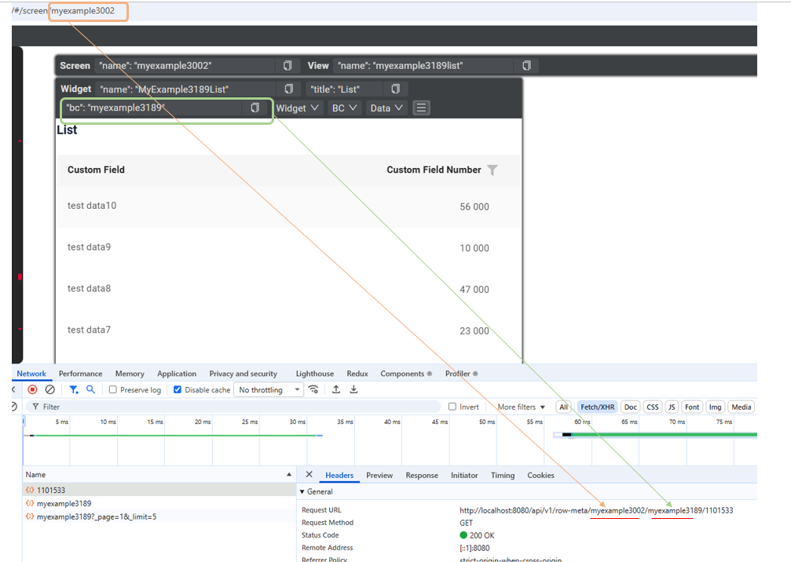
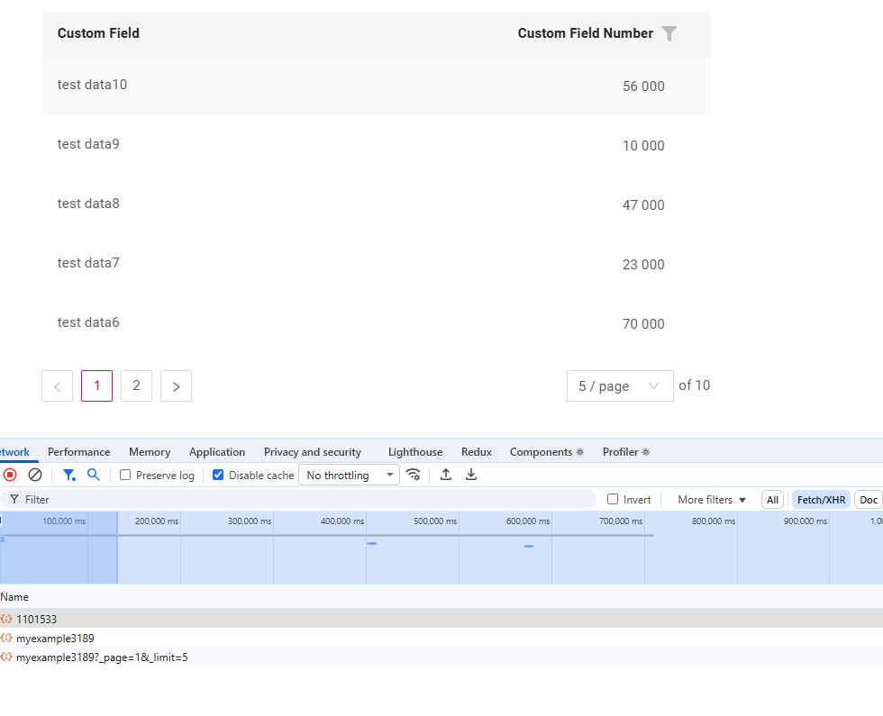
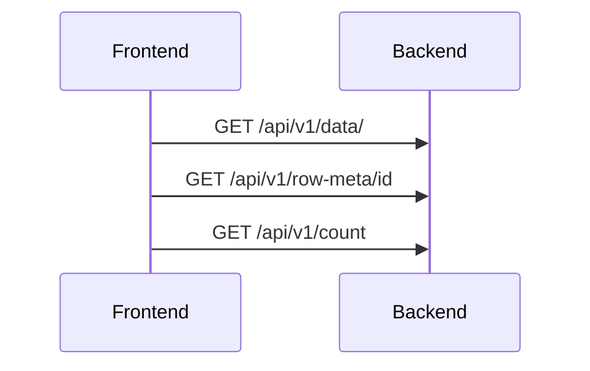
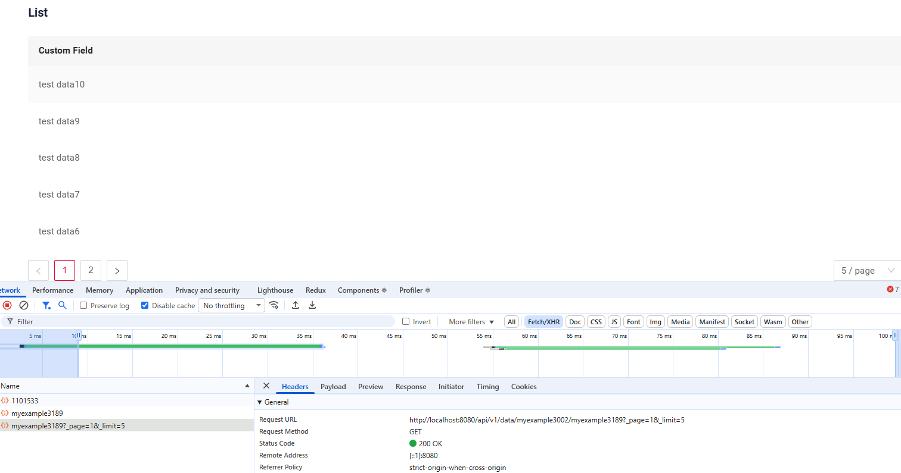
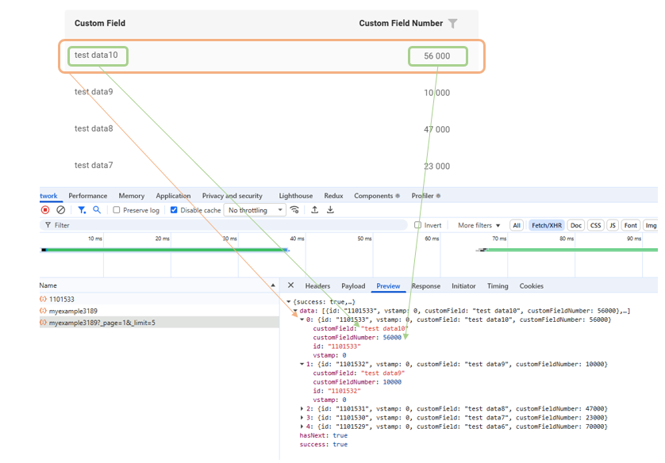
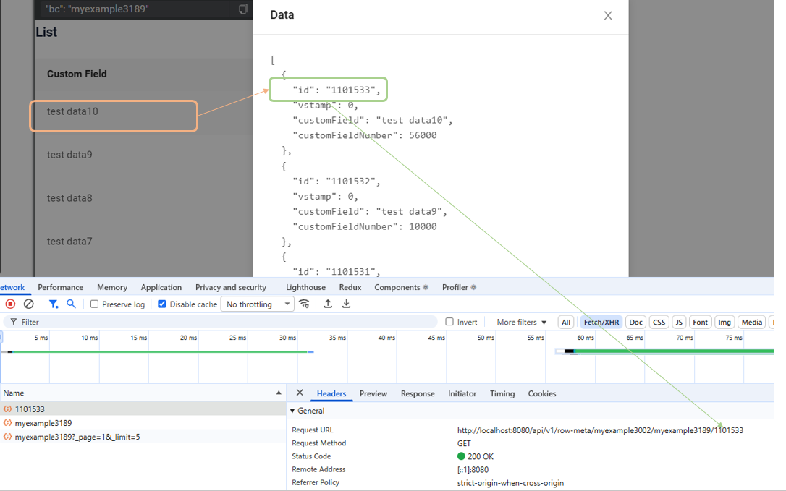
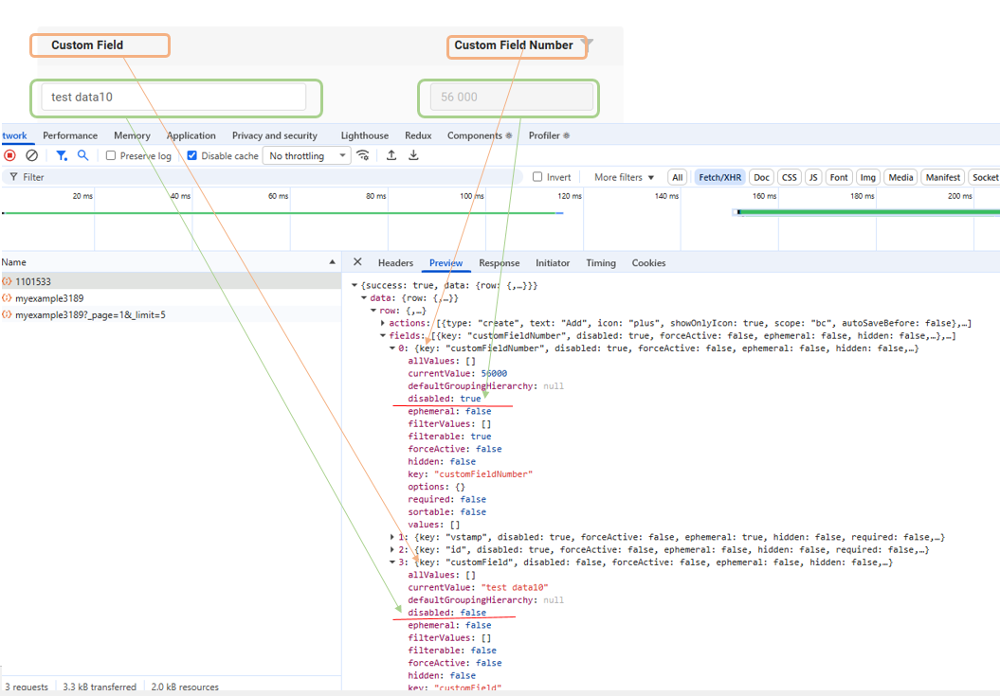
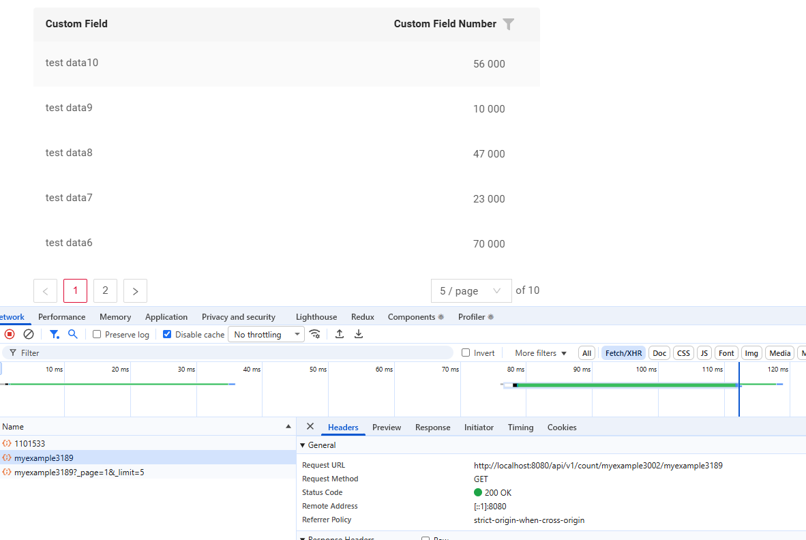
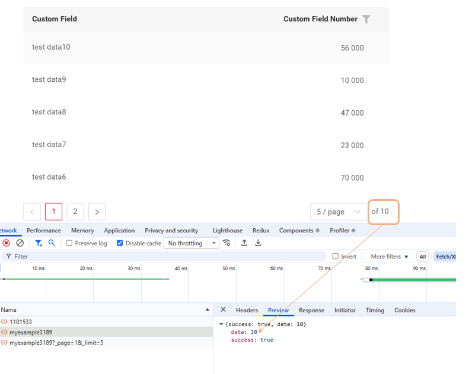

# Frontend - Backend Interaction 

CXBox provides a standardized and unified API mechanism for frontend–backend communication.
Developers don’t need to design or maintain custom APIs — all data operations (read, update, delete, metadata retrieval, and custom actions) are handled by built-in endpoints.
This approach simplifies development, improves consistency, and reduces integration errors.

The platform includes a universal interaction mechanism that works equally well for forms, tables, and other widgets. This means that when you change the widget type, the underlying logic remains correct - everything continues to function without requiring additional API configuration.

In this article, we'll examine how this mechanism is structured and explore the fundamental API methods that make it work.

---

## API Endpoints

Interaction between the frontend and backend in CXBox is built on four types of APIs:

* [/data](#data)
* [/row-meta/](#rowmeta)
* [/custom-action](#customaction)
* [/count](#count)

The API is structured as follows:

* independent entities:  `.../screen/bc` or `.../screen/bc/id` 
* for dependent parent-child relationships:  `.../screen/parent_bc/id/child_bc` or `screen/parent_bc/id/child_bc/id`
 
Example:

### <a id="data">/data</a>

| Method  | Endpoint             | Description                   |
|:--------|:---------------------|:-------------------------------|
| GET     | /api/v1/data/        | Get list of records            |
| GET     | /api/v1/data/id      | Get specific record data       |
| PUT     | /api/v1/data/id      | Update record                  |
| DELETE  | /api/v1/data/id      | Delete record                  |

---
### <a id="rowmeta">/row-meta</a>

Metadata describes which fields are enabled, which buttons are visible, and so on.

| Method | Endpoint              | Description                            |
|:-------|:----------------------|:---------------------------------------|
| GET    | /api/v1/row-meta      | Get general metadata                   |
| GET    | /api/v1/row-meta/id   | Get metadata for a specific record     |
| GET    | /api/v1/row-meta-new  | Get metadata for creating new record   |

---

### <a id="customaction">/custom-action</a>

| Method | Endpoint                | Description                  |
|:-------|:------------------------|:------------------------------|
| POST   | /api/v1/custom-action   | Trigger a custom action       |

---

### <a id="count">/count</a>

| Method | Endpoint         | Description                |
|:-------|:-----------------|:----------------------------|
| GET    | /api/v1/count    | Get total record count      |

---

## <a id="coreprinciple">CXBOX Core Principle</a>

Form, list, and info widgets all work under the same logic.   
This ensures that switching from one widget type to another does not disrupt the API functionality.

## Examples
### How a List Works?
Let’s consider a screen with a single List widget.

1. Open the Developer Tools → Network tab.
2. Load the screen containing the list. 

We can see that three API calls are executed.

#### GET /api/v1/data/

**How does it look?**

**Description**

This request retrieves the data to be displayed on the screen.
It respects pagination parameters (page, limit), as well as filtering and sorting conditions.

The diagram above shows how the API response directly maps to the UI elements displayed in the list.

#### GET /api/v1/row-meta/id
**How does it look?**

**Description**

When the list screen opens, CXBox automatically positions the selection on the first record — you can see this as the first row being highlighted.
The metadata response defines the state of UI controls such as active buttons and editable fields for first record.

(This call is made for only one record to ensure proper operation according to the [CXBox Core Principle](#coreprinciple).
And we retrieve metadata for a single record rather than all records to avoid overloading the API)
 

The diagram illustrates how fields correspond to their properties received from the backend.

* When the backend sends a field state with the parameter `disabled: true`, the frontend displays the field as read-only (not editable).
* When the parameter is `disabled: false`, the frontend displays the field as editable.

This principle applies to all properties provided by this API — each property received from the backend directly determines how the field is displayed and behaves on the client side.

#### GET /api/v1/count
**How does it look?**

**Description**

The count method returns the total number of records.
The call depends on the Pagination parameter — see  [Pagination](/widget/type/property/pagination/pagination).
The frontend uses this value to display information about the total number of available records.
 

For example:
“Showing 5 out of 10 records.”