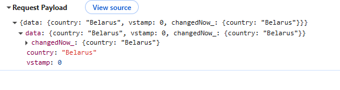
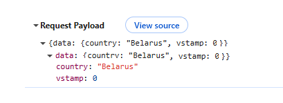

# `isFieldChangedNow()`
[:material-play-circle: Live Sample]({{ external_links.code_samples }}/ui/#/screen/myexample4901/view/myexample3420FA){:target="_blank"} ·
[:fontawesome-brands-github: GitHub]({{ external_links.github_ui }}/{{ external_links.github_branch }}/src/main/java/org/demo/repository/metabuilder/buildrowdependentmeta/isfieldchangenow){:target="_blank"}

Available since [v2.0.14](/new/version2014/)

The `isFieldChangedNow()` method checks whether a specific field was modified by the user 
during the current frontend interaction (in this iteration only).

```java
public <V> boolean isFieldChangedNow(RowDependentFieldsMeta<T> fields, DtoField<? super T, V> field)
```

Parameters:

* `fields` – The current metadata state of the fields
* `field` – The DTO field to check

Returns(boolean):

* `true` if the field was changed in the UI during this interaction
* `false` if it was not changed


✅ Recommended Usage

Use this method only for checking changes in dependent fields.
We recommend placing `isFieldChangedNow()` at the beginning of `buildRowDependentMeta`, to ensure all dependent values are updated first, before setting setHidden, setRequired, or other field properties.


## How to add?
[:material-play-circle: Live Sample]({{ external_links.code_samples }}/ui/#/screen/myexample4901/view/myexample3420FA){:target="_blank"} ·
[:fontawesome-brands-github: GitHub]({{ external_links.github_ui }}/{{ external_links.github_branch }}/src/main/java/org/demo/repository/metabuilder/buildrowdependentmeta/isfieldchangenow){:target="_blank"}

??? Example

    **buildRowDependentMeta** 

     ```java
     --8<--
     {{ external_links.github_raw }}/repository/metabuilder/buildrowdependentmeta/isfieldchangenow/anysource/MyExample3420Meta.java:buildRowDependentMeta
     --8<--
     ```

## How it works?

On the frontend side, a new tag `changedNow_` was introduced.
This tag stores only the fields **modified in the current user session**, before being sent to the backend.

=== "After row-meta/ (POST) (v2.0.14+)"
    

=== "Before row-meta/ (POST) "
    

**When is `changedNow_` sent?**

row-meta/ (POST)

* When the user exits a field that has `forceActive = true`.
* When call FormPopup widget

=== "After Behavior (v2.0.14+)"

    | Scenario                                                                                                                   | Meta Builder Called | Field Update Triggered         |
    | -------------------------------------------------------------------------------------------------------------------------- | ------------------- | ------------------------------ |
    | Editing a field with `forceActive`                                                                                         | ✅ Yes               | ✅ Yes                          |
    | `forceActive` → Standard Save button (for fields listed below where `row-meta` is not triggered until the field is exited) | ❌ No                | ❌ No                           |
    | `forceActive` → Custom button (for fields listed below where `row-meta` is not triggered until the field is exited)        | ❌ No                | ❌ No                           |
    | Opening a `FormPopup`                                                                                                      | ✅ Yes               | ✅ Yes                          |
    | Clicking only the Standard Save button                                                                                     | ❌ No                | ❌ No                           |
    | Clicking only a Custom button                                                                                              | ❌ No                | ❌ No                           |
    | Clicking Delete                                                                                                            | ❌ No                | ❌ No (only deletes the record) |

=== "Before Behavior"

    | Scenario                                                                                                                   | Meta Builder Called                                 | Field Update Triggered                     |
    | -------------------------------------------------------------------------------------------------------------------------- | --------------------------------------------------- | ------------------------------------------ |
    | Editing a field with `forceActive`                                                                                         | ✅ Yes                                               | ✅ Yes                                      |
    | `forceActive` → Standard Save button (for fields listed below where `row-meta` is not triggered until the field is exited) | ✅ Yes (via `/row-meta` → followed by save request)  | Update occurs within the `/row-meta` event |
    | `forceActive` → Custom button (for fields listed below where `row-meta` is not triggered until the field is exited)        | ✅ Yes (via `/row-meta` → followed by custom action) | Update occurs within the `/row-meta` event |
    | Opening a `FormPopup`                                                                                                      | ✅ Yes                                               | ✅ Yes                                      |
    | Clicking only the Standard Save button                                                                                     | ❌ No                                                | ❌ No                                       |
    | Clicking only a Custom button                                                                                              | ❌ No                                                | ❌ No                                       |
    | Clicking Delete                                                                                                            | ❌ No                                                | ❌ No (only deletes the record)             |


**Field Type Behavior**

Legend:

* ✅ — `forceActive` (`row-meta`) is triggered immediately on value selection.
* ❌ — `row-meta` is not triggered until a button is clicked or user leaves the field.
* `noValid` — field does not support in-place value changes.

| Field Type            | `forceActive` triggered immediately? | Notes                                               |
| --------------------- | ------------------------------------ | --------------------------------------------------- |
| `input`               | ❌ No                                 | Triggered on click outside the field or on a button |
| `date`                | ✅ Yes                                |                                                     |
| `dateTime`            | ✅ Yes                                |                                                     |
| `dateTimeWithSeconds` | ✅ Yes                                |                                                     |
| `number`              | ❌ No                                 | Triggered on click outside the field or on a button |
| `percent`             | ❌ No                                 | Triggered on click outside the field or on a button |
| `hidden`              | `noValid`                            | Not editable                                        |
| `text`                | ❌ No                                 | Triggered on click outside the field or on a button |
| `radio`               | ✅ Yes                                |                                                     |
| `checkbox`            | ✅ Yes                                |                                                     |
| `money`               | ❌ No                                 |                                                     |
| `dictionary`          | ✅ Yes                                |                                                     |
| `fileUpload`          | ✅ Yes                                |                                                     |
| `pickList`            | ✅ Yes                                |                                                     |
| `inlinePickList`      | ✅ Yes                                | Save only triggered if an item is picked            |
| `hint`                | `noValid`                            | Not editable                                        |
| `multifield`          | ✅ Yes                                |                                                     |
| `multivalueHover`     | `noValid`                            | Not editable                                        |
| `multivalue`          | ✅ Yes                                |                                                     |
| `multipleSelect`      | ✅ Yes                                |                                                     |
| `suggestionPickList`  | ✅ Yes                                | Save only triggered if an item is picked            |


## `isFieldChanged()` vs  `isFieldChangedNow()`

Unlike `isFieldChanged()`, which checks whether a field has changed **at any point in the past** (e.g., using the accumulated `data` tag), `isFieldChangedNow()` looks specifically at the **current interaction**, based on the `changedNowParam` tag.

This distinction is important when using `forceActive` or working with dependent fields:

* `isFieldChanged()` may detect earlier changes from previous interactions.
* `isFieldChangedNow()` detects only immediate user input from the ongoing client-side session.