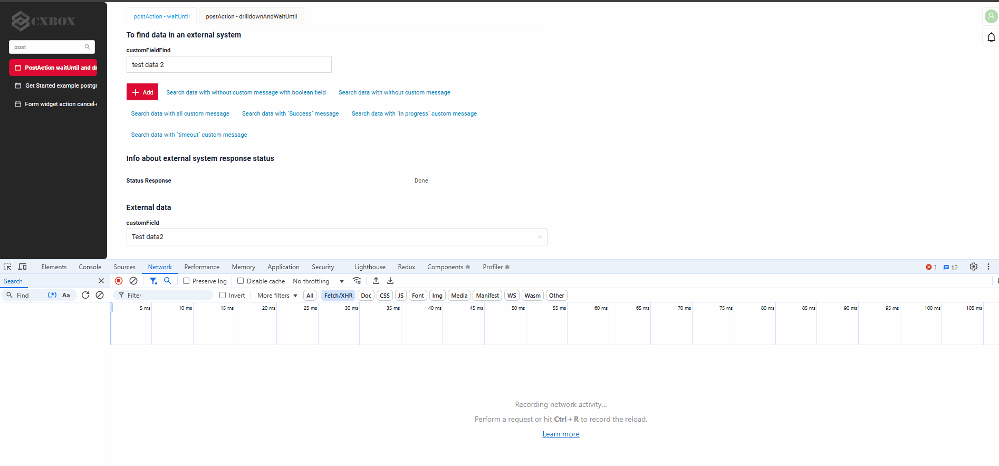
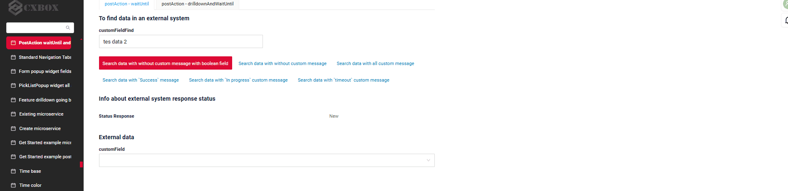
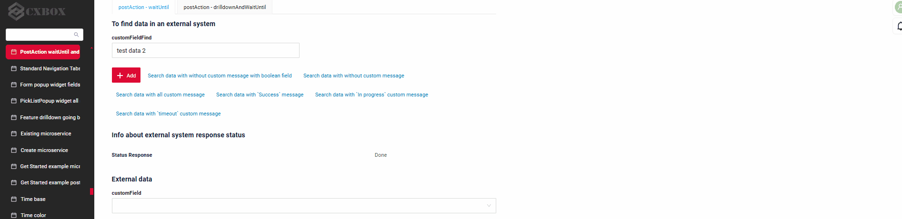

# waitUntil and drillDownAndWaitUntil
 
## waitUntil
[:material-play-circle: Live Sample]({{ external_links.code_samples }}/ui/#/screen/myexample3231/view/myexample3231asyncform){:target="_blank"} ·
[:fontawesome-brands-github: GitHub]({{ external_links.github_ui }}/{{ external_links.github_branch }}/src/main/java/org/demo/documentation/feature/postaction/waituntil){:target="_blank"}

Creates a post-action that waits until a specified condition is met.

Use Case:
This mechanism is useful for implementing long-running operations where the user needs to be informed about the progress and its outcome.

```java
PostAction.waitUntil(
    MyExampleDTO_.statusResponse, // Field to check for the condition
    StatusEnum.DONE)               // Expected value
   .timeoutMaxRequests(6)          // Maximum number of requests
   .timeout(Duration.ofSeconds(12)) // Total timeout duration
   .inProgressMessage("In Progress custom message") // In-progress message
   .successMessage("Success custom message")      // Success message
   .timeoutMessage("Timeout custom message")       // Timeout message
   .build()
```
 
1.(Required) **Field to check for the condition**:
    - `MyExampleDTO_.statusResponse` — This is the field that will be checked for the condition. It can be of type `boolean` or `enum`. 
   Field that will be compared to the expected value.This field must be (may be hidden) in the  on the screen.

2.(Required) **Expected value**:
    - `StatusEnum.DONE` — This is the value the frontend will wait for in the `statusResponse` field.
   When the field matches this value, the waiting dialog will be closed.

**Additional Configuration**:

3. (Optional) **Maximum number of requests**:
    - `timeoutMaxRequests(6)` — This is the maximum number of requests the frontend will make to the backend to check the condition. If the condition is not met after 6 requests, a timeout will be triggered.

4. (Optional) **Timeout**:
    - `timeout(Duration.ofSeconds(12))` — The total time during which the frontend will wait for the condition to be met. In this case, it is 12 seconds. The time between requests is calculated as `total time / number of requests`. Here, the interval between requests will be `12 seconds / 6 requests = 2 seconds`.

5. (Optional) **In-progress message**:
    - `inProgressMessage("In Progress custom message")` — This is a custom message that will be displayed on the frontend while waiting for the condition to be met.
      By default, a standard message is displayed: Operation in progress. 
6. (Optional) **Success message**:
    - `successMessage("Success custom message")` — This is a custom message that will be displayed when the condition is met (i.e., when `statusResponse` equals `StatusEnum.DONE`).
      By default, the standard message is not displayed.
7. (Optional) **Timeout message**:
    - `timeoutMessage("Timeout custom message")` — This is a custom message that will be displayed if the condition is not met before the timeout expires (i.e., after 6 requests within 12 seconds).
      By default, the standard message is not displayed.

How it Works:

- The frontend starts making requests to the backend at intervals of 2 seconds (12 seconds / 6 requests).
- On each request, the value of the `statusResponse` field is checked.
- If the field becomes equal to `StatusEnum.DONE`, the `Success custom message` is displayed, and the process completes.
- If the condition is not met after 6 requests, the `Timeout custom message` is displayed, and the process ends due to a timeout.
- During the execution of the requests, the `In Progress custom message` is displayed.

 
## How does it look?
=== "Without custom message"
    
=== "With `Success` and `In progress` custom message"
    
=== "With `Timeout` custom message"
    
###  <a id="Howtoaddbacis">How to add?</a>
??? Example

    **Step1** Add **PostAction.waitUntil** to corresponding **VersionAwareResponseService**. 

    ```java
       --8<--
       {{ external_links.github_raw_doc }}/feature/postaction/waituntil/MyExample3231Service.java:getActions
       --8<--
    ```
 
## drillDownAndWaitUntil
[:material-play-circle: Live Sample]({{ external_links.code_samples }}/ui/#/screen/myexample3231/view/myexample3232form){:target="_blank"} ·
[:fontawesome-brands-github: GitHub]({{ external_links.github_ui }}/{{ external_links.github_branch }}/src/main/java/org/demo/documentation/feature/postaction/drilldownandwaituntil){:target="_blank"}
 
Creates a post-action that performs a INNER drill-down and then waits until a specified condition is met. 

Use Case:
This method is useful for scenarios where you need to navigate to a screen, wait for a specific condition (e.g., a status change), and provide feedback to the user during the process.

```java
PostAction.drillDownAndWaitUntil(
    "/screen/myexample3231/view/myexample3232resultform/" +
    CxboxMyExampleController.myexample + "/" + myEntity.getId(),
    CxboxMyExampleController.myexample,
    MyExampleDTO_.statusResponse,
    StatusEnum.DONE
)
.inProgressMessage("In Progress custom message")
.successMessage("Success custom message")
.timeoutMessage("Timeout custom message")
.timeoutMaxRequests(6)
.timeout(Duration.ofSeconds(12))
.build();
```

**Parameters of `drillDownAndWaitUntil`**:

1. (Required) **Path to the screenpath to the screen**:
   - `"/screen/myexample3231/view/myexample3232resultform/" +
     CxboxMyExampleController.myexample + "/" + myEntity.getId()` — This is path to the screen where will navigate.

2. (Required) **Business component to check for the condition**:
   - `CxboxMyExampleController.myexample` — This is the business component that will be checked for the condition. It can be of type `boolean` or `enum`.
     Field that will be compared to the expected value.

3. (Required) **Field to check for the condition**:
   - `MyExampleDTO_.statusResponse` — This is a business component where the field to be compared with the expected value will be checked.
   This business component must be (may be hidden)in the  on the screen to which the transition is made.

4. (Required) **Expected value**:
   - `StatusEnum.DONE` — This is the value the frontend will wait for in the `statusResponse` field.
     When the field matches this value, the waiting dialog will be closed.This field must be (may be hidden) in the  on the screen to which the transition is made.

**Additional Configuration**:
5. (Optional) **Maximum number of requests**:
   - `timeoutMaxRequests(6)` — This is the maximum number of requests the frontend will make to the backend to check the condition. If the condition is not met after 6 requests, a timeout will be triggered.

6. (Optional) **Timeout**:
   - `timeout(Duration.ofSeconds(12))` — The total time during which the frontend will wait for the condition to be met. In this case, it is 12 seconds. The time between requests is calculated as `total time / number of requests`. Here, the interval between requests will be `12 seconds / 6 requests = 2 seconds`.

7. (Optional) **In-progress message**:
   - `inProgressMessage("In Progress custom message")` — This is a custom message that will be displayed on the frontend while waiting for the condition to be met.
     By default, a standard message is displayed: Operation in progress.
8. (Optional) **Success message**:
   - `successMessage("Success custom message")` — This is a custom message that will be displayed when the condition is met (i.e., when `statusResponse` equals `StatusEnum.DONE`).
     By default, the standard message is not displayed.
9. (Optional) **Timeout message**:
   - `timeoutMessage("Timeout custom message")` — This is a custom message that will be displayed if the condition is not met before the timeout expires (i.e., after 6 requests within 12 seconds).
     By default, the standard message is not displayed. 
 
### How It Works:
1. The frontend navigates to the specified screen (`/screen/myexample3231/view/myexample3232resultform/...`).
2. It starts checking the `statusResponse` field in `MyExample3232DTO_` for the value `StatusEnum.DONE`.
3. The frontend makes up to 6 requests at intervals of 2 seconds (12 seconds total).
4. During this process:
   - The `In Progress custom message` is displayed.
5. If the condition is met:
   - The `Success custom message` is displayed, and the process ends.
6. If the condition is not met after 6 requests:
   - The `Timeout custom message` is displayed, and the process ends due to a timeout.

### How does it look?


###  <a id="Howtoaddbacis">How to add?</a>
??? Example

    **Step1** Add **PostAction.waitUntil** to corresponding **VersionAwareResponseService**. 

    ```java
       --8<--
       {{ external_links.github_raw_doc }}/feature/postaction/drilldownandwaituntil/MyExample3232Service.java:getActions
       --8<--
    ```
 