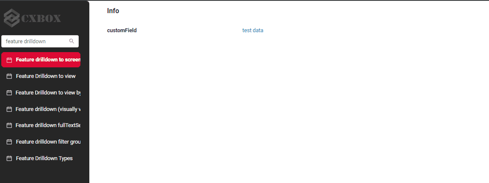
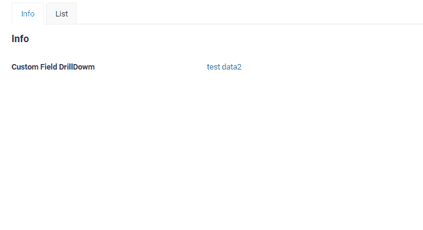
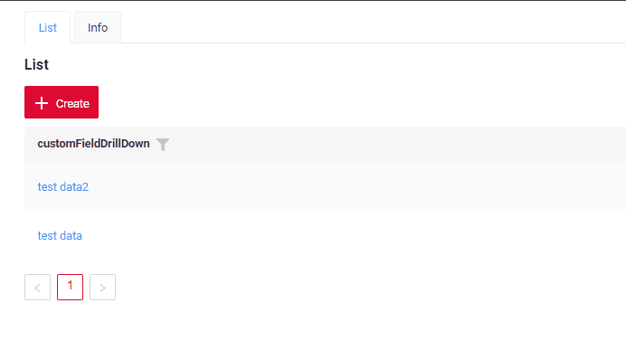
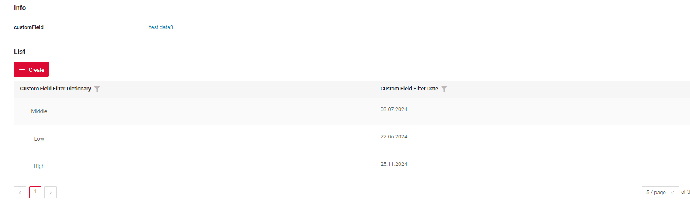
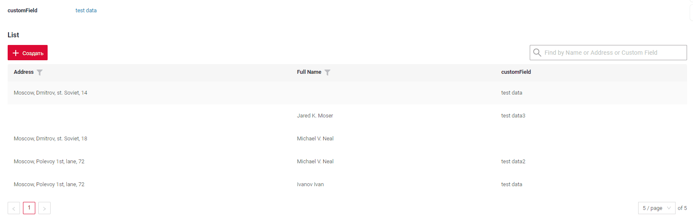
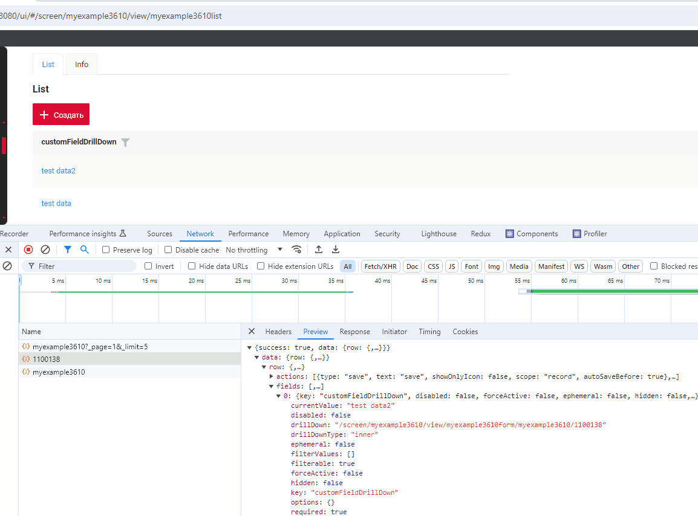
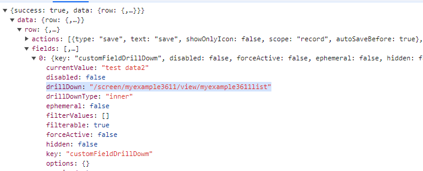
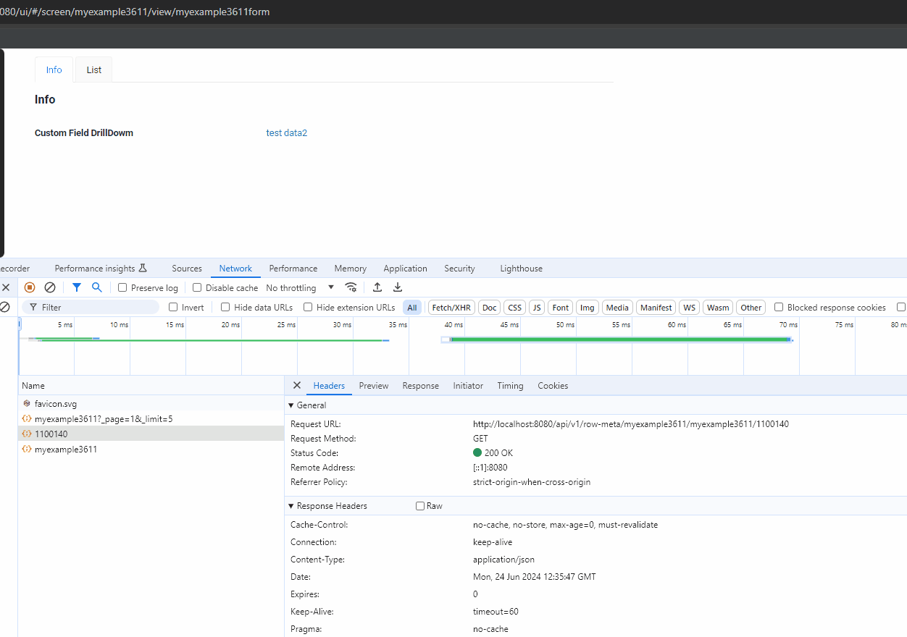

# DrillDown
`DrillDown link` is an element that lets the user navigate to another view by tapping it.

DrillDown functionality is used when we need to navigate from one place to another.

The following transition formats are possible:
 
* [To screen](#to_screen) to a screen without focusing on specific data
* [To view without id](#to_view) to a view without focusing on specific data
* [To view by bc record id](#to_view_id).The most popular option.Transition to viewing by transmitting the ID record.
* [To view with fields filtration](#to_view_with_fields_filtration) Apply a filter using additional fields (visually visible).
 
## <a id="Transitionformats">Transition formats</a>
### <a id="to_screen">To screen</a>
[:material-play-circle: Live Sample]({{ external_links.code_samples }}/ui/#/screen/myexample3619){:target="_blank"}
[:fontawesome-brands-github: GitHub]({{ external_links.github_ui }}/{{ external_links.github_branch }}/src/main/java/org/demo/documentation/feature/drilldown/byscreen){:target="_blank"}

Simple transition to a view without focusing on specific data.

The link is formulated as follows:  `/screen/nameScreen`

Example request: `/screen/myexample3618`

##### How does it look?


##### How to add?

??? Example

    The availability of this function depends on the type. See more [field types](/widget/fields/fieldtypes/)

    `Step1`  Add **fields.setDrilldown** to corresponding **FieldMetaBuilder**.

    `field` - field with drilldown
    
    `drillDownType` - [DrillDown Types](/features/element/drilldown/drilldowntype)
    
    `drillDown` - link

    ```java
    --8<--
    {{ external_links.github_raw_doc }}/feature/drilldown/byscreen/MyExample3619Meta.java:buildRowDependentMeta
    --8<--
    ```

    `Step2`  Add **drillDown** to corresponding **.widget.json**.
    ```json
    --8<--
    {{ external_links.github_raw_doc }}/feature/drilldown/byscreen/MyExample3619Info.widget.json
    --8<--
    ```


### <a id="to_view">To view</a>
#### <a id="to_view_without_id">To view without id</a>
[:material-play-circle: Live Sample]({{ external_links.code_samples }}/ui/#/screen/myexample3611){:target="_blank"}
[:fontawesome-brands-github: GitHub]({{ external_links.github_ui }}/{{ external_links.github_branch }}/src/main/java/org/demo/documentation/feature/drilldown/simple){:target="_blank"}

Simple transition to a view without focusing on specific data.

The link is formulated as follows:  `/screen/nameScreen/view/nameView`

Example request: `/screen/myexample3611/view/myexample3611list`

##### How does it look?


##### How to add?

??? Example
    The availability of this function depends on the type. See more [field types](/widget/fields/fieldtypes/)

    `Step1`  Add **fields.setDrilldown** to corresponding **FieldMetaBuilder**.

    `field` - field with drilldown
    
    `drillDownType` - [DrillDown Types](/features/element/drilldown/drilldowntype)
    
    `drillDown` - link

    ```java
    --8<--
    {{ external_links.github_raw_doc }}/feature/drilldown/simple/MyExample3611Meta.java:buildRowDependentMeta
    --8<--
    ```

    `Step2`  Add **drillDown** to corresponding **.widget.json**.
    ```json
    --8<--
    {{ external_links.github_raw_doc }}/feature/drilldown/simple/MyExample3611Form.widget.json
    --8<--
    ```

 
#### <a id="to_view_id">To view by bc record id</a>
[:material-play-circle: Live Sample]({{ external_links.code_samples }}/ui/#/screen/myexample3610){:target="_blank"}
[:fontawesome-brands-github: GitHub]({{ external_links.github_ui }}/{{ external_links.github_branch }}/src/main/java/org/demo/documentation/feature/drilldown/drilldownviewid){:target="_blank"}

The most popular option.Transition to viewing by transmitting the ID record.
Retrieve data on this entity and all its dependent entities without filtering.

The link is formulated as follows: `/screen/nameScreen/view/nameView/bc/id`

Example request: `screen/myexample3610/view/myexample3610form/myexample3610/1100178`

##### How does it look?


##### How to add?
??? Example

    `Step1`  Add **fields.setDrilldown** to corresponding **FieldMetaBuilder**.

    `field` - field with drilldown
    
    `drillDownType` - [DrillDown Types](/features/element/drilldown/drilldowntype)
    
    `drillDown` - link

    ```java
    --8<--
    {{ external_links.github_raw_doc }}/feature/drilldown/drilldownviewid/MyExample3610Meta.java:buildRowDependentMeta
    --8<--
    ```

    `Step2`  Add **drillDown** to corresponding **.widget.json**.
    ```json
    --8<--
    {{ external_links.github_raw_doc }}/feature/drilldown/drilldownviewid/MyExample3610Form.widget.json
    --8<--
    ```
 
### <a id="to_view_with_fields_filtration">To view with fields filtration</a>
#### By fields (visually visible)
[see more about filtration](/widget/type/property/filtration/filtration)

[:material-play-circle: Live Sample]({{ external_links.code_samples }}/ui/#/screen/myexample3612){:target="_blank"}
[:fontawesome-brands-github: GitHub]({{ external_links.github_ui }}/{{ external_links.github_branch }}/src/main/java/org/demo/documentation/feature/drilldown/advancedonebcfilter){:target="_blank"}

The link is formulated as follows: `/screen/nameScreen/view/nameView/bc?+SearchSpec`

Example request: `screen/myexample3610/view/myexample3610form/myexample3610/11001782?_page=1&_limit=5&customFieldFilterDictionary.equalsOneOf=%5B%22Low%22%2C%22Middle%22%5D`

##### How does it look?

 
##### How to add?
??? Example

    !!! tips
        To write this drilldown, follow these steps:
        
            * Add a filter function for fields that require filtering.
            * Visually fill in the necessary filters in the interface.
            * Open the developer panel.
            * Locate the required request.
            * Use this query to substitute in your code to get a reference  

    The link consists of two parts:
    ```java
    --8<--
    {{ external_links.github_raw_doc }}/feature/drilldown/advancedonebcfilter/MyExample3612Meta.java:url
    --8<--
    ```
    
    `Step 1`  Create a link to the required widget. 
    The link is formulated as follows:  `/screen/nameScreen/view/nameView/nameBC`    
    
    ```java
    --8<--
    {{ external_links.github_raw_doc }}/feature/drilldown/advancedonebcfilter/MyExample3612Meta.java:urlBC
    --8<--
    ```
    `Step 2`  Create a link with filter.
    
    ```java
    --8<--
    {{ external_links.github_raw_doc }}/feature/drilldown/advancedonebcfilter/MyExample3612Meta.java:urlFilter
    --8<--
    ```
    `Step 3`  Create a link for drilldown.
    
    ```java
    --8<--
    {{ external_links.github_raw_doc }}/feature/drilldown/advancedonebcfilter/MyExample3612Meta.java:url
    --8<--
    ```


#### By fulltextsearch
[see more about FullTextSearch](/features/element/filtration/fulltextsearch/fulltextsearch)

[:material-play-circle: Live Sample]({{ external_links.code_samples }}/ui/#/screen/myexample3615){:target="_blank"}
[:fontawesome-brands-github: GitHub]({{ external_links.github_ui }}/{{ external_links.github_branch }}/src/main/java/org/demo/documentation/feature/drilldown/advancedfulltextsearchfilter){:target="_blank"}


When the user enters a search query in the full-text search input area, the widget filters and displays strings that match the search criteria.

The link is formulated as follows: `/screen/nameScreen/view/nameView/bc+SearchSpec`

Example request: `screen/myexample3610/view/myexample3610form/myexample3610/1100178?_page=1&_limit=5&_fullTextSearch=Moscow%2C+Dmitrov`
 
##### How does it look?

 
##### How to add?
??? Example

    !!! tips
        To write this drilldown, follow these steps:
    
        * Add a filter function for fields that require filtering.
        * Visually fill in the necessary filters in the interface.
        * Open the developer panel.
        * Locate the required request.
        * Use this query to substitute in your code to get a reference  
    
    The link consists of two parts:
    ```java
    --8<--
    {{ external_links.github_raw_doc }}/feature/drilldown/advancedfulltextsearchfilter/MyExample3615Meta.java:url
    --8<--
    ```
    
    `Step 1`  Create a link to the required widget. 
    The link is formulated as follows:  `/screen/nameScreen/view/nameView/nameBC`    
    
    ```java
    --8<--
    {{ external_links.github_raw_doc }}/feature/drilldown/advancedfulltextsearchfilter/MyExample3615Meta.java:urlBC
    --8<--
    ```
    `Step 2`  Create a link with filter.
    
    ```java
    --8<--
    {{ external_links.github_raw_doc }}/feature/drilldown/advancedfulltextsearchfilter/MyExample3615Meta.java:urlFilter
    --8<--
    ```
    `Step 3`  Create a link for drilldown.
    
    ```java
    --8<--
    {{ external_links.github_raw_doc }}/feature/drilldown/advancedfulltextsearchfilter/MyExample3615Meta.java:url
    --8<--
    ```

#### By filter group
    _not applicable_
<!-- 

#### by personal filter group
### <a id=" AdvanceddrillDownmMultiBC"> Advanced drillDown multi bc</a>
[:material-play-circle: Live Sample]({{ external_links.code_samples }}/ui/#/screen/myexample3612){:target="_blank"}
[:fontawesome-brands-github: GitHub]({{ external_links.github_ui }}/{{ external_links.github_branch }}/src/main/java/org/demo/documentation/feature/drilldown/advancedoneview){:target="_blank"}

The link is formulated as follows: `/screen/nameScreen/view/nameView/bc1/id1/bc2/id2`

Example request: `screen/myexample3610/view/myexample3610form/myexample3610/1100/myexample3611/1101`

#### How does it look?


#### How to add?
??? Example
    The link consists of two parts:
    ```java
    --8<--
    {{ external_links.github_raw_doc }}/feature/drilldown/advancedoneview/MyExample3612Meta.java:url
    --8<--
    ```

    `Step 1`  Create a link to the required widget. 
    The link is formulated as follows:  `/screen/nameScreen/view/nameView/nameBC`    
    
    ```java
    --8<--
    {{ external_links.github_raw_doc }}/feature/drilldown/advancedoneview/MyExample3612Meta.java:urlBC
    --8<--
    ```
    `Step 2`  Create a link with filter.
 
    ```java
    --8<--
    {{ external_links.github_raw_doc }}/feature/drilldown/advancedoneview/MyExample3612Meta.java:urlFilter
    --8<--
    ```

<!-- 

3.2) передать фильтра по доп полям (визуально видимый) сразу на несколько сущностей


4) "совсем странные случаи"
   4.1) ?filters по родители и ребенку
   по идее должно работать для parentChild, но визуально это таблица под таблицей (иначе нет смысла накидывать фильтры), что бывает редко

4.2) по родителю по id, а по ребенку filters -- ДОЛЖНО РАБОТАТЬ ПРОВЕРИТЬ!

по родителю
screen/meeting/view/meetingview/meeting/1100012

по ребенку
+ ?filters =
  
-->
## The operation mechanism of drilldown
The operation mechanism of drilldown works as follows:

* REST.Backend. A link is generated within this property and sent to the frontend as metadata  `../api/v1/row-meta/..`

  

* REST.Frontend. The front end then generates a GET \data request with parameters based on specific rules. See more [Transition formats](#Transitionformats)

  

  
 