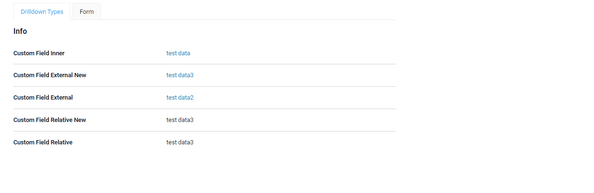
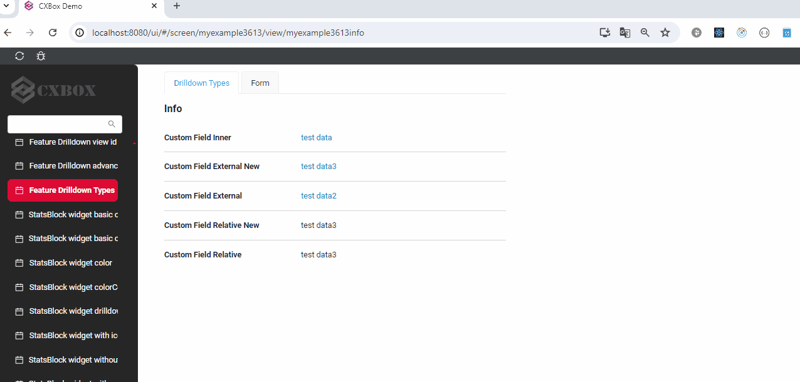

# DrillDown Types
[:material-play-circle: Live Sample]({{ external_links.code_samples }}/ui/#/screen/myexample3613){:target="_blank"}
[:fontawesome-brands-github: GitHub]({{ external_links.github_ui }}/{{ external_links.github_branch }}/src/main/java/org/demo/documentation/feature/drilldowntypes/MyExample3613Meta){:target="_blank"}

There are several types of drilldown:

* [INNER](#INNER)  Transition inside the application.

* [EXTERNAL](#EXTERNAL)  Transition by an absolute link to an external source.Current tab

* [EXTERNAL_NEW](#EXTERNAL_NEW)  Transition by an absolute link to an external source.New tab

* [RELATIVE](#RELATIVE) Transition by a relative link while keeping the protocol, host, port.Current tab

* [RELATIVE_NEW](#RELATIVE_NEW) Transition by a relative link while keeping the protocol, host, port.New tab
 
## <a id="INNER">INNER</a>
DrillDownType.INNER - Transition inside the application.
### How does it look?


### How to add?

??? Example
    The availability of this function depends on the type. See more [field types](/widget/fields/fieldtypes/)

    `Step 1` Add  fields.setDrilldown with type **DrillDownType.INNER** to corresponding **FieldMetaBuilder**.
    ```java
    --8<--
    {{ external_links.github_raw }}/feature/drilldown/drilldowntypes/MyExample3613Meta.java:buildRowDependentMetaINNER
    --8<--
    ```
## <a id="EXTERNAL">EXTERNAL</a>
DrillDownType.EXTERNAL - Transition by an absolute link to an external source. When you click the link, it will open in the same tab.

### How does it look?


### How to add?
??? Example
    The availability of this function depends on the type. See more [field types](/widget/fields/fieldtypes/)

    `Step 1` Add  fields.setDrilldown with type **DrillDownType.EXTERNAL** to corresponding **FieldMetaBuilder**.
    ```java
    --8<--
    {{ external_links.github_raw }}/feature/drilldown/drilldowntypes/MyExample3613Meta.java:buildRowDependentMetaEXTERNAL
    --8<--
    ```
 
## <a id="EXTERNAL_NEW">EXTERNAL_NEW</a>
DrillDownType.EXTERNAL_NEW - Transition by an absolute link to an external source. When you click the link, it will open in a new tab.
### How does it look?


### How to add?
??? Example
    The availability of this function depends on the type. See more [field types](/widget/fields/fieldtypes/)

    `Step 1` Add  fields.setDrilldown with type **DrillDownType.EXTERNAL_NEW** to corresponding **FieldMetaBuilder**.
    ```java
    --8<--
    {{ external_links.github_raw }}/feature/drilldown/drilldowntypes/MyExample3613Meta.java:buildRowDependentMetaEXTERNAL_NEW
    --8<--
    ```

## <a id="RELATIVE">RELATIVE</a>
DrillDownType.RELATIVE - Transition by a relative link while keeping the protocol, host, port.
### How does it look?


### How to add?
??? Example
    The availability of this function depends on the type. See more [field types](/widget/fields/fieldtypes/)

    `Step 1` Add  fields.setDrilldown with type **DrillDownType.RELATIVE** to corresponding **FieldMetaBuilder**.
    ```java
    --8<--
    {{ external_links.github_raw }}/feature/drilldown/drilldowntypes/MyExample3613Meta.java:buildRowDependentMetaRELATIVE
    --8<--
    ```
## <a id="RELATIVE_NEW">RELATIVE_NEW</a>
DrillDownType.RELATIVE_NEW - Transition by a relative link while keeping the protocol, host, port. New tab

### How does it look?


### How to add?
??? Example
    The availability of this function depends on the type. See more [field types](/widget/fields/fieldtypes/)

    `Step 1` Add  fields.setDrilldown with type **DrillDownType.RELATIVE_NEW** to corresponding **FieldMetaBuilder**.
    ```java
    --8<--
    {{ external_links.github_raw }}/feature/drilldown/drilldowntypes/MyExample3613Meta.java:buildRowDependentMetaRELATIVE_NEW
    --8<--
    ```
