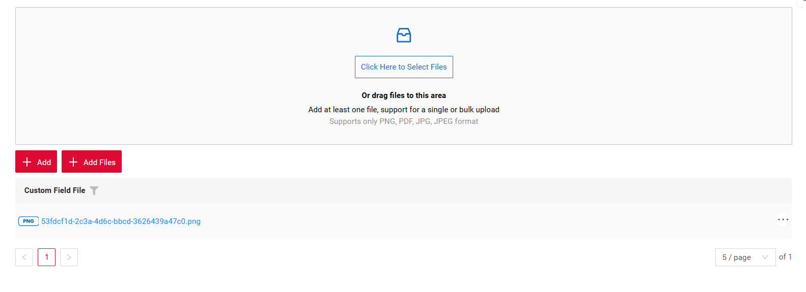
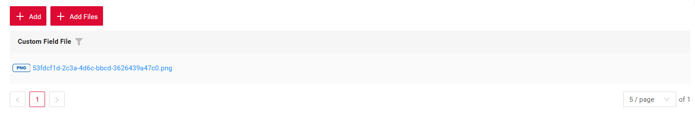

# Multi-upload files

[:material-play-circle: Live Sample]({{ external_links.code_samples }}/ui/#/screen/myexample6100){:target="_blank"}
[:fontawesome-brands-github: GitHub]({{ external_links.github_ui }}/{{ external_links.github_branch }}/src/main/java/org/demo/documentation/feature/file){:target="_blank"}

We have implemented multi-file upload. You can use a dedicated drag-and-drop zone or a standard button to select your files.

This feature supports the following types:

* [Form widget](/widget/type/form/form)  
* [List widget](/widget/type/list/list)
* [GroupingHierarchy widget](/widget/type/groupinghierarchy/groupinghierarchy)   


This feature supports only field [fileUpload](/widget/fields/field/fileUpload/fileUpload)

##### How does it look?
=== "Button And Multi-upload files"
    
=== "Button"
    
=== "Multi-upload files"
    


##### How to add?

??? Example
    === "Button And Multi-upload files"
        `Step1`  Add actionKey **associate** to corresponding **.widget.json**.
    
        ```json
              {
                "actionKey": "associate",
                "fieldKey": "customFieldFile",
                "mode": "default-and-file-upload-dnd"
              }
        ```
        
        ```json
        --8<--
        {{ external_links.github_raw_doc }}/src/main/java/org/demo/documentation/feature/file/MyExample6100AllList.widget.json
        --8<--
        ``` 
    === "Multi-upload files"
        `Step1`  Add actionKey **associate** to corresponding **.widget.json**.
    
        ```json
              {
                "actionKey": "associate",
                "fieldKey": "customFieldFile",
                "mode": "file-upload-dnd"
              }
        ```
        
        ```json
        --8<--
        {{ external_links.github_raw_doc }}/src/main/java/org/demo/documentation/feature/file/MyExample6100FileList.widget.json
        --8<--
        ``` 
    === "Button"
        `Step1`  Add actionKey **associate** to corresponding **.widget.json**.
    
        ```json
              {
                "actionKey": "associate",
                "fieldKey": "customFieldFile",
                "mode": "default"
              }
        ```
        
        ```json
        --8<--
        {{ external_links.github_raw_doc }}/src/main/java/org/demo/documentation/feature/file/MyExample6100DefaultList.widget.json
        --8<--
        ``` 
    
        ```json
        --8<--
        {{ external_links.github_raw_doc }}/src/main/java/org/demo/documentation/feature/file/MyExample6100AllList.widget.json
        --8<--
        ```

    `Step2`  Add **setFileAccept** to corresponding **FieldMetaBuilder**.
        ```java
            fields.setFileAccept(MyExampleDTO_.customFieldFile, List.of(".png",".pdf",".jpg",".jpeg"));
        ```
    
        ```json
        --8<--
        {{ external_links.github_raw_doc }}/src/main/java/org/demo/documentation/feature/file/MyExample6100Meta:buildIndependentMeta
        --8<--
        ```

    `Step3`  Add **associate** to corresponding **ResponseService**.
        ```java
            .associate(ast -> ast
            .withCustomParameter(Map.of("subtype", "multiFileUpload"))
            .text("Add Files"))
        ```
    
        ```json
        --8<--
        {{ external_links.github_raw_doc }}/src/main/java/org/demo/documentation/feature/file/MyExample6100Meta:getActions
        --8<--
        ```
    `Step3.1`  Add **doAssociate** to corresponding **ResponseService**.
    
        ```json
        --8<--
        {{ external_links.github_raw_doc }}/src/main/java/org/demo/documentation/feature/file/MyExample6100Meta:doAssociate
        --8<--
        ```
    `Step3.2`  Add function **fileUpload** to corresponding **ResponseService**.
    
        ```json
        --8<--
        {{ external_links.github_raw_doc }}/src/main/java/org/demo/documentation/feature/file/MyExample6100Meta:fileUpload
        --8<--
        ```