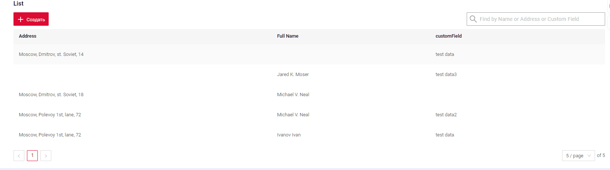

# FullTextSearch 
[:material-play-circle: Live Sample]({{ external_links.code_samples }}/ui/#/screen/myexample3614){:target="_blank"}
[:fontawesome-brands-github: GitHub]({{ external_links.github_ui }}/{{ external_links.github_branch }}/src/main/java/org/demo/documentation/feature/fulltextsearch){:target="_blank"}

When the user types in the full text search input area, then widget filters the rows that match the search query
(search criteria is configurable and will usually check if at least one column has corresponding value). 
This feature makes it easier for users to quickly find the information they are looking for within a List widget.

## Basic
It only works for the widget `List` type. [List widget](/widget/type/list/list)

### How does it look?


### How to add?
??? Example

    `Step 1` Add extention file FullTextSearchExt.java
    ```java
    --8<--
    {{ external_links.github_raw }}/conf/cxbox/fulltextsearch/FullTextSearchExt.java
    --8<--
    ```

    `Step 2` Add **specifications** for fulltextsearch fields to corresponding **JpaRepository**. 
    ```java
    --8<--
    {{ external_links.github_raw_doc }}/feature/fulltextsearch/MyEntity3614Repository.java
    --8<--
    ```

    `Step 4` Add **getSpecification** to corresponding **VersionAwareResponseService**. 
    ```java
    --8<--
    {{ external_links.github_raw_doc }}/feature/fulltextsearch/MyExample3614Service.java:getSpecification
    --8<--
    ```

    `Step 5` Add **fullTextSearch** to corresponding **.widget.json**. 

    `enabled` true/false  

    `placeholder` - description for  fullTextSearch
        
    ```json
    --8<--
    {{ external_links.github_raw_doc }}/feature/fulltextsearch/MyExample3614List.widget.json
    --8<--
    ```