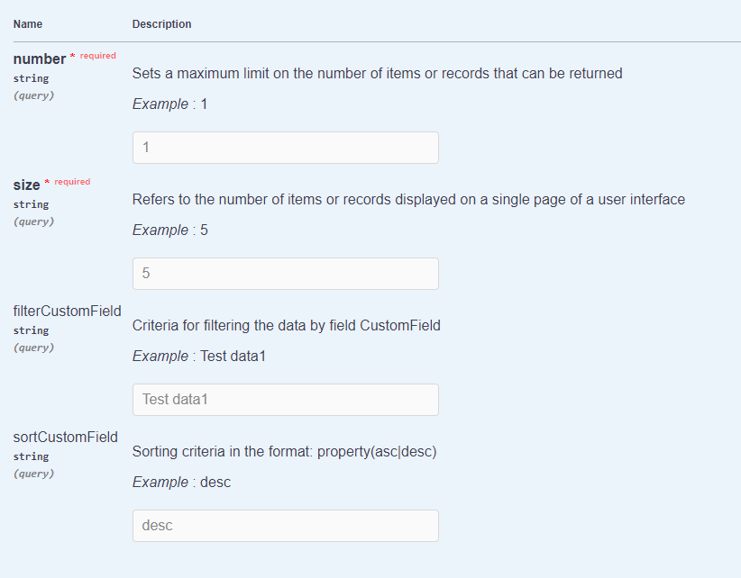

# Connecting an existing microservices 
In this example, we're considering the scenario where we need to integrate with an existing microservice responsible for data operations.

## Architecture existing microservice
Let's outline the inputs our microservice accepts:

[:fontawesome-brands-github: GitHub]({{ external_links.github_ui }}/{{ external_links.github_branch }}/src/main/java/org/demo/documentation/microservice/microservicestoringdata/ExistingMicroserviceStoringDataController.java){:target="_blank"}


Parameters **get** `/myentity3900`:



[swagger]({{ external_links.code_samples }}/swagger-ui/index.html#/)

The interface that will emerge will resemble the following:

[:material-play-circle: Live Sample]({{ external_links.code_samples }}/ui/#/screen/myexample3800){:target="_blank"} 


## Developing a straightforward interaction with the existing microservice architecture.

### **Step1** Create mapping entity

Create mapping entity through which data will be sent to the microservice

??? Example

    ```java
    --8<--
    {{ external_links.github_raw }}/microservice/existingmicroservices/MyEntity3800OutServiceDTO.java
    --8<--
    ```

### **Step 2** Create **DAO**

Create **DAO** extends **AbstractAnySourceBaseDAO** implements **AnySourceBaseDAO**

Override methods:

* **Create** : method create

??? Example
    ```java
    --8<--
        {{ external_links.github_raw }}/microservice/existingmicroservices/MyEntity3800Dao.java:create
    --8<--
    ```
* **Deletion**: method delete

??? Example
     ```java
     --8<--
     {{ external_links.github_raw }}/microservice/existingmicroservices/MyEntity3800Dao.java:delete
     --8<--
     ```
* **Update of existing entries**:  method update

??? Example
     ```java
     --8<--
     {{ external_links.github_raw }}/microservice/existingmicroservices/MyEntity3800Dao.java:update
     --8<--
     ```
* **Getting all data**: method getList

    Page size:  

    ```java
    String page = bc.getParameters().getParameter("_page");
    ```   
     
    Limit: 
    ```java
    String limit = bc.getParameters().getParameter("_limit");
    ```
  
    Sorting for field CustomField:
    ```java
        List<String> sortCustomField = getSortFieldName(queryParameters, "customField");
        Optional<String> sort = sortCustomField.isEmpty() ? Optional.empty() : Optional.of(sortCustomField.get(0));
    ```    
    
    Filter for field CustomField:
    ```java
     List<String> filterCustomField = getFilterFieldName(queryParameters, "customField", "contains");
     Optional<String> filter = filterCustomField.isEmpty() ? Optional.empty() : Optional.of(filterCustomField.get(0));
    ```  

??? Example
     ```java
     --8<--
     {{ external_links.github_raw }}/microservice/existingmicroservices/MyEntity3800Dao.java:getList
     --8<--
     ```

* **Getting data by ID**:  method getByIdIgnoringFirstLevelCache

??? Example
     ```java
     --8<--
     {{ external_links.github_raw }}/microservice/existingmicroservices/MyEntity3800Dao.java:getByIdIgnoringFirstLevelCache
     --8<--
     ```

### **Step 3** Create **DTO**

Create **DTO** extends **DataResponseDTO**

??? Example
    ```java
    --8<--
    {{ external_links.github_raw }}/microservice/existingmicroservices/MyExample3800DTO.java
    --8<--
    ```

### **Step4** Create **MetaBuilder**

Create **MetaBuilder** extends **AnySourceFieldMetaBuilder**

??? Example   
     ```java
     --8<--
     {{ external_links.github_raw }}/microservice/existingmicroservices/MyExample3800Meta.java
     --8<--
     ```

### **Step5** Create **Service**

Create **Service** extends **AnySourceVersionAwareResponseService**

??? Example
     ```java
     --8<--
     {{ external_links.github_raw }}/microservice/existingmicroservices/MyExample3800Service.java
     --8<--
     ```

### **Step6** Create **Controller**

Create **Controller** implements **EnumBcIdentifier**

??? Example
    ```java
    --8<--
     {{ external_links.github_raw }}/microservice/existingmicroservices/PlatformMyExample3800Controller.java
    --8<--
    ```

### **Step7** Create **widget.json**  

??? Example

    ```java
    --8<--
    {{ external_links.github_raw }}/microservice/existingmicroservices/MyExample3800List.widget.json
    --8<--
    ```
### **Step8** Create **view.json**

??? Example

    ```java
    --8<--
    {{ external_links.github_raw }}/microservice/existingmicroservices/myexample3800list.view.json
    --8<--
    ```

### **Step9** Create **screen.json**

??? Example

    ```java
    --8<--
    {{ external_links.github_raw }}/microservice/existingmicroservices/myexample3800.screen.json
    --8<--
    ```