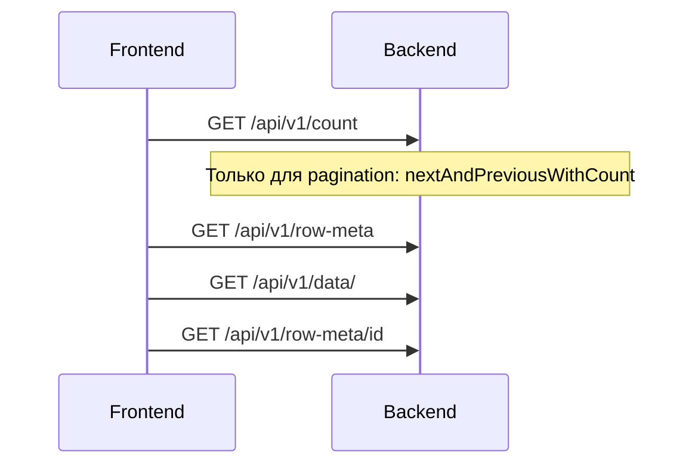
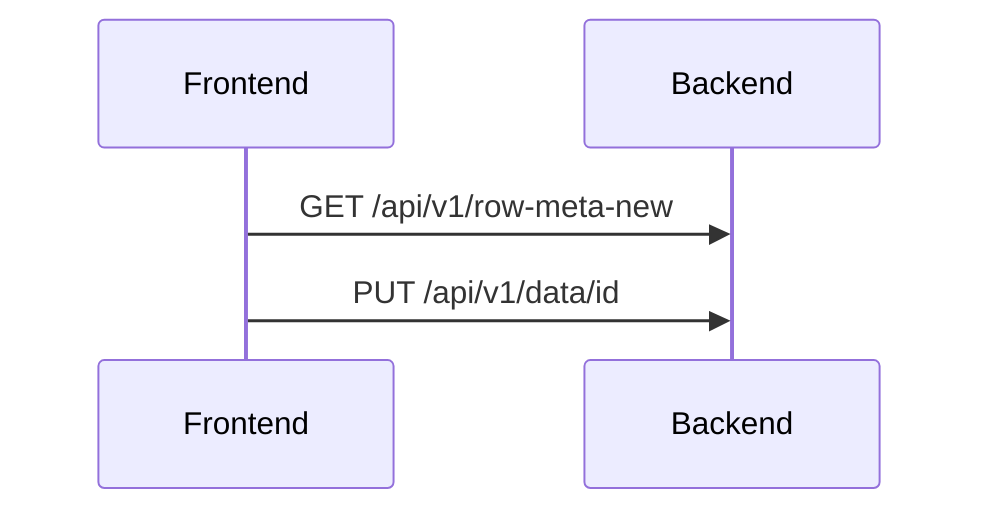
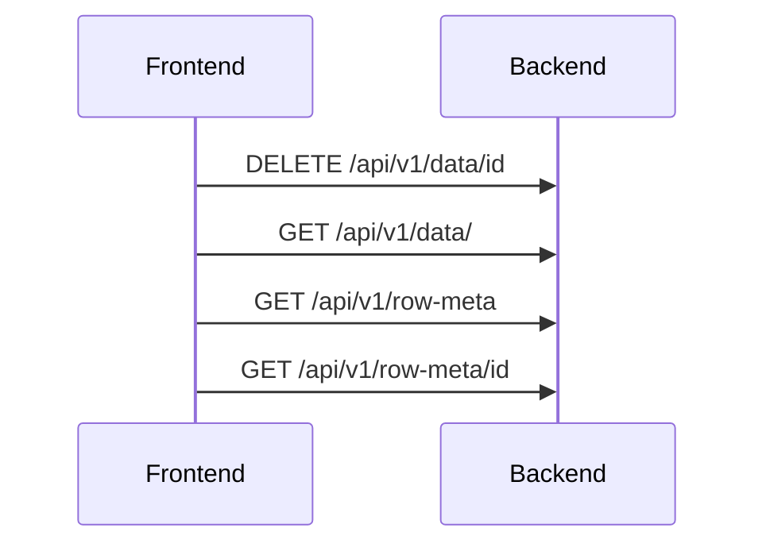
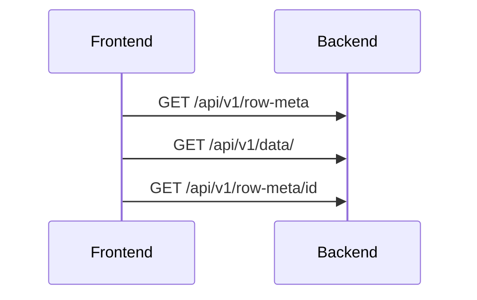

# Microservices cache


Мы используем FirstLevelCache для функция update, create

  Жизненный цикл   EntityFirstLevelCache для каждого пользователя 
Начало HTTP-запроса
│
▼
Создаётся новый EntityFirstLevelCache (пустой)
│
▼
В течение запроса методы могут:
- put(key, value)  ──▶ сохранить в кеш
- get(key)         ──▶ получить из кеша
  │
  ▼
  Конец HTTP-запроса
  │
  ▼
  EntityFirstLevelCache уничтожается 🗑️
  (все данные теряются) 

```markdown
# Работа с виджетами List и Form в CXBOX

## Общая архитектура взаимодействия

### Компоненты системы:
- **Frontend** - клиентская часть
- **Backend** - серверная часть  
- **CXBOX Core** - ядро системы
- **CustomDao** - DAO, расширяющий `AbstractAnySourceBaseDAO`

### Базовые механизмы:
- **FirstLevelCache** - кэш первого уровня
- **RowMeta** - метаданные записи
- **Pagination** - пагинация данных

## Виджет List (Список)

### Открытие экрана и загрузка данных

**Действия пользователя:** Открытие экрана списка

**Процесс загрузки:**


**Особенности:**
- Для списка берется `id` первой записи, так как курсор устанавливается на первую запись
- Для операций с записью требуется `rowMeta`
- Если записей нет, вызывается метод без `id`

### Операции с записями

#### Создание записи (Create)

**Действия пользователя:** Create, Save

**Процесс:**


**Используемые методы:**
- `getId()` (с использованием FirstLevelCache)
- `getByIdIgnoringFirstLevelCache()`
- `setId()` (с использованием FirstLevelCache)

**Рекомендация:** Использовать стандартный механизм CXBOX для хранения записи и вызова сторонних систем.

#### Удаление записи (Delete)

**Действия пользователя:** Delete

**Процесс:**


**Используемые методы:**
- `delete()`
- `getList()`
- `getByIdIgnoringFirstLevelCache()`

### Дополнительные операции

#### Контекстное меню (…)

**Действия пользователя:** Нажатие "…"

**Процесс:**
- Вызывается `getByIdIgnoringFirstLevelCache()`
- Отправляется запрос: `GET /api/v1/row-meta/id`

#### Принудительная активация и редактирование

**Действия пользователя:**
- Нажатие "assoc"
- "Force Active"
- "Edit"
- Поднятие "Form Popup"

**Процесс:**
- Вызывается `getByIdIgnoringFirstLevelCache()`
- Отправляется запрос: `GET /api/v1/row-meta/id`

## Виджет Form (Форма)

### Открытие экрана формы

**Действия пользователя:** Открытие экрана семейства Form widget

**Процесс загрузки:**


**Используемые методы:**
- `getList()` (получение всех записей)
- `getByIdIgnoringFirstLevelCache()`

**Особенности:**
- Если записей нет, вызывается метод без `id`

## API Endpoints

### Основные endpoints:

| Метод | Endpoint | Назначение |
|-------|----------|-------------|
| GET | `/api/v1/count` | Получение количества записей |
| GET | `/api/v1/row-meta` | Получение метаданных |
| GET | `/api/v1/row-meta-new` | Метаданные для новой записи |
| GET | `/api/v1/row-meta/id` | Метаданные конкретной записи |
| GET | `/api/v1/data/` | Получение данных |
| PUT | `/api/v1/data/id` | Обновление записи |
| DELETE | `/api/v1/data/id` | Удаление записи |

## Рекомендации по использованию

1. **Кэширование:** Используйте FirstLevelCache для оптимизации производительности
2. **Обработка пустых списков:** Всегда учитывайте сценарий отсутствия записей
3. **Метаданные:** RowMeta необходим для операций с конкретными записями
4. **Пагинация:** Используйте соответствующие режимы пагинации для больших наборов данных
```

Эта документация организована в структурированном формате с:
- Четкой иерархией разделов
- Диаграммами последовательностей для наглядности
- Таблицами для API endpoints
- Выделенными блоками кода и примечаний
- Логической группировкой связанной функциональности

Документация готова для использования в MkDocs и может быть легко расширена дополнительными разделами.