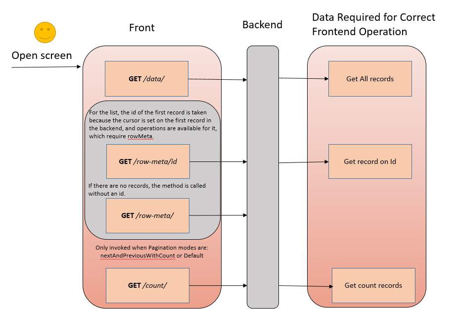
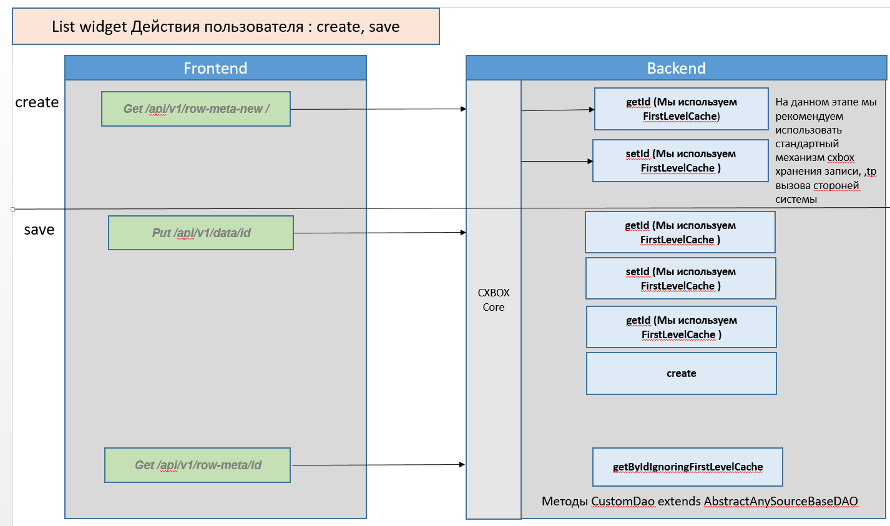
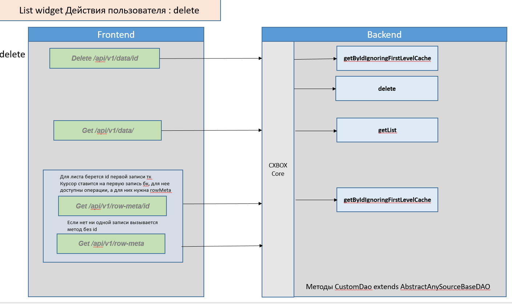
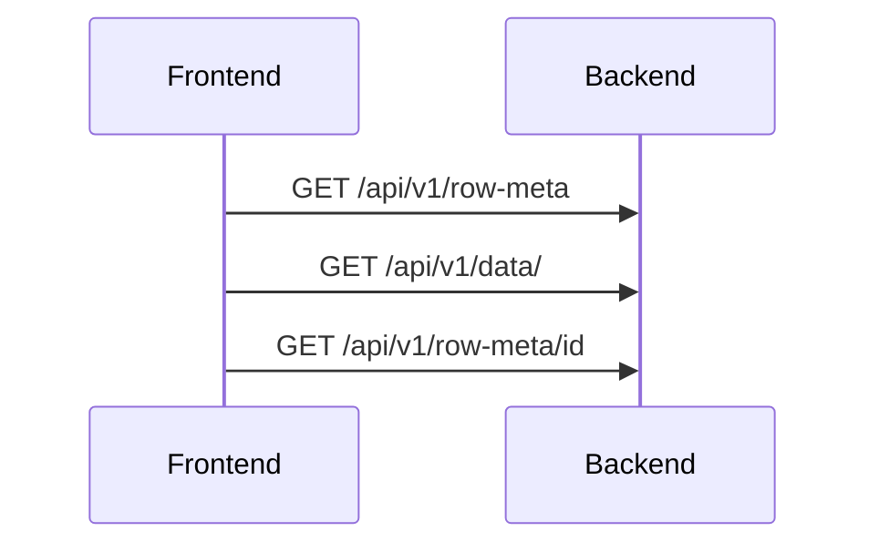

# Microservices for List widgets

## User Actions

* [Opening List Screen](#openlistscreen)
* [CRUD Operations](#crudoperations)
* [Click ...](#click)
* [Force Active](#forceactive)
* [open Assoc](#openPopup)
* [open Popup](#openPopup)
* [open Form Popup](#openformpopup)
* pagination =  [Opening List Screen](#openlistscreen) with Nextpage
* custom Action (Post api/v1/custom-action)
* refresh screen = [Opening List Screen](#openlistscreen)
* parent child
* show condition
* customization column (api/v1/personalAdditionalFields)
* file download 
* уведомление
GET

=== "List widget"
    count (Only for pagination: default, nextAndPreviousWithCount)

    | Operation             | `/row-meta`      | `/row-meta-new` | `/row-meta/id` | `/data/` |`/count` |
    |-----------------------|------------------|-----------------|----------------|--------------|-------------|
    | Open Screen           | ✅ no records | ❌             | ✅            | ✅           | ✅          |
    | Create                | ❌                | ✅             | ❌             | ❌          | ❌          |
    | Save                  | ❌                | ❌             | ✅             | ❌          | ❌          |
    | Delete                | ✅ no records | ❌             | ✅             | ✅          | ❌          |
    | Click ..              | ✅                | ❌             | ❌             | ❌          | ❌          |
    | Open Assoc, Popup | ✅                | ❌             | ❌             | ✅          | ✅          |
    | Open Form Popup       | ❌                | ❌             | ❌             | ❌          | ❌          |
    | Force Active          | ❌                | ❌             | ❌             | ❌          | ❌          |

Other
=== "List widget"
    
    | Operation             | POST  `/row-meta/id` | PUT  `/data/id` | DELETE  `/data/id` |
    |-----------------------|---------------------|---------------|------------------|
    | Open Screen           | ❌                  | ❌            | ❌            |
    | Create                | ❌                  | ❌            | ❌            |
    | Save                  | ❌                  | ✅            | ❌            |
    | Delete                | ❌                  | ❌            | ✅            |
    | Click ..              | ❌                  | ❌            | ❌            |
    | Open Assoc, Popup | ❌                  | ❌            | ❌            |
    | Open Form Popup       | ✅                  | ❌            | ❌            |
    | Force Active          | ✅                  | ❌            | ❌            |
    

### <a id="openlistscreen">Opening List Screen</a>
use F12
[:material-play-circle: Live Sample]({{ external_links.code_samples }}/ui/#/screen/myexample3800){:target="_blank"} ·

`/row-meta/id`

For the list, the `id` of the first record is taken because the cursor is set on the first record in the backend, and operations are available for it, which require rowMeta.

`/row-meta/`

If there are no records, the method is called without an ID.

`/count/`

Only invoked when Pagination modes are: nextAndPreviousWithCount or Default

 

#### How it work?
 

??? Thems
    

### <a id="crudoperations">CRUD Operations</a>

#### Create

**User actions:** Create

**Process:**

**Used methods:**
- `getId()` (using FirstLevelCache)
- `setId()` (using FirstLevelCache)

**Recommendation:** Use standard CXBOX mechanism for record storage and calling external systems.

#### Save
**User actions:** Save

**Process:**

**Used methods:**

Frontend->>Backend: PUT /api/v1/data/id

- `getId()` (using FirstLevelCache)
- `setId()` (using FirstLevelCache)
- `getId()` (using FirstLevelCache)
- `create()` (using FirstLevelCache)

Frontend->>Backend: GET /api/v1/row-meta/id

- `getByIdIgnoringFirstLevelCache()`

#### Delete 

**User actions:** Delete

**Process:**

**Used methods:**

Frontend->>Backend: DELETE /api/v1/data/id

- `delete()`
- `getList()`
- `getByIdIgnoringFirstLevelCache()`

### <a id="click">Click ...</a>

**User actions:** Clicking "…"

**Process:**

### <a id="forceactive">Force Activate</a>

**Process:**

### <a id="openformpopup">Open FormPopup</a>

**Process:**

### <a id="openPopup">Open Popup, Assoc</a>

**Process:**

## Form Widget

### Opening Form Screen

**User actions:** Opening Form widget family screen

**Loading process:**

**Used methods:**
- `getList()` (get all records)
- `getByIdIgnoringFirstLevelCache()`

**Features:**
- If there are no records, the method without `id` is called

 

| Endpoint           | Open Screen      | create | save | delete           | click .. | open Assoc,  popup |
|--------------------|------------------|--------|------|------------------|----------|----------------------|
| GET `/count`       | ✅                |       |      |                  |          |✅                  |
| GET `/row-meta`    | ✅ no records |       |      | ✅ no records |   ✅    |✅                  |
| GET `/row-meta-new`|                  | ✅     |      |                  |          |                      |
| GET `/row-meta/id` | ✅                |       | ✅   | ✅               |          |                      |
| GET `/data/`       | ✅                |       |      | ✅               |          |✅                     |
| PUT `/data/id`     |                  |        | ✅   |                  |          |                      |
| DELETE `/data/id`  |                  |        |      | ✅               |          |                      |

All

| Operation             | GET  `/row-meta` | GET  `/row-meta-new` | GET  `/row-meta/id` | POST  `/row-meta/id` | GET  `/data/` | PUT  `/data/id` | DELETE  `/data/id` | GET  `/count` |
|-----------------------|-------------------|--------------------------|-------------------|--------------------|--------------|---------------|------------------|--------------|
| Open Screen           | ✅ no records  | ❌                 |✅                |                    | ✅           |               |                  | ✅           |
| Create                | ❌                 | ✅                 |                   |                    |              |               |                  |              |
| Save                  | ❌                 | ❌                 | ✅                |                    |              | ✅            |                  |              |
| Delete                | ✅ no records  | ❌                 | ✅                |                    | ✅           |               | ✅               |              |
| Click ..              | ❌                 | ❌                 | ✅                 |                    |              |               |                  |              |
| Open Assoc, Popup | ✅  no records | ❌                 | ✅                 |                    | ✅           |               |                  | ✅           |
| Open Form Popup       | ❌                 | ❌                 |                   | ✅                  |              |               |                  |              |
| Force Active          | ❌                 | ❌                 |                   | ✅                 |              |               |                  |              |

 