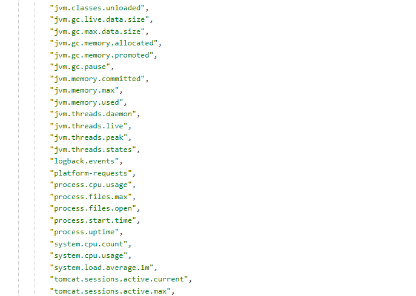
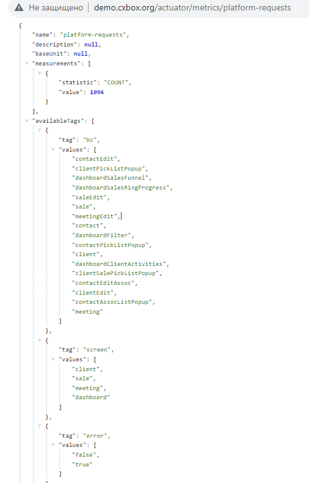
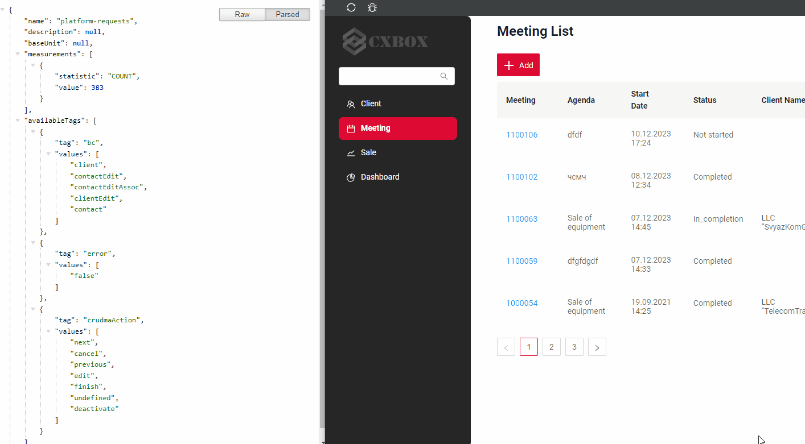

# Perfomance metrics
cxbox/core 3.0.5

cxbox-ui/core 1.37.1

[:material-play-circle: Live Sample]({{ external_links.demo }}/actuator/metrics){:target="_blank"} 

## How does it look?
 

## Metrics
Metrics can be two types:

* Standard
* Custom


### Standard metrics

Description Standard metrics see [spring-boot metrics]( https://docs.spring.io/spring-boot/docs/2.0.x/reference/html/production-ready-metrics.html#production-ready-metrics-meter)

#### How to add?
??? Example
    Step 1. Add pom.xml  new dependency.
    ```xml
    <dependency>
    <groupId>org.springframework.boot</groupId>
    <artifactId>spring-boot-starter-actuator</artifactId>
    </dependency>
    ```
    Step 2. Add permission to  SecurityConfig.java 
    ```java
    .antMatchers("/actuator/metrics/**").permitAll()
    ```
    Step 3. Add new environment to  application.yml
    ```
        management:
            endpoint:
                metrics:
                    enabled: true
        endpoints:
            enabled-by-default: true
            web:
                exposure:
                    include: 'metrics'
    ```
 
 
### Custom metrics
You can see the number of requests in different sections.


[:material-play-circle: Live Sample]({{ external_links.demo }}/actuator/metrics/platform-requests){:target="_blank"} Statistics of all requests to UI

[:material-play-circle: Live Sample]({{ external_links.demo }}/actuator/metrics/platform-requests?tag=screen:client&tag=user:JOHN%20SNOW){:target="_blank"} Statistics of all requests to screen clients and user

Example request:

`../actuator/metrics/platform-requests?tag=<section name>:<section value>`
 
`{{ external_links.demo }}/actuator/metrics/platform-requests?tag=screen:client`All requests to screen clients

You can filter by several sections at once.

`{{ external_links.demo }}/actuator/metrics/platform-requests?tag=screen:client&tag=user:JOHN%20SNOW` All requests to user and  screen clients
 
####  How does it look?
=== "Statistics of all requests to UI"
    Custom application metrics: counting calls to UI tesler.
    

=== "Statistics of all requests to user and  screen clients"
    Custom application metrics: counting calls to screen clients.
     

#### How to add?
??? Example
    Step 1. Add pom.xml  new dependency.
    ```xml
    <dependency>
    <groupId>org.springframework.boot</groupId>
    <artifactId>spring-boot-starter-actuator</artifactId>
    </dependency>
    ```
    Step 2. Add permission to  SecurityConfig.java 
    ```java
    .antMatchers("/actuator/metrics/**").permitAll()
    ```
    Step 3. Add new environment to  application.yml
    ```
        management:
            endpoint:
                metrics:
                    enabled: true
        endpoints:
            enabled-by-default: true
            web:
                exposure:
                    include: 'metrics'
    ```
    Step 4. Add description custom metrics:screen,bc,crudmaAction,error,user.

    Custom metrics start name: "platform-requests"
    
    ```java
    package org.demo.conf.cxbox.metrics;
    
    import io.micrometer.core.instrument.Counter;
    import io.micrometer.core.instrument.MeterRegistry;
    import java.util.Optional;
    import java.util.stream.Stream;
    import org.cxbox.core.crudma.CrudmaActionHolder.CrudmaAction;
    import org.cxbox.core.crudma.CrudmaEvent;
    import org.cxbox.core.crudma.bc.BusinessComponent;
    import org.demo.conf.security.cxboxkeycloak.CxboxKeycloakAccount;
    import org.springframework.context.ApplicationListener;
    import org.springframework.security.core.Authentication;
    import org.springframework.security.core.context.SecurityContext;
    import org.springframework.security.core.context.SecurityContextHolder;
    import org.springframework.stereotype.Component;
    
    @Component
    public class CrudmaEventListener implements ApplicationListener<CrudmaEvent> {
    
        public static final String UNDEFINED = "undefined";
    
        private final MeterRegistry registry;
    
        public CrudmaEventListener(MeterRegistry registry) {
            this.registry = registry;
            registry.counter("platform-requests");
        }
    
        @Override
        public final void onApplicationEvent(final CrudmaEvent event) {
            final CrudmaAction crudmaAction = event.getCrudmaAction();
            final BusinessComponent bc = crudmaAction.getBc();
            Counter counter = registry.counter(
                    "platform-requests",
                    "screen", Optional.ofNullable(bc.getHierarchy().getScreenName()).orElse(UNDEFINED),
                    "bc", Optional.ofNullable(bc.getName()).orElse(UNDEFINED),
                    "crudmaAction", Optional.ofNullable(crudmaAction.getName()).orElse(UNDEFINED),
                    "user", Optional.ofNullable(getUserLogin()).orElse(UNDEFINED),
                    "error", event.getException() == null ? "false" : "true"
            );
            counter.increment();
        }
    
        public static String getUserLogin() {
            return Stream.of(SecurityContextHolder.getContext())
                    .map(SecurityContext::getAuthentication)
                    .map(Authentication::getDetails)
                    .filter(CxboxKeycloakAccount.class::isInstance)
                    .map(CxboxKeycloakAccount.class::cast)
                    .findFirst()
                    .map(CxboxKeycloakAccount::getUsername)
                    .orElse(null);
        }
    
    }
    ```
 