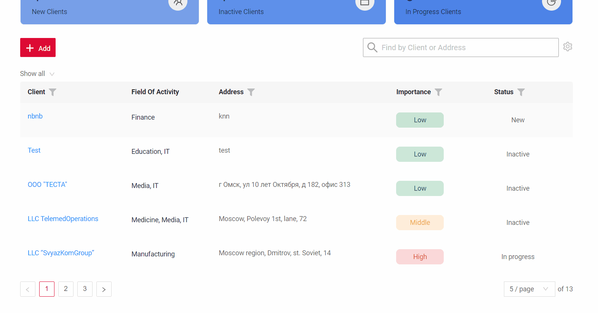
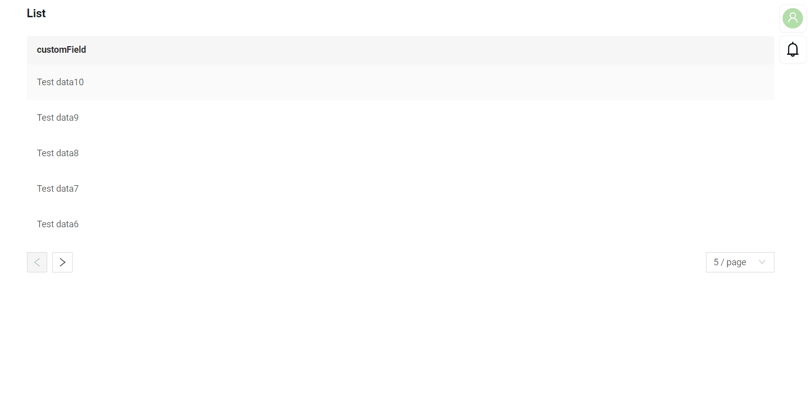

# Pagination

`Pagination` is a method used to divide a large amount of content into multiple pages to improve usability. 
It allows users to view data in parts using navigation elements.

## Basic
At the bottom of the page, there are "Forward" and "Back" arrows for pagination with page numbers, and an option to select the number of records displayed per page.

When choosing the number of records displayed per page, the following options are available: 

* 5
* 10
* 15
* 20

### How does it look?

## Pagination mode

You can set up hiding navigation arrows and row count options if the number of rows on a page is less than the limit.

### How does it look?

