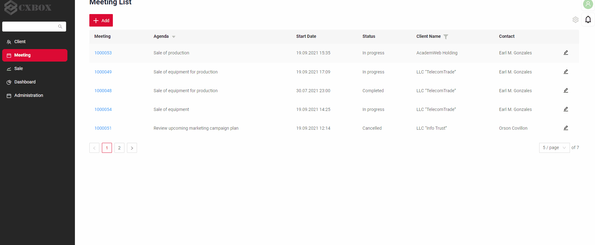

# Push notificaions
cxbox/core 3.0.5

cxbox-ui/core 1.37.1

[:material-play-circle: Live Sample]({{ external_links.demo }}/ui/#/screen/meeting){:target="_blank"} 

## How does it look?
 

## How to add?
??? Example    
    - Step 1. Add pom.xml  new dependency.
    ```
    <dependency>
    <groupId>org.springframework.boot</groupId>
    <artifactId>spring-boot-starter-websocket</artifactId>
    </dependency>
    ```

    -  Step 2. Add new environment to  application.yml
    ```
    websocket:
        endpointToConnect: /websocketnotification
        topic: /user/queue/websocket.reply
    ```

    === "Step 3. SimpleBroker"
        The default broker is SimpleBroker Spring implementation.

        see more [STOMP Protocols](https://www.toptal.com/java/stomp-spring-boot-websocket)

    === "Step 3. ActiveMQ"
        - see more [ActiveMQ](https://roytuts.com/messaging-with-stomp-over-websockets-using-spring-and-activemq/)
    
            +  Step 3.1. Add pom.xml  new dependency.
    
                    ```
                        <dependency>
                          <groupId>org.springframework.boot</groupId>
                          <artifactId>spring-boot-starter-activemq</artifactId>
                        </dependency>
                        <dependency>
                          <groupId>org.springframework.boot</groupId>
                          <artifactId>spring-boot-starter-reactor-netty</artifactId>
                        </dependency>
                    ```
            +  Step 3.2. Convert the ACTIVEMQ_BROKER_TYPE environment variable to the 'activemq' value
            
                    ```
                    ACTIVEMQ_BROKER_TYPE:activemq
                    ```
                    
            +  Step 3.3 Other configurations:
                    
                    ```
                    ACTIVEMQ_ADMIN_LOGIN: The default admin login is 'admin'
                    ACTIVEMQ_ADMIN_PASSWORD: The default administrator password is 'admin'
                    ACTIVEMQ_HOST: The default connection host is 'activemq'
                    ACTIVEMQ_PORT: The default connection port is '61616'
                    STOMP_PORT: The default STOMP connection port is '61613'
                    ```

    - Step 4. Add WebSocketConfig.java

        ```java
        import org.springframework.beans.factory.annotation.Value;
        import org.springframework.context.annotation.Configuration;
        import org.springframework.messaging.simp.config.MessageBrokerRegistry;
        import org.springframework.web.socket.config.annotation.EnableWebSocketMessageBroker;
        import org.springframework.web.socket.config.annotation.StompEndpointRegistry;
        import org.springframework.web.socket.config.annotation.WebSocketMessageBrokerConfigurer;
        
        @Configuration
        @EnableWebSocketMessageBroker
        public class WebSocketConfig implements WebSocketMessageBrokerConfigurer {
        
            @Value("${spring.websocket.topic}")
            private String topic;
        
            @Value("${spring.websocket.endpointToConnect}")
            private String endpointToConnect;
        
            @Value("${cxbox.api.path}")
            private String api;
        
            @Override
            public void configureMessageBroker(MessageBrokerRegistry config) {
                config.enableSimpleBroker(topic);
            }
        
            @Override
            public void registerStompEndpoints(StompEndpointRegistry registry) {
                registry.addEndpoint(api + endpointToConnect);
            }
        
        }
        ```
     