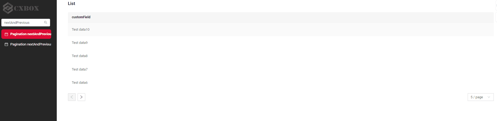

# Pagination
!!! warning line end "Work in progress"

Pagination is the process of dividing content into separate, discrete pages, making it easier to navigate and consume large amounts of information.

The navigation arrows and limit settings block are removed if the number of records is less than the limit.

Pagination modes:

* [nextAndPreviousWithHasNext](#nextAndPreviousWithHasNext)
* [nextAndPreviousSmart](#nextAndPreviousSmart)

## <a id="nextAndPreviousWithHasNext">nextAndPreviousWithHasNext</a>
[:material-play-circle: Live Sample]({{ external_links.code_samples }}/ui/#/screen/myexample3860){:target="_blank"} ·
[:fontawesome-brands-github: GitHub]({{ external_links.github_ui }}/{{ external_links.github_branch }}/src/main/java/org/demo/documentation/feature/microservice/nextandpreviouswihhasnext){:target="_blank"}

Next button availability logic:

* If hasNext (from /data) is true, Next button is available.
* If hasNext (from /data) is false, Next button is disabled.

### How does it look?


### How to add?
??? Example

    Add in **options** parameter **pagination** to corresponding **.widget.json**.

    ```
      "pagination": {
      "type": "nextAndPreviousWihHasNext"
      }
    ```
   
    ```json
    --8<--
    {{ external_links.github_raw_doc }}/feature/microservice/nextandpreviouswihhasnext/MyExample3860List.widget.json
    --8<--
    ```

    [:material-play-circle: Live Sample]({{ external_links.code_samples }}/ui/#/screen/myexample3860){:target="_blank"} ·
    [:fontawesome-brands-github: GitHub]({{ external_links.github_ui }}/{{ external_links.github_branch }}/src/main/java/org/demo/documentation/feature/microservice/nextandpreviouswihhasnext){:target="_blank"}


## <a id="nextAndPreviousSmart">nextAndPreviousSmart</a>
[:material-play-circle: Live Sample]({{ external_links.code_samples }}/ui/#/screen/myexample3861){:target="_blank"} ·
[:fontawesome-brands-github: GitHub]({{ external_links.github_ui }}/{{ external_links.github_branch }}/src/main/java/org/demo/documentation/feature/microservice/nextandprevioussmart){:target="_blank"}
 
Next button availability logic:
If the number of records received from /data is less than _limit, Next button is disabled.

Disadvantages of this mode:

* If the number of records is a multiple of _limit, a single jump to a page with no records will occur, since it is impossible to determine whether this is the last page.
* If the number of records is a multiple of _limit, a request for the next page will be sent even if it does not exist. If this request returns an error, it should be handled with a try {} catch {} block.

### How does it look?


### How to add?
??? Example

    Add in **options** parameter **pagination** to corresponding **.widget.json**.
    ```
    "pagination": {
    "type": "nextAndPreviousWihHasNext"
    }
    ```
    ```json
      --8<--
        {{ external_links.github_raw_doc }}/feature/microservice/nextandprevioussmart/MyExample3861List.widget.json
      --8<--
    ```
    [:material-play-circle: Live Sample]({{ external_links.code_samples }}/ui/#/screen/myexample3861){:target="_blank"} ·
    [:fontawesome-brands-github: GitHub]({{ external_links.github_ui }}/{{ external_links.github_branch }}/src/main/java/org/demo/documentation/feature/microservice/nextandprevioussmart){:target="_blank"}

 