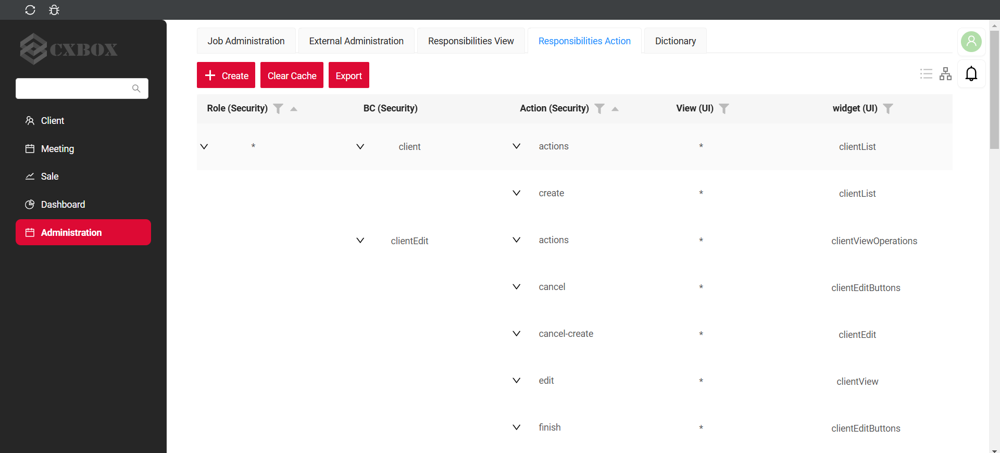
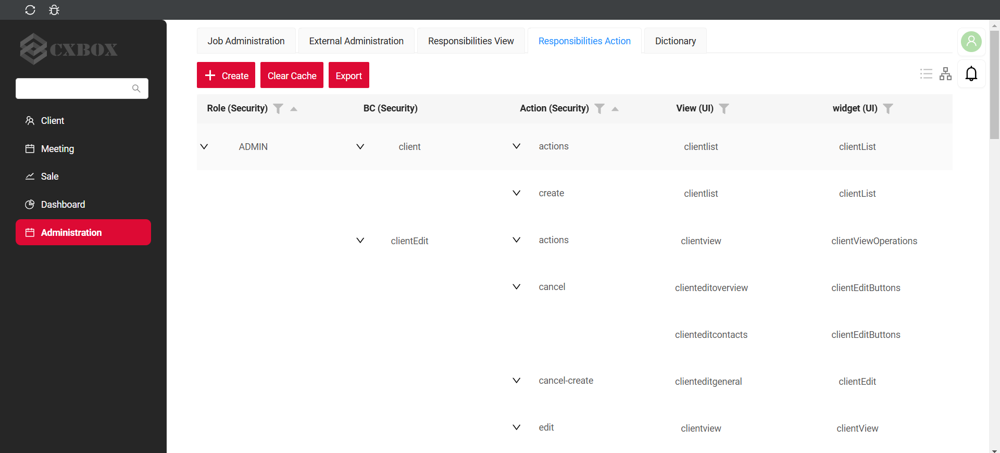
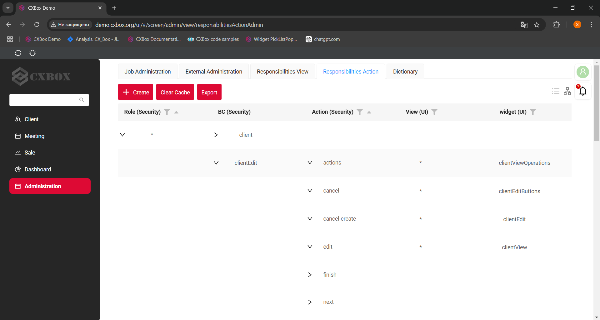

# Role Loading (Views and Actions)

This article explains how determines:

* which **views** a user can open
* which **actions** are visible and available inside widgets

It also explains how these permissions are configured and why different approaches exist.

 
## Basic

Access control is split into several independent layers. 
This separation allows flexibility but requires careful configuration to avoid inconsistencies.

There are **three main permission layers**:

1. **View access**
   Controls whether a user can open a specific screen (navigation item).

2. **Widget actions**
   Defines which buttons or actions are visible and executable within a widget.

3. **Service-level restrictions** for widget actions
   Backend-level validation  

Viewing and editing of the role model is available through the administrator screen().

## Role Loading for Views
The set of views available to a user depends on their roles.

The role model for views is based on data stored in the **RESPONSIBILITY** table.

!!! warning
    Avoid creating or modifying records in the `RESPONSIBILITIES` table manually.
    Incorrect data may lead to inconsistent UI behavior or security issues.
 
Load permissions from two main sources:

* Meta JSON Files
* CSV and Liquibase 

### **Meta JSON Files**
It is not possible to configure responsibilities through the Administration UI.

We recommended to use for faster development.

The system extracts roles from the `rolesAllowed` field in `.view.json` files and populates the `RESPONSIBILITIES` table.

**Advantages:**

* Better integration with plugins
* Faster development (automatically generates responsibility records based on metadata)
* Less risk of human error

!!! info
    For faster development, we recommend working in this mode:

      1. Develop and configure data using this mode during implementation.
      2. Once development is complete, navigate to the **view/responsibilitiesAdmin** screen.
      3. Click the **Export** button.
      4. Download the generated file.
      5. Use this file later for data loading via CSV.

#### Examples

**Goal:**

Make a view available for role `CXBOX_USER`.

**What happens internally:**

1. Developer adds `rolesAllowed = ["CXBOX_USER"]` in `.view.json`
2. Application starts or meta is refreshed
3. CXBOX creates a record in `RESPONSIBILITIES`
4. User with role `CXBOX_USER` can now open the view


How does it look?


How to add?
??? Example

    Step 1. Enable feature
    
    In `application.yml`:
    
    ```yaml
    cxbox:
      meta:
        view-allowed-roles-enabled: true
    ```
    
    
    Step 2. Configure `.view.json`
    
    Add the `rolesAllowed` field:
    
    ```json
    {
      "name": "myexamplelist",
      "title": "My Example List",
      "url": "/screen/myexample/view/myexamplelist",
      "template": "DashboardView",
      "widgets": [
        {
          "widgetName": "SecondLevelMenu",
          "position": 0,
          "gridWidth": 24
        },
        {
          "widgetName": "MyExampleList",
          "position": 20,
          "gridWidth": 12
        }
      ],
      "rolesAllowed": [
        "CXBOX_USER"
      ]
    }
    ```
    Step 3. Apply changes
    
    * Restart the application **or**
      * Trigger Meta Refresh
    
    Step 4. Verify in database
    
    Check the `RESPONSIBILITIES` table:
    
    | ID      | INTERNAL_ROLE_CD | RESPONSIBILITIES | RESP_TYPE |
    | ------- | ---------------- | ---------------- | --------- |
    | 1100441 | CXBOX_USER       | myexamplelist    | VIEW      |

    Each view declares allowed roles in metadata
    On application startup or meta refresh:

        * scans all `.view.json` files
        * Extracts `rolesAllowed`
        * Creates or updates records in `RESPONSIBILITIES`

 
### CSV and Liquibase
It is possible to configure responsibilities through the Administration UI.

Permissions be loaded via - vanilla load CSV files (e.g., `RESPONSIBILITIES_VIEW.csv`) and Liquibase changesets
 

This approach is typically used when permissions must be managed externally.

This approach is useful for runtime configuration but less convenient for development workflows.


#### Examples

**Goal:**

Make a view available for role `CXBOX_USER`.

**What happens internally:**

1. Developer adds view-role to `RESPONSIBILITIES.CSV`
2. Application starts or meta is refreshed
3. CXBOX creates a record in `RESPONSIBILITIES`
4. User with role `CXBOX_USER` can now open the view


How does it look?


How to add?
??? Example

    Step 1. Enable feature
    
    In `application.yml`:
    
    ```yaml
    cxbox:
      meta:
        view-allowed-roles-enabled: false
    ```
    
    
    Step 2. Add role- vew to `RESPONSIBILITIES.CSV`

    | INTERNAL_ROLE_CD | RESPONSIBILITIES | ID |
    |------------------|------------------|----|
    | CXBOX_USER       | myexample82list  |    |

    Step 3. Apply changes
    
    * Restart the application **or**
    * Trigger Meta Refresh
    
    Step 4. Verify in database
    
    Check the `RESPONSIBILITIES` table:
    
    | ID      | INTERNAL_ROLE_CD | RESPONSIBILITIES | RESP_TYPE |
    | ------- | ---------------- | ---------------- | --------- |
    | 1100441 | CXBOX_USER       | myexamplelist    | VIEW      |

    On application startup or meta refresh:

        * Creates or updates records in `RESPONSIBILITIES`

## Role Loading for Actions

Which **widget actions** (buttons, row actions, and so on) a role may use is driven by the **`RESPONSIBILITIES_ACTION`** table.

The source of truth is controlled by `cxbox.meta.widget-action-groups-enabled` (see `MetaConfigurationProperties` in the core: `cxbox-starter-meta`).

!!! warning
    Avoid editing `RESPONSIBILITIES_ACTION` manually in production without understanding the role model.
    Prefer the Administration UI or controlled CSV/Liquibase loads.

Load permissions from two main sources:

* Meta JSON files (`*.widget.json` → `actionGroups`)
* CSV and Liquibase (file such as `RESPONSIBILITIES_ACTION.csv` in the demo project)

### **Meta JSON Files**

When `widget-action-groups-enabled` is **true**, action visibility is defined in **`widget.json`** under `options.actionGroups` (typically `include` lists action group keys).

The platform can also **prefill** `RESPONSIBILITIES_ACTION` from `actionGroups.include` on startup when this mode is enabled. Only **`include`** is migrated automatically; if you use **`exclude`**, plan a manual migration.

**Advantages:**

* Same workflow as for views: fast iteration in metadata
* Aligns with plugin-driven development

!!! info
    Recommended development flow (analogous to views):

    1. Configure actions in `widget.json` while `widget-action-groups-enabled: true`.
    2. When the model is stable, open **`/screen/admin/view/responsibilitiesActionAdmin`** (Administration → action responsibilities).
    3. Click **Export** and download the generated CSV.
    4. Place or merge the file into your project (for example `src/main/resources/db/data/cxbox/RESPONSIBILITIES_ACTION.csv`) and load it with Liquibase like other responsibility data.
    5. Optionally switch `widget-action-groups-enabled` to `false` so the database becomes the single source of truth.

#### `widget-action-groups-compact`

This flag matters when `widget-action-groups-enabled` is **true** and the application **fills** `RESPONSIBILITIES_ACTION` from JSON (migration / prefill).

* **`true` (compact)** — fewer rows: wildcard semantics (for example `*` for “all roles / all views”) so the table stays readable during migration.
* **`false` (full)** — one row per role and view combination; more verbose but explicit.

Default in core: `widget-action-groups-compact: true`.

How does prefill look in the database?
=== "COMPACT (`widget-action-groups-compact: true`)"
    
=== "FULL (`widget-action-groups-compact: false`)"
    

#### Examples

**Goal:** Allow action groups `create` and `actions` on a List widget for metadata-driven development.

**What happens internally:**

1. Developer sets `widget-action-groups-enabled: true` in `application.yml`.
2. Developer adds `actionGroups.include` in `*.widget.json`.
3. On startup or meta refresh, the engine applies widget meta; with prefill enabled, rows can be created in `RESPONSIBILITIES_ACTION` according to `widget-action-groups-compact`.

How does it look?


How to add?
??? Example

    Step 1. Enable JSON-driven action groups

    In `application.yml`:

    ```yaml
    cxbox:
      meta:
        widget-action-groups-enabled: true
        widget-action-groups-compact: true
    ```

    Step 2. Configure `*.widget.json`

    Example fragment:

    ```json
    {
      "options": {
        "actionGroups": {
          "include": [
            "create",
            "actions"
          ]
        }
      }
    }
    ```

    Step 3. Apply changes

    * Restart the application **or**
    * Trigger Meta Refresh

    Step 4. (Optional) Export for Liquibase

    Use **`responsibilitiesActionAdmin`** → **Export** to produce `RESPONSIBILITIES_ACTION.csv` for version control.

### **CSV and Liquibase**

When `widget-action-groups-enabled` is **false**, action responsibilities are **not** taken only from `widget.json` for the role model: they are maintained in **`RESPONSIBILITIES_ACTION`** (UI or CSV).

Typical project file in **cxbox-demo**: `src/main/resources/db/data/cxbox/RESPONSIBILITIES_ACTION.csv`

Liquibase loads it (see changelog `RESPONSIBILITIES_ACTION` in `db/changelog/cxbox/`). Separator is **`;`**. Columns:

| Column             | Meaning |
| ------------------ | ------- |
| `INTERNAL_ROLE_CD` | Internal role code |
| `ACTION`           | Action key |
| `VIEW`             | View name |
| `WIDGET`           | Widget name |
| `ID`               | Optional / generated depending on migration |

Primary key for upsert: `INTERNAL_ROLE_CD`, `ACTION`, `VIEW`, `WIDGET`.

#### Examples

**Goal:** Grant an action for role `CXBOX_USER` on a concrete view and widget via data load.

**What happens internally:**

1. Row exists in `RESPONSIBILITIES_ACTION` (via UI edit + Clear Cache, or via CSV + Liquibase).
2. User with that role sees the action when the view/widget matches.

How does it look?


How to add?
??? Example

    Step 1. Disable JSON-only action groups (DB is source of truth)

    In `application.yml`:

    ```yaml
    cxbox:
      meta:
        widget-action-groups-enabled: false
    ```

    Step 2. Add or edit rows

    * **Option A — UI:** open **`/screen/admin/view/responsibilitiesActionAdmin`**, configure rows, use **Clear Cache** (experimental; not for clustered cache without coordination).
    * **Option B — CSV:** edit `RESPONSIBILITIES_ACTION.csv` and let Liquibase apply on deploy.

    Step 3. Apply changes

    * Restart after Liquibase **or**
    * Clear meta cache from the UI as required

    Step 4. Export for the next environment

    From **`responsibilitiesActionAdmin`**, click **Export** to obtain a CSV in the same format used by Liquibase migrations.

## See also

* [Role-based meta settings](../authorization/rolebasedmetasettings.md) — recommended combinations of `view-allowed-roles-enabled`, `widget-action-groups-enabled`, and `widget-action-groups-compact`.
