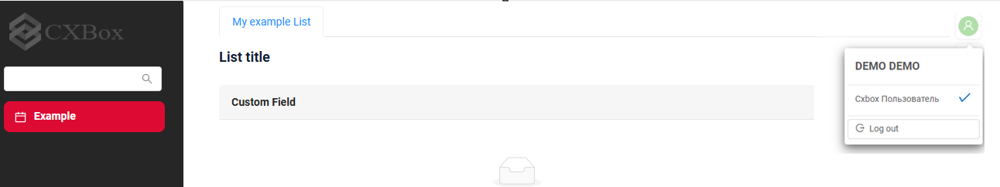

# Role Loading (Views and Actions)

This article explains how determines:

* which **views** a user can open
* which **actions** are visible and available inside widgets

It also briefly explains how these permissions are configured and why different approaches exist.

 
## Basic

Access control is split into several independent layers. This separation allows flexibility but requires careful configuration to avoid inconsistencies.

There are **three main permission layers**:

1. **View access**
   Controls whether a user can open a specific screen (navigation item).

2. **Widget actions**
   Defines which buttons or actions are visible and executable within a widget.

3. **Service-level restrictions**
   Backend-level validation  


## Role Loading for Views
The set of views available to a user depends on their roles.

Stores allowed **View–Role pairs** in the `RESPONSIBILITIES` table:

* `INTERNAL_ROLE_CD` — role code
* `RESPONSIBILITIES` — view name
* `RESP_TYPE` — type of permission (e.g., `VIEW`)

!!! warning
    Avoid creating or modifying records in the `RESPONSIBILITIES` table manually.
    Incorrect data may lead to inconsistent UI behavior or security issues.
 
Load permissions from two main sources:

* Meta JSON Files
* CSV and Liquibase 

### **Meta JSON Files**
It is not possible to configure responsibilities through the Administration UI.

We recommended to use for faster development.

Permissions can also be loaded via: 

* `*.view.json` 

**Advantages:**

* Better integration with plugins
* Faster development(automatically generates responsibility records based on metadata)
* Automatic synchronization with the system
* Less risk of human error
 
 
The system extracts roles from the `rolesAllowed` field in `.view.json` files and populates the `RESPONSIBILITIES` table.

#### Examples

**Goal:**

Make a view available for role `CXBOX_USER`.

**What happens internally:**

1. Developer adds `rolesAllowed = ["CXBOX_USER"]` in `.view.json`
2. Application starts or meta is refreshed
3. CXBOX creates a record in `RESPONSIBILITIES`
4. User with role `CXBOX_USER` can now open the view


How does it look?


How to add?
??? Example

    Step 1. Enable feature
    
    In `application.yml`:
    
    ```yaml
    cxbox:
      meta:
        view-allowed-roles-enabled: true
    ```
    
    
    Step 2. Configure `.view.json`
    
    Add the `rolesAllowed` field:
    
    ```json
    {
      "name": "myexamplelist",
      "title": "My Example List",
      "url": "/screen/myexample/view/myexamplelist",
      "template": "DashboardView",
      "widgets": [
        {
          "widgetName": "SecondLevelMenu",
          "position": 0,
          "gridWidth": 24
        },
        {
          "widgetName": "MyExampleList",
          "position": 20,
          "gridWidth": 12
        }
      ],
      "rolesAllowed": [
        "CXBOX_USER"
      ]
    }
    ```
    Step 3. Apply changes
    
    * Restart the application **or**
      * Trigger Meta Refresh
    
    Step 4. Verify in database
    
    Check the `RESPONSIBILITIES` table:
    
    | ID      | INTERNAL_ROLE_CD | RESPONSIBILITIES | RESP_TYPE |
    | ------- | ---------------- | ---------------- | --------- |
    | 1100441 | CXBOX_USER       | myexamplelist    | VIEW      |

    Each view declares allowed roles in metadata
    On application startup or meta refresh:

        * scans all `.view.json` files
        * Extracts `rolesAllowed`
        * Creates or updates records in `RESPONSIBILITIES`

 
### CSV and Liquibase
It is possible to configure responsibilities through the Administration UI.

Permissions can also be loaded via:

* vanilla load CSV files (e.g., `RESPONSIBILITIES_VIEW.csv`) and Liquibase changesets
 

This approach is typically used when permissions must be managed externally.

This approach is useful for runtime configuration but less convenient for development workflows.


#### Examples

**Goal:**

Make a view available for role `CXBOX_USER`.

**What happens internally:**

1. Developer adds view-role to `RESPONSIBILITIES.CSV`
2. Application starts or meta is refreshed
3. CXBOX creates a record in `RESPONSIBILITIES`
4. User with role `CXBOX_USER` can now open the view


How does it look?


How to add?
??? Example

    Step 1. Enable feature
    
    In `application.yml`:
    
    ```yaml
    cxbox:
      meta:
        view-allowed-roles-enabled: false
    ```
    
    
    Step 2. Add to `RESPONSIBILITIES.CSV`

    | INTERNAL_ROLE_CD | RESPONSIBILITIES | ID |
    |------------------|------------------|----|
    | CXBOX_USER       | myexample82list  |    |
   
    ```
    Step 3. Apply changes
    
    * Restart the application **or**
    * Trigger Meta Refresh
    
    Step 4. Verify in database
    
    Check the `RESPONSIBILITIES` table:
    
    | ID      | INTERNAL_ROLE_CD | RESPONSIBILITIES | RESP_TYPE |
    | ------- | ---------------- | ---------------- | --------- |
    | 1100441 | CXBOX_USER       | myexamplelist    | VIEW      |

    On application startup or meta refresh:

        * Creates or updates records in `RESPONSIBILITIES`

<!-- ## Widget actions loading 

### JSON mode (`actionGroups` in `*.widget.json`)

When `cxbox.meta.widget-action-groups-enabled=true`, action visibility is loaded from widget meta:

- `*.widget.json -> actionGroups -> include/exclude`

### DB/UI mode (Responsibilities Action)

When `cxbox.meta.widget-action-groups-enabled=false`, action visibility is loaded from DB
(commonly a table like `responsibilities_action`) and can be managed through UI and migrations.

This mode is recommended when you need:

- environment-to-environment migration of permissions
- runtime updates without rebuilding meta JSON files

## Basic loading during release (recommended workflow)

This section describes a typical release workflow to make role loading predictable for users and DevOps.

### Option A: Permissions as code (JSON-driven)

Use when you want permissions to be shipped with meta JSON:

```yaml
cxbox:
  meta:
    view-allowed-roles-enabled: true
    widget-action-groups-enabled: true
    widget-action-groups-compact: true
```

Release steps:

1. Update `rolesAllowed` in `*.view.json` and `actionGroups` in `*.widget.json`.
2. Deploy the new application build.
3. Restart the application (meta reload as per your setup).

### Option B: Permissions via DB/UI (Responsibilities-driven)

Use when you want permissions to be migrated and adjusted via UI:

```yaml
cxbox:
  meta:
    view-allowed-roles-enabled: false
    widget-action-groups-enabled: false
    widget-action-groups-compact: true
```

Release steps:

1. Prepare migration content (CSV/Liquibase) for Responsibilities tables.
2. Deploy and run DB migrations.
3. Restart the application (or clear meta cache from Administration UI if applicable).
4. Validate: login as a user with each role and confirm navigation + actions are correct.

### Option C: Transitional mode (migrate actions from JSON first)

Use when you are moving action permissions from JSON to DB:

```yaml
cxbox:
  meta:
    view-allowed-roles-enabled: false
    widget-action-groups-enabled: true
    widget-action-groups-compact: true
```

Then switch `widget-action-groups-enabled` to `false` after you have prefilled/migrated action responsibilities.

## Configuration parameters reference

These parameters are defined in core in `MetaConfigurationProperties` (`cxbox.meta.*`):

- `cxbox.meta.view-allowed-roles-enabled` (default `false`)
- `cxbox.meta.widget-action-groups-enabled` (default `true`)
- `cxbox.meta.widget-action-groups-compact` (default `true`)

Detailed description: [Role-based meta settings](/features/element/authorization/rolebasedmetasettings/)
-->