# Localization (i18n)

!!! warning line end "Work in progress"

This document describes how localization works in the system and how to add translations for UI elements, dictionaries, and enums.

The system supports localization for:

* [Static UI Text](#static)
* [Data Localization](#data)

##<a id="setting">Common setting</a>
 
??? Example
 
    **UI(Static message(required,exception,button))**:

    **Step 1**  
    Add a translation file to ui/src/i18n/assets/fr.json containing the translations.
    ```json
    "translation": { 
        "Clear": "Effacer",
        "Copy details to clipboard": "Copier les détails dans le presse-papiers",
        "Details": "Détails",
        "Error": "Erreur",
        "Errors": "Erreurs"
    }
    ```
    **Step 2**  
    Register the language in: ui/src/i18n/assets/index.ts

    Add:

    * import of the new file
    * mapping between language code and file

    ```
    import { Resource } from 'i18next'
    import en from './en.json'
    import fr from './fr.json'
    
    export const resources: Resource = {
        en,
        fr
    }    
    ```
    **Step 3** Register the language in: ui/src/interfaces
 
    ```
    import i18n from 'i18next'
    import { initReactI18next } from 'react-i18next'
    import { resources } from './assets'
    
    export function initLocale(lang: 'fr' |'en' | string) {
        i18n.use(initReactI18next).init({
            resources: resources,
            lng: lang,
            keySeparator: false,
            interpolation: {
                escapeValue: false
            }
        })
    }    
    ```

    **Backend**:

    **Step 1**  
    Create translation files in:  src/main/resources/ui/ 

    Use the following naming format(UTF-8): (messages_fr.properties)    
      ```text
      messages.properties (default)
      messages_<lang>.properties
      ```
    
    **Step 2**  Add supported languages.
    Add to `application.yml` :
    
      ```yaml
      cxbox:
        localization:
          supported-languages: [ en, fr ]
      ```


## <a id="static">Static UI Text</a>

Static localization is used for interface labels, titles, buttons, messages, and other UI text that does not come from business data.

### Global Static Text (Front-end)

This includes common UI labels shared across the entire interface.

Stored on the front-end: translation file to ui/src/i18n/assets/<language>.json containing the translations.

Frontend localization is used for standard Cxbox buttons, operations, and validation errors handled on the UI side.


#### Examples

How does it look?
=== "action filter settings"
    === "french"
        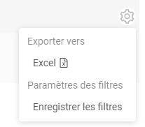
    === "english"
        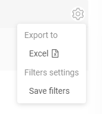
=== "required message"
    === "french"
        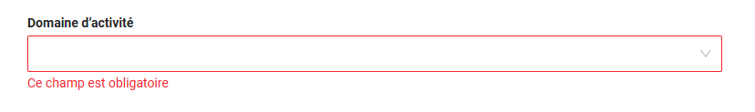
    === "english"
        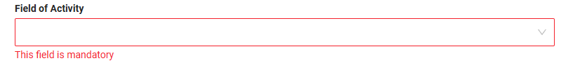

How to add?

??? Example
    Add  [setting UI(Static message(required,exception,button))](#setting)


### In Widget / View / Screen-Level Static Text

This includes text defined directly in configuration files:

* *.widget.json
* *.view.json
* *.screen.json

Such text may include:

* Titles
* Labels
* Any custom text specified directly in JSON

Localization is applied by using translation keys instead of hardcoded text. Use  "{{ui.client.name}}" 

#### Examples:

##### <a id="field">Field Labels Localization</a>

Field labels define how fields are displayed on screens.

How does it look?
=== "french"
    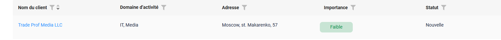
=== "english"
    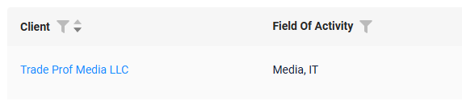

How to add?
??? Example
    
    **Step 1**  
    Use a translation key in screen JSON: `ui.client.name`       

    
    ```json
    {
    "title": "{{ui.client.name}}",
    "key": "fullName",
    "type": "input",
    "width": 300
    }
    ```
    

    **Step 2**  
    Add translation to `messages_fr.properties`:
    
      ```properties
      ui.client.name=Nom du client
      ```

    Use recommended key prefixes:
    
    * `ui.*` — UI texts 


##### <a id="view">View Titles Localization</a>

Screen titles define the name of a view in the UI.

How does it look?
=== "french"
    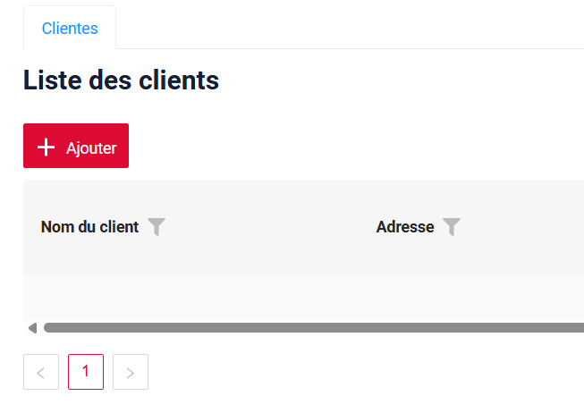
=== "english"
    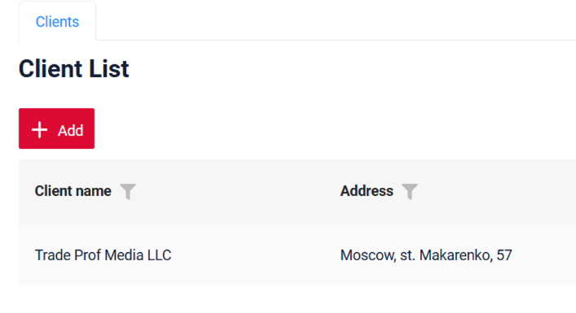

How to add?

??? Example

    **Step 1**  
    Define title in screen JSON:  `ui.view.clients`

    
    ```json
    "menu": [
      {
        "title": "{{ui.view.clients}}",
        "child": [
          {
            "viewName": "clientlist"
          }
        ]
      }
    ]
    ``` 
    

    **Step 2**  
    Add translation to `messages_fr.properties`:
    
      ```properties
      ui.view.clients=Clientes
      ```
    
    Use recommended key prefixes:
    
    * `ui.*` — UI texts 


##### <a id="screen">Screen Titles Localization</a>

Screen titles define the name of a screen in the UI.

How does it look?
=== "french"
    
=== "english"
    
 
How to add?

??? Example
    
    **Step 1**  
    Define title in screen JSON:  `ui.screen.clients`

    
    ```json
    "name": "client",
    "icon": "team",
    "order": 0,
    "title": "{{ui.screen.clients}}",
    "navigation": {
    }
    ``` 
    
    **Step 2**  
    Add translation to `messages_fr.properties`:
    
      ```properties
      ui.screen.clients=Clientes
      ```
    
    Use recommended key prefixes:
    
    * `ui.*` — UI texts
    * `action.*` — buttons and actions


##### FullTextSearch placeholder

How does it look?
=== "french" 
    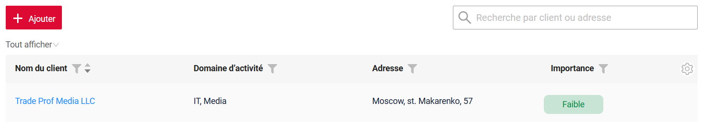
=== "english"
    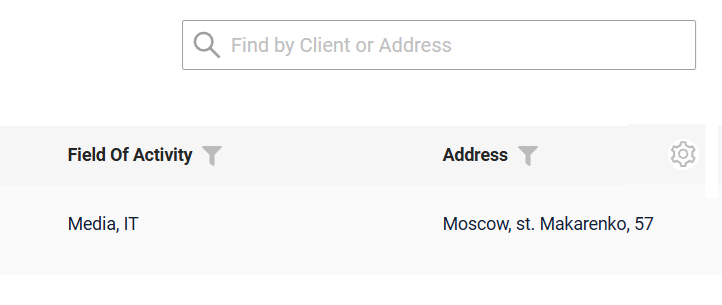

How to add?
??? Example

    **Step 1**  
    Use a translation key in screen JSON: `ui.client.find.placeholder`       

    
    ```json
    "fullTextSearch": {
      "enabled": true,
      "placeholder": "{{ui.client.find.placeholder}}"
    },
    ```
    

    **Step 2**  
    Add translation to `messages_fr.properties`:
    
      ```properties
      ui.client.find.placeholder=Recherche par client ou adresse
      ```

    Use recommended key prefixes:
    
    * `ui.*` — UI texts 

### <a id="action">Static Text Defined in Java</a>
 This includes UI text created on the backend, such as:

* Button captions
* Popup messages
* Validation messages
* etc

Important rule:
Static text defined in Java must be translated before it is sent to the front-end.

The translation can be performed at any place in Java code where the value is prepared for the UI.
Use method LocalizationFormatter.uiMessage("action.add")

#### Examples
##### Actions
How does it look?

=== "french"
    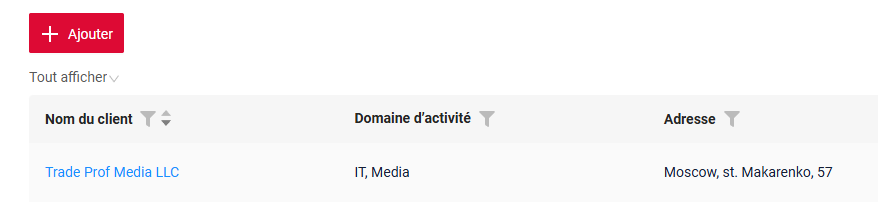
=== "english"
    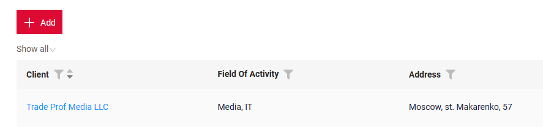 
 
How to add?

??? Example
    **Step 1**  
    Add translation LocalizationFormatter.uiMessage() to button 

    ```java
	public Actions<MyexampleDTO> getActions() {
		return Actions.<MyexampleDTO>builder()
				.save(sv -> sv.text(LocalizationFormatter.uiMessage("action.save")))
				.cancelCreate(ccr -> ccr.text(LocalizationFormatter.uiMessage("action.cancel")).available(bc -> true))
				.create(crt -> crt.text(LocalizationFormatter.uiMessage("action.add")))
				.delete(dlt -> dlt.text(LocalizationFormatter.uiMessage("action.delete")))
				.build();
	}
    ```

    **Step 2**  
    Add translation to `messages_fr.properties`:
    
      ```properties
      action.add=Ajouter 
      ```
    
    Use recommended key prefixes:
    
    * `ui.*` — UI texts
    * `action.*` — buttons and actions

##### Business Exception messages Localization

How does it look?

=== "french"
    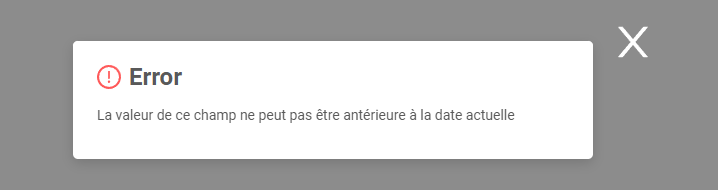
=== "english"
    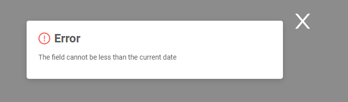

How to add?

??? Example
    **Step 1**  
    Add translation LocalizationFormatter.uiMessage() to button

    ```java
	protected ActionResultDTO<MyexampleDTO> doUpdateEntity(Myexample6103 entity, MyexampleDTO data, BusinessComponent bc) {

		if (data.isFieldChanged(MyexampleDTO_.dateStart)) {
			LocalDateTime sysdate = LocalDateTime.now();
			if (data.getDateStart() != null && sysdate.compareTo(data.getDateStart()) > 0) {
				throw new BusinessException().addPopup(LocalizationFormatter.uiMessage("business.exception.less.current.date"));
			}
			entity.setDateStart(data.getDateStart());
		}
    ``` 

    **Step 2**  
    Add translation to `messages_fr.properties`:
    
    ```properties
    business.exception.less.current.date=La valeur de ce champ ne peut pas être antérieure à la date actuelle
    ``` 

## Data Localization

1) Enum Localization

2) Dictionary 

#### <a id="enum">Enum Localization</a>
How does it look?

=== "french" 
    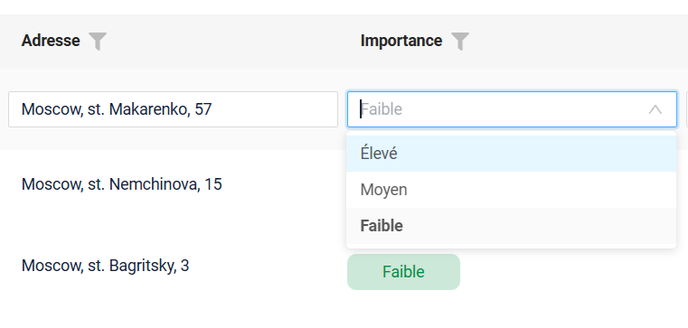
=== "english" 
    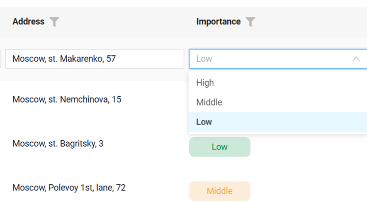

How to add?

??? Example
    **Step 1**  Add LocaleEnumUtil to  /conf/cxbox/extension/locale

    ```java

    public final class LocaleEnumUtil {
    
        private LocaleEnumUtil() {
        }
    
        public static <E extends Enum<E> & PlatformLocaleEnum<E>> String toValue(
                @NonNull PlatformLocaleEnum<E> e
        ) {
            Locale locale = LocaleContextHolder.getLocale();
            return e.translations()
                    .getOrDefault(
                            locale,
                            e.translations().values().stream().findFirst().orElseThrow()
                    )
                    .get();
        }
    
        public static <E extends Enum<E> & PlatformLocaleEnum<E>> Optional<E> fromValue(
                @NonNull Class<E> enumClass,
                @NonNull String value
        ) {
            Map<String, E> map = new HashMap<>();
            for (E e : enumClass.getEnumConstants()) {
                for (var entry : e.translations().entrySet()) {
                    map.put(entry.getValue().get(), e);
                }
            }
            return Optional.ofNullable(map.get(value));
        }
    
    }
    ``` 

    **Step 2**  Add PlatformLocaleEnum.java
    ```java
    
    public interface PlatformLocaleEnum<E extends Enum<E> & PlatformLocaleEnum<E>> {
    
        Map<Locale, Supplier<String>> translations();
    
        @JsonValue
        default String toValue() {
            return LocaleEnumUtil.toValue(this);
        }
    
        @JsonCreator
        default E fromValue(String value) {
            return LocaleEnumUtil
                    .fromValue((Class<E>) this.getClass(), value)
                    .orElse(null);
        }
    
    }
    ```

    **Step 3**  Add LocaleEnum.java 
        Each enum constant must define a value for every supported Locale.
        Localization is configured via the  #translations() map.

    ```java
    
    public interface LocaleEnum<E extends Enum<E> & PlatformLocaleEnum<E>>
            extends PlatformLocaleEnum<E> {
    
        String getValue();
    
        String getValueFr();
    
        @Override
        default Map<Locale, Supplier<String>> translations() {
            return  Map.of(
                    Locale.ENGLISH, this::getValue,
                    Locale.FRENCH, this::getValueFr
            );
        }
    }
    ```
    **Step 4**  implements LocaleEnum.java 
    ```java
    
    @Getter
    @AllArgsConstructor
    public enum StatusEnum implements LocaleEnum {
    
        NEW("New", "Nouvelle"),
        INACTIVE("Inactive", "Inactive"),
        IN_PROGRESS("In progress", "En cours");
    
        private final String value;
    
        private final String valueFr;
    }
    
    ```

#### Dictionary

How does it look?

=== "french" 
    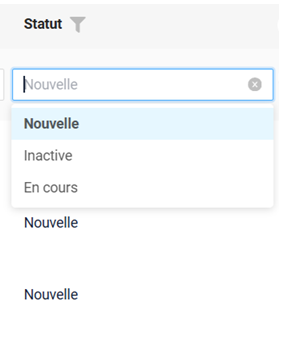
=== "english"
    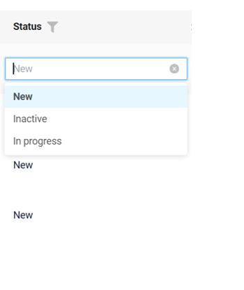

How to add?

??? Example
    It is necessary to populate the `dictionary_item_tr` table with translated values for each dictionary, adding the value of the newly introduced language in the `language` column.

