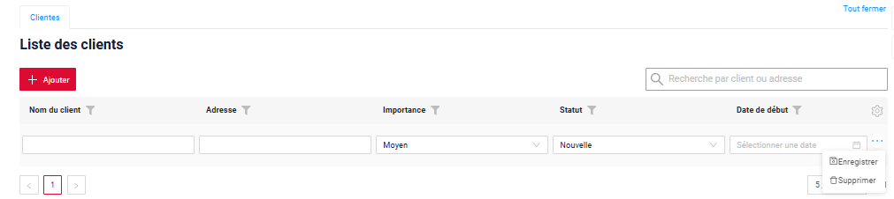
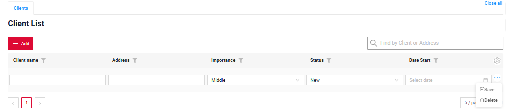
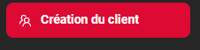
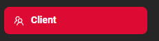

# Localization (i18n)

This document describes how localization works in the system and how to add translations for UI elements, dictionaries, and enums.

The system supports localization for:

* [Static Text](#static)
* [Data Localization](#datalocalization)
## Basic
[:material-play-circle: Live Sample]({{ external_links.code_samples }}/ui/#/screen/client){:target="_blank"} ·
[:fontawesome-brands-github: GitHub]({{ external_links.github_ui }}/{{ external_links.github_branch }}/src/main/java/org/demo/documentation/feature/locale){:target="_blank"}

To change the interface language, you need to:

* French — log in as a user demo_fr/demo
* English — log in as a user demo/demo

!!! info
    To apply the translation of all elements to the selected language, you must log out and log back in, or refresh the page. Simply switching roles does not fully change the interface language.

How does it look?

=== "french"
    
=== "english"
     

## <a id="setting">Pre-setup for Working with Localization</a>
 
??? Example
    To work with localization, perform pre-setup on both front-end and back-end, which is necessary for correct handling of the added language.
    
    **Front-end**:
    
    see more [Global Static Text (Front-end)](#global)
 
    **Step 1**  
      
    Add a translation file to `ui/src/i18n/assets/fr.json` containing the translations.  
    In `ui/src/i18n/assets`, we already have an `en.json` file with translations used for the UI.
    For a new language, it is sufficient to translate the values into the new language.

    Use the following naming format(UTF-8): (fr.json)

      ```text
      fr.json
      en.json
      <lang>.json
      ```
    
    Example:

    ```json
    "translation": { 
        "Clear": "Effacer",
        "Copy details to clipboard": "Copier les détails dans le presse-papiers",
        "Details": "Détails",
        "Error": "Erreur",
        "Errors": "Erreurs"
    }
    ```
    **Step 2**  
    Register the new language to allow the front-end to handle it.
    1.0 ui/src/i18n/assets/local/index.ts
    ```
    import { Resource } from 'i18next'
    import en from './en.json'
    import fr from './fr.json'
    import ru from './ru.json'
    
    export default {
        en,
        ru,
        fr
    } as Resource
    
    ```
    1.1  ui/src/i18n/assets/moment/index.ts
    ```
    import 'moment/locale/ru'
    import 'moment/locale/fr'
    ```

    1.2 Ant supported languages:    ui/src/i18n/assets/antd/index.

    ```
    import { Locale } from 'antd/es/locale-provider'
    import { SupportedLanguage } from '../../constants'
    import enUs from 'antd/es/locale-provider/en_US'
    import ruRu from 'antd/es/locale-provider/ru_RU'
    import frFr from 'antd/es/locale-provider/fr_FR'
    
    export default { en: enUs, ru: ruRu, fr: frFr } as { [key in SupportedLanguage]: Locale }
    ```

    !!! info
        Since [release 2.0.18](https://doc.cxbox.org/new/version218/): The frontend automatically detects the user's language: /login parameter `language`
        
        Before [release 2.0.18](https://doc.cxbox.org/new/version218/): Additional frontend development was required to retrieve the user's language. Without this customization, the frontend used a predefined constant.
    
    **Back-end**:
    
    see more [Static Text: Widget / View / Screen](#widget)

    **Step 1**  
    Create translation files for [Static Text: Widget / View / Screen](#widget) in:  src/main/resources/ui/ 

    Use the following naming format(UTF-8): (messages_<lang>.properties)

      ```text
      messages.properties (default)
      messages_fr.properties
      ```
    
    **Step 2**  Add supported languages.
    Add to `application.yml` :
    
      ```yaml
      cxbox:
        localization:
          supported-languages: [ en, fr ]
      ```


## <a id="static">Static Text</a>

Static localization is used for interface labels, titles, buttons, messages, and other UI text that does not come from business data.

### <a id="global"> Static Text: Global(Front-end)</a>

This includes common UI labels shared across the entire interface(standard Cxbox buttons, operations, and validation errors handled on the UI side).

Stored on the front-end: translation file to ui/src/i18n/assets/<language>.json containing the translations.

#### Examples

How does it look?
=== "action filter settings"
    === "french"
        
    === "english"
        
=== "required message"
    === "french"
        
    === "english"
        

How to add?

??? Example
    Add a translation file to ui/src/i18n/assets/fr.json containing the translations.

    ```json
    "translation": { 
        "Clear": "Effacer",
        "Copy details to clipboard": "Copier les détails dans le presse-papiers",
        "Details": "Détails",
        "Error": "Erreur",
        "Errors": "Erreurs"
    }
    ```


### <a id="widget">Static Text: Widget / View / Screen </a>

This includes text defined directly in configuration files:

* *.widget.json
* *.view.json
* *.screen.json

Such text may include: Titles, Labels, Any custom text specified directly in JSON

Localization is applied by using translation keys instead of hardcoded text. 

Use   {{ui.client.name}}  

#### Examples Localization

##### Field Labels

Field labels define how fields are displayed on screens.

How does it look?
=== "french"
    
=== "english"
    

How to add?
??? Example
    
    **Step 1**  
    Use a translation key in screen JSON: `ui.client.name`       

    ```json
    --8<--
    {{ external_links.github_raw_doc }}/feature/locale/clientList.widget.json
    --8<--
    ```  
 
    **Step 2**  
      Add translation to `src/main/resources/ui/messages_fr.properties`:
    
      ```properties
      ui.screen.screenname=Nom du client
      ```

    Use recommended key prefixes:
    
    * `ui.*` — UI texts 


##### View Titles 

Screen titles define the name of a view in the UI.

How does it look?
=== "french"
    
=== "english"
    

How to add?

??? Example

    **Step 1**  
    Define title in screen JSON:  `ui.view.clients`

    ```json
    --8<--
    {{ external_links.github_raw_doc }}/feature/locale/clientlist.view.json
    --8<--
    ``` 

    **Step 2**  
      Add translation to `src/main/resources/ui/messages_fr.properties`:
    
      ```properties
      ui.view.clients=Clientes
      ```
    
    Use recommended key prefixes:
    
    * `ui.*` — UI texts 


##### Screen Titles

Screen titles define the name of a screen in the UI.

How does it look?
=== "french"
     
=== "english"
    
 
How to add?

??? Example
    
    **Step 1**  
    Define title in screen JSON:  `ui.screen.clients`

    ```json
    --8<--
    {{ external_links.github_raw_doc }}/feature/locale/client.screen.json
    --8<--
    ``` 

    **Step 2**  
      Add translation to `src/main/resources/ui/messages_fr.properties`:
    
      ```properties
        ui.screen.screenname
      ```
    
    Use recommended key prefixes:
    
    * `ui.*` — UI texts


##### FullTextSearch placeholder

How does it look?
=== "french" 
    
=== "english"
    

How to add?
??? Example

    **Step 1**  
    Use a translation key in screen JSON: `ui.client.find.placeholder`       

    ```json
    --8<--
    {{ external_links.github_raw_doc }}/feature/locale/clientList.widget.json
    --8<--
    ```  

    **Step 2**  
      Add translation to `src/main/resources/ui/messages_fr.properties`:
    
      ```properties
      ui.client.find.placeholder=Recherche par client ou adresse
      ```

    Use recommended key prefixes:
    
    * `ui.*` — UI texts 

### <a id="action">Static Text: Defined in Java</a>
 This includes UI text created on the backend, such as:

* Button captions
* Popup messages
* Validation messages
* etc

!!! warning  
    It is important to distinguish **statistics** from **data** that are also passed from Java.
    By *data*, we mean values that can change (by a user, via the admin UI, etc.) and/or for which additional features are available—such as search, sorting, full-text search, and so on.
    As a result, Static Text: Defined in Java only require translating the value immediately before it is sent to the front end, anywhere in Java, using the corresponding expression.
    **Data**, on the other hand, must support editing, searching, and sorting. Therefore, a task of **reverse translation** is added—converting the localized value received from the UI back to its internal representation. This is a more complex problem and will be discussed in section  [Data Localization](#datalocalization).


The translation can be performed at any place in Java code where the value is prepared for the UI.
Use method LocalizationFormatter.uiMessage("action.add")

#### Examples Localization

##### Actions
How does it look?

=== "french"
    
=== "english"
     
 
How to add?

??? Example
    **Step 1**  
    Add translation LocalizationFormatter.uiMessage() to button 

    ```java
    --8<--
    {{ external_links.github_raw_doc }}/feature/locale/Myexample6103Service.java:getActions
    --8<--
    ```  

    **Step 2**  
      Add translation to `src/main/resources/ui/messages_fr.properties`:
    
      ```properties
      action.add=Ajouter 
      ```
    
    Use recommended key prefixes:
    
    * `action.*` — buttons and actions

##### Business Exception messages

How does it look?

=== "french"
    
=== "english"
    

How to add?

??? Example
    **Step 1**  
    Add translation LocalizationFormatter.uiMessage() to button

    ```java
    --8<--
    {{ external_links.github_raw_doc }}/feature/locale/Myexample6103Service.java:doUpdateEntity
    --8<--
    ```  

    **Step 2**  
      Add translation to `src/main/resources/ui/messages_fr.properties`:
    
    ```properties
    business.exception.less.current.date=La valeur de ce champ ne peut pas être antérieure à la date actuelle
    ``` 

## <a id="datalocalization">Data Localization</a>

* [Enum](#enum)
* [Dictionary](#dictionary)

!!! warning
    By 'data' mean information that can be modified (by users, via the admin panel, etc.) and/or supports additional functions such as search, sorting, full-text search, etc. The LocalizationFormatter.uiMessage() function performs translation in one direction only, while data requires editing, search, full-text search, and sorting capabilities. Since this function does not support reverse translation, we do not recommend using LocalizationFormatter.uiMessage() for data

#### <a id="enum">Enum</a>
How does it look?

=== "french" 
    
=== "english" 
    

How to add?

??? Example
    === "first setting"
    **Step 1**  Add PlatformLocaleEnum.java to  /conf/cxbox/extension/locale

    ```java
    --8<--
    {{ external_links.github_raw }}/conf/cxbox/extension/locale/PlatformLocaleEnum.java
    --8<--
    ```  
    **Step 2**  Add SupportedLanguages.java

    ```java
    --8<--
    {{ external_links.github_raw }}/conf/cxbox/extension/locale/SupportedLanguages.java
    --8<--
    ```  
    **Step 3**  Add LocaleEnum.java 
    Each enum constant must define a value for every supported Locale.
    Localization is configured via the  #translations() map.

    ```java
    --8<--
    {{ external_links.github_raw }}/conf/cxbox/extension/locale/LocaleEnum.java
    --8<--
    ```  
    **Step 3**  implements LocaleEnum.java 

    ```java
    --8<--
    {{ external_links.github_raw_doc }}/feature/locale/enums/StatusEnum.java
    --8<--
    ```  

#### <a id="dictionary">Dictionary</a>   

How does it look?

=== "french" 
    
=== "english"
    

How to add?

??? Example
    It is necessary to populate the `dictionary_item_tr` table with translated values for each dictionary, adding the value of the newly introduced language in the `language` column.
    
    **Step 1** Add new column `VALUE_FR`
    ```
        <column name="VALUE_FR" remarks="French language" type="VARCHAR2(255)"/>
    ```
    **Step 2** Add new column `VALUE_FR` in DICTIONARY.csv

    ```csv
    TYPE;KEY;VALUE;VALUE_FR;DISPLAY_ORDER;DESCRIPTION;ACTIVE;ID
    BRIEFINGS;PROJECT;Project;Projet;1;;;
    BRIEFINGS;SECURITY;Security;Sécurité;2;;;
    BRIEFINGS;MARKET;Market;Marché;3;;;
    ```

    **Step 3** Add value_fr in insert for dictionary_item_tr

    ```
    <sql>
      insert into dictionary_item_tr (id, language, value)
      select id, 'en', value from dictionary_item
      union all
      select id, 'fr', value_fr from dictionary_item;
    </sql>
    ```