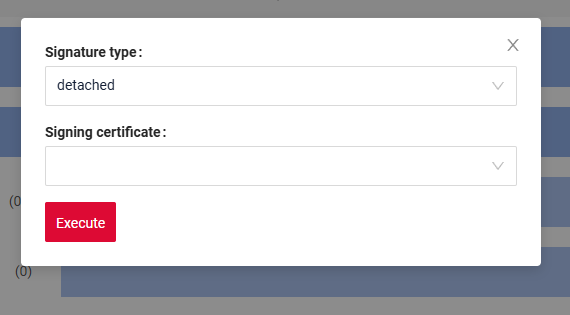
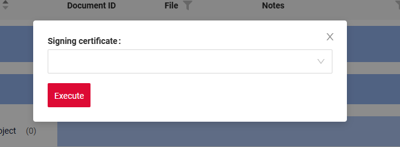

# Signing and encrypting
(since [release 2.0.18](https://doc.cxbox.org/new/version2018/))

Support for signing and encrypting documents using a Qualified Electronic Signature (QES) with CryptoPro software.

## PrerequisitesPre-setup for Working

To use this functionality, the user must have the required [software CryptoPro](http://testca2012.cryptopro.ru/ui/) installed.
 
## Basic

Supported:

* [document signing](#doc_signing);
* [document encrypting](#doc_encryption);
* [document signing and encrypting](#doc_signing_encryption);
* [document encrypting and signing](#doc_encryption_signing);
  
## <a id="doc_signing">Document signing</a>

How does it look?

<video controls width="800">
<source src="/features/sign/sign.mp4" type="video/mp4">
</video>


How to add?
??? Example

    **Step 1**  Add a button for signing 
    
    ```java
    .action(act -> act
						.action("documentSign", "Sign")
						.scope(ActionScope.RECORD)
						.available(bc -> {
							return true;
						})
						.invoker((bc, dto) -> {
							return new ActionResultDTO<MeetingDocumentsDTO>()
									.setAction(PostAction.showMessage(MessageType.INFO, "Action documentSign was invoked"
									));
						})
				)
    ```  
 
    **Step 2** Include options.cryptoGenerator in the .widget configuration options.

    | Parameter               | Description                                                                 |
    |------------------------|-----------------------------------------------------------------------------|
    | `type` (required)       | Operation type. `sign` — document signing                                   |
    | `signaturePackage`      | Signature container type (`detached` / `attached` / `any`), default: `detached` |
    | `signatureType`         | Electronic signature type (`CADES_BES` / `CADES_T`), default: `CADES_BES`  |
    | `actionName` (required) | Name of the operation to be executed (e.g. `documentSign`)           |
    | `documentFileIdKey` (required) | Key used for the document file ID                                   |
    | `documentFileNameKey` (required) | Key used for the document file name                              |
    | `signatureFileIdKey` (required) | Key for the signature file ID                                    |
    | `signatureFileNameKey` (required) | Key for the signature file name                                |

    `type` - operation type:

    | Parameter         | Description                               |
    |------------------|-------------------------------------------|
    | `sign`           | Signing only                              |
    | `encrypt`        | Encryption only                           |
    | `encryptAndSign` | Encrypt first, then sign                  |
    | `signAndEncrypt` | Sign first, then encrypt                  |

    ```json
    "options": {
      cryptoGenerator": [
      {
        "type": "sign",
        "signaturePackage": "any",
        "signatureType": "CADES_BES",
        "actionName": "documentSign",
        "documentFileIdKey": "fileId",
        "documentFileNameKey": "file",
        "signatureFileIdKey": "fileSignId",
        "signatureFileNameKey": "fileSign" 
      }
    ]
    }
    ```  

### Electronic Signature Type

The user can select the electronic signature type:

- **CAdES_BES** — basic electronic signature type  
  Used for standard document signing without additional attributes.

- **CAdES_T** — extended signature type  
  Includes all properties of CAdES_BES and additionally contains a trusted timestamp that records the exact moment of signing.


How to add?
??? Example

    **Step 1**  Add the `signatureType` property to `options.cryptoGenerator` in the `.widget` configuration options.

    `CADES_BES ` (default) / `CADES_T` 

    ```json
    "options": {
      cryptoGenerator": [
      {
        "type": "sign",
        "signaturePackage": "any",
        "signatureType": "CADES_BES",
        "actionName": "documentSign",
        "documentFileIdKey": "fileId",
        "documentFileNameKey": "file",
        "signatureFileIdKey": "fileSignId",
        "signatureFileNameKey": "fileSign" 
      }
    ]
    }
    ```  
### Signature Container Format

The user can choose the format of the generated container:

- **detached (detached signature)**  
  A separate signature file is generated that contains only the signature for the document.  
  The document itself is not included in the container.

- **attached (attached signature)**  
  A single container is generated that includes: original document and  signature for the document

Two scenarios are possible in the UI:

* **User selects the signature type**  
   A popup is displayed with a dropdown allowing the user to choose: container format (detached / attached)
* **Signature type is predefined by the system**  
   The dropdown is not shown in the interface.  
   The signature is generated automatically according to the predefined configuration.

How does it look?
=== "User selects the signature type"
    
=== "Signature type is predefined by the system"
    

How to add?
??? Example

    **Step 1**  Add the `signaturePackage` property to `options.cryptoGenerator` in the `.widget` configuration options.

    `any` - User selects the signature type*
     `detached` (default) / `attached` - Signature type is predefined by the system

    ```json
    "options": {
      cryptoGenerator": [
      {
        "type": "sign",
        "signaturePackage": "any",
        "signatureType": "CADES_BES",
        "actionName": "documentSign",
        "documentFileIdKey": "fileId",
        "documentFileNameKey": "file",
        "signatureFileIdKey": "fileSignId",
        "signatureFileNameKey": "fileSign" 
      }
    ]
    }
    ```  

### Override of the signed document name

You can override the name of the signed document file.

How does it look?

<video controls width="800">
<source src="/features/sign/sign_override_name.mp4" type="video/mp4">
</video>

How to add?
??? Example

    **Step 1**  Add the `signatureFileBaseNameKey` property to `options.cryptoGenerator` in the `.widget` configuration options.
 

    ```json
    "options": {
     "cryptoGenerator": [
      {
        "type": "sign",
        "signaturePackage": "any",
        "signatureType": "CADES_BES",
        "actionName": "documentSign",
        "documentFileIdKey": "fileId",
        "documentFileNameKey": "file",
        "signatureFileIdKey": "fileSignId",
        "signatureFileNameKey": "fileSign",
        "signatureFileBaseNameKey": "fileSignName"
      }
    ]
    }
    ```  
    **Step 2**  Add field fileSignName  to `fields` - hidden

    {
      "title": "File Signed Name",
      "key": "fileSignName",
      "type": "hidden"
    }


##  <a id="doc_encryption">Document encrypting</a> 
 
How does it look?

<video controls width="800">
<source src="/features/sign/encrypt.mp4" type="video/mp4">
</video>

How to add?
??? Example

    **Step 1**  Add a button for encrypt 
    
    ```java
    .action(act -> act
						.action("documentEncrypt", "Encrypt")
						.scope(ActionScope.RECORD)
						.available(bc -> {
							return true;
						})
						.invoker((bc, dto) -> {
							return new ActionResultDTO<MeetingDocumentsDTO>()
									.setAction(PostAction.showMessage(MessageType.INFO, "Action encrypt was invoked"
									));
						})
				)
    ```  
 
    **Step 2** Include options.cryptoGenerator in the .widget configuration options.

    | Parameter               | Description                                                                 |
    |------------------------|-----------------------------------------------------------------------------|
    | `type` (required)       | Operation type. `encrypt` — document signing                                   |
    | `actionName` (required) | Name of the operation to be executed (e.g. `documentEncrypt`)           |
    | `documentFileIdKey` (required) | Key used for the document file ID                                   |
    | `documentFileNameKey` (required) | Key used for the document file name                              |
    | `encryptedFileIdKey` (required) | Key for the encrypt file ID                                    |
    | `encryptedFileNameKey` (required) | Key for the encrypt file name                                |

    `type` - operation type:

    | Parameter         | Description                               |
    |------------------|-------------------------------------------|
    | `sign`           | Signing only                              |
    | `encrypt`        | Encryption only                           |
    | `encryptAndSign` | Encrypt first, then sign                  |
    | `signAndEncrypt` | Sign first, then encrypt                  |

    ```json
    "options": {
      cryptoGenerator": [
      {
        "type": "sign",  
        "actionName": "documentEncrypt",
        "documentFileIdKey": "fileId",
        "documentFileNameKey": "file",
        "encryptedFileIdKey": "fileEncryptId",
        "encryptedFileNameKey": "fileEncrypt"
      }
    ]
    }
    ```  

### Override of the encrypted document name 

You can override the name of the encrypted document file

How does it look?

<video controls width="800">
<source src="/features/sign/encrypt_override_name.mp4" type="video/mp4">
</video>

How to add?
??? Example

    **Step 1**  Add the `encryptedFileBaseNameKey` property to `options.cryptoGenerator` in the `.widget` configuration options.
 

    ```json
    "options": {
     "cryptoGenerator": [
      {
        "type": "encrypt",
        "actionName": "documentEncryptSign",
        "documentFileIdKey": "fileId",
        "documentFileNameKey": "file", 
        "encryptedFileIdKey": "fileEncryptId",
        "encryptedFileNameKey": "fileEncrypt",
        "encryptedFileBaseNameKey": "fileEncryptName" 
      }
    ]
    }
    ```  
    **Step 2**  Add field fileEncryptName  to `fields` - hidden

    {
      "title": "File Encrypt Name",
      "key": "fileEncryptName",
      "type": "hidden"
    }

## <a id="doc_signing_encryption">Document signing and encrypting</a>
Sign first, then encrypt

How does it look?

<video controls width="800">
<source src="/features/sign/signAndEncrypt.mp4" type="video/mp4">
</video>

How to add?
??? Example
        `type` - operation type:`signAndEncrypt`              
 
#### <a id="doc_encryption_signing">Document  encrypting and signing</a>   
Encrypt first, then sign

How does it look?

<video controls width="800">
<source src="/features/sign/signAndEncrypt.mp4" type="video/mp4">
</video>

How to add?
??? Example
    `type` - operation type:`encryptAndSign`  