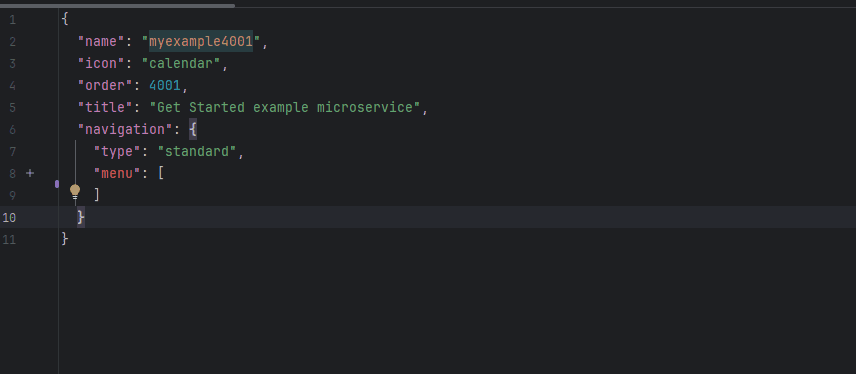

# Add new field to new screen
(see more [Microservices](https://doc.cxbox.org/features/element/microservices/microservices/))

Task for the developer: 

* You need to create the field to a new screen.
* The screen will be designed to look like this:


[:material-play-circle: Live Sample]({{ external_links.code_samples }}/ui/#/screen/myexample4001){:target="_blank"} ·
[:fontawesome-brands-github: GitHub]({{ external_links.github_ui }}/{{ external_links.github_branch }}/src/main/java/org/demo/documentation/getstarted/microservice/example){:target="_blank"}
=== "With plugin(recommended)"

    **Step 1** [Download Intellij Plugin](https://document.cxbox.org/plugin/plugininstalling)

    **Step2** Add **screen**

    Create file  **screen.json**

    ```json 
    {
      "name": "myexample",
      "icon": "calendar",
      "order": 4002,
      "title": "Get Started example microservice",
      "navigation": {
        "menu": [
        ]
      }
    }
    ```
    
    **Step3** Create and add **view** to corresponding **screen.json**

     

    **Step4** Create and add **widget** to corresponding **view.json**

    

    **Step5** Create  **DAO**, **DTO** , **Service**. Add to corresponding **Controller**
    
    
    **Step6** Add field to corresponding **widget.json**
    see [Add field](/gettingstarted/microservice/addfield)

=== "Example of writing code"

    ## **Step1** Create  **DAO**, **DTO** , **Service**, **Controller**
    see [Create environment](/gettingstarted/microservice/addenvironment)
    
    ## **Step2** Add **screen**
    see [Add screen](/gettingstarted/microservice/addscreen)
    
    ## **Step3** Add **view** to corresponding **screen.json**
    see [Add view](/gettingstarted/microservice/addview)
    
    ## **Step4** Add **widget** to corresponding **view.json**
    see [Add widget](/gettingstarted/microservice/addwidget)
    
    ## **Step5** Add field to corresponding **widget.json**
    see [Add field](/gettingstarted/microservice/addfield)
