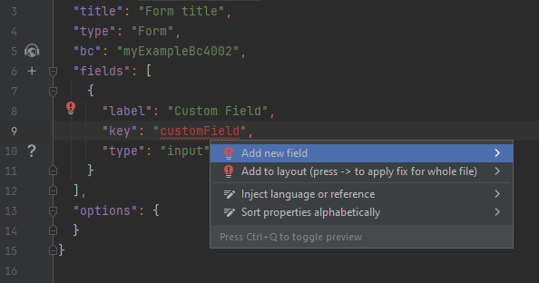
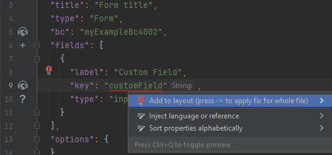
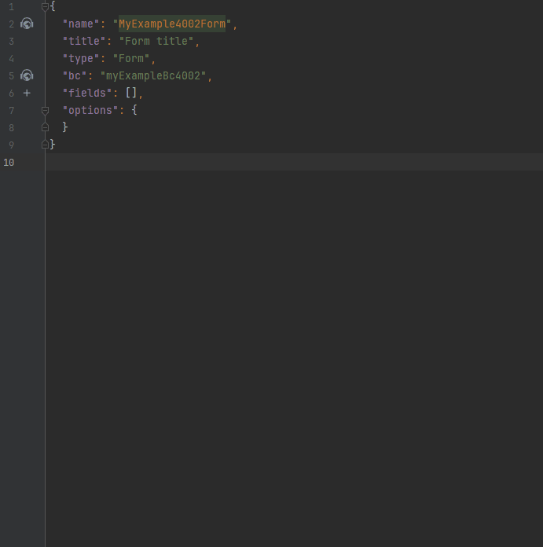

# Add new field to an existing screen

Add field to corresponding **widget.json**

## Step1 Add field to widget

        

## Step2 Add field to entity, DTO

      

## Step3 Add field to layout

   

## Example
     