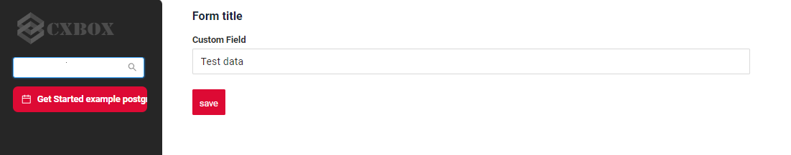

# Add new field to screen
The task involves adding a new field to the display. 

The screen should be designed to look like this:

[:material-play-circle: Live Sample]({{ external_links.code_samples }}/ui/#/screen/myexample4002){:target="_blank"} ·
[:fontawesome-brands-github: GitHub]({{ external_links.github_ui }}/{{ external_links.github_branch }}/src/main/java/org/demo/documentation/getstarted/postgres/example){:target="_blank"}

## **Step1** Create  **DAO**, **DTO** , **Service**, **Controller**
see [Create environment](/gettingstarted/postgres/addenvironment)

## **Step2** Add **screen**
see [Add screen](/gettingstarted/postgres/addscreen)

## **Step3** Add **view** to corresponding **screen.json**
see [Add view](/gettingstarted/postgres/addview)

## **Step4** Add **widget** and  **field** to corresponding **view.json**
see [Add widget and field](/gettingstarted/postgres/addwidget)
