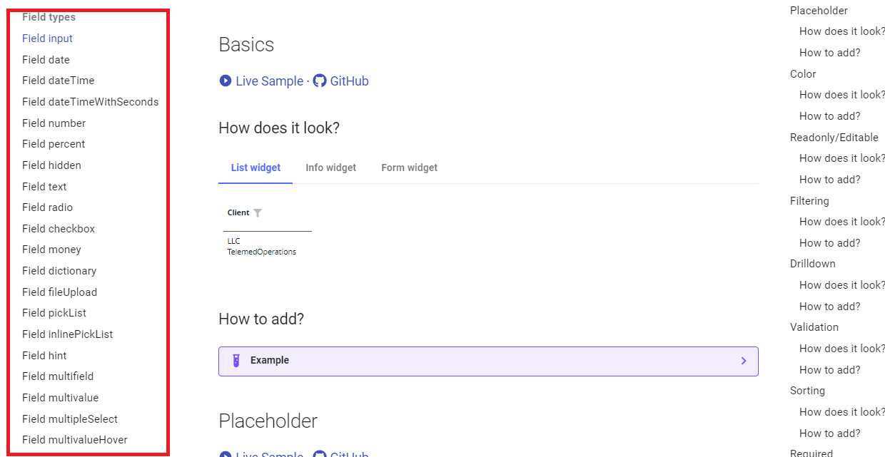
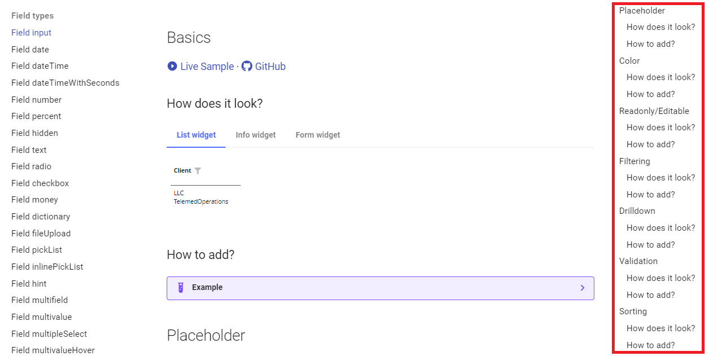
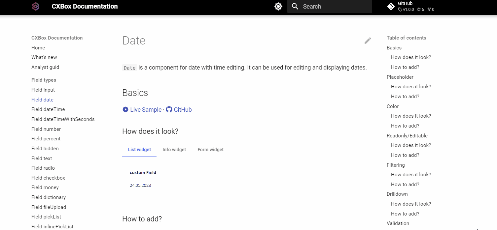
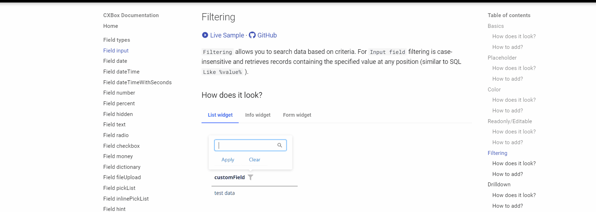

# Guide for analysts
## How to use 
### Add field type
I want to incorporate a field into the interface and explore its properties and functionalities.

How to do it?
#### 1) Choose field type

On the left side, there's a menu that allows you to choose the desired field type,
and you can easily share a link to that specific field type with the developer

#### 2) Choose function

Upon clicking a field type, a menu will be displayed,
providing access to all potential scenarios for interacting with that specific field.

For instance, if you wish to learn how filtering functions for a specific field type,
you can simply select the "Filtering - How does it look?" link to explore its functionality.

#### 3) Look at the description about explanation of operational intricacies

In this section, you'll find a description detailing the capabilities of this function and its visual representation on the screen. 

#### 4) Look at the live example

If the provided description isn't sufficient, you can navigate to the live examples section through the link.
There, you can interact with it directly to gain a better understanding of how this field operates.