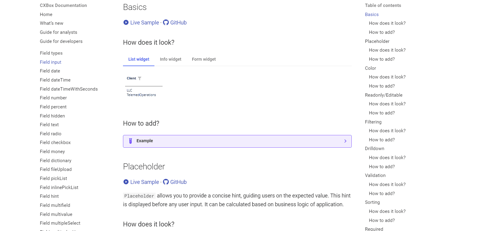
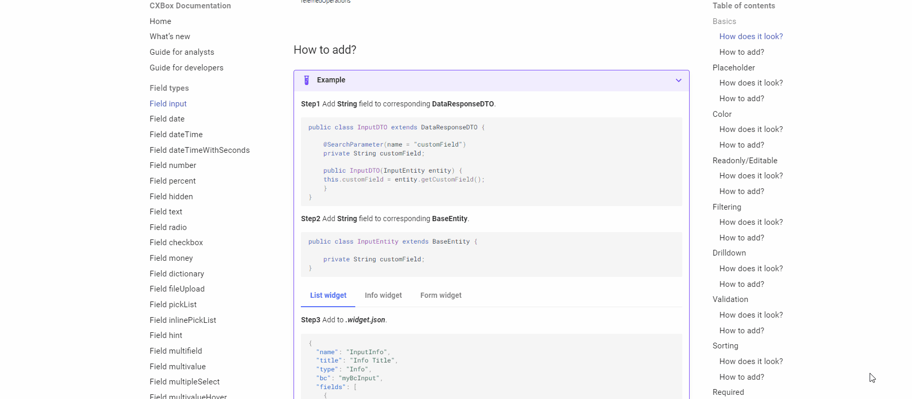

# Guide for developers
## How to use 
### Add a field add the desired function
The task is to add a field with a specific type and add the desired function

How to do it?
#### 1) Choose field type

On the left side, there's a menu that allows you to choose the desired field type,

#### 2) Choose Basics function

Upon clicking a field type, a menu will be displayed,
providing access to all potential scenarios for interacting with that specific field.

Select the "Basics - How to add?" link.
This section shows what basic actions to take to add the required field type

#### 3) Add the desired function

For instance, if you wish to learn how filtering functions for a specific field type,
you can simply select the "Filtering - How does it look?" link to explore its functionality.

In this section, you'll find a description detailing the capabilities of this function. 

#### 4) Look at the code sample

If the provided description isn't sufficient, you can navigate to the code examples section through the link.
There, you can interact with it directly to gain a better understanding of how to add  this field .