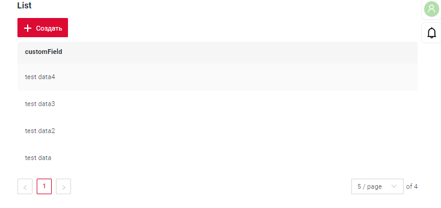
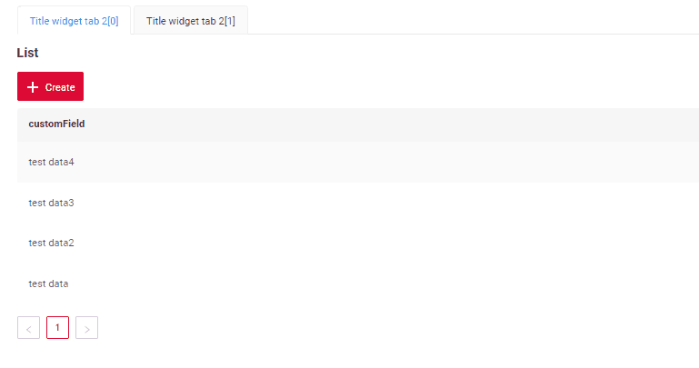
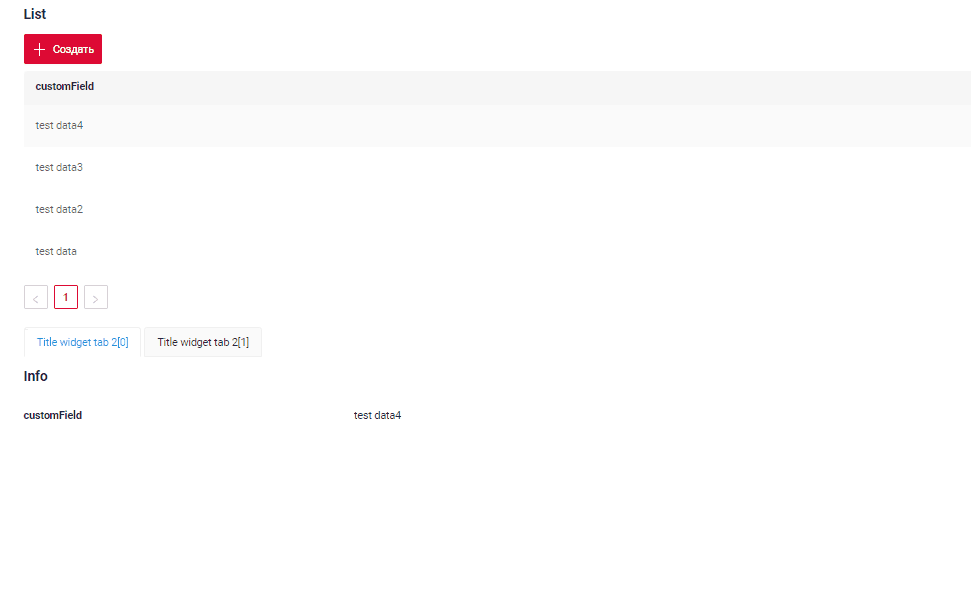
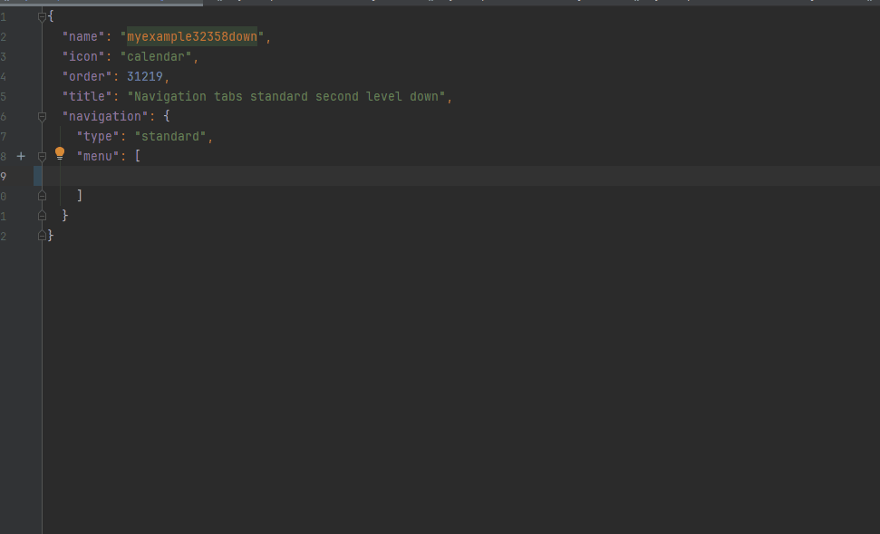
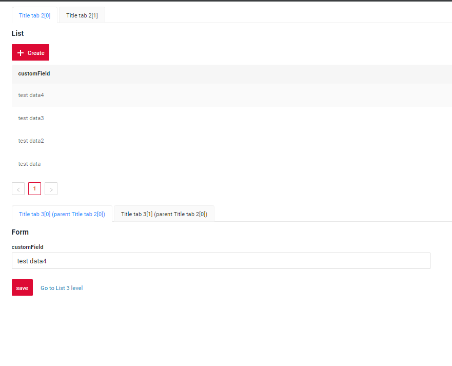
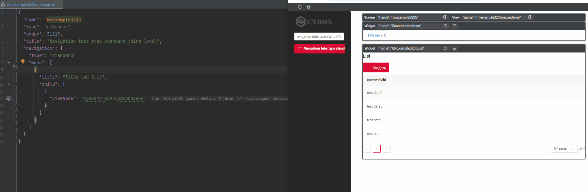
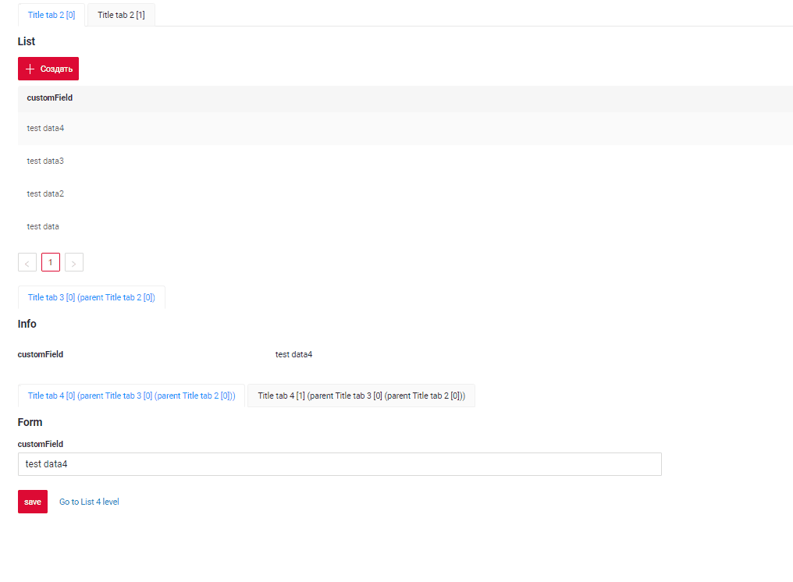
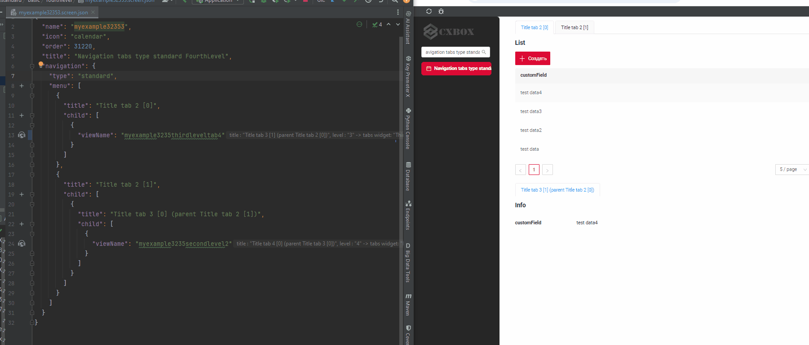
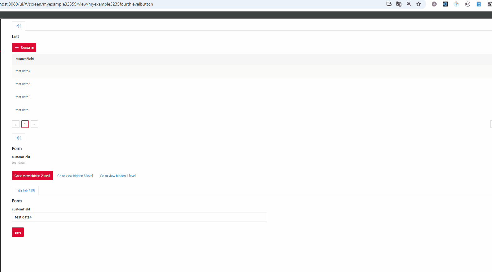

# Type standard
`Tab`  is a  component that enables users to switch between different components using tabs.
The tabs are organized as a tab bar. If the number of tabs exceeds the space available in the tab bar, navigation buttons will appear to help users scroll through the tabs.

* Tab names can only use **constant** values.
* Currently, a **three-level tab hierarchy** is supported.

 

##  <a id="OneLevel">View without tabs</a>
[:material-play-circle: Live Sample]({{ external_links.code_samples }}/ui/#/screen/myexample32356){:target="_blank"} ·
[:fontawesome-brands-github: GitHub]({{ external_links.github_ui }}/{{ external_links.github_branch }}/src/main/java/org/demo/documentation/navigation/tab/typestandard/basic/onelevel){:target="_blank"}

### How does it look?


###  How to add?
??? Example
    **Step1** Add business widget to **.view.json** using [widget position](/navigation/view/view/) property.
    ```json
    --8<--
    {{ external_links.github_raw_doc }}/navigation/tab/typestandard/basic/onelevel/myexample32356single.view.json
    --8<--
    ```
    **Step2** Add view to the **.screen.json** with type [Single](/navigation/tabs/standard/basicdevelop/tabfordevelop/#options-for-adding-a-view-to-the-screen)
    ```json
    --8<--
    {{ external_links.github_raw_doc }}/navigation/tab/typestandard/basic/onelevel/myexample32356.screen.json
    --8<--
    ```

    


##  <a id="SecondLevel">SecondLevel</a>

### How does it look?
=== "Top"
    

=== "Down"
    

###  How to add?
??? Example
    === "Top"
        [:material-play-circle: Live Sample]({{ external_links.code_samples }}/ui/#/screen/myexample32358){:target="_blank"} ·
        [:fontawesome-brands-github: GitHub]({{ external_links.github_ui }}/{{ external_links.github_branch }}/src/main/java/org/demo/documentation/navigation/tab/typestandard/basic/secondlevel/top){:target="_blank"}

        **Step1** Add widget **SecondLevelMenu** `first` to **.view.json** using [widget position](/navigation/view/view/) property. 
    
        ```json
        --8<--
        {{ external_links.github_raw_doc }}/navigation/tab/typestandard/basic/secondlevel/top/myexample3235second.view.json
        --8<--
        ```
     
        **Step2** Add view to the **.screen.json** with type [Single](/navigation/tabs/standard/basicdevelop/tabfordevelop/#options-for-adding-a-view-to-the-screen)
        ```json
        --8<--
        {{ external_links.github_raw_doc }}/navigation/tab/typestandard/basic/secondlevel/top/myexample32358.screen.json
        --8<--
        ```

        
    === "Down"
        [:material-play-circle: Live Sample]({{ external_links.code_samples }}/ui/#/screen/myexample32358down){:target="_blank"} ·
        [:fontawesome-brands-github: GitHub]({{ external_links.github_ui }}/{{ external_links.github_branch }}/src/main/java/org/demo/documentation/navigation/tab/typestandard/basic/secondlevel/down){:target="_blank"}

        **Step1** Add widget **SecondLevelMenu** `after a widget` to **.view.json** using [widget position](/navigation/view/view/)
        ```json
        --8<--
        {{ external_links.github_raw_doc }}/navigation/tab/typestandard/basic/secondlevel/down/myexample3235seconddown.view.json
        --8<--
        ```
    
        **Step2** Add view to the **.screen.json** with type [Single](/navigation/tabs/standard/basicdevelop/tabfordevelop/#options-for-adding-a-view-to-the-screen)
        ```json
        --8<--
        {{ external_links.github_raw_doc }}/navigation/tab/typestandard/basic/secondlevel/down/myexample32358down.screen.json
        --8<--
        ```
        

##  <a id="ThirdLevelMenu">ThirdLevelMenu</a>
[:material-play-circle: Live Sample]({{ external_links.code_samples }}/ui/#/screen/myexample3235){:target="_blank"} ·
[:fontawesome-brands-github: GitHub]({{ external_links.github_ui }}/{{ external_links.github_branch }}/src/main/java/org/demo/documentation/navigation/tab/typestandard/basic/thirdlevel){:target="_blank"}
### How does it look?


###  How to add?
??? Example
    **Step1** Add widget **ThirdLevelMenu** after a widget **SecondLevelMenu** to **.view.json** using [widget position](/navigation/view/view/)
        see more [Tab levels](/navigation/tab/typestandard/basic/tabfordevelop/#tab-levels)
    ```json
    --8<--
    {{ external_links.github_raw_doc }}/navigation/tab/typestandard/basic/secondlevel/down/myexample3235seconddown.view.json
    --8<--
    ```

    **Step2** Add view to the **.screen.json** with type [Aggregate](/navigation/tabs/standard/basicdevelop/tabfordevelop/#options-for-adding-a-view-to-the-screen)
     see more [How add name for tab](/navigation/tab/typestandard/basic/tabfordevelop/#how-add-name-for-tab)
    ```json
    --8<--
    {{ external_links.github_raw_doc }}/navigation/tab/typestandard/basic/thirdlevel/myexample3235.screen.json
    --8<--
    ```
    

##  <a id="FourthLevelMenu">FourthLevelMenu</a>
 
[:material-play-circle: Live Sample]({{ external_links.code_samples }}/ui/#/screen/myexample32353){:target="_blank"} ·
[:fontawesome-brands-github: GitHub]({{ external_links.github_ui }}/{{ external_links.github_branch }}/src/main/java/org/demo/documentation/navigation/tab/typestandard/basic/fourthlevel){:target="_blank"}
### How does it look?
 

### How to add?
??? Example
    **Step1** Add widget **FourthLevelMenu** after a widget **ThirdLevelMenu** to **.view.json** using [widget position](/navigation/view/view/)
    see more [Tab levels](/navigation/tab/typestandard/basic/tabfordevelop/#tab-levels)
    ```json
    --8<--
    {{ external_links.github_raw_doc }}/navigation/tab/typestandard/basic/fourthlevel/myexample3235fourthleveltab1.view.json
    --8<--
    ```

    **Step2** Add view to the **.screen.json** with type [Aggregate](/navigation/tabs/standard/basicdevelop/tabfordevelop/#options-for-adding-a-view-to-the-screen)
    ```json
    --8<--
    {{ external_links.github_raw_doc }}/navigation/tab/typestandard/basic/fourthlevel/myexample32353.screen.json
    --8<--
    ```

    

## Additional properties
### <a id="hidden">Hidden</a>
[:material-play-circle: Live Sample]({{ external_links.code_samples }}/ui/#/screen/myexample32359){:target="_blank"} ·
[:fontawesome-brands-github: GitHub]({{ external_links.github_ui }}/{{ external_links.github_branch }}/src/main/java/org/demo/documentation/navigation/tab/typestandard/hidden){:target="_blank"}

If a view is marked as hidden, it will not appear in the general hierarchy and can only be accessed through a specific link (e.g., drilldown or button click). When you exit a hidden view, it will disappear.

Rules for working with hidden views:

Hidden views cannot be used by default. You cannot configure the system to switch to a hidden view by default, such as when opening a screen.

#### How does it look?
 

#### How to add?
??? Example
    **Step1** Add **hidden** = **true** for  view 
 
    ```json
    --8<--
    {{ external_links.github_raw_doc }}/navigation/tab/typestandard/hidden/myexample32359.screen.json
    --8<--
    ```
 