# Type standard
## <a id="rules_rendering">Rules for rendering tabs</a>
These rules are necessary to ensure that when a tab is selected, there is always something to display or render.

These rules are designed to maintain a coherent and functional tab navigation system, ensuring that users always have a meaningful view and can navigate effectively.

* **Unique view name**: Each tab must have a unique name. This helps in tracking and restoring the highlighting of tabs when drilling down through different levels.
  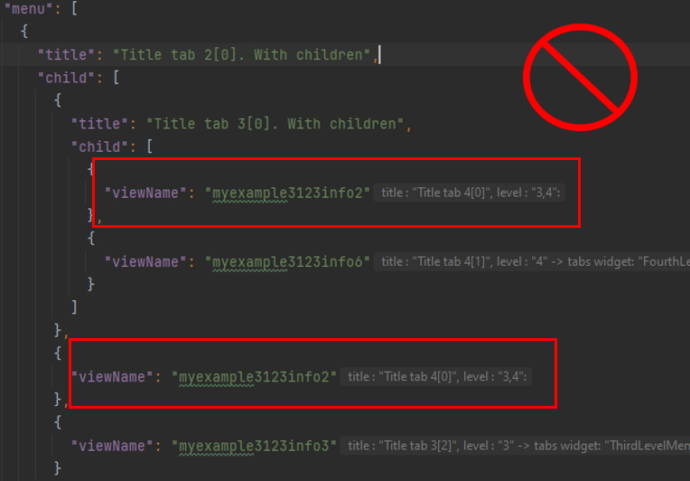

* **No empty arrays**: You cannot have a level where the array is empty. This ensures that there is always a view to render when drilling down or navigating through tabs.
  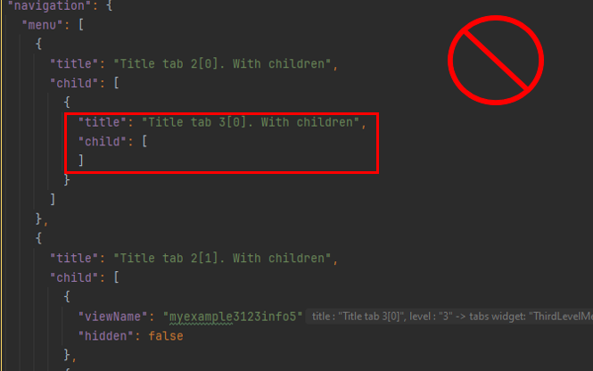

* **At least one view per level**: Each level in the tab hierarchy must contain at least one view.
  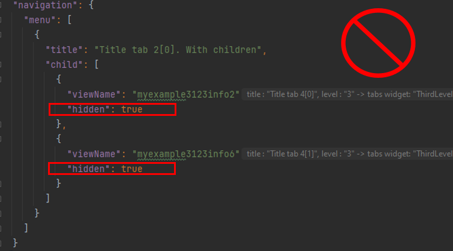

 
## <a id="option_add_view">How add a view to the screen?</a>
There are two options for adding a view:

* Single View
* Aggregate View

!!! advice on adding views
    Add views only with a plugin
 
* **Single View**.
    This type allows to add single view on current level

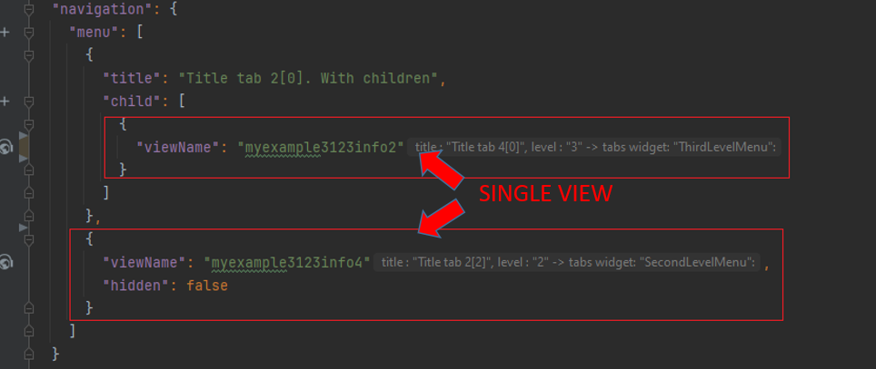

* **Aggregate View**.
   This is used when multiple level tabs are needed(>2).
   Each level in an aggregate view corresponds to a tab in the hierarchy. As you drill down through the tabs, you move through these aggregate view levels.
   You cannot have a level where the array is empty.([see Rules tabs](#rules_rendering))

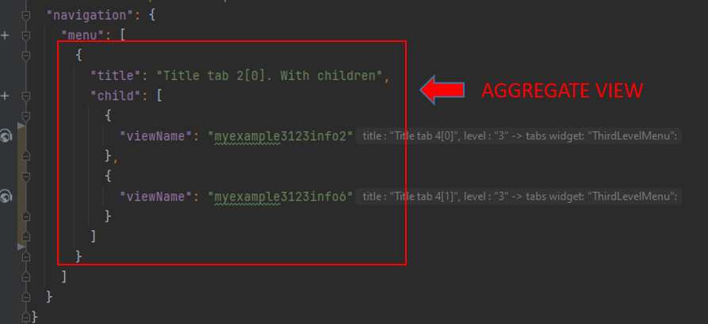

## <a id="ADD_NAME_VIEW">How add name for tab?</a>
Tab names can only use **constant** values.

**Single View**:
The tab name is derived directly from the view name.
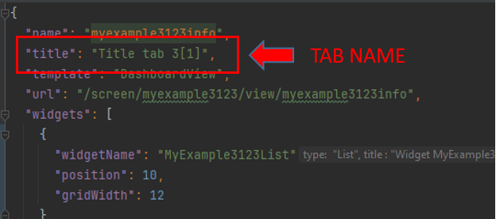
 
**Aggregate View**:
The tab name is taken from title field.
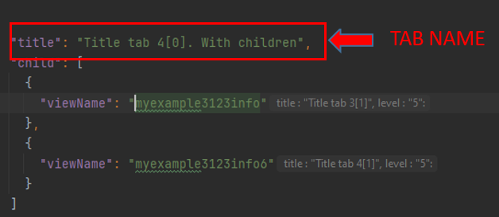

## <a id="tab_levels">What does tab level mean?</a>
Currently, a **three-level tab hierarchy** is supported.
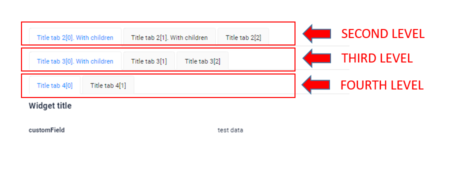

Widgets are organized according to their level by using the corresponding system widget for each tab level.

* [SecondLevelMenu](/navigation/tabs/standard/basic/tab/#SecondLevel)
* [ThirdLevelMenu](/navigation/tabs/standard/basic/tab/#ThirdLevelMenu)
* [FourthLevelMenu](/navigation/tabs/standard/basic/tab/#FourthLevelMenu)

**Implementation Example**

To manage a hierarchy of tabs with three levels in a system, follow these steps:

1) Identify System Widgets: Each level of tabs has a corresponding system widget. Ensure you have the system widgets for each level defined in your system.

2) Add Widgets in the View File. Place Widgets in the Hierarchy:

   * Level 2: Widgets placed directly under SecondLevelMenu system widget. 
     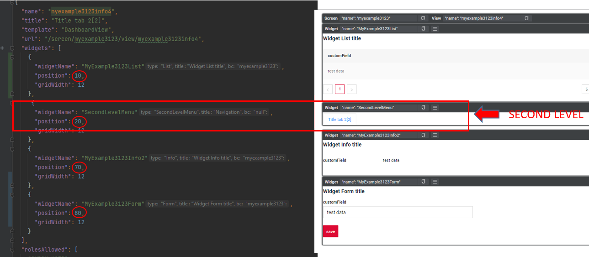  
   * Level 3: Widgets placed under ThirdLevelMenu system widget.
     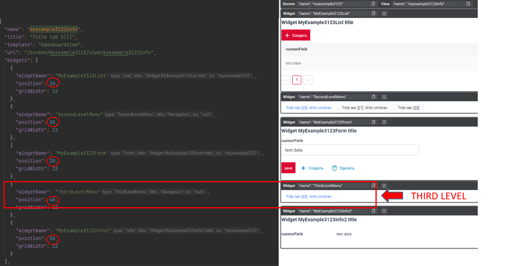  
   * Level 4: Widgets placed under FourthLevelMenu system widget.
     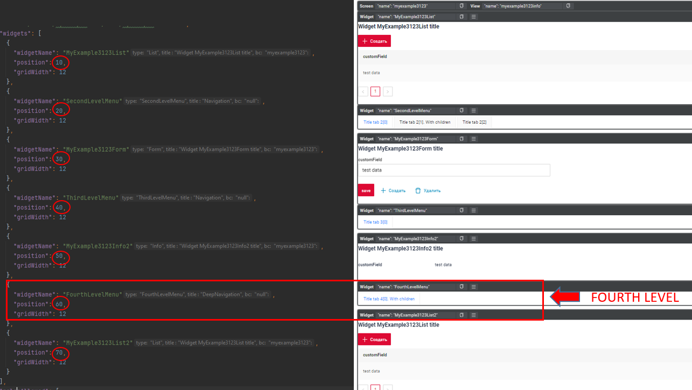

## <a id="add_tab">How create tab?</a>

**<a id="add_tab_level_1">Level 1</a>**

* Add view to the **.screen.json** with type [Single](/navigation/tabs/standard/basicdevelop/tabfordevelop/#how-add-a-view-to-the-screen)
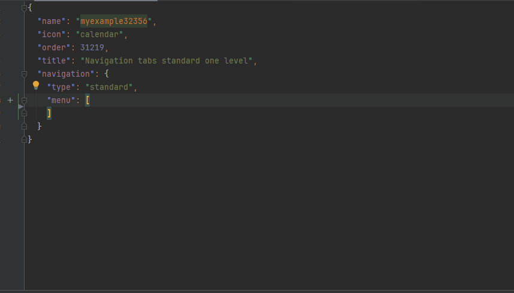

**<a id="add_tab_level_2">Level 2</a>**

First view level 2:

* Add widget [SecondLevelMenu](/navigation/tabs/standard/basicdevelop/tabfordevelop/#tab-levels) in selected view
* Add selected view to the **.screen.json** with type [Single](/navigation/tabs/standard/basicdevelop/tabfordevelop/#how-add-a-view-to-the-screen)
* The name of the level 2 tab = *Title* view. see more [How add name for tab](/navigation/tabs/standard/basicdevelop/tabfordevelop/#how-add-name-for-tab)

Next view level 2:

* Add widget [SecondLevelMenu](/navigation/tabs/standard/basicdevelop/tabfordevelop/#tab-levels) in selected view
* Add selected view to the **.screen.json** with type [Single](/navigation/tabs/standard/basicdevelop/tabfordevelop/#how-add-a-view-to-the-screen)
* The name of the level 2 tab = *Title* view. see more [How add name for tab](/navigation/tabs/standard/basicdevelop/tabfordevelop/#how-add-name-for-tab)

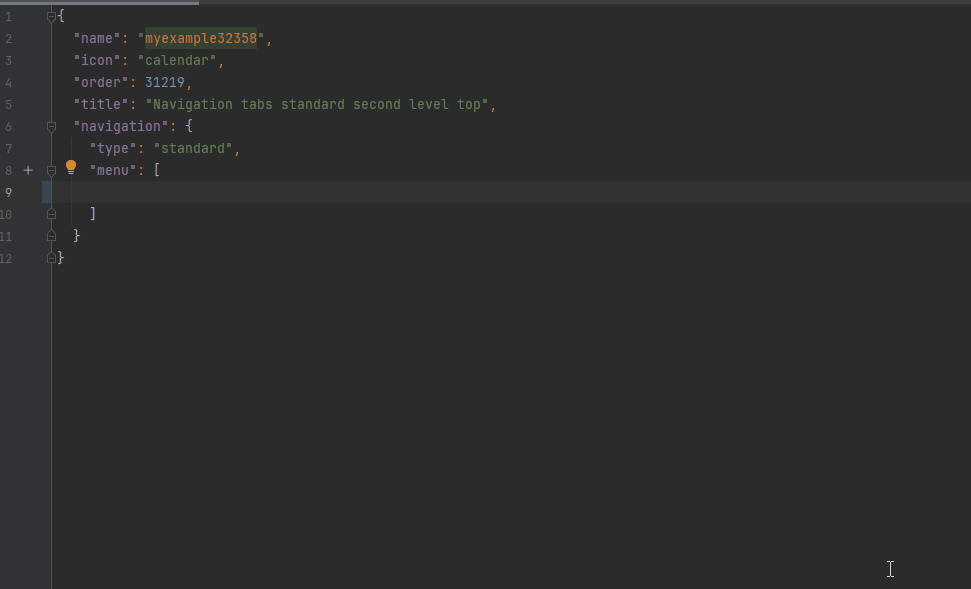

**<a id="add_tab_level_3">Level 3</a>**

First view level 3:

* Add widget [ThirdLevelMenu](/navigation/tabs/standard/basicdevelop/tabfordevelop/#tab-levels) in selected view
* Add selected view to the **.screen.json** with type [Aggregate view](/navigation/tabs/standard/basicdevelop/tabfordevelop/#how-add-a-view-to-the-screen)
* The name of the level 2 tab on which the level 3 tabs will be located = title field see more [How add name for tab](/navigation/tabs/standard/basicdevelop/tabfordevelop/#how-add-name-for-tab)
* The name of the level 3 tab = *Title* view. see more [How add name for tab](/navigation/tabs/standard/basicdevelop/tabfordevelop/#how-add-name-for-tab)

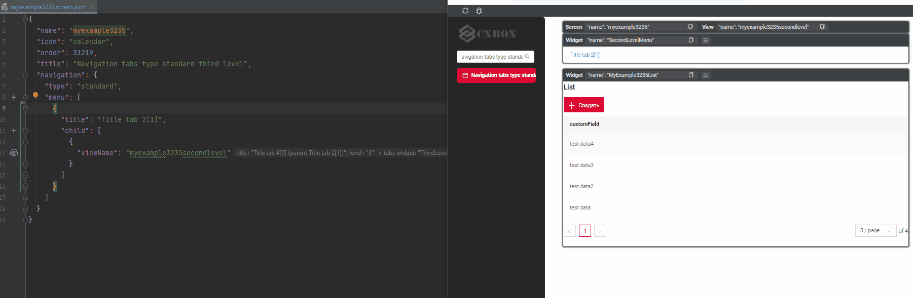

Next view level 3:

* Add widget [ThirdLevelMenu](/navigation/tabs/standard/basicdevelop/tabfordevelop/#tab-levels) in selected view
* At level 3 select tag `child` and add selected view to the **.screen.json** with type [Single](/navigation/tabs/standard/basicdevelop/tabfordevelop/#how-add-a-view-to-the-screen)
* The name of the level 3 tab =  *Title* view. see more [How add name for tab](/navigation/tabs/standard/basicdevelop/tabfordevelop/#how-add-name-for-tab)

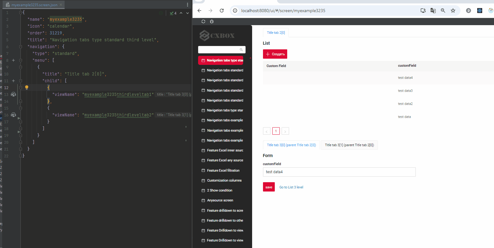

**<a id="add_tab_level_4">Level 4</a>**

First view level 4:

* Add widget [FourthLevelMenu](/navigation/tabs/standard/basicdevelop/tabfordevelop/#tab-levels) in selected view.
* Add [level tab 3](#add_tab_level_3).
* At level 3 select tag `child` and add selected view to the **.screen.json** with type [Aggregate view](/navigation/tabs/standard/basicdevelop/tabfordevelop/#how-add-a-view-to-the-screen)
* The name of the level 3 tab on which the level 4 tabs will be located = title field see more [How add name for tab](/navigation/tabs/standard/basicdevelop/tabfordevelop/#how-add-name-for-tab)
* The name of the level 4 tab = *Title* view. see more [How add name for tab](/navigation/tabs/standard/basicdevelop/tabfordevelop/#how-add-name-for-tab)

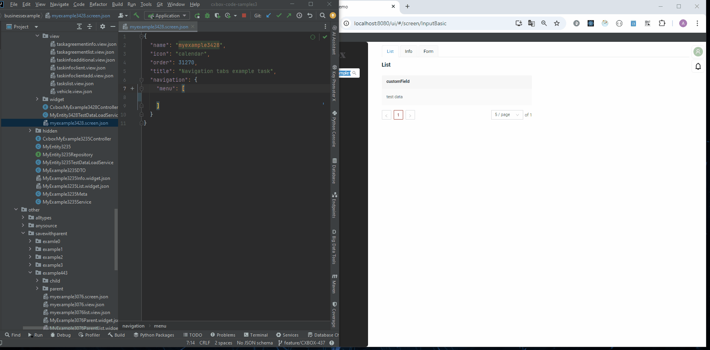

Next view level 4:

* Add widget [FourthLevelMenu](/navigation/tabs/standard/basicdevelop/tabfordevelop/#tab-levels) in selected view.
* At level 4 select tag `child` and add selected view to the **.screen.json** with type [Single](/navigation/tabs/standard/basicdevelop/tabfordevelop/#how-add-a-view-to-the-screen)
* The name of the level 4 tab =  *Title* view. see more [How add name for tab](/navigation/tabs/standard/basicdevelop/tabfordevelop/#how-add-name-for-tab)

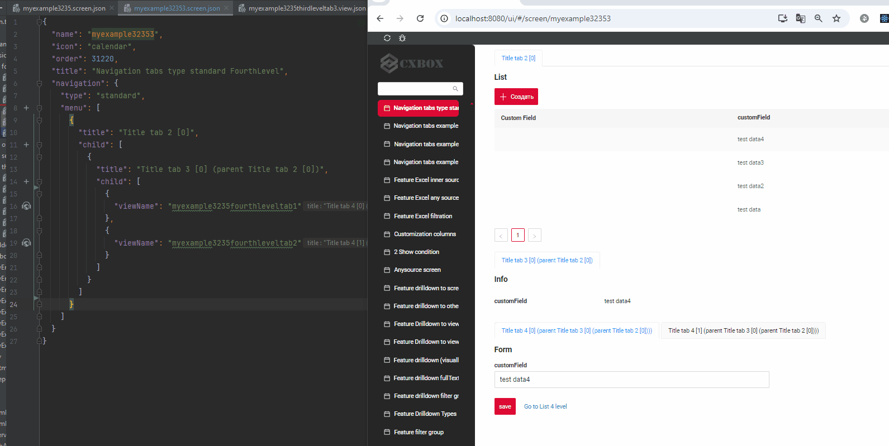

## How to understand tab levels on the finished screen?

To ensure correct screen assembly at each level, use the collapse function in Idea: 

1) Collapse the JSON to the first level (menu).Each element represents a tab, and the number of elements equals the number of horizontal tabs on the second level.Use [widget position property](/widget/type/widget/).
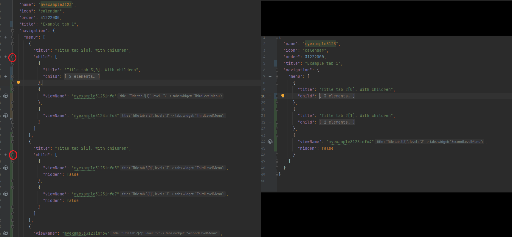
  
*Example* :

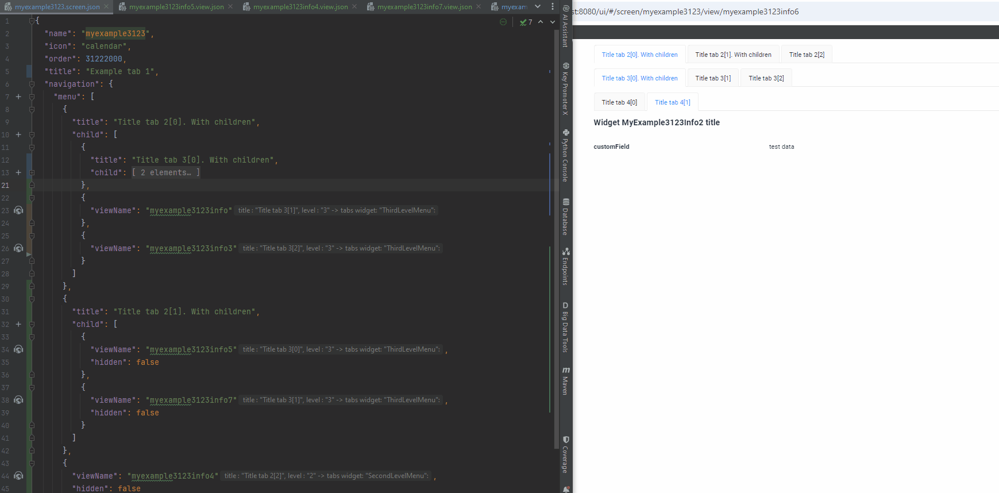

2) Expand the first element of the second level. Each element represents a tab, and the number of elements equals the number of horizontal tabs on the third level.Use [widget position property](/widget/type/widget/).

*Example* :

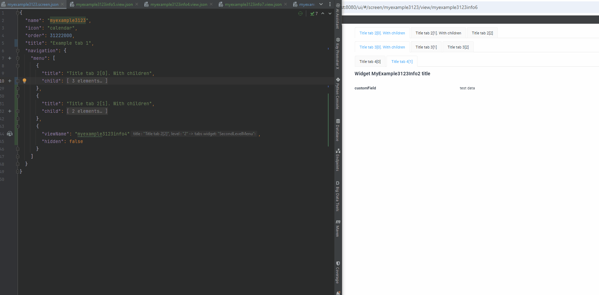

3) Expand the first element of the fourth level. Each element represents a tab, and the number of elements equals the number of horizontal tabs on the fourth level.Use [widget position property](/widget/type/widget/).

*Example* :

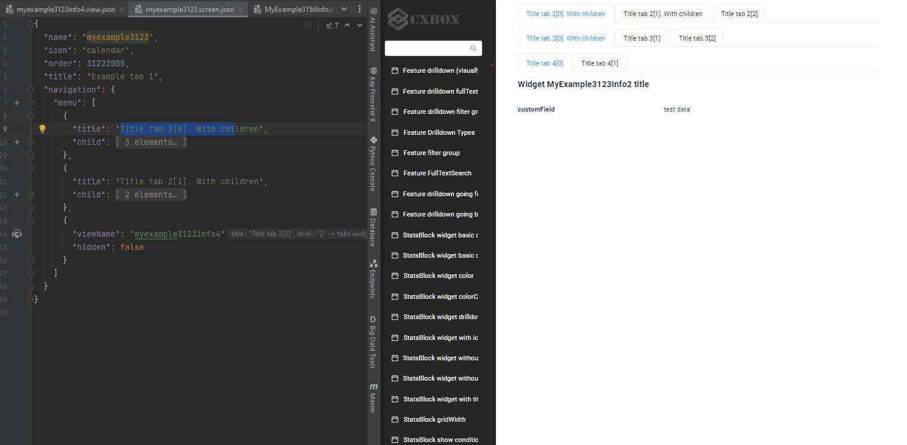

## Business example
[:material-play-circle: Live Sample]({{ external_links.code_samples }}/ui/#/screen/myexample3428){:target="_blank"} ·
[:fontawesome-brands-github: GitHub]({{ external_links.github_ui }}/{{ external_links.github_branch }}/src/main/java/org/demo/documentation/navigation/tab/typestandard/businessexample){:target="_blank"}

Business Screen Hierarchy:

* General List of Tasks: Display all tasks in a comprehensive list.
* Specific Task Details:  Show details view for a selected task. (add data,show additional details)
* List of Clients: Display all clients in a comprehensive list  associated with the selected task.
* Client Information:   Show details view for selected task.
* List of Agreement: Display information on the agreements linked to selected task.

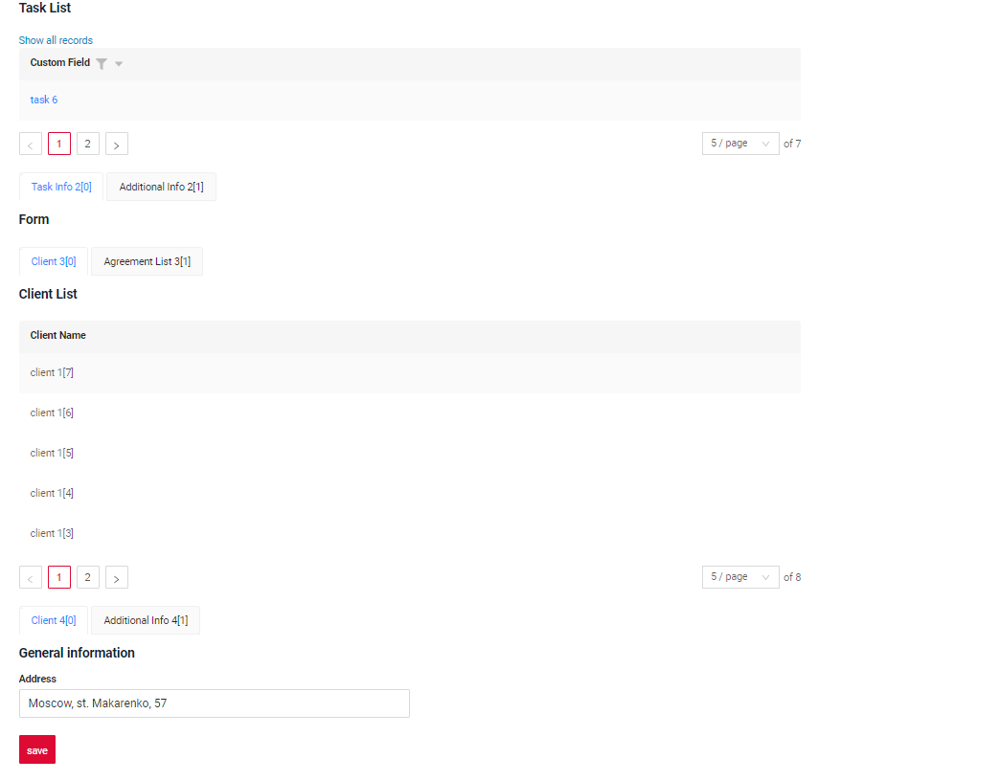

### 1. Define the hierarchy
We define the hierarchy for our screen:

**Level 1**:

* General list of tasks

**Level 2 Info about task**:

* Task Info tab
* Additional Info tab

**Level 3 Related objects**:

* Client tab
* Agreement tab

**Level 4 Info about client**:

* Client Info tab
* Additional Info tab

### 2. View Formation
For instance, we selected the view with the highest number of tabs (4) and will create the remaining views in a similar fashion.

**View** :

`Level 1`: List Tasks

`Level 2`: Task Info   

`Level 3`: Client  

`Level 4`: Client Info  

**Level 1. List Tasks**:

TaskList widget first level - adds widget first
??? Example
    ```json
    "widgets": [
        {
            "widgetName": "TaskList",
            "position": 10,
            "gridWidth": 12
        } 
    ]
    ```
**Level 2. Task Info**:

For the TaskInfoForm widget at the second level, first include the system widget SecondLevelMenu, and then add the TaskInfoForm.
??? Example
    ```json
    "widgets": [
        {
            "widgetName": "TaskList",
            "position": 10,
            "gridWidth": 12
        } 
        {
          "widgetName": "SecondLevelMenu",
          "position": 20,
          "gridWidth": 12
        }
        {
            "widgetName": "TaskInfoForm",
            "position": 30,
            "gridWidth": 24
        }
    ]
    ```
**Level 3. Client**:

For the ClientsList widget at the third level, first include the system widget ThirdLevelMenu, and then add the ClientsList.
 
??? Example
    ```json
    "widgets": [
        {
          "widgetName": "TaskList",
          "position": 10,
          "gridWidth": 12
        },
        {
            "widgetName": "SecondLevelMenu",
            "position": 20,
            "gridWidth": 12
        },
        {
            "widgetName": "TaskInfoForm",
            "position": 30,
            "gridWidth": 24
        },
        {
            "widgetName": "ThirdLevelMenu",
            "position": 40,
            "gridWidth": 12
        },
        {
            "widgetName": "ClientsList",
            "position": 50,
            "gridWidth": 12
        } 
    ]
    ```
**Level 4. Client Info**:

For the ClientInformationForm widget at the third level, first include the system widget FourthLevelMenu, and then add the ClientInformationForm.

??? Example
    ```json
    "widgets": [
        {
            "widgetName": "TaskList",
            "position": 10,
            "gridWidth": 12
        },
        {
            "widgetName": "SecondLevelMenu",
            "position": 20,
            "gridWidth": 12
        },
        {
            "widgetName": "TaskInfoForm",
            "position": 30,
            "gridWidth": 24
        },
        {
            "widgetName": "ThirdLevelMenu",
            "position": 40,
            "gridWidth": 12
        },
        {
            "widgetName": "ClientsList",
            "position": 50,
            "gridWidth": 12
        },
        {
            "widgetName": "FourthLevelMenu",
            "position": 60,
            "gridWidth": 12
        },
        {
            "widgetName": "ClientInformationForm",
            "position": 70,
            "gridWidth": 12
        }
    ]
    ```
!!! advice
    It’s advisable to assign position numbers to widgets in increments of 10. This way, if you need to add new widgets between existing ones, you can do so easily without having to renumber everything.

### 3. Screen Formation

**Level 1. List Tasks**: General list of tasks

**Level 2. Info about task**: Task Info tab, Additional Info tab

**Level 3. Related objects**: Client tab, Agreement tab

**Level 4. Info about client**: Client Info tab, Client Additional Info tab

3.1 Add level 4

**Level 4. Info about client**: Client Info tab, Client Additional Info tab
First, we add a [level 4 view](#add_tab_level_4)

 
 
3.2 Add level 3

**Level 3. Related objects**: Client tab, Agreement tab

Collapse the JSON to the third level (menu). We add a level 3 view.

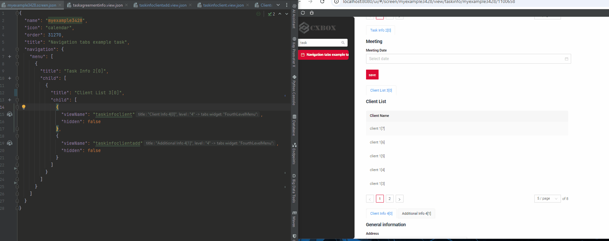

3.3 Add level 2

**Level 2. Info about task**: Task Info tab, Additional Info tab

Collapse the JSON to the second level (menu). We add a level 2 view.

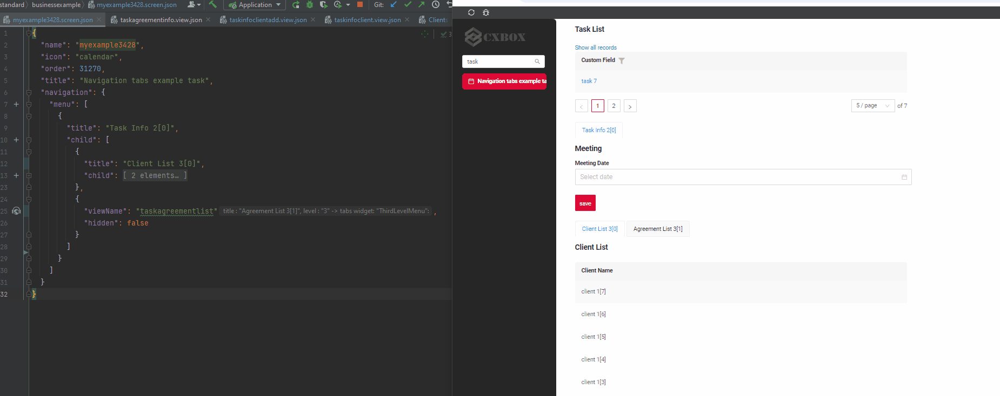