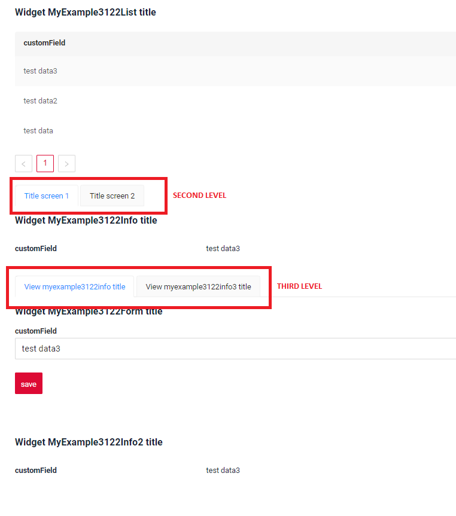
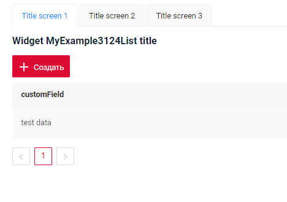
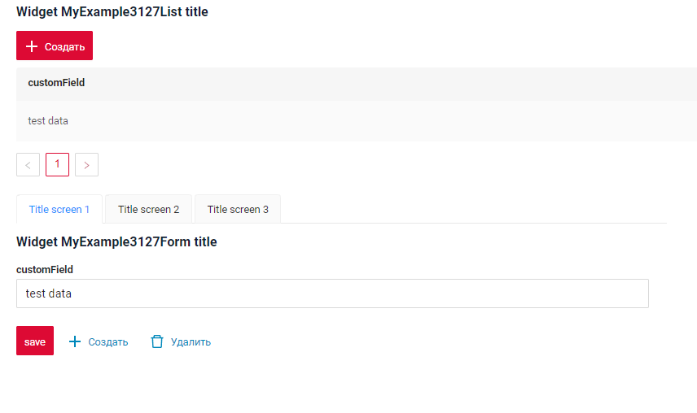
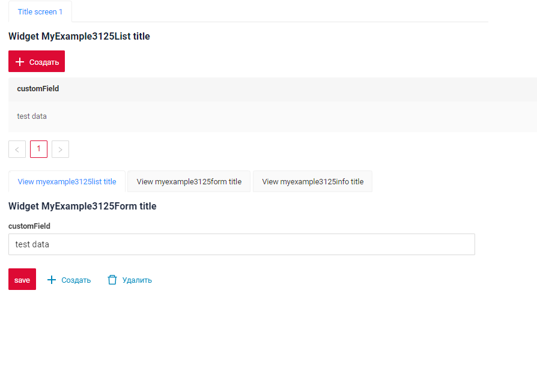

# Tabs
`Tab`  is a  component that enables users to switch between different components using tabs.
The tabs are organized as a tab bar. If the number of tabs exceeds the space available in the tab bar, navigation buttons will appear to help users scroll through the tabs.

## Basics
[:material-play-circle: Live Sample]({{ external_links.code_samples }}/ui/#/screen/myexample3122){:target="_blank"} ·
[:fontawesome-brands-github: GitHub]({{ external_links.github_ui }}/{{ external_links.github_branch }}/src/main/java/org/demo/documentation/feature/tab/basic){:target="_blank"}

Существует 2 варианта добавления типов вью как сингл вью и как агригейт вью

1) Уникальное имя чтобы при дриллдауне можно было воостановить подсветку табов по дерево вверх
2) Нельзя пустой массив нельзятк что отрисовывать если  мы идем по дереву внизу и рисуем первое вью в массиве
3) Хотя бы одна вью на уровне с хидден дб изиз пункта 2

   Tab levels:

* [SecondLevelMenu](#SecondLevel)
* [ThirdLevelMenu](#ThirdLevelMenu)
* [FourthLevelMenu](#FourthLevelMenu)

### How does it look?

 
##  <a id="SecondLevel">SecondLevel</a>

[:material-play-circle: Live Sample]({{ external_links.code_samples }}/ui/#/screen/myexample3124){:target="_blank"} · 
[:fontawesome-brands-github: GitHub]({{ external_links.github_ui }}/{{ external_links.github_branch }}/src/main/java/org/demo/documentation/feature/tab/secondlevel){:target="_blank"}
### How does it look?
=== "Top"
    
=== "Down"
    

###  How to add? 
??? Example
    === "Top"
        **Step1** Add view to the **.screen.json** using the `child` property. 

        see more [screen](/screen/screen/)

        ```json
        --8<--
        {{ external_links.github_raw_doc }}/feature/tab/secondlevel/top/myexample3124.screen.json
        --8<--
        ```
        **Step2**  Add widget **SecondLevelMenu** `first` to **.view.json** using the `position` property. 

        see more [widget position](widget/type/widget/)

        ```json
        --8<--
        {{ external_links.github_raw_doc }}/feature/tab/secondlevel/top/myexample3124form.view.json
        --8<--
        ```
    === "Down"
        **Step1** Add view to the **.screen.json** using the `child` property. 

        see more [screen](/screen/screen/)

        ```json
        --8<--
        {{ external_links.github_raw_doc }}/feature/tab/secondlevel/down/myexample3127.screen.json
        --8<--
        ```
        **Step2**  Add widget **SecondLevelMenu** `after a widget` to **.view.json** using the `position` property. 

        see more [widget position](widget/type/widget/)

        ```json
        --8<--
        {{ external_links.github_raw_doc }}/feature/tab/secondlevel/down/myexample3127form.view.json
        --8<--
        ```

##  <a id="ThirdLevelMenu">ThirdLevelMenu</a>
[:material-play-circle: Live Sample]({{ external_links.code_samples }}/ui/#/screen/myexample3125){:target="_blank"} ·
[:fontawesome-brands-github: GitHub]({{ external_links.github_ui }}/{{ external_links.github_branch }}/src/main/java/org/demo/documentation/feature/tab/thirdlevel){:target="_blank"}
### How does it look?


###  How to add?
??? Example
    Add widget **ThirdLevelMenu** after a widget **SecondLevelMenu** to **.view.json** using the `position` property.

    see more [widget position](widget/type/widget/)
    ```json
    --8<--
    {{ external_links.github_raw_doc }}/feature/tab/thirdlevel/myexample3125form.view.json
    --8<--
    ```

##  <a id="FourthLevelMenu">FourthLevelMenu</a>
**_not applicable_**
<!-- 
[:material-play-circle: Live Sample]({{ external_links.code_samples }}/ui/#/screen/myexample3126){:target="_blank"} ·
[:fontawesome-brands-github: GitHub]({{ external_links.github_ui }}/{{ external_links.github_branch }}/src/main/java/org/demo/documentation/feature/tab/fourthlevel){:target="_blank"}
### How does it look?


### How to add?
??? Example
    Add widget **FourthLevelMenu** after a widget **ThirdLevelMenu** to **.view.json** using the `position` property.

    see more [widget position](widget/type/widget/)
    ```json
    --8<--
    {{ external_links.github_raw_doc }}/feature/tab/thirdlevel/myexample3126form.view.json
    --8<--
    ```

-->