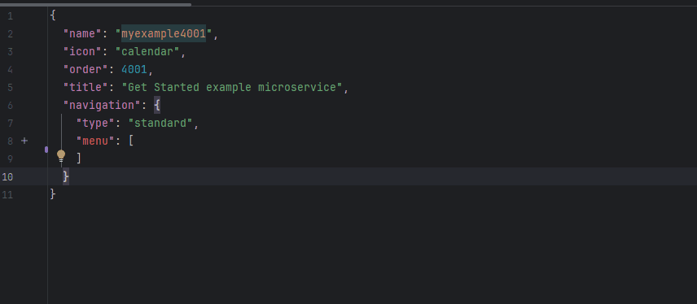

## View

**`View`** is the core building block of the user interface, used to form screens in the system. Each screen is created based on one or more Views, inside which various widgets are placed.

A View defines:

*   The structure and layout of the screen's content.
*   The order in which widgets are displayed.
*   The width of each widget (using an adaptive grid).
 

### Adaptive Grid

The system uses a 24-column adaptive grid for placing widgets. This allows for flexible management of their positioning and interface adaptability.

| Value | Behavior |
| :--- | :--- |
| **24** | The widget occupies the full width of the page. *(Default)* |
| **12** | The widget occupies half the width of the page (12/24 = 50%). |

> **Note:** Some special widgets (e.g., `AdditionalList`) may ignore the standard width rules and behave differently.

If two consecutive widgets have a total grid width of 24 or less, they will be placed on the same line: the first on the left, the second on the right. If the total width of the widgets exceeds 24, the following widgets are automatically moved to a new line.

### Widget Display Order (`position`)

Widgets inside a View are displayed in ascending order of their `position` parameter.

> **Recommendation:**
> Use increments of 10 (e.g., `10`, `20`, `30`) so that in the future you can easily insert a new widget between existing ones (e.g., at position `15`) without changing the other values.

 
### Example View Configuration

| Parameter | Example Value             | Description |
| :--- |:--------------------------| :--- |
| **`id`** | `myexampleid`             | The unique identifier for the View in the system. |
| **`title`** | `My Title`                | The View title displayed to the user (depends on the tab level). |
| **`template`** | `DashboardView`           | The View template. `DashboardView` is the standard (vanilla) template. |
| **`url`** | `myexample357listexample` | The unique URL for the View. |
| **`rolesAllowed`** | `["CXBOX_USER"]`          | The list of roles allowed to access this View. |
 
### How to add?
??? Example
    To create a new View, you must:

    1.  Set a unique `id`
    2.  Specify `title`.
    3.  Define the list of allowed `roles`.
    4.  `template`= `DashboardView`
    5.  Add URL for the view.
    6.  Add widgets, specifying for each:
          *   The `position` parameter (controls the display order).
          *   The `gridWidth` parameter (controls the width in the 24-column grid). 

    === "With plugin(recommended)"
        

    === "Example of writing code"
        ```json
        --8<--
        {{ external_links.github_raw_doc }}/getstarted/microservice/example/myexample4001form.view.json
        --8<--
        ```
## Security
Allowed Roles
[see more rolesAllowed](/environment/userrole/userrole/)