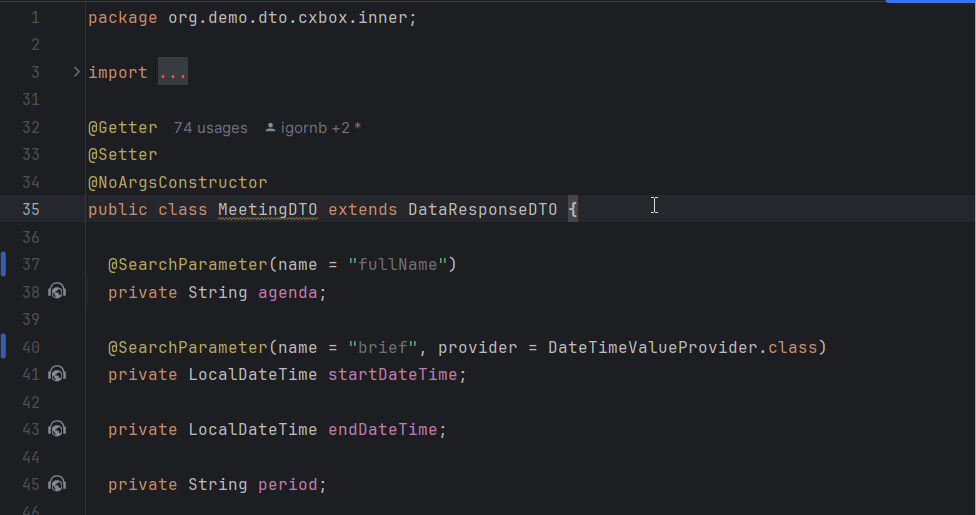
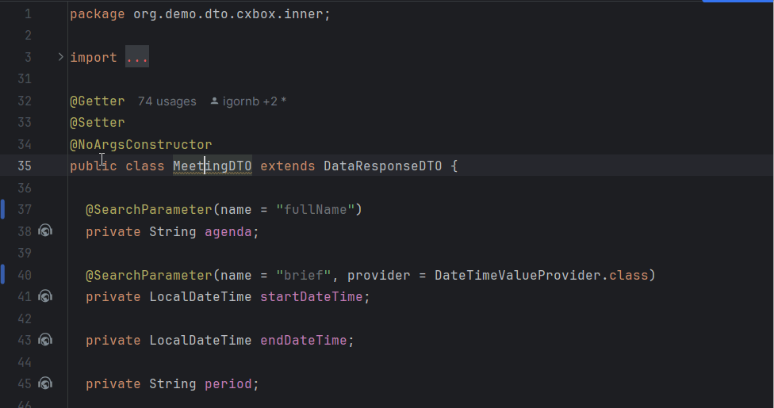
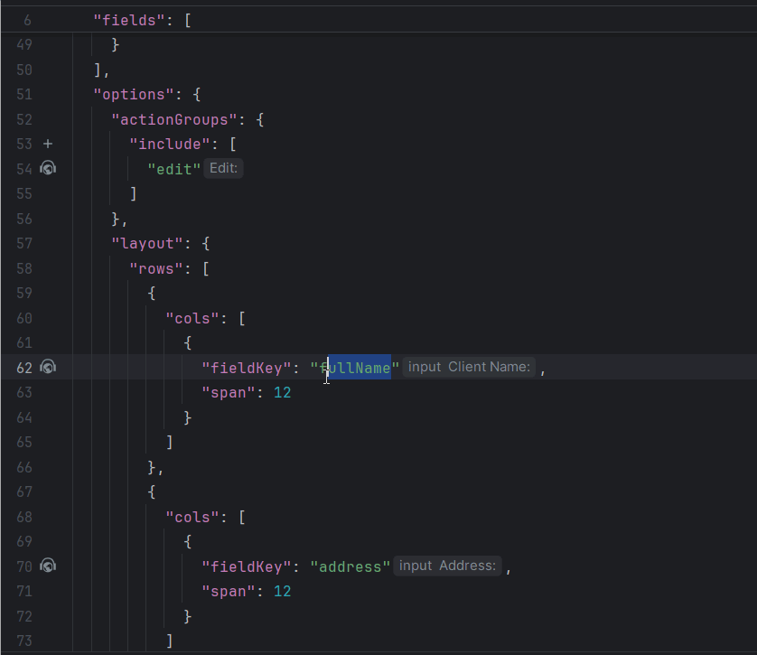
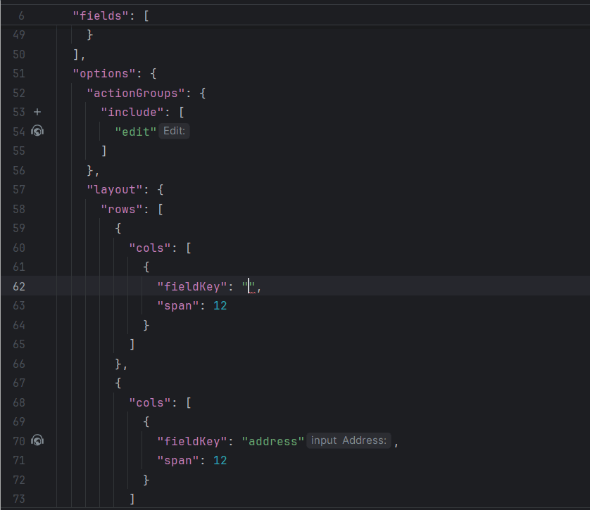

# 1.7.8

## Added: @SearchParameter - improved handling for unresolved entities

We have improved the plugin's behavior when the Entity specified in the annotation cannot be resolved.

Now, if the Entity cannot be resolved, the plugin will:

###  Inspection
Highlight the class name in yellow (Warning) with the message "Entity not found."

### Quick-fix suggestion
Quick-fix suggestion to specify the Entity path explicitly in a comment.
Example comment: //@entity:<fully qualified path to entity>.

## Inspection for field references with -FieldKey postfix (options section).

The plugin now supports autocomplete, reference and inspections for field references in the options section of a widget.json file. To enable this functionality, ensure that fields in the options are named using the -FieldKey postfix (or simply named fieldKey). The plugin will link these fields to the fields array at the beginning of a widget.json file and, thus, ensure accurate references.

"Autocomplete"
   

"Reference"
   

"Inspection"
   

## Added: Adding **MultipleSelect** field for Enum stored in Entity as Set<>
Adding **MultipleSelect** field now utilizes a new method for `buildRowDependentMeta`.

