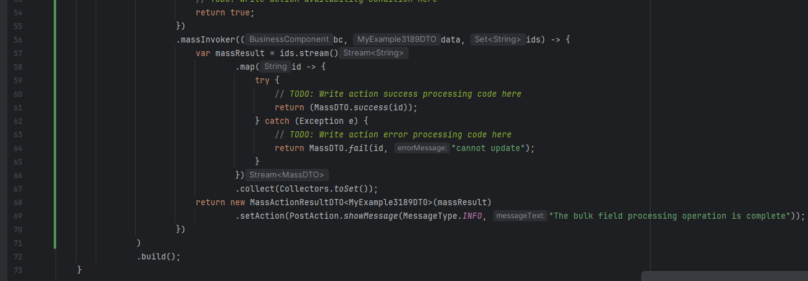

# 2.0.2
 
## Added. Support for the new version of IDEA (2.25.3) added
<!-- CXBOX-1194  -->
IntelliJ 2025.3+ support added.
 
## Fixed. Fixed invoker for massInvoker(Bulk operations)
<!-- CXBOX-1173  -->
Fixed invoker for massInvoker.
=== "after" 
    
=== "before"
    

## Added. Inspection warns about same-BC widget usage
<!-- CXBOX-1077   -->
An inspection (warning) has been added to indicate when widgets are used in the `options.create`, `options.edt`, or `options.read` tags with the same business component as the widget on which these tags are applied.

## Fixed. Fixed. PickMapHasValueOnWidgetInspection deleted
<!-- CXBOX-1011   -->
PickMapHasValueOnWidgetInspection deleted.

## Fixed. Fixed for VersionAwareResponseService MultivalueField generation
<!-- CXBOX-1182   -->
Creating a Multivalue field works again for inner entities.
