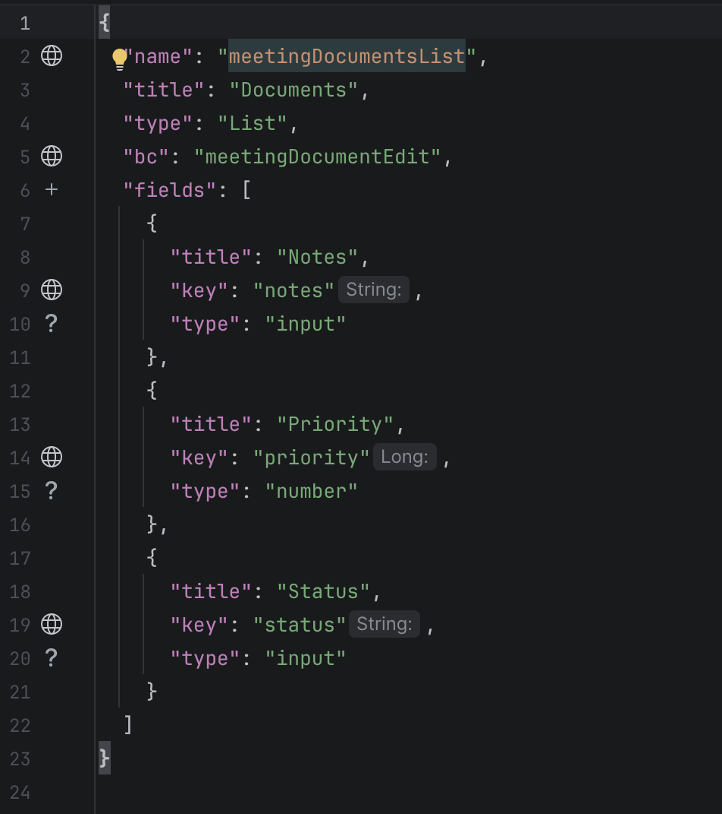
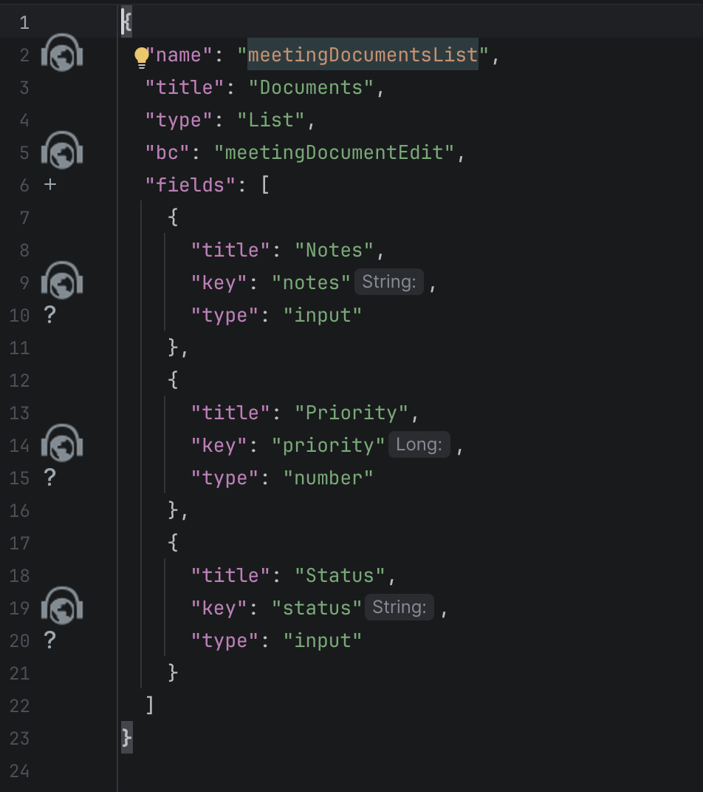

# 2.0.4

## Added. Support for the new version of IDEA (2026.2) added
<!-- CXBOX-1376  -->
IntelliJ 2026.2+ support added.

## Changed. Navigation gutter icon
<!-- CXBOX-1376  -->
The navigation gutter icon has been changed to a compact `AllIcons.Nodes.PpWeb` icon everywhere it was used:

* `.screen.json`: `defaultView`, `primaryViewName`, `primaryViews`, view `name` in `navigation`;
* `.view.json`: view `name`, widget names in `widgets`;
* `.widget.json`: widget `name`, `bc`, field `key`, `popupBcName` and `assocValueKey` of `multivalue` / `pickList` fields, `pickMap` keys, time `format`, `actionGroups` actions and groups, `fieldKey` in `options.layout`;
* Java: fields of DTO classes (inheritors of `DataResponseDTO`), navigation to their usages in widgets.

=== "after"
    
=== "before"
    
