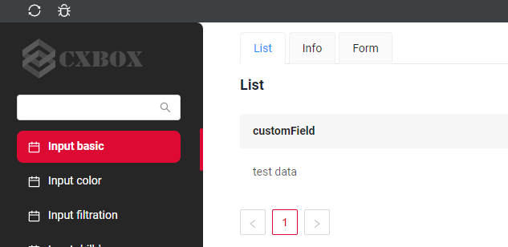
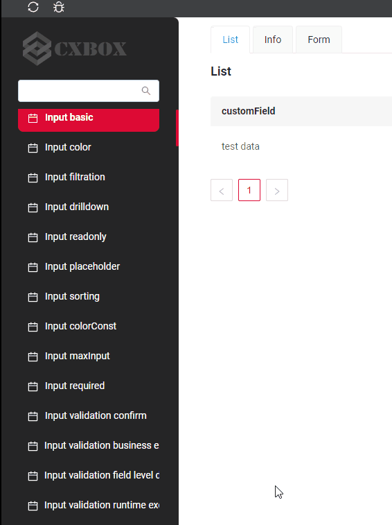
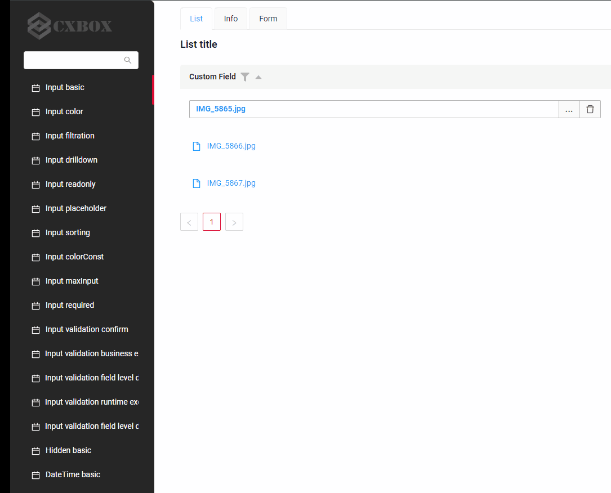
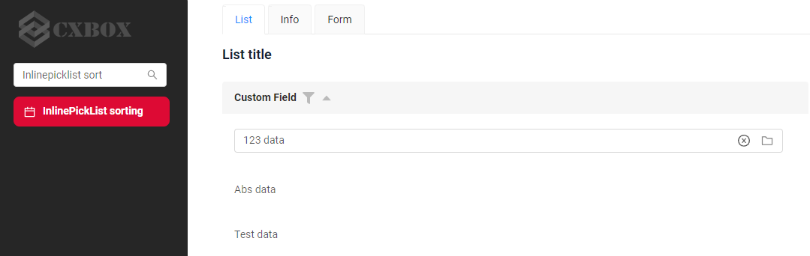
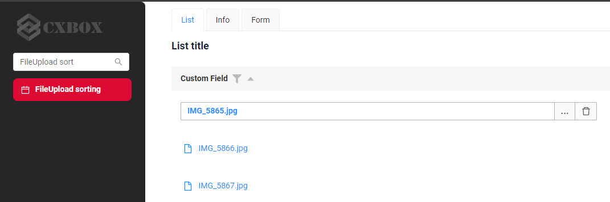
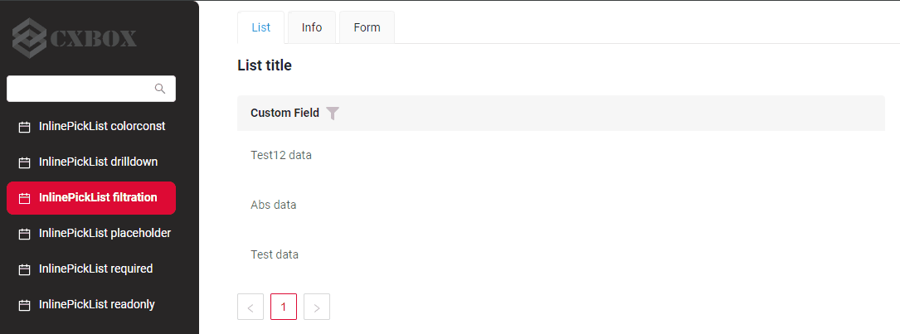
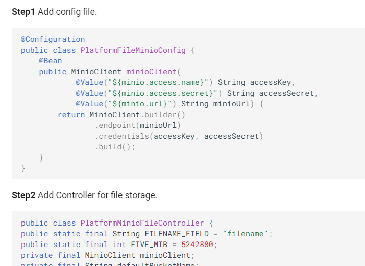

# v1.0.0

## **Key updates September 21, 2023**
### CXBOX ([Demo](https://github.com/CX-Box/cxbox-demo), [Code Samples](https://github.com/CX-Box/cxbox-code-samples))

#### Red-black theme
{width="800"}

The release has updated the theme of a certain project or software.
The chosen theme is a classic combination of red and black, which symbolizes aristocratic taste and dignity)

If you want to see the new theme, you can click on the provided
[link]({{ external_links.demo }}/ui/)

#### Added search for screens by name in menu
{width="300" }

The update includes a new and convenient search feature specifically designed for screens  by name in the menu.
This will make it easier for users to search and locate specific screens quickly and efficiently.
Filtering is case-insensitive and retrieves records containing the specified value at any position (similar to SQL Like %value% )
[link](http://code-samples.cxbox.org/ui/#/screen/InputBasic).

####  Added scroll for screens in menu
{width="500" }

Added scrolling function in a menu. 
It feature that allows users to view the full list of screens or options within a limited space. 
When the list of items exceeds the available space, the user can scroll up or down to see more options.
[link](http://code-samples.cxbox.org/ui/#/screen/InputBasic)

#### Added sort for fields FileUpload,InlinePicklist
{ width="800" }
{ width="800" }

Added sort for field FileUpload,InlinePicklist. Fields has lexicographic sorting.
This sorting method is based on the order of characters in the field, where letters and numbers are organized according to their respective positions in the alphabet or numeric sequence.
If you want to see 
[InlinePicklist](http://code-samples.cxbox.org/ui/#/screen/InputBasic),
[FileUpload](http://code-samples.cxbox.org/ui/#/screen/InputBasic).

#### Fix filtration 
{width="600" }

We've resolved filtering issues across types of fields:
    [InlinePickList](http://code-samples.cxbox.org/ui/#/screen/myexample142/view/myexample142list),
    [PickList](http://code-samples.cxbox.org/ui/#/screen/myexample111/view/myexample111list),
    [MultipleSelect](http://code-samples.cxbox.org/ui/#/screen/myexample256/view/myexample256list),
    [Radio](http://code-samples.cxbox.org/ui/#/screen/myexample25/view/myexample25list),
    [Money](http://code-samples.cxbox.org/ui/#/screen/myexample63/view/myexample63list),
    [Number](http://code-samples.cxbox.org/ui/#/screen/NumberFiltration/view/NumberFiltrationlist),
    [DateTime](http://code-samples.cxbox.org/ui/#/screen//screen/DateTimeFiltration/view/DateTimeFiltrationlist),
    [DateTimeWithSeconds](http://code-samples.cxbox.org/ui/#/screen/DateTimeWithSecondsFiltration/view/DateTimeWithSecondsFiltrationlist),
    [FileUpload](http://code-samples.cxbox.org/ui/#/screen/myexample99/view/myexample99list),
    [Checkbox](http://code-samples.cxbox.org/ui/#/screen/myexample53/view/myexample53list)

#### Added worked with file store Minio

We've expanded the documentation by including a comprehensive example demonstrating how to work with Minio file storage. 
This addition offers users practical insights into utilizing Minio for their file storage needs with cxbox.
[FileStorage.Minio](https://doc.cxbox.org/features/element/fileStorage/fileStorage/)

#### Other Changes
see [cxbox-demo changelog](https://github.com/CX-Box/cxbox-demo/releases/tag/v1.0.0)

see [cxbox-code-samples changelog](https://github.com/CX-Box/cxbox-code-samples/releases/tag/v1.0.0)