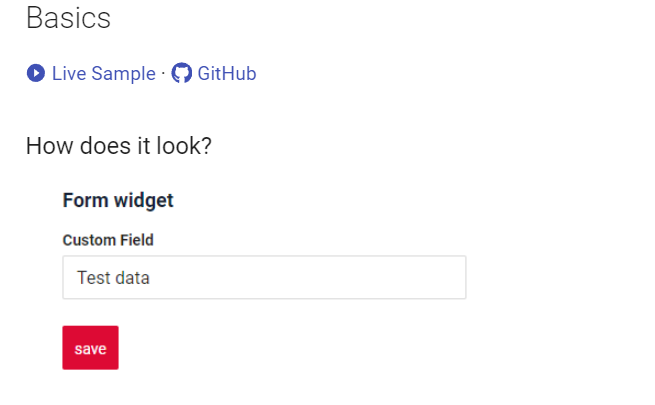
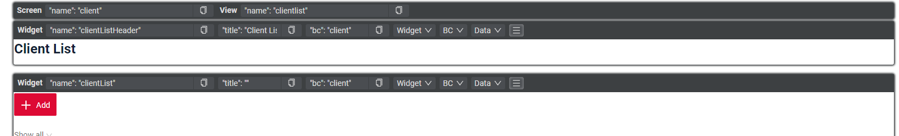

# v1.0.1
cxbox/core 3.0.5
cxbox-ui/core 1.37.1

## **Key updates December 7, 2023**

### CXBOX [documetation](https://doc.cxbox.org/)

#### Added creation form widget
{width="500"}

We've introduced a new documentation section that details the core functionality for form widget.
Section of the documentation contains a detailed description of the basics ,main visual parts,show condition.
Additionally, we've included links to live examples for hands-on demonstrations and access to code samples for reference.

#### Other Changes
see [cxbox-doc changelog](https://github.com/CX-Box/cxbox-doc/releases/tag/v1.0.1)

### CXBOX ([Demo](https://github.com/CX-Box/cxbox-demo))

#### Development mode redesign
{width="800"}

We have made improvements to the debug panel by making more convenient. This redesign allows users to view all the essential information of a widget in a single line. If users require more detailed information, they can simply click on an arrow to expand and access the additional details. This enhancement provides a more streamlined and user-friendly experience when interacting with the debug panel.
We've introduced a new documentation section that details the core functionality for all field types.
Each section of the documentation contains a detailed description of the main operations, placeholders,
sorting methods, coloring options, filtering, detailing, checking, compulsory filling, filtering by a specific field type.
Additionally, we've included links to live examples for hands-on demonstrations and access to code samples for reference.

#### Oracle support
Added the ability to deploy an application to an oracle database using settings.

see more [Oracle support](/features/element/database/oracle/oraclebd)

#### Added Performance Metrics
We added monitoring tools in application - performance metrics.
Performance metrics are utilized to evaluate and monitor the conduct, operations, and effectiveness.

see more [Performance Metrics](/features/element/monitoringtools/metrics/performancemetrics)

#### Integration with email
We added  sent to email  in application.

see more [Sent to email](/features/element/notifications/email/email)

#### Basic auth optional support added
Added the ability storing login and password in a database.

see more [Basic Authorization](/features/element/authorization/basic/basicauthorization)
#### Push notifications
We added push notifications

see more [WebSocket and Long Pooling](/features/element/notifications/push/websocket)

#### Other Changes
see [cxbox-demo changelog](https://github.com/CX-Box/cxbox-demo/releases/tag/v.1.0.1)

see [cxbox-code-samples changelog](https://github.com/CX-Box/cxbox-code-samples/releases/tag/v1.0.1)