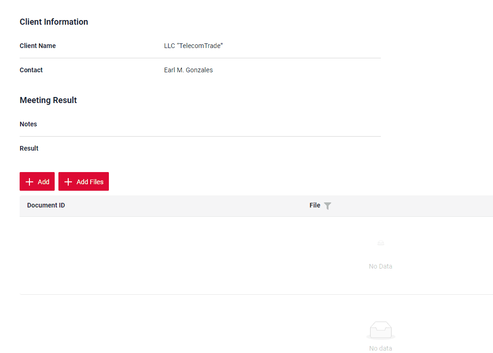
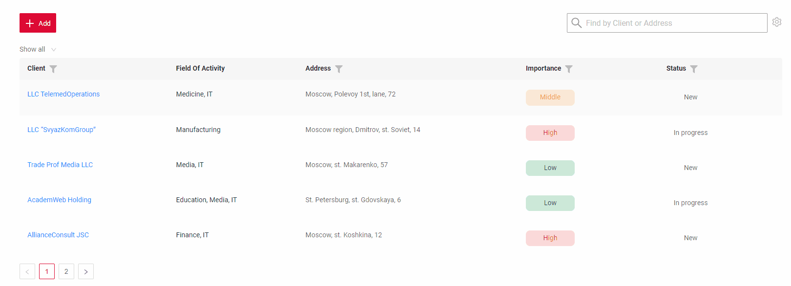
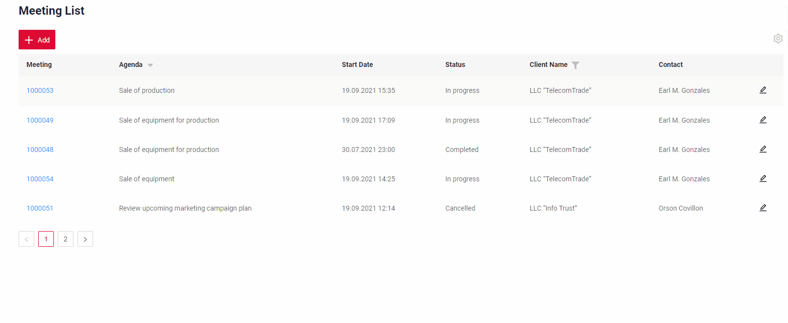
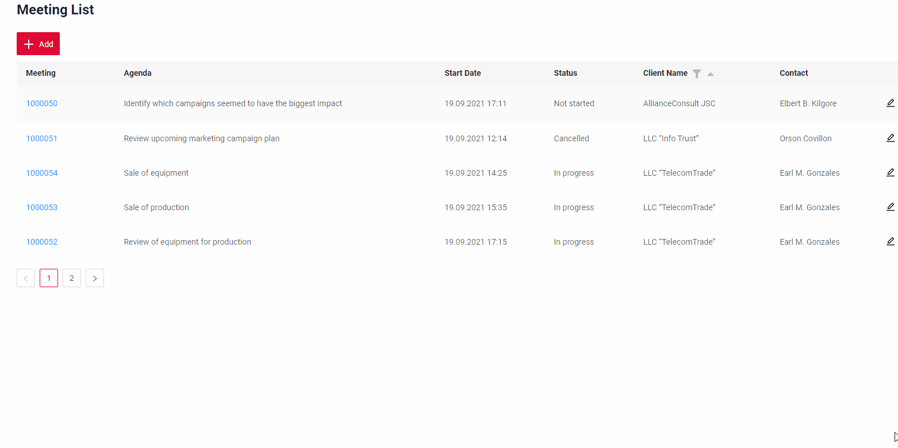
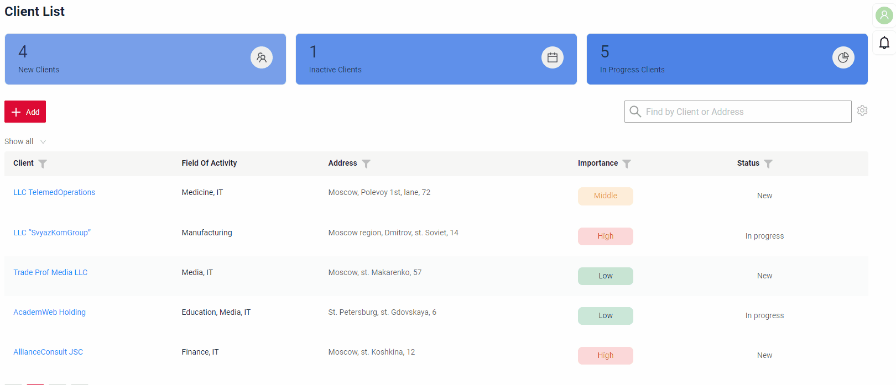
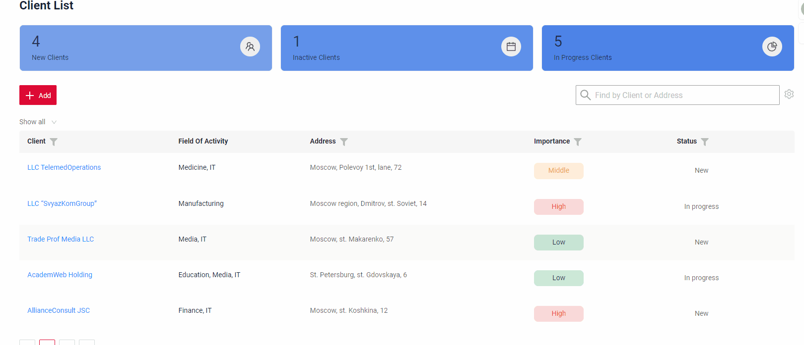
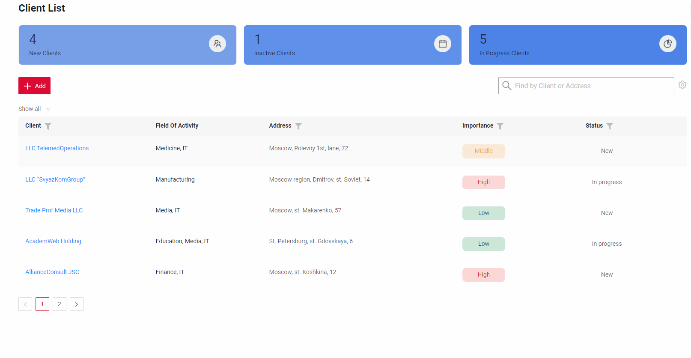
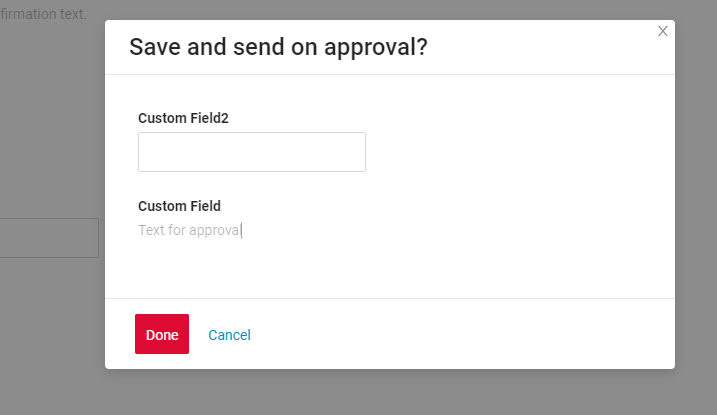

# v2.0.0

cxbox/core 4.0.0-M2

cxbox-ui/core 2.0.0-alpha.6

## **Key updates March 11, 2024**

### CXBOX ([Demo](https://github.com/CX-Box/cxbox-demo))

#### New version front cxbox
The release uses new version cxbox front UI.

see more [New ui](#CXBOXUI)

#### New version core cxbox
The release uses new version core cxbox.

see more [New core](#CXBOXCORE)

####  Support for microservice architecture
Added the ability to work not only with data from the database, but also with data from any source. E.g. support for microservice architecture significantly improved.

see more [Improved work with microservices](#Microservices)

#### Added multi-download for files

Multi-upload of files. To upload several files, you need to select them in popup, wait for loading and click the "Save" button.
The files will be downloaded to the storage and will appear on the page once the upload process is complete. This feature makes it easy to upload multiple documents at once, streamlining the process and saving time for the user.
It also ensures that all necessary files are uploaded to the widget in one go, eliminating the need for multiple uploads of individual files.

Live sample [Add files](  {{ external_links.demo }}/ui/#/screen/meeting/view/meetingview/meeting/1000053)

#### Added full text search

Added the ability for List widgets to use fullText Search. When the user types in the full text search input area, then widget filters the rows that match the search query (search criteria is configurable and will usually check if at least one column has corresponding value). This feature makes it easier for users to quickly find the information they are looking for within a List widget.

Live sample [Full text search]({{ external_links.demo }}/ui/#/screen/meeting)

#### Additional columns

If you'd like to change the composition or sequence of the columns displayed, you can do so by customizing your preferences in the settings menu, where you can select which columns should be "displayed" and wich are not.
These changes will be saved for your account only, so you can view the columns in a way that suits your preferences.

Live sample [Customization of displayed columns]({{ external_links.demo }}/ui/#/screen/client)

#### New pickList filtration

New filteration allows users to search for picklist entries by either their ID or text, providing a more flexible and efficient way to find the desired information. The filtering modes are mutually exclusive, meaning that users can only use one mode at a time to search for entries within the picklist.
This enhancement improves the user experience and accelerates the process of selecting entries from picklists.

Live sample [New pickList filter]({{ external_links.demo }}/ui/#/screen/meeting)

#### Filter group setting

The user filters can be saved for this user and can be selected from the drop-down list. This allows to easily access their presonal saved filters without having to re-enter them each time. These changes will be saved for user account only.

Live sample [Filter group setting]({{ external_links.demo }}/ui/#/screen/client).

#### Added new widget type - StatsBlock

Widget allows to display statistics in the form of a bar. Only for data viewing.

Live sample [StatsBlock]({{ external_links.demo }}/ui/#/screen/client).

#### Added new widget type - suggestionPickList

The new widget type allows you to search for data in other systems by specific fields. The current release provides an example with taking data from external rest api (dadata).

Live sample [suggestionPickList]({{ external_links.demo }}/ui/#/screen/client)

#### Added new widget type - FormPopup

Added new widget type - popup with additional fields.

Live sample [FormPopup](https://doc.cxbox.org/widget/type/formpopup/formpopup/)

#### Added new widget type - AdditionalInfo

Added new widget type only for data viewing. Widget is always located on the right side and has gray background.

Live sample [AdditionalInfo](https://doc.cxbox.org/widget/type/additionalinfo/additionalinfo/)

#### Other Changes
see [cxbox-demo changelog](https://github.com/CX-Box/cxbox-demo/releases/tag/v2.0.0)

### <a id="CXBOXUI">CXBOX</a> ([Core Ui](https://github.com/CX-Box/cxbox-ui))

#### Node JS < version 18
Removed support for Node JS < version 18

#### All direct dependencies have been removed
The changes made it possible to use dependencies within the project that meet the requirements of the version range.

#### UIKit has been separated from ui core
UIKit has been separated from the ui core, so now insead of using cxbox standart ant-design based UIkit you can implement your own UIKit within the project using your perffered library (material and so on).

#### Replaced custom typescript utilities
We have replaced custom typescript utilities with well-documented, standardized functions of the Redux-toolkit and the Redux-observable libraries.

#### Change standard actions behavior
Added the ability to change the behavior of standard actions on project level.

#### Change routing logic on the frontend
Added the ability to select a library for routing on the frontend.

#### Autotests for asynchronous Marble testing processes
It is now possible to implement autotests for asynchronous Marble testing processes

### <a id="CXBOXCORE">CXBOX</a>  ([Core](https://github.com/CX-Box/cxbox))
#### Updated to Springbot 3(java 17+)
Updated to Springbot 3 (java 17+)

#### <a id="Any source API">Any Source API and improved work with microservices</a>
The new "Any Source" API allows you to show/edit/update data now from microservices or any other sources.
The API's feature is complete uniformity with old "inner" API for working in standard mode (e.g. VersionAwareResponseService based api).
Multi-stage entity creation with force active fields is supported out of the box in new "Any Source" API.

#### Fixed dependency security alert
Fixed all github ([dependency security alerts](https://github.com/CX-Box/cxbox/security/dependabot)) currently found by github.

#### Removed from the core of the table
Removed from the core of the table:

    * User
    * User_Role
    * USER_DIVISIONS
    * REVINFO
    * DIVISION
    * DEPT

#### Removed the starters
Removed the starters:

    * cxbox notifications starter(the example has been moved to demo and implemented on web sockets for the possibility of deep customization on projects)
    * cxbox quartz starter (removed)
    * cxbox workflow starter (removed)
    * Changelistener (recommended to use the standard hibernate Listner)

#### Made FieldExtractors spring service
Developer do not need to register them in META-INF.services any more - @Service annotation is enough now

#### Other Changes
see [cxbox changelog](https://github.com/CX-Box/cxbox/releases/tag/cxbox-4.0.0-M2)
