# v2.0.1

cxbox/core 4.0.0-M3

cxbox-ui/core 2.0.0

## **Key updates July 2024**
###  CXBOX [plugin](https://plugins.jetbrains.com/plugin/19523-platform-tools)
We've updated the plugin from version 1.7.1 to version 1.7.4.
You have the latest features and improvements available.
#### Dynamically selects whether to use the Javax library or Jakarta
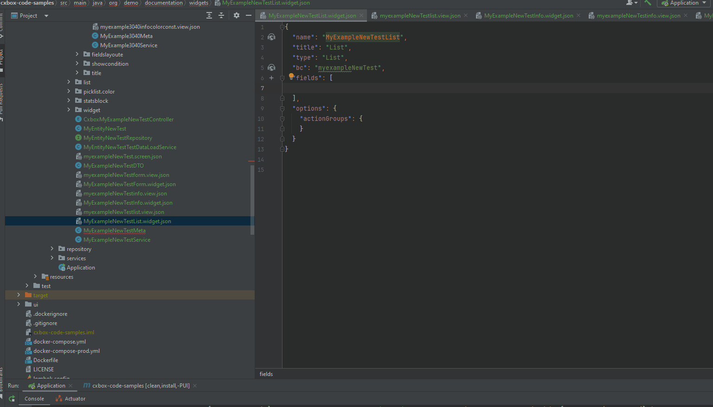
Dynamically selects whether to use the Javax library or Jakarta depending on the version Hibernate 

#### Added quick-fix and check for correct filling for the "hidden" property
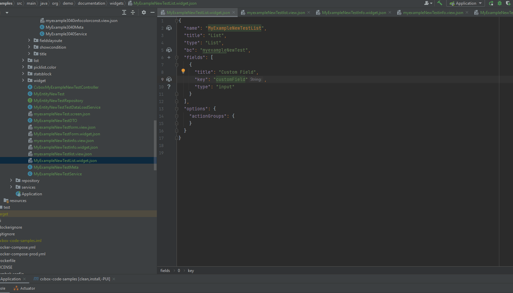
For the "hidden" property in .widget.json, a quick-fix has been implemented, and a check for correct filling has been added.

#### Added a check for correct filling  for the "title" property

Property "title" a check for correct filling in .widget.json for type widget "List" has been added.
 
#### Other Changes
see [cxbox-plugin changelog](https://plugins.jetbrains.com/plugin/19523-platform-tools/versions)

### CXBOX [documetation](https://doc.cxbox.org/)
#### Added getting started for developer
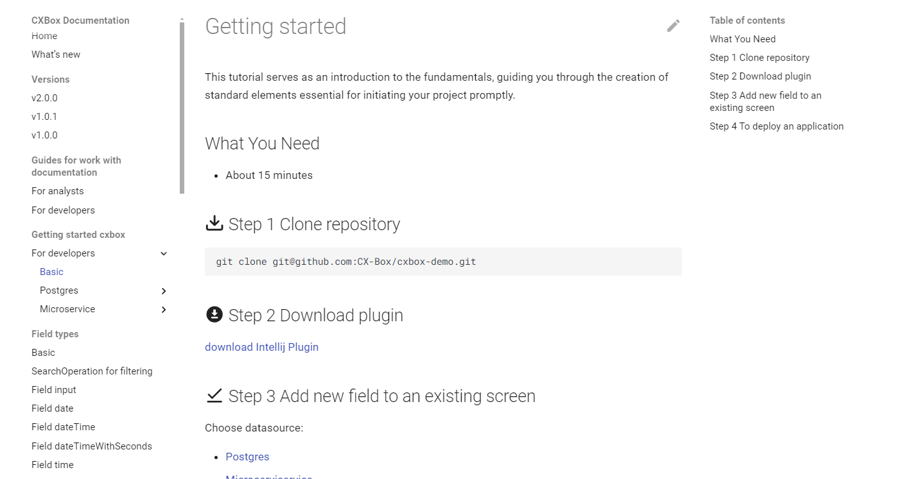

This tutorial serves as an introduction to the fundamentals, guiding you through the creation of standard elements essential for initiating your project promptly.

[Getting started](https://doc.cxbox.org/gettingstarted/getstartedfordevelopers/)
#### Added creation examples for microservice
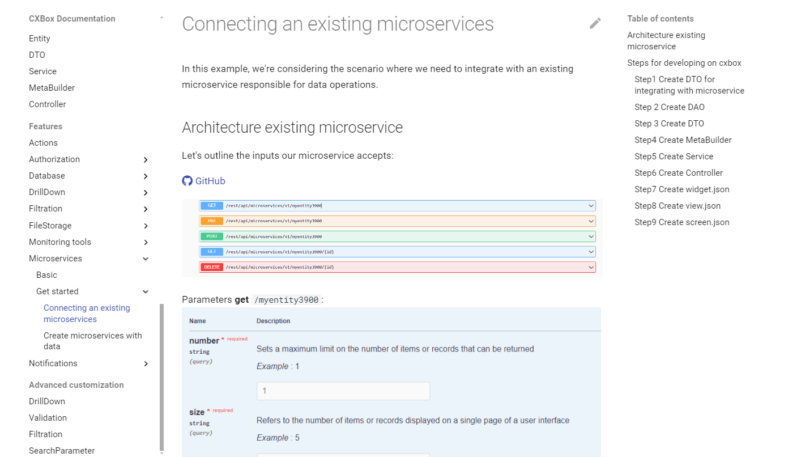

We have included an overview of standard methodologies for working with microservices. 
Additionally, we have outlined a scenario where it is necessary to integrate with an existing microservice responsible for data operations.

[Microservices](https://doc.cxbox.org/features/element/microservices/microservices/)
#### Added creation examples for widgets
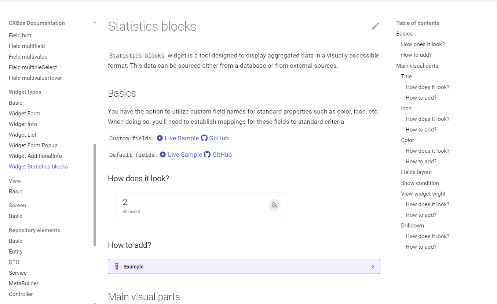

We have included a description of how to work with the following types of widgets:

[Info](https://doc.cxbox.org/widget/type/info/info/):
Info widget is a component only for data viewing.

[Form](https://doc.cxbox.org/widget/type/form/form/):
Form widget is a component for data viewing and editing. Usually it shows multiple fields. Also, it can show available action

[List](https://doc.cxbox.org/widget/type/list/list/):
List widget is list the general information for many records and present it in a way that is easily interpretable for users.

[AdditionalInfo](https://doc.cxbox.org/widget/type/additionalinfo/additionalinfo/):
AdditionalInfo widget is a component only for data viewing. Widget is always located on the left.

[Statistics blocks](https://doc.cxbox.org/widget/type/statblocks/statblocks/):
Statistics blocks widget is a tool designed to display aggregated data in a visually accessible format. This data can be sourced either from a database or from external sources.
#### Added creation examples for fulltextsearch,Filter group
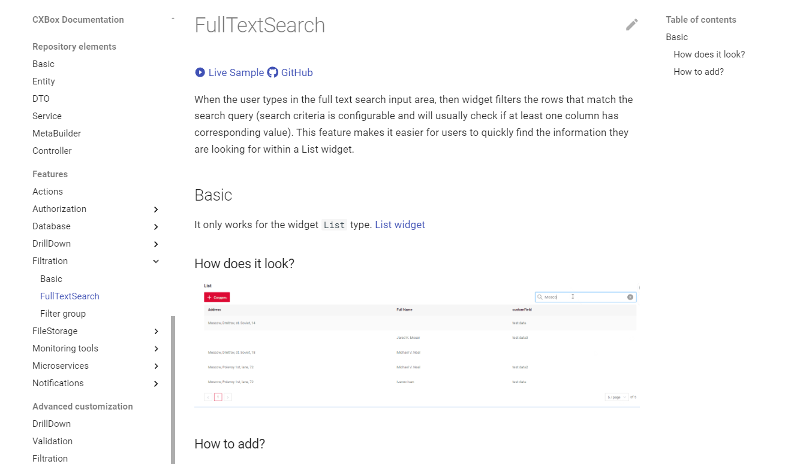

We have included descriptions of the following filtering methods:

[Fulltextsearch](https://doc.cxbox.org/features/element/filtration/fulltextsearch/fulltextsearch/) :
When the user types in the full text search input area, then widget filters the rows that match the search query (search criteria is configurable and will usually check if at least one column has corresponding value). This feature makes it easier for users to quickly find the information they are looking for within a List widget.

[Filter group](https://doc.cxbox.org/features/element/filtration/filtergroup/filtergroup/):
A user-filled filter can be saved for each individual user.

#### Added creation examples for drilldown
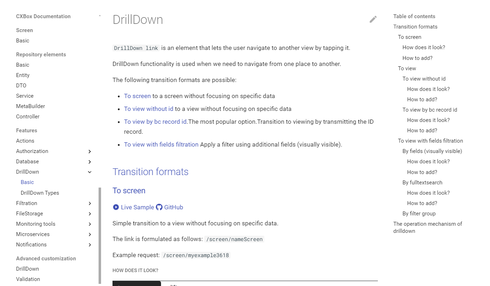
We have included a description of working with drilldown, detailing their features and the various possibilities for utilizing them.

[Drilldown](https://doc.cxbox.org/features/element/drilldown/drilldown/) :
DrillDown link is an element that lets the user navigate to another view by tapping it.
#### Added creation examples for multivalue_primary
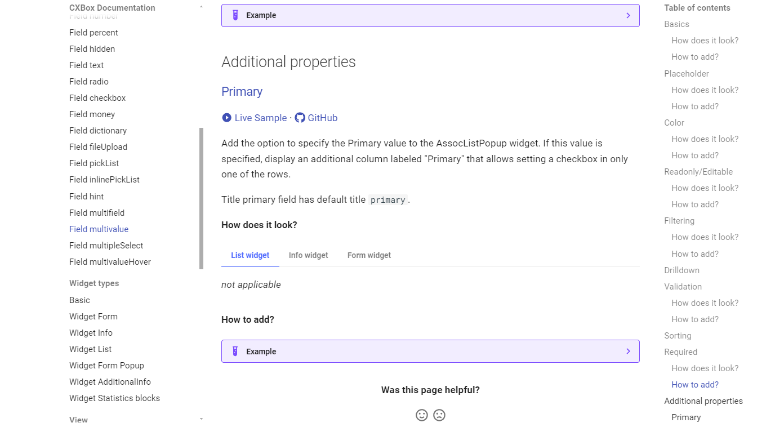
We have included an example demonstrating the possibility of adding a primary attribute to a field type "multivalue".

[Multivalue_primary](https://doc.cxbox.org/widget/fields/field/multivalue/multivalue//):
Add the option to specify the Primary value to the AssocListPopup widget. If this value is specified, display an additional column labeled "Primary" that allows setting a checkbox in only one of the rows.

#### Other Changes
see [cxbox-doc changelog](https://github.com/CX-Box/cxbox-doc/releases/tag/v2.0.1)

### CXBOX ([Demo](https://github.com/CX-Box/cxbox-demo), [Code Samples](https://github.com/CX-Box/cxbox-code-samples))
#### File preview

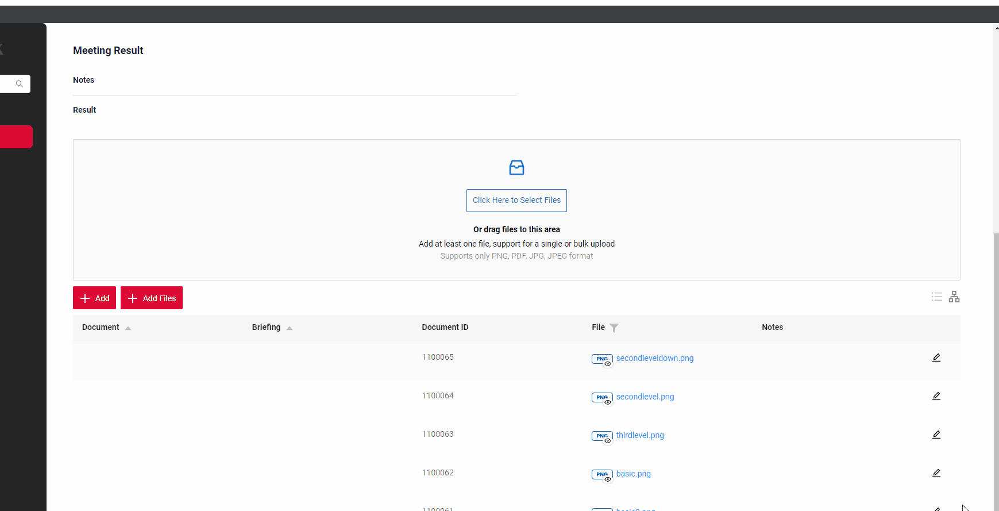

An eye button has been added. When clicked, the system generates a pop-up displaying a full-screen preview of the file.
Three types of buttons have been added to the preview:

Fullscreen: When clicked, the system generates a pop-up displaying a full-screen preview of the file.
Navigate: The system displays file previews in the pop-up from the widget list in the order present when the pop-up was activated. This respects any applied filters or sorting.
Download: The system initiates a file download and saves it to the user's standard Download folder.

see more [File preview]({{ external_links.demo }}/ui/#/screen/meeting/view/meetingview/meeting/1000053)

#### Multi-upload of files without popup.

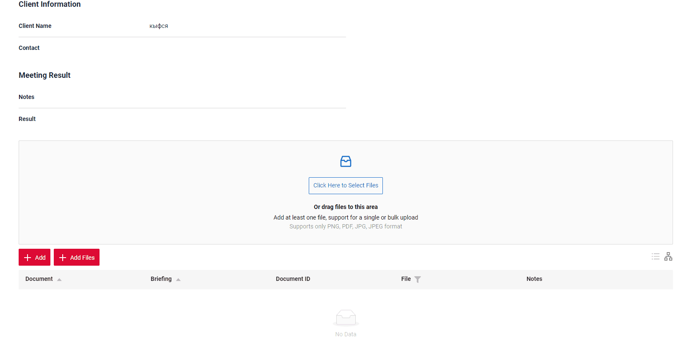

With the new update, you can use a widget to download the files. 
After uploading, the files will be stored and displayed on the page once the process is complete.
Added progress bar for download files.
This improvement simplifies the process of uploading multiple documents simultaneously.

Live sample [Add files]({{ external_links.demo }}/ui/#/screen/meeting/view/meetingview/meeting/1000053)

#### Added display of the number of applied filters

If you have filtered by table, the "Clear all filters" button will appear.
It is suggested to indicate the number of applied filters by displaying "Clear n filters" (where n represents the number of columns being filtered).

Live sample [Add files]({{ external_links.demo }}/ui/#/screen/meeting)
#### Added the ability to select limits for pagination
Added the ability to select limits for pagination
#### Added new widget type - GroupingHierarchy
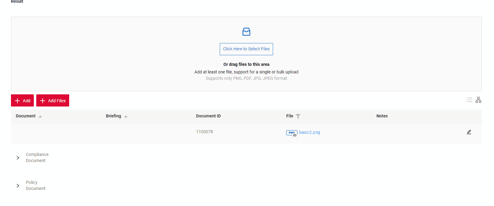

"Grouping Hierarchy" and "Table" are purely display modes.
Fundamentally, this widget is a list widget enhanced with a grouping feature.
Live sample [GroupingHierarchy]({{ external_links.demo }}/ui/#/screen/meeting/view/meetingview/meeting/1000053)
 
Added new widget type only for data viewing. Widget is always located on the right side and has gray background.

Live sample [AdditionalInfo](https://doc.cxbox.org/widget/type/additionalinfo/additionalinfo/)
#### Add view with responsibility

Added screen with responsivenes. Allows you to add or remove view accessibility.

Live sample [Responsibility]({{ external_links.demo }}/ui/#/screen/admin/view/resplist)

#### Add filtration by range for Date/DateTime/DateTimeWithSeconds

#### Add support BgColor/BgColorKey of field in Title template
Added new widget type only for data viewing. Widget is always located on the right side and has gray background.

Live sample [AdditionalInfo](https://doc.cxbox.org/widget/type/additionalinfo/additionalinfo/)
#### Other Changes
see [cxbox-demo changelog](https://github.com/CX-Box/cxbox-demo/releases/tag/v2.0.1)

see [cxbox-code-samples changelog](https://github.com/CX-Box/cxbox-code-samples/releases/tag/v2.0.1)

### <a id="CXBOXUI">CXBOX</a> ([Core Ui](https://github.com/CX-Box/cxbox-ui))

#### Add filtration by range for Date/DateTime/DateTimeWithSeconds
Add filtration by range for Date/DateTime/DateTimeWithSeconds
#### Add support BgColor/BgColorKey of field in Title template
Add support BgColor/BgColorKey of field in Title template
#### Select Multiple Files
Add supports additional for multiple files
#### File preview
Add supports additional in meta for file preview

### <a id="CXBOXCORE">CXBOX</a>  ([Core](https://github.com/CX-Box/cxbox))
####  Updated to Springbot 3.2.4 (java 17+)
Updated to Springbot 3.2.4
#### Select Multiple Files
@cxboxgithub
fileAccept added to ui meta fields in cxbox core
#### File preview
Add supports additional in meta for file preview 
#### Add filtration by range for Date/DateTime/DateTimeWithSeconds
Add supports filtration by range for Date/DateTime/DateTimeWithSeconds
#### Added sorting in the LOV dictionary
Added sorting in the LOV dictionary
#### Added Responsibilities
Added Responsibilities  
####  Global Bc limit default value is configurable
Global Bc limit default value is configurable
#### Other Changes
see [cxbox changelog](https://github.com/CX-Box/cxbox/releases/tag/cxbox-4.0.0-M3)
