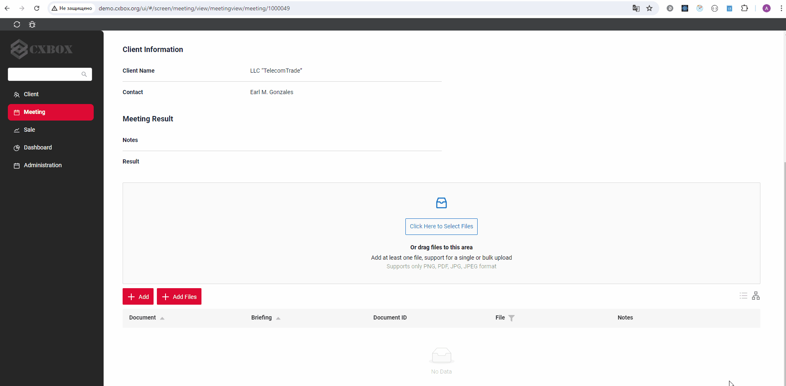
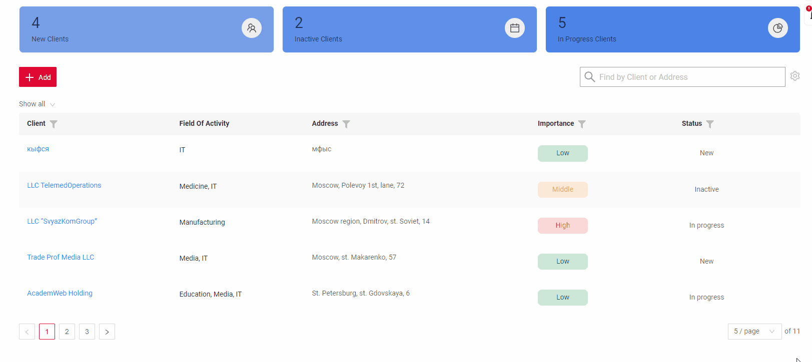

# v2.0.1
cxbox/core 4.0.0-M3-SNAPSHOT

cxbox-ui/core 2.0.0

## **Key updates July 2024**

### CXBOX ([Demo](https://github.com/CX-Box/cxbox-demo))
#### File preview

An eye button has been added. When clicked, the system generates a pop-up displaying a full-screen preview of the file.
Three types of buttons have been added to the preview:

Fullscreen: When clicked, the system generates a pop-up displaying a full-screen preview of the file.
Navigate: The system displays file previews in the pop-up from the widget list in the order present when the pop-up was activated. This respects any applied filters or sorting.
Download: The system initiates a file download and saves it to the user's standard Download folder.

see more [File preview]({{ external_links.demo }}/ui/#/screen/meeting/view/meetingview/meeting/1000053)
#### Multi-upload of files without popup.

With the new update, you can use a widget to download the files. 
After uploading, the files will be stored and displayed on the page once the process is complete.
Added progress bar for download files.
This improvement simplifies the process of uploading multiple documents simultaneously.

Live sample [Add files]({{ external_links.demo }}/ui/#/screen/meeting/view/meetingview/meeting/1000053)
#### Added display of the number of applied filters

If you have filtered by table, the "Clear all filters" button will appear.
It is suggested to indicate the number of applied filters by displaying "Clear n filters" (where n represents the number of columns being filtered).

Live sample [Add files]({{ external_links.demo }}/ui/#/screen/meeting)
#### Added the ability to select limits for pagination
Added the ability to select limits for pagination
#### Added new widget type - GroupingHierarchy

"Grouping Hierarchy" and "Table" are purely display modes.
Fundamentally, this widget is a list widget enhanced with a grouping feature.
Live sample [GroupingHierarchy]({{ external_links.demo }}/ui/#/screen/meeting/view/meetingview/meeting/1000053)
 
#### Add view with responsibility

Added screen with responsivenes. Allows you to add or remove view accessibility.

Live sample [Responsibility]({{ external_links.demo }}/ui/#/screen/admin/view/resplist)

#### Add filtration by range for Date/DateTime/DateTimeWithSeconds
#### Add support BgColor/BgColorKey of field in Title template

#### Other Changes
see [cxbox-demo changelog](https://github.com/CX-Box/cxbox-demo/releases/tag/v2.0.1)

### <a id="CXBOXUI">CXBOX</a> ([Core Ui](https://github.com/CX-Box/cxbox-ui))

### <a id="CXBOXCORE">CXBOX</a>  ([Core](https://github.com/CX-Box/cxbox))
#### Select Multiple Files
@cxboxgithub
fileAccept added to ui meta fields in cxbox core
#### File preview
FileUpload field type now supports additional meta (in widget.json in fields block) for file preview
see more [New ui](#CXBOXUI)
 
####  
@JdbcTypeCode(Types.LONGVARCHAR) @JdbcTypeCode(Types.CLOB)

#### Other Changes
see [cxbox changelog](https://github.com/CX-Box/cxbox/releases/tag/cxbox-4.0.0-M2)
