# 2.0.10

* [cxbox/demo 2.0.10 git](https://github.com/CX-Box/cxbox-demo/tree/v.2.0.10), [release notes](https://github.com/CX-Box/cxbox-demo/releases/tag/v.2.0.10)

* [cxbox/core 4.0.0-M13 git](https://github.com/CX-Box/cxbox/tree/cxbox-4.0.0-M13), [release notes](https://github.com/CX-Box/cxbox/releases/tag/cxbox-4.0.0-M13), [maven](https://central.sonatype.com/artifact/org.cxbox/cxbox-starter-parent/4.0.0-M13)

* [cxbox-ui/core 2.4.3 git](https://github.com/CX-Box/cxbox-ui/tree/2.4.3), [release notes](https://github.com/CX-Box/cxbox-ui/releases/tag/2.4.3), [npm](https://www.npmjs.com/package/@cxbox-ui/core/v/2.4.3)

* [cxbox/code-samples 2.0.10 git](https://github.com/CX-Box/cxbox-code-samples/tree/v.2.0.10), [release notes](https://github.com/CX-Box/cxbox-code-samples/releases/tag/v.2.0.10)

* cxbox/intellij-plugin 1.7.8 [Jetbrains Marketplace](https://plugins.jetbrains.com/plugin/19523-platform-tools/versions/stable/653424), [cxbox-intellij-plugin.zip](https://disk.yandex.com/d/xwPBxVT1qgq4Cw)

## **Key updates December 2024, January 2025**

### CXBOX ([Demo](http://demo.cxbox.org))  

#### Added: [List widget](/list/) - alignment of numeric field types  

We have adjusted the alignment for numeric field types ([number](/widget_field_number), [money](/widget_field_money), [percent](/widget_field_percent)) in [List widget](/list/) to be right-aligned. Both headers and content are now consistently aligned to the right.  

=== "number"  
    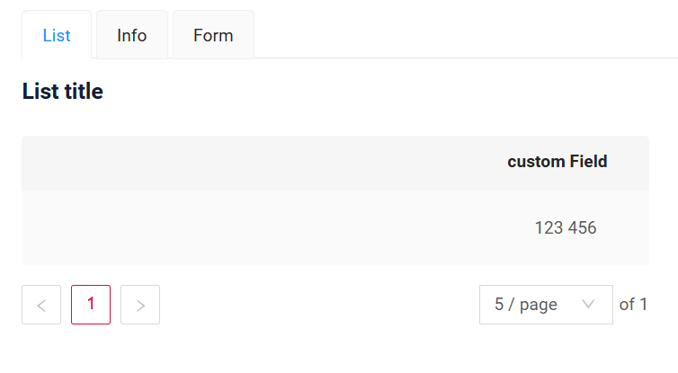  
=== "money"  
    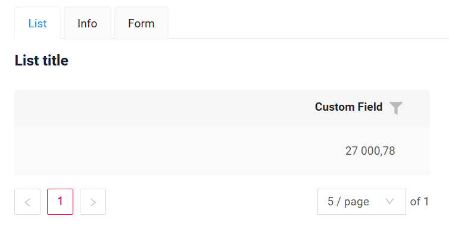  
=== "percent"
    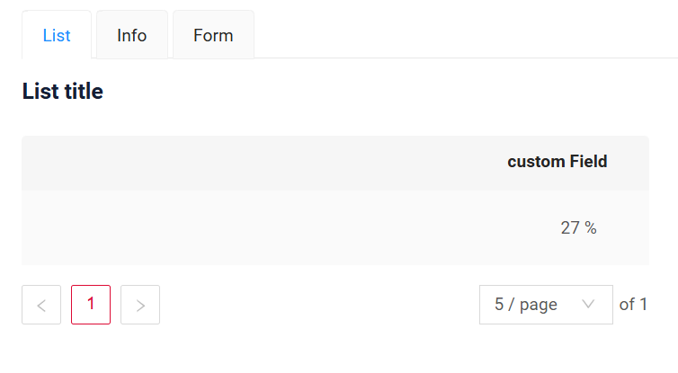  

#### Added: [Form](/form/), [Info](/info/) widgets - improved field alignment  

We have improved the layout logic for fields in [Form](/form/) and multi-column [Info](/info/) (with [titleMode: top](https://doc.cxbox.org/new/version207/?h=titlemode#added-info-widget-field-title-mode)) widgets. The row layout remains consistently aligned, regardless of whether the fields include labels or not.  

=== "All with labels"
    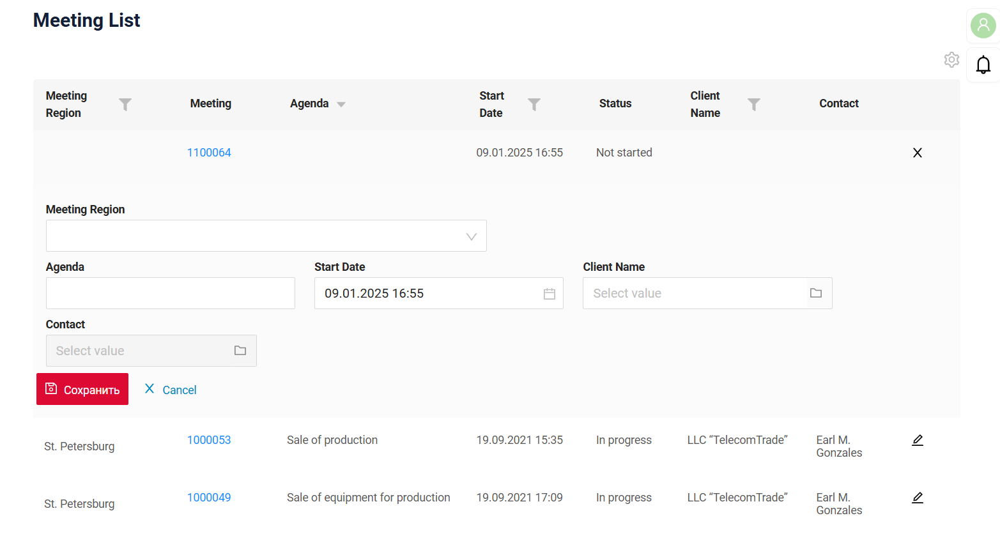  
=== "Some with labels"
    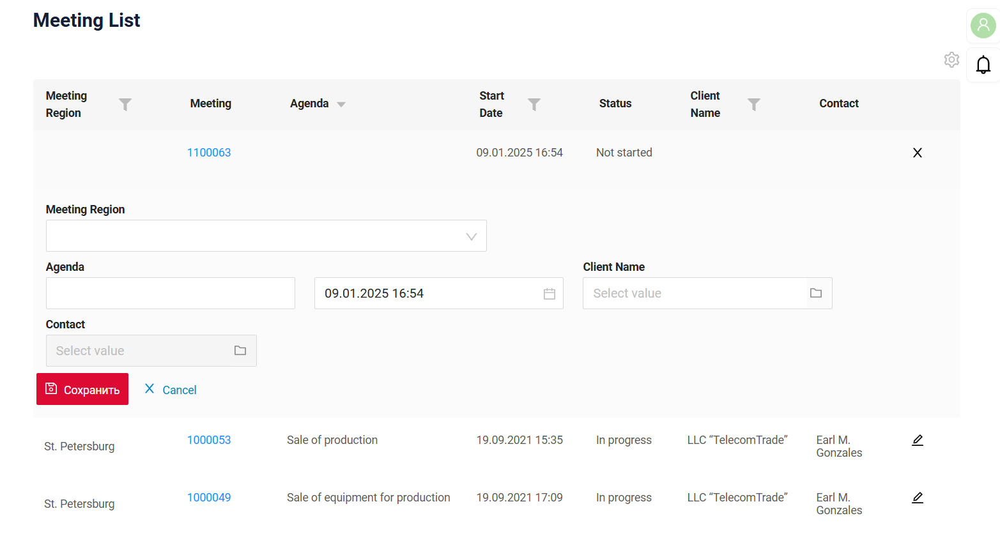  
=== "None with labels"  
      

#### Added: [fileUpload](/widget_field_fileUpload) field - case-insensitive file extension handling for file preview

We have implemented case-insensitive validation for file extensions to ensure accurate file type representations in previews. Whether the extension is **.png** or **.PNG**, the preview icon will now correctly display the file type.  

=== "After"  
    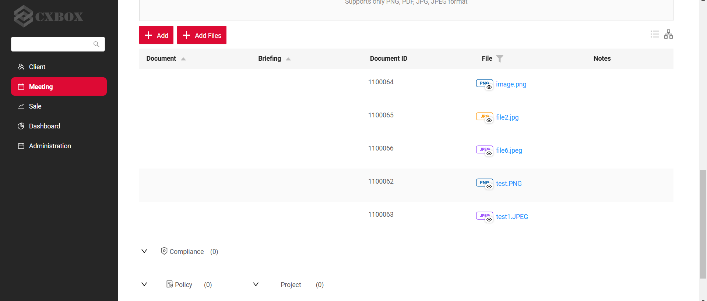
=== "Before"
    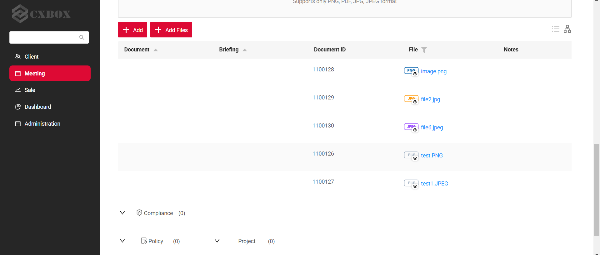  

#### Added: [List widget](/list/) - constant funnel size for all fields  

Now, the funnel size remains the same regardless of the type of the filtered field.  

=== "After" 
    
=== "Before"
    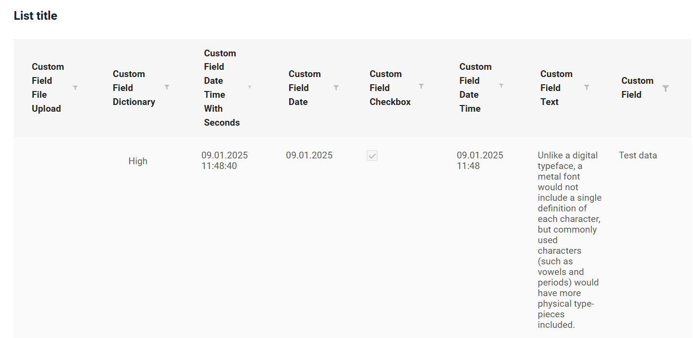  

#### Other Changes
see [cxbox-demo changelog](https://github.com/CX-Box/cxbox-demo/releases/tag/v.2.0.10)

### CXBOX ([Core Ui](https://github.com/CX-Box/cxbox-ui/releases/tag/2.4.3))

We have released a new CORE UI version (2.4.3).

#### Other Changes
see [cxbox-ui changelog](https://github.com/CX-Box/cxbox-ui/releases/tag/2.4.3)  

<!--### CXBOX [plugin](https://plugins.jetbrains.com/plugin/19523-platform-tools)

We've updated the plugin to version 1.7.8! New version of Plugin is currently being reviewed by JetBrains and will be available in a few business days.

#### Added: inspection for field references with `-FieldKey` postfix (`options` section)   

The plugin now supports autocomplete, reference and inspections for field references in the `options` section of a `widget.json` file. To enable this functionality, ensure that fields in the options are named using the `-FieldKey` postfix (or simply named `fieldKey`). The plugin will link these fields to the fields array at the beginning of a widget.json file and, thus, ensure accurate references.  

=== "Autocomplete"  
    
=== "Reference"  
    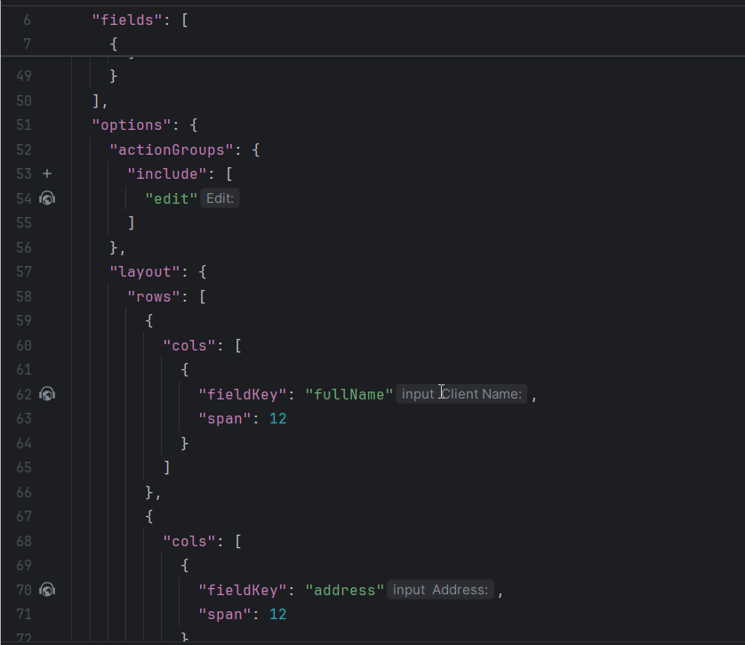
=== "Inspection"  
    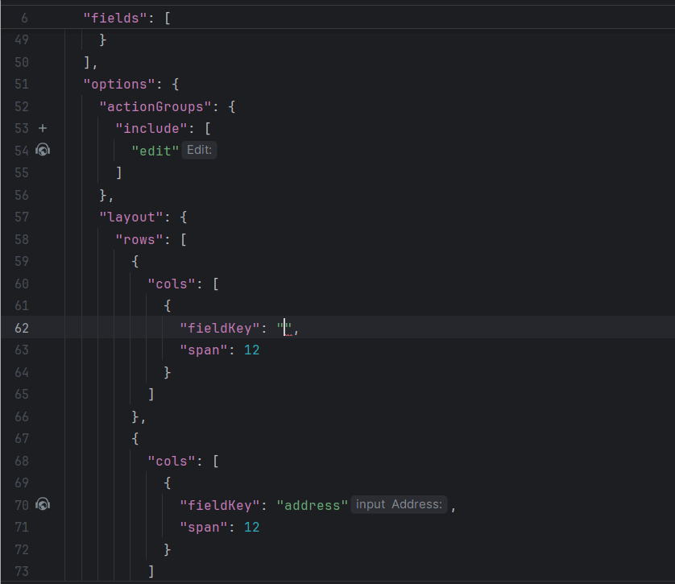  
-->

### CXBOX [documentation](https://doc.cxbox.org/)

#### Added: [AdditionalList](https://doc.cxbox.org/widget/type/additionallist/additionallist.md/)
We have provided a detailed description of AdditionalList widget.  

### CXBOX [plugin](https://plugins.jetbrains.com/plugin/19523-platform-tools)
#### Added: @SearchParameter - improved handling for unresolved entities

We have improved the plugin's behavior when the Entity specified in the annotation cannot be resolved.

Now, if the Entity cannot be resolved, the plugin will:

#####  Inspection
Highlight the class name in yellow (Warning) with the message "Entity not found."

##### Quick-fix suggestion
Quick-fix suggestion to specify the Entity path explicitly in a comment.
Example comment: //@entity:<fully qualified path to entity>.

#### Inspection for field references with -FieldKey postfix (options section).
 
The plugin now supports autocomplete, reference and inspections for field references in the options section of a widget.json file. To enable this functionality, ensure that fields in the options are named using the -FieldKey postfix (or simply named fieldKey). The plugin will link these fields to the fields array at the beginning of a widget.json file and, thus, ensure accurate references.

=== "Autocomplete"
    
=== "Reference"
    
=== "Inspection"
    

#### Added: Adding **MultipleSelect** field for Enum stored in Entity as Set<>
Adding **MultipleSelect** field now utilizes a new method for `buildRowDependentMeta`.
 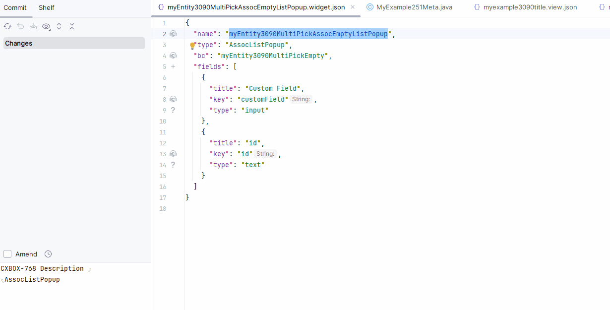