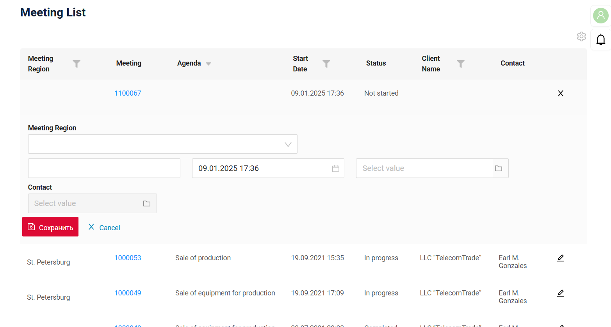

# 2.0.10

* [cxbox/demo 2.0.10 git](https://github.com/CX-Box/cxbox-demo/tree/v.2.0.10), [release notes](https://github.com/CX-Box/cxbox-demo/releases/tag/v.2.0.10)

* [cxbox-ui/core 2.4.3 git](https://github.com/CX-Box/cxbox-ui/tree/2.4.3), [release notes](https://github.com/CX-Box/cxbox-ui/releases/tag/2.4.3), [npm](https://www.npmjs.com/package/@cxbox-ui/core/v/2.4.3)

* [cxbox/code-samples 2.0.10 git](https://github.com/CX-Box/cxbox-code-samples/tree/v.2.0.10), [release notes](https://github.com/CX-Box/cxbox-code-samples/releases/tag/v.2.0.10)

## **Key updates December 2024, January 2025**

### CXBOX ([Demo](http://demo.cxbox.org))  

#### Added: [List widget](/list/) - alignment of numeric field types  

We have adjusted the alignment for numeric field types ([number](/widget_field_number), [money](/widget_field_money), [percent](/widget_field_percent)) in [List widget](/list/) to be right-aligned. Both headers and content are now consistently aligned to the right.  

=== "number"  
      
=== "money"  
      
=== "percent"
      

#### Added: [Form](/form/), [Info](/info/) widgets - improved field alignment  

We have improved the layout logic for fields in [Form](/form/) and multi-column [Info](/info/) (with [titleMode: top](https://doc.cxbox.org/new/version207/?h=titlemode#added-info-widget-field-title-mode)) widgets. The row layout remains consistently aligned, regardless of whether the fields include labels or not.  

=== "All with labels"
      
=== "Some with labels"
      
=== "None with labels"  
      

#### Added: [fileUpload](/widget_field_fileUpload) field - case-insensitive file extension handling for file preview

We have implemented case-insensitive validation for file extensions to ensure accurate file type representations in previews. Whether the extension is **.png** or **.PNG**, the preview icon will now correctly display the file type.  

=== "After"  
    
=== "Before"
      

#### Added: [List widget](/list/) - constant funnel size for all fields  

Now, the funnel size remains the same regardless of the type of the filtered field.  

=== "After" 
    
=== "Before"
      

#### Other Changes
see [cxbox-demo changelog](https://github.com/CX-Box/cxbox-demo/releases/tag/v.2.0.10)

### CXBOX ([Core Ui](https://github.com/CX-Box/cxbox-ui/releases/tag/2.4.3))

We have released a new CORE UI version (2.4.3).

#### Other Changes
see [cxbox-ui changelog](https://github.com/CX-Box/cxbox-ui/releases/tag/2.4.3)  

### CXBOX [documentation](https://doc.cxbox.org/)

#### Added: [AdditionalList](https://doc.cxbox.org/widget/type/additionallist/additionallist/)
We have provided a detailed descriptions of Additional List widget.  

