# 2.0.11

* [cxbox/demo 2.0.11 git](https://github.com/CX-Box/cxbox-demo/tree/v.2.0.11), [release notes](https://github.com/CX-Box/cxbox-demo/releases/tag/v.2.0.11)

* [cxbox/core 4.0.0-M15 git](https://github.com/CX-Box/cxbox/tree/cxbox-4.0.0-M15), [release notes](https://github.com/CX-Box/cxbox/releases/tag/cxbox-4.0.0-M15), [maven](https://central.sonatype.com/artifact/org.cxbox/cxbox-starter-parent/4.0.0-M15)

* [cxbox-ui/core 2.5.0 git](https://github.com/CX-Box/cxbox-ui/tree/2.5.0), [release notes](https://github.com/CX-Box/cxbox-ui/releases/tag/2.5.0), [npm](https://www.npmjs.com/package/@cxbox-ui/core/v/2.5.0)

* [cxbox/code-samples 2.0.11 git](https://github.com/CX-Box/cxbox-code-samples/tree/v.2.0.11), [release notes](https://github.com/CX-Box/cxbox-code-samples/releases/tag/v.2.0.11)


## **Key updates January, February 2025**

### CXBOX ([Demo](http://demo.cxbox.org))

#### Added: [GroupingHierarchy](https://doc.cxbox.org/widget/type/groupinghierarchy/groupinghierarchy/) widget - support for aggregate rows 

We have added aggregate rows to display the aggregates on hierarchy levels. You can configure in `widget.json -> options -> groupMode: compact/ aggregate`.      
 
=== "aggregate"  
    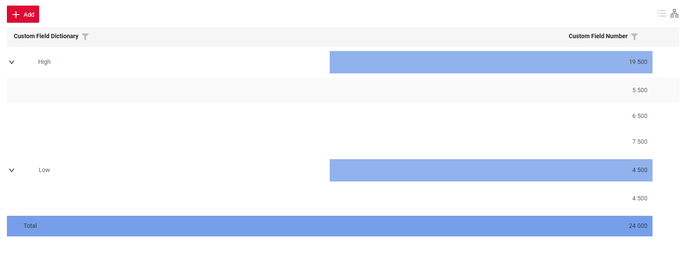{width="700"}  
    With `groupMode: aggregate` the widget displays **aggregate rows** at the grouping field level.  
    With this mode you can:  
    1) Define the columns to display aggregate values in  
    2) Specify at which hierarchy levels aggregates should appear  
    3) Select an aggregation function for calculations. Currently, we support standard functions: sum, min, max, avg.  
    4) Configure which columns will be used for aggregation calculations, including values from other columns.  
    !!! info  
        We will soon provide a detailed description of Aggregate mode in the updated `GroupingHierarchy` article ([Aggregate](http://localhost:8000/widget/type/groupinghierarchy/groupinghierarchy/#aggregate) section) 
=== "compact (default)"
    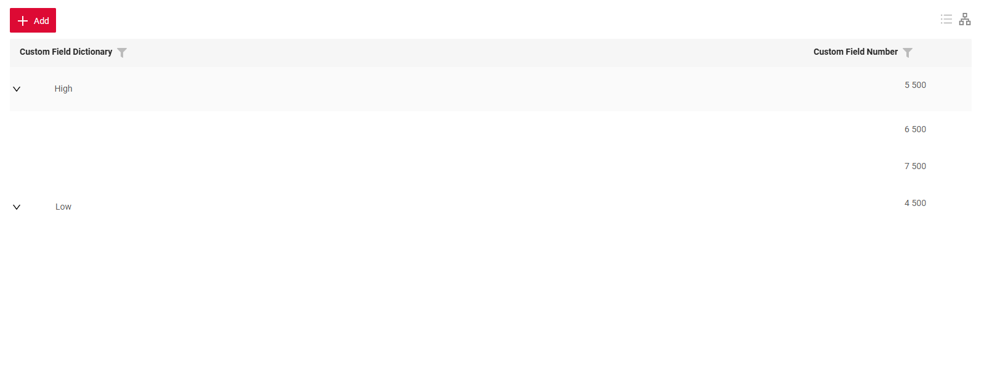{width="700"}  
    With `groupMode: compact` the widget appears in a compact view, where grouping fields and their content are displayed **on the same row**.  

#### Added: [waitUntil and drillDownAndWaitUntil PostAction](https://doc.cxbox.org/features/element/actions/postaction/drilldownandwaituntil/ddandwaituntil/)

**waitUntil**

This mechanism allows the program to wait until a certain condition is met. For example, "Wait until the task status becomes 'Done'."

This is useful when you have long-running operations (e.g., waiting for a response from a third-party system), and you want the user to see what’s happening and know when everything is finished.

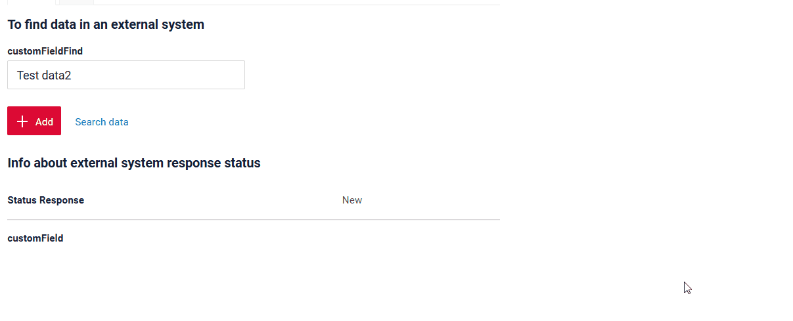

**drillDownAndWaitUntil**

This is a mechanism that allows the program to navigate to another screen  and then wait until a specific condition is met.
For example, "Go to this screen, wait until the status becomes 'Done', and show the user what’s happening."

This is helpful in scenarios where you need to navigate to another screen (e.g., to view details or results).

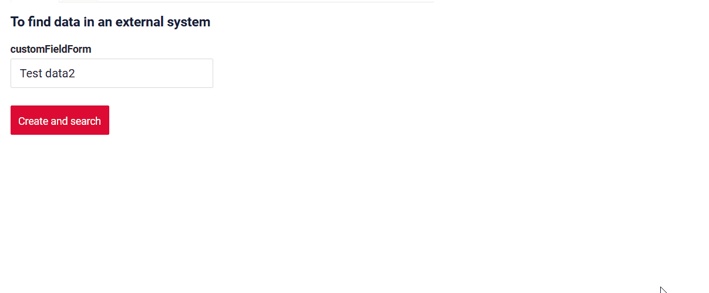

#### Added: Pie1D widget - New widget type!  

We have added a new widget type `Pie1D` to display data in a circular format.  

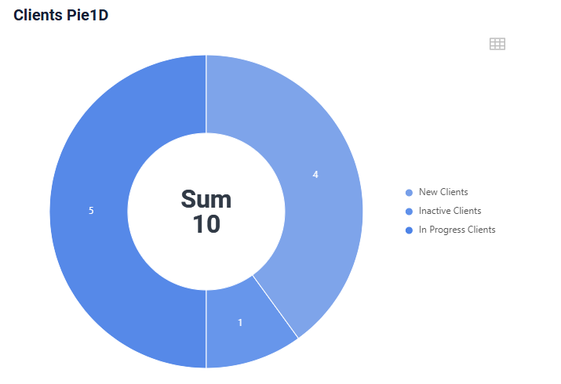

Key features include:

* Inner radius control
* Tooltips' display  
* Legend display  
* Center text/aggregate display  

Functionality includes:    

=== "Drilldown"  
    Click on a segment to drilldown to the filtered data displayed in a table.  
    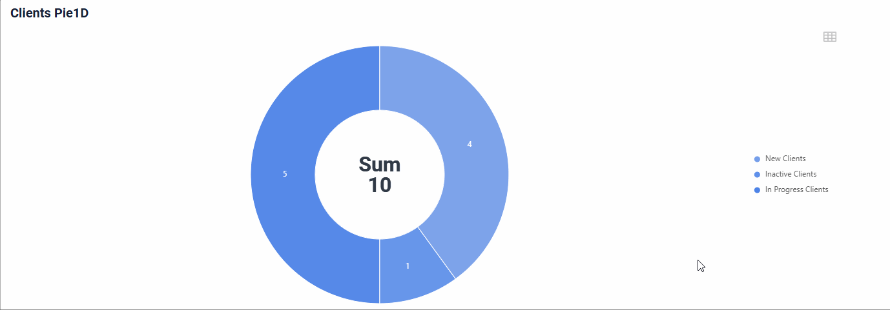
=== "Switch mode"  
    Switch from chart mode to table mode to view data in a tabular format.  
    
=== "Segment interaction"  
    Click on legend values to add or remove segments from the chart. The aggregate value in the center of the chart will be recalculated as you interact with the legend values.
      

#### Added: Column2D widget - New widget type!  

We have introduced a new widget type `Column2D` to display data using X and Y axes.  

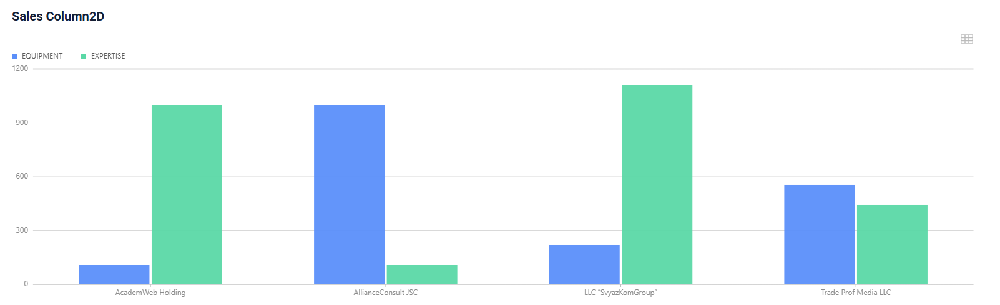

Key features include:    

* Axes' scale/ step control
* Grouped bars' display
* Tooltips' display

Functionality includes:  

=== "Drilldown"  
    Click on xAxis values to drilldown to the filtered data displayed in a table.   
    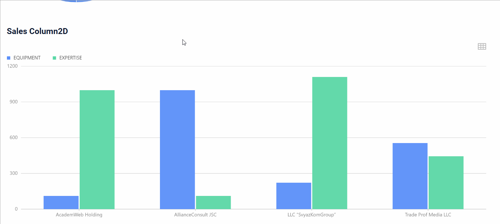
=== "Switch mode"  
    Switch from column mode to table mode to view data in a tabular format.  
    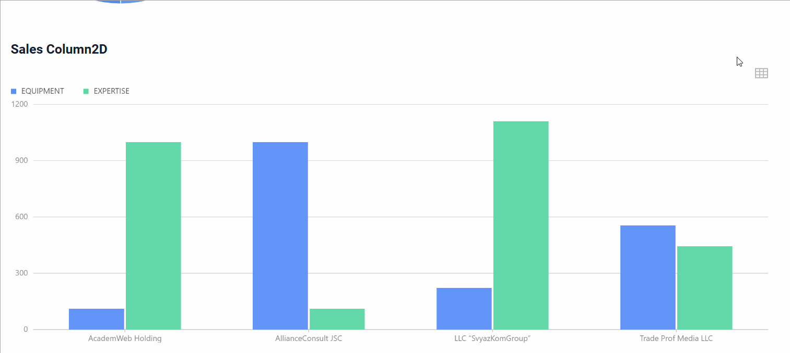
=== "Segment interaction"  
    Click on legend values to add or remove bars from the plot.  
    

#### Added: [AssocListPopup](https://doc.cxbox.org/widget/type/assoclistpopup/assoclistpopup/) widget - support for creating a row  

Now, you can create a new row directly in the `AssocListPopup`. When you click the Add button, a new row appears inside the popup, allowing you to enter data and immediately select it as a value for a field.  
=== "After"  
    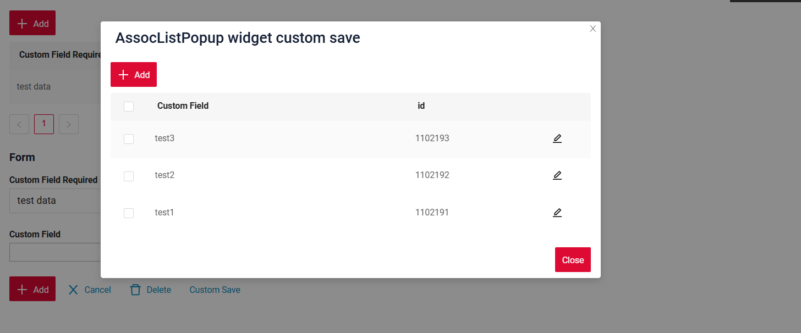
=== "Before"  
    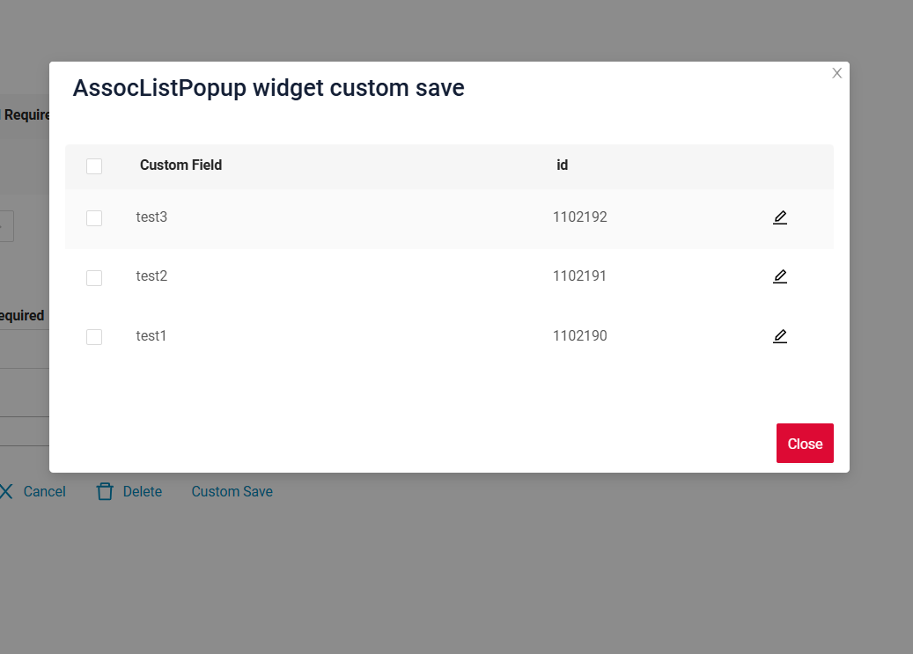  

#### Added: [Info](/info/) widget - consistent field highlighting  

We have improved the logic of field highlighting in the [Info](/info/) widget. Hidden fields are not highlighted at all.  
For visible fields, a line is added above and below, except:  

* The first row (no line on top)  
* The last row (no line at the bottom)

=== "After"  
    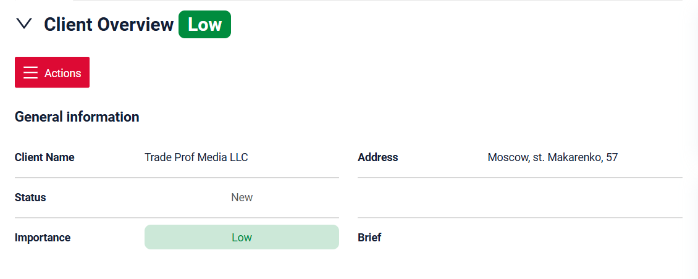
=== "Before"  
      

#### Added: [inlinePickList](https://doc.cxbox.org/widget/fields/field/inlinePickList/inlinePickList/) field - restrictions in [FormPopup](/form/) widget  

We have added a restriction for the [inlinePickList](https://doc.cxbox.org/widget/fields/field/inlinePickList/inlinePickList/) field in [FormPopup](/form/) to prevent opening a popup within a popup, as this functionality is not supported. The folder icon has been removed, so the popup can no longer be triggered. All the available values will be displayed in the dropdown list.    

!!! info  
    We recommend to use InlinePickList (and to avoid pickList) in FormPopup, as inlinePickList displays values in the dropdown list, while the popup functionality for pickList will not work due to the restriction.  

=== "After"  
    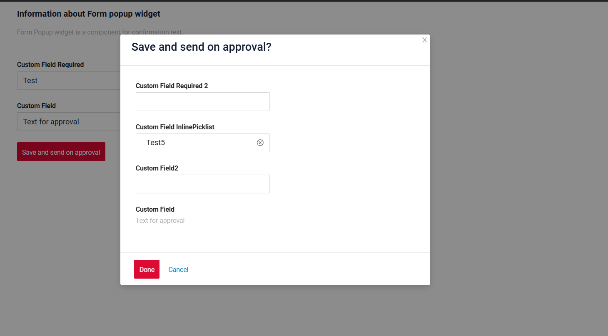  
=== "Before"
    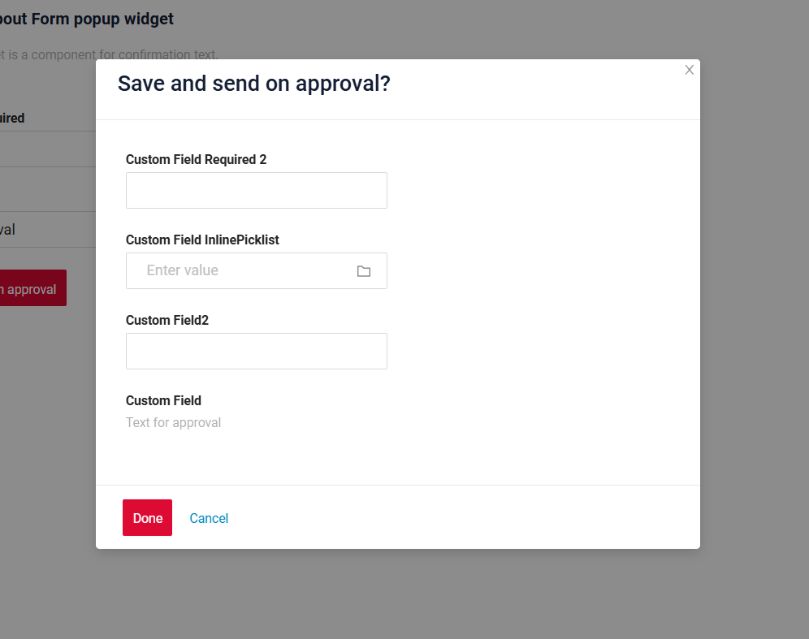  

#### Added: [FormPopup](/form/) widget - improved required fields' handling  

We have updated the logic for checking required fields when they are present in the FormPopup: the required fields in the FormPopup and on the main form are now validated separately.  

#### Added: SIEM
* Added login system logging.
```
INFO o.d.c.c.extension.siem.SecurityLogger: SIEM event. Operation: login, endpoint (resource): /login, user: DEMO (CXBOX_USER,BUSINESS_ADMIN), session: F2DBA42C1BAED2599339101D5FA3280F, ipAddress: 0:0:0:0:0:0:0:1, data: 1100057 
```

* For  `invoke`  events, log the action name.
``` 
INFO o.d.c.c.extension.siem.SecurityLogger : SIEM event. Operation: INVOKE.sendEmailNextDay, endpoint (resource): meeting (1100062), user: DEMO (CXBOX_USER,BUSINESS_ADMIN), session: F2DBA42C1BAED2599339101D5FA3280F, ipAddress: 0:0:0:0:0:0:0:1, data: null
```

* Log access `Responsibility View` и `Responsibility Action` changes in SIEM (with WARN level).
```
WARN o.d.c.c.extension.siem.SecurityLogger    : SIEM event. Operation: UPDATE, endpoint (resource): responsibilities (1100342), user: DEMO (CXBOX_USER,BUSINESS_ADMIN), session: F2DBA42C1BAED2599339101D5FA3280F, ipAddress: 0:0:0:0:0:0:0:1, data: {"id":"1100342","vstamp":1,"internalRoleCD":"BUSINESS_ADMIN","view":"meetingview","viewWidgets":[{"id":"meetingViewButtons","value":"'/api/v1/../meeting' by widget 'meetingViewButtons'","options":{}},{"id":"meetingEditViewHeader","value":"'/api/v1/../meetingEdit' by widget 'meetingEditViewHeader'","options":{}},{"id":"meetingDocumentsFormForList","value":"'/api/v1/../meetingDocumentEdit' by widget 'meetingDocumentsFormForList'","options":{}},{"id":"meetingView","value":"'/api/v1/../meeting' by widget 'meetingView'","options":{}},{"id":"meetingDocumentsList","value":"'/api/v1/../meetingDocumentEdit' by widget 'meetingDocumentsList'","options":{}},{"id":"meetingViewClientInfo","value":"'/api/v1/../meeting' by widget 'meetingViewClientInfo'","options":{}},{"id":"SecondLevelMenu","value":"'/api/v1/../null' by widget 'SecondLevelMenu'","options":{}},{"id":"meetingViewResult","value":"'/api/v1/../meeting' by widget 'meetingViewResult'","options":{}}]}
```

In the project code, in SiemCrudmaEventListener, you can **customize the settings**:

* Configure log only the IDs:
 ``` public static final boolean SIEM_CONFIG_LOG_DATA_ID_ONLY = false;```

* Configure which CRUD-MA actions to log:
``` 
public static final Map<CrudmaActionType, Boolean> SIEM_CONFIG_LOG_CRUDMA_ACTION_TYPES = Map.of(
  CrudmaActionType.INVOKE, true,
  CrudmaActionType.FIND, true,
  CrudmaActionType.GET, true,
  CrudmaActionType.UPDATE, true,
  CrudmaActionType.PREVIEW, false,
  CrudmaActionType.DELETE, true,
  CrudmaActionType.COUNT, false,
  CrudmaActionType.ASSOCIATE, true,
  CrudmaActionType.META, false,
  CrudmaActionType.CREATE, true
  );
```

* Configure which BC + CRUD-MA pairs to log with a WARN level (by default, it is set for administration screens: responsibility and action responsibility):
```
public static final Map<EnumBcIdentifier, List<CrudmaActionType>> SIEM_CONFIG_LOG_LEVEL_WARN = Map.of(
    CxboxRestController.responsibilities,
    Arrays.stream(CrudmaActionType.values()).filter(e -> !e.isReadOnly()).toList(),
    CxboxRestController.responsibilitiesAction,
    Arrays.stream(CrudmaActionType.values()).filter(e -> !e.isReadOnly()).toList()
);
```
#### Fixed: [dictionary](/dictionary/) field - filtering logic   

We have improved the filtering logic for Dictionary fields. Now, when all selected values are unchecked and Apply is clicked, the filter is properly cleared, and all data is displayed without requiring an additional Clear Filter action.  

#### Fixed: consistent handling of field keys  

We have updated the logic for processing field keys. Previously, `widget.json -> fields -> key: number` would lead to errors in data handling on the frontend, because the "key" value was misinterpreted as a custom type. Now, the new logic prevents errors and guarantees proper interpretation of fields.  

#### Other Changes
see [cxbox-demo changelog](https://github.com/CX-Box/cxbox-demo/releases/tag/v.2.0.11)

### CXBOX ([Core Ui](https://github.com/CX-Box/cxbox-ui/releases/tag/2.5.0))

We have released a new CORE UI version (2.5.0).

#### Other Changes
see [cxbox-ui changelog](https://github.com/CX-Box/cxbox-ui/releases/tag/2.5.0)

### CXBOX 4.0.0-M15 ([Core](https://github.com/CX-Box/cxbox/tree/cxbox-4.0.0-M15))  

#### Added: @RequiredArgsConstructor  
Use Lombok’s @RequiredArgsConstructor and @Getter (meta,dao) for AnySourceVersionAwareResponseService and  @Getter (meta) VersionAwareResponseService instead of explicitly writing a constructor.
This makes the code cleaner and reduces boilerplate.

=== "After"

    ```java
    @SuppressWarnings({"java:S1170"})
    @Service
    @RequiredArgsConstructor
    public class ResponsibilitiesActionAdminService extends
    VersionAwareResponseService<ResponsibilitiesActionAdminDTO, ResponsibilitiesAction> {
 
        private final MetaAdminServiceExt metaAdminServiceExt;
    
        private final JpaDao jpaDao;
    
        private final CxboxFileService cxboxFileService;
    
        @Getter(onMethod_ = @Override)
        private final Class<ResponsibilitiesActionAdminMeta> meta = ResponsibilitiesActionAdminMeta.class;

    ```
=== "Before"

    ```java
    @Service
    public class ResponsibilitiesActionAdminService extends
    VersionAwareResponseService<ResponsibilitiesActionAdminDTO, ResponsibilitiesAction> {
    
        private final MetaAdminServiceExt metaAdminServiceExt;
    
        private final JpaDao jpaDao;
    
        private final CxboxFileService cxboxFileService;
    
        public ResponsibilitiesActionAdminService(MetaAdminServiceExt metaAdminServiceExt, JpaDao jpaDao,
                CxboxFileService cxboxFileService) {
            super(
                    ResponsibilitiesActionAdminDTO.class,
                    ResponsibilitiesAction.class,
                    null,
                    ResponsibilitiesActionAdminMeta.class
            );
            this.metaAdminServiceExt = metaAdminServiceExt;
            this.jpaDao = jpaDao;
            this.cxboxFileService = cxboxFileService;
        }

    ```
#### Other Changes
We have released two CORE versions! See [cxbox 4.0.0-M14 changelog](https://github.com/CX-Box/cxbox/releases/tag/cxbox-4.0.0-M14) and [cxbox 4.0.0-M15 changelog](https://github.com/CX-Box/cxbox/releases/tag/cxbox-4.0.0-M15).  

### CXBOX [documentation](https://doc.cxbox.org/)

#### Added: [waitUntil and drillDownAndWaitUntil](https://doc.cxbox.org/features/element/actions/postaction/drilldownandwaituntil/ddandwaituntil/)  

We have added a full description of waitUntil and drillDownAndWaitUntil postActions  

#### Added: [pickListPopup](https://doc.cxbox.org/widget/type/picklistpopup/picklistpopup/) widget - standard actions and additional properties description  

We have provided a full description of [pickListPopup](https://doc.cxbox.org/widget/type/picklistpopup/picklistpopup/) widget's [standard actions](https://doc.cxbox.org/widget/type/picklistpopup/picklistpopup/#standard-actions) and [additional properties](https://doc.cxbox.org/widget/type/picklistpopup/picklistpopup/#additional-properties). 

#### Added: [assocListPopup](https://doc.cxbox.org/widget/type/assoclistpopup/assoclistpopup/) widget - standard actions and additional properties description

We have provided a full description of [assocListPopup](https://doc.cxbox.org/widget/type/assoclistpopup/assoclistpopup/) widget's [standard actions](https://doc.cxbox.org/widget/type/assoclistpopup/assoclistpopup/#actions) and [additional properties](https://doc.cxbox.org/widget/type/assoclistpopup/assoclistpopup/#additional-properties). 

#### Added: [filtration](https://doc.cxbox.org/widget/type/property/filtration/filtration/) - [by personal filter group](https://doc.cxbox.org/widget/type/property/filtration/filtration/#by-personal-filter-group)  

We have added a description of filtration [by personal filter group](https://doc.cxbox.org/widget/type/property/filtration/filtration/#by-personal-filter-group). 

#### Added: [sorting](https://doc.cxbox.org/widget/type/property/sorting/sorting/) - field level  

We have updated the [sorting](https://doc.cxbox.org/widget/type/property/sorting/sorting/) article with the information on fields' sorting.  

#### Added: [multipleSelect](https://doc.cxbox.org/widget/fields/field/multipleSelect/multipleSelect/) field - method update  

We have updated the article on [multipleSelect](https://doc.cxbox.org/widget/fields/field/multipleSelect/multipleSelect/) field and provided the information on `setConcreteValues` method.  

