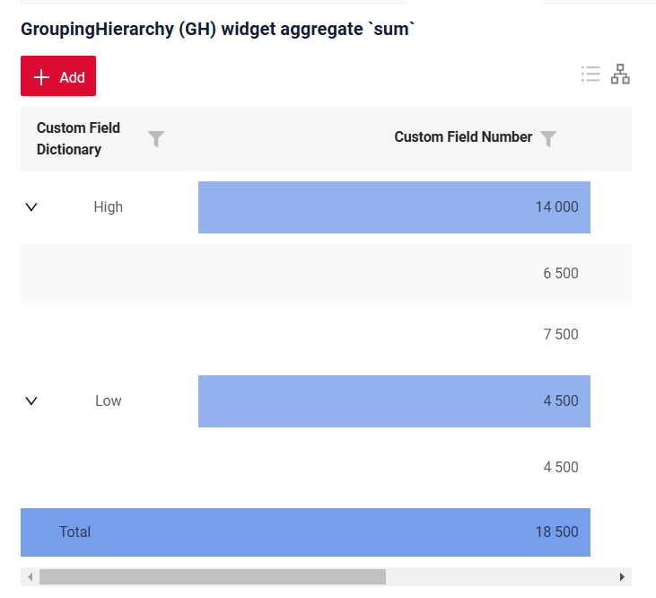
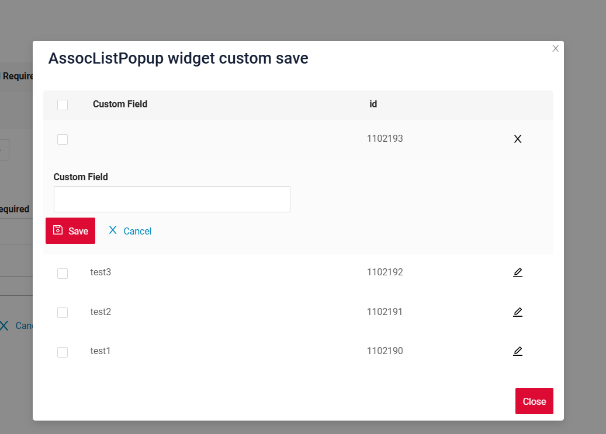
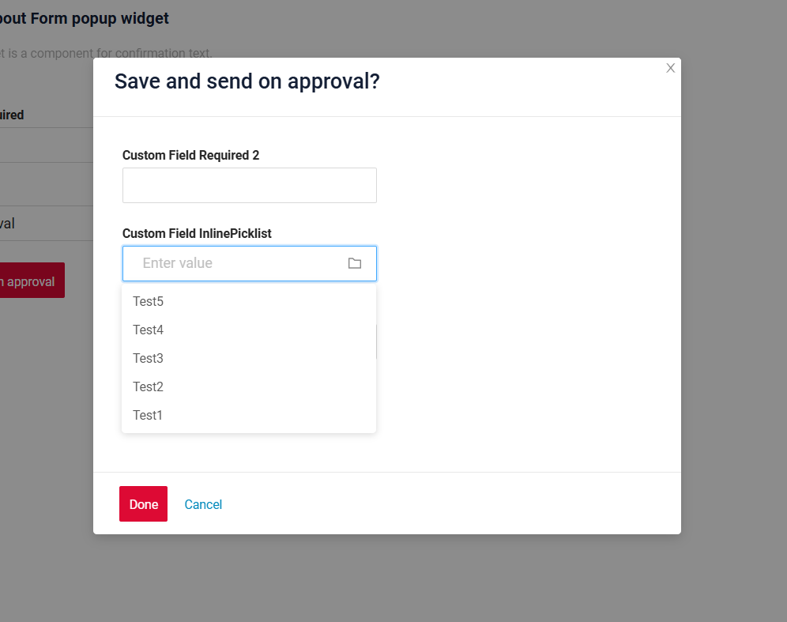

# 2.0.11

* [cxbox/demo 2.0.11 git](https://github.com/CX-Box/cxbox-demo/tree/v.2.0.11), [release notes](https://github.com/CX-Box/cxbox-demo/releases/tag/v.2.0.11)

* [cxbox/core 4.0.0-M14 git](https://github.com/CX-Box/cxbox/tree/cxbox-4.0.0-M14), [release notes](https://github.com/CX-Box/cxbox/releases/tag/cxbox-4.0.0-M14), [maven](https://central.sonatype.com/artifact/org.cxbox/cxbox-starter-parent/4.0.0-M14)

* [cxbox-ui/core 2.5.0 git](https://github.com/CX-Box/cxbox-ui/tree/2.5.0), [release notes](https://github.com/CX-Box/cxbox-ui/releases/tag/2.5.0), [npm](https://www.npmjs.com/package/@cxbox-ui/core/v/2.5.0)

* [cxbox/code-samples 2.0.11 git](https://github.com/CX-Box/cxbox-code-samples/tree/v.2.0.11), [release notes](https://github.com/CX-Box/cxbox-code-samples/releases/tag/v.2.0.11)

## **Key updates January, February 2025**

### CXBOX ([Demo](http://demo.cxbox.org))

#### Added: [GroupingHierarchy](https://doc.cxbox.org/widget/type/groupinghierarchy/groupinghierarchy/) widget - support for aggregate rows 

We have added aggregate rows to display the aggregates on hierarchy levels. You can configure it with the `groupMode: compact/ aggregate` setting.      

=== "compact (default)"
      
    With `groupMode: compact` the widget appears in a compact view, where grouping fields and their content are displayed **on the same row**.  
=== "aggregate"  
      
    With `groupMode: aggregate` the widget displays **aggregate rows** at the grouping field level.  
    With this mode you can:  
    1) Define the columns to display aggregate values in  
    2) Specify at which hierarchy levels aggregates should appear  
    3) Select an aggregation function for calculations. Currently, we support standard functions: sum, min, max, avg.  
    4) Configure which columns will be used for aggregation calculations, including values from other columns.  
    !!! info  
        To apply aggregates to all levels, use the `aggFields` parameter. To apply aggregation to specific levels, use `aggLevels` and explicitly define the target levels.  

#### Added: Pie1D widget - New widget type!  

We have added a new widget type `Pie1D` to display data in a circular format.  

Key features include:  

=== "Tooltip (descriptionFieldKey)"
    === "Default"  
    === "Custom"  
=== "Inner radius control (innerSpace)"
    === "0.5 (default)"  
    === "0"  
=== "Legend (titleFieldKey)"
    === "With legend"  
    === "No legend"  
=== "Center (total)"
    === "Text (value)"  
    === "Aggregate (func)"  

Functionality includes:    

=== "Drilldown"  
    Click on a segment to drilldown to the filtered data displayed in a table.  
=== "Mode switch"  
    Switch from chart mode to table mode to view data in a tabular format.  
=== "Segment interaction"  
    Click on legend values to add or remove segments from the chart. The aggregate value in the center of the chart will be recalculated as you interact with the legend values.

#### Added: Column2D widget - New widget type!  

We have introduced a new widget type `Column2D` to display data using X and Y axes.  

Key features include:    

=== "Tooltip (descriptionFieldKey)"  
    === "Default"  
    === "Custom"  
=== "Grouped bars (groupFieldKey)"  
    === "No group bars (only 2 parameters)"  
    === "With group bars (3 parameters for separation within each category)"  
=== "Grouped bars' mode (stack)"
    === "stack: false (default)"  
        Bars are displayed separately.  
    === "stack: true"  
        Bars are stacked.  
=== "Axis Scale (xMin/xMax/yMin/yMax)"  
    === "default"  
    === "custom"  
=== "Step size (xStep/yStep)"  
    === "default"  
    === "custom"  

Functionality includes:  

=== "Drilldown"  
    Click on xAxis values to drilldown to the filtered data displayed in a table.    
=== "Mode switch"  
    Switch from column mode to table mode to view data in a tabular format.  

#### Added: [AssocListPopup](https://doc.cxbox.org/widget/type/assoclistpopup/assoclistpopup/) widget - support for creating a row  

Now, you can create a new row directly in the `AssocListPopup`. When you click the Add button, a new row appears inside the popup, allowing you to enter data and immediately select it as a value for a field.  
=== "After"  
    
=== "Before"  
      

#### Added: [Info](/info/) widget - consistent field highlighting  

We have improved the logic of field highlighting in the [Info](/info/) widget. Hidden fields are not highlighted at all.  
For visible fields, a line is added above and below, except:  

* The first row (no line on top)  
* The last row (no line at the bottom)

=== "After"  
    
=== "Before"  
      

#### Added: [inlinePickList](https://doc.cxbox.org/widget/fields/field/inlinePickList/inlinePickList/) field - limitation in [FormPopup](/form/) widget  

We have added a restriction for the [inlinePickList](https://doc.cxbox.org/widget/fields/field/inlinePickList/inlinePickList/) field in [FormPopup](/form/) to prevent opening a popup within a popup, as this functionality is not supported. The folder icon has been removed, so the popup can no longer be triggered.  

!!! info  
    We recommend avoiding the use of InlinePickList in FormPopup, as the popup functionality will not work due to this limitation.  

=== "After"  
      
=== "Before"
      

#### Added: [FormPopup](/form/) widget - a new way of required fields' handling  

We have updated the logic for checking required fields when they are present in the FormPopup: the required fields in the FormPopup and on the main form are now validated separately.  

#### Added: SIEM  

<!-- TO DO >> Аня -->

#### Fixed: [dictionary](/dictionary/) field - filtering logic   

We have improved the filtering logic for Dictionary fields. Now, when all selected values are unchecked and Apply is clicked, the filter is properly cleared, and all data is displayed without requiring an additional Clear Filter action.  

#### Fixed: consistent handling of field keys  

We have updated the logic for processing field keys. Now, the "key" value in JSON is no longer matched against custom field type names. This prevents conflicts where a field was incorrectly interpreted as a custom type, which previously led to errors in rendering and data handling on the frontend.  

#### Other Changes
see [cxbox-demo changelog](https://github.com/CX-Box/cxbox-demo/releases/tag/v.2.0.11)

### CXBOX ([Core Ui](https://github.com/CX-Box/cxbox-ui/releases/tag/2.5.0))

We have released a new CORE UI version (2.5.0).

#### Other Changes
see [cxbox-ui changelog](https://github.com/CX-Box/cxbox-ui/releases/tag/2.5.0)

### CXBOX 4.0.0-M14 ([Core](https://github.com/CX-Box/cxbox/tree/cxbox-4.0.0-M14))  

#### Added: @RequiredArgsConstructor  

<!-- TODO>> Аня -->

#### Added: waitUntil and drillDownAndWaitUntil postActions

<!--TODO >> Аня -->

### CXBOX [documentation](https://doc.cxbox.org/)

#### Added: [waitUntil and drillDownAndWaitUntil](https://doc.cxbox.org/features/element/actions/postaction/drilldownandwaituntil/ddandwaituntil/)  

We have added a full description of waitUntil and drillDownAndWaitUntil postActions  

#### Added: [pickListPopup](https://doc.cxbox.org/widget/type/picklistpopup/picklistpopup/) widget - standard actions and additional properties description  

We have provided a full description of [pickListPopup](https://doc.cxbox.org/widget/type/picklistpopup/picklistpopup/) widget's [standard actions](https://doc.cxbox.org/widget/type/picklistpopup/picklistpopup/#standard-actions) and [additional properties](https://doc.cxbox.org/widget/type/picklistpopup/picklistpopup/#additional-properties). 

#### Added: [assocListPopup](https://doc.cxbox.org/widget/type/assoclistpopup/assoclistpopup/) widget - standard actions and additional properties description

We have provided a full description of [assocListPopup](https://doc.cxbox.org/widget/type/assoclistpopup/assoclistpopup/) widget's [standard actions](https://doc.cxbox.org/widget/type/assoclistpopup/assoclistpopup/#actions) and [additional properties](https://doc.cxbox.org/widget/type/assoclistpopup/assoclistpopup/#additional-properties). 

#### Added: [filtration](https://doc.cxbox.org/widget/type/property/filtration/filtration/) - [by personal filter group](https://doc.cxbox.org/widget/type/property/filtration/filtration/#by-personal-filter-group)  

We have added a description of filtration [by personal filter group](https://doc.cxbox.org/widget/type/property/filtration/filtration/#by-personal-filter-group). 

#### Added: [sorting](https://doc.cxbox.org/widget/type/property/sorting/sorting/) - field level  

We have updated the [sorting](https://doc.cxbox.org/widget/type/property/sorting/sorting/) article with the information on fields' sorting.  

#### Added: [multipleSelect](https://doc.cxbox.org/widget/fields/field/multipleSelect/multipleSelect/) field - method update  

We have updated the article on [multipleSelect](https://doc.cxbox.org/widget/fields/field/multipleSelect/multipleSelect/) field and provided the information on `setConcreteValues` method.  

