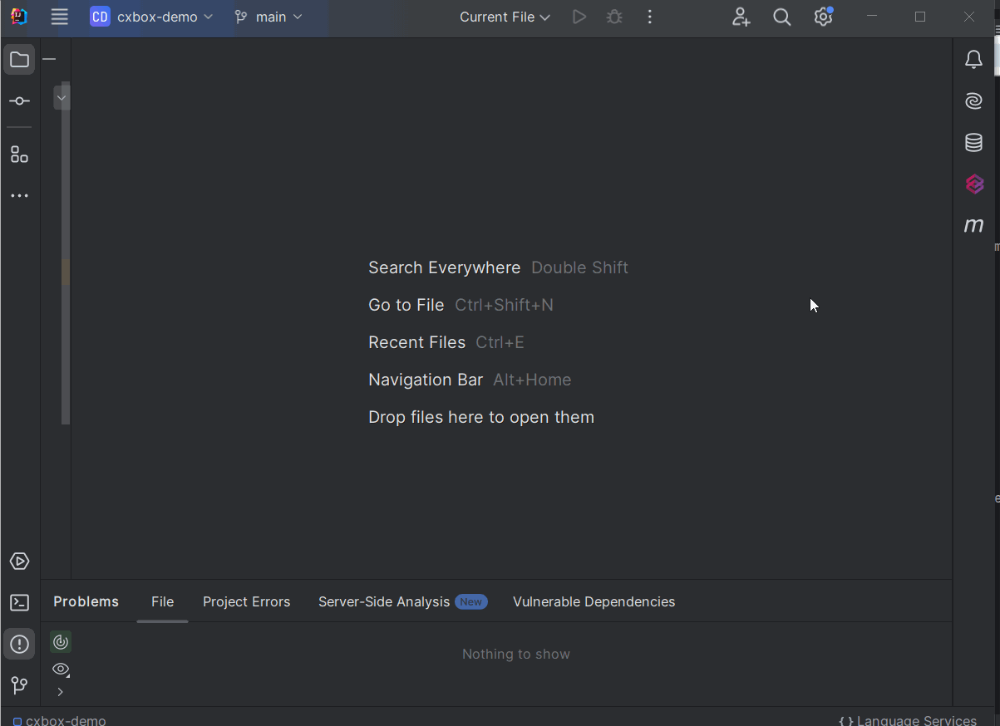

# 2.0.12

* [cxbox/demo 2.0.12 git](https://github.com/CX-Box/cxbox-demo/tree/v.2.0.12), [release notes](https://github.com/CX-Box/cxbox-demo/releases/tag/v.2.0.12)

* [cxbox/core 4.0.0-M16 git](https://github.com/CX-Box/cxbox/tree/cxbox-4.0.0-M16), [release notes](https://github.com/CX-Box/cxbox/releases/tag/cxbox-4.0.0-M16), [maven](https://central.sonatype.com/artifact/org.cxbox/cxbox-starter-parent/4.0.0-M16)

* [cxbox-ui/core 2.5.2 git](https://github.com/CX-Box/cxbox-ui/tree/2.5.2), [release notes](https://github.com/CX-Box/cxbox-ui/releases/tag/2.5.2), [npm](https://www.npmjs.com/package/@cxbox-ui/core/v/2.5.2)

* [cxbox/code-samples 2.0.12 git](https://github.com/CX-Box/cxbox-code-samples/tree/v.2.0.12), [release notes](https://github.com/CX-Box/cxbox-code-samples/releases/tag/v.2.0.12)  

* cxbox/intellij-plugin 1.7.9 - Available soon! New version of Plugin is currently being reviewed by JetBrains.  


## **Key updates February, March 2025**

### CXBOX ([Demo](http://demo.cxbox.org))

#### Added: Push Notifications - new display modes  

We have introduced three display modes for [WebSocket Push Notifications](https://doc.cxbox.org/features/element/notifications/push/websocket/): `single`, `stack`, and `column`.  

=== "Stack (default)"  
    Notifications appear separately, stacking on top of each other.  
    
=== "Column"  
    Notifications appear separately, aligned vertically in a column.  
      
=== "Single"  
    Each new notification replaces the previous one in a single area.  
      

You can configure `timeout` for all three modes. For `stack` and `column`, you can also set the maximum number of visible notifications and the display direction (`upward`/`downward`).  

#### Added: Line2D widget - New widget type!  

We have introduced a new widget type `Line2D` to display data using X and Y axes in a linear format.

{width="700"}

Key features include:

* Axis scale/ step control
* Grouped display
* Tooltip display

Functionality includes:

* Drilldown - click on xAxis values to drilldown to the filtered data displayed in a table.   
* Switch mode - switch from column mode to table mode to view data in a tabular format.  
* Segment interaction - click on legend values to add or remove lines from the plot.  

#### Added: DualAxes2D widget - New widget type!

We have introduced a new widget type `DualAxes2D` to display data from different types of charts in a single area. The charts share the same X axis, but can have separate Y axes. 
**Note!** DualAxes2D can only display 2D types of widgets (e.g. Line2D, Column2D). The features (tooltip and axis scale/step) for 2D widgets will apply to DualAxes2D automatically.

{width="700"}

Functionality includes:  

* Drilldown - click on yAxis values to drilldown to the filtered data displayed in a table.  
* Switch mode - switch from column mode to table mode to view data in a tabular format.  
* Segment interaction - click on legend values to add or remove lines/bars from the plot.  

#### Added: UI panel - display of application version and environment type  

We have added the ability to display the environment type and current application version in the UI panel for convenience. The text adapts depending on the menu state (`collapsed`/`expanded`) and shows a tooltip with more details. Background color customization for this section is also supported.  

=== "After"  
    
=== "Before"
    

#### Added: Push Notifications - long links support  

We have enhanced the display of long link labels for [Push Notifications](https://doc.cxbox.org/features/element/notifications/push/websocket/). Now, if the link label exceeds the width of the notification, the text automatically wraps to the next line, ensuring the full label is displayed correctly without being truncated. In addition, the *"and (N) more..."* text (in case there are several links) is also displayed correctly within the notification area.   

=== "After"
    {width="700"}
=== "Before"
    {width="700"}  

#### Added: suggestionPickList field - scrollbar support  

We have improved the suggestionPickList field by adding scrollbar support - you can now navigate long lists more easily using the scrollbar.  

=== "After"
    {width="700"}
=== "Before"
    {width="700"}  

#### Added: suggestionPickList field - changes in filtering method  

We have refined the filtering method for the suggestionPickList field. Previously, it required an exact match with the typed characters (`equals`). Now, the filtering logic is less strict, and displays all the results that contain the entered text (`contains`).  
=== "After"  
      
=== "Before"  
      

#### Added: dictionary field - improved layout for mode:icon  

We have removed the minimum width restriction for [Dictionary](https://doc.cxbox.org/widget/fields/field/dictionary/dictionary/) field with `mode: icon`. This allows the field to shrink dynamically while keeping the icon and value closer together, resulting in a more compact layout.  
=== "After"  
    {width="700"}   
=== "Before"  
    {width="700"}  

#### Added: GroupingHierarchy widget - validation for aggregate fields  

We have introduced a validation rule for aggregate fields in the [GroupingHierarchy](https://doc.cxbox.org/widget/type/groupinghierarchy/groupinghierarchy/) widget. Now, a field **cannot** be used both as a grouping field and as an aggregate field at the same time. If the same field is used both for  grouping and aggregation, the widget will prioritize grouping, and the aggregation function will be ignored.  

#### Fixed: FormPopup widget - forceActive update  

We have enhanced the forceActive feature for [FormPopup widget](https://doc.cxbox.org/widget/type/formpopup/formpopup/) to ensure that only a POST row-meta request is executed. This guarantees the most up-to-date information even when the entity is being edited, preventing data loss.  

#### Fixed: AssocListPopup - ignored scope for action buttons  

We have updated [AssocListPopup](https://doc.cxbox.org/widget/type/assoclistpopup/assoclistpopup/) to ignore `scope` for action buttons, which prevents unnecessary duplication. Previously, actions from the three-dot menu were duplicated as separate buttons at the top.  

#### Added: Draft Builder for Drilldowns with field filtration

A new Java Builder for generating [drillDowns with filter by fields](https://doc.cxbox.org/features/element/drilldown/drilldown/#to-view-with-fields-filtration) has been introduced:
=== "After"  
    ```java
    drillDownExt.filterBcByFields(
	    CxboxRestController.sale, SaleDTO.class, fb -> fb
	        .input(SaleDTO_.clientName, fields.getCurrentValue(DashboardSalesProductDTO_.clientName).orElse(null))
	        .dictionary(SaleDTO_.product, fields.getCurrentValue(DashboardSalesProductDTO_.productName).orElse(null))
	        .multiValue(SaleDTO_.fieldOfActivity, activity)
	);
    ```
=== "Before"  
    ```java
   	"?filters={\""
		+ CxboxRestController.sale + "\":\""
		+ URLEncoder.encode(SaleDTO_.clientName + "." + SearchOperation.CONTAINS.getOperationName() 
		+ "=" + fields.getCurrentValue(DashboardSalesProductDTO_.clientName).orElse(null), StandardCharsets.UTF_8)
		+ "&"
		+ URLEncoder.encode(SaleDTO_.product + "." +  SearchOperation.EQUALS_ONE_OF.getOperationName()
		+ "=[\\\"" + fields.getCurrentValue(DashboardSalesProductDTO_.productName).orElse(null) + "\\\"]", StandardCharsets.UTF_8)
		+ "&"
		+ URLEncoder.encode(SaleDTO_.fieldOfActivity + "." + SearchOperation.EQUALS_ONE_OF.getOperationName()
		+ "=[\\\"" + FieldOfActivity.IT.getValue() + "\\\",\\\"" + FieldOfActivity.MEDIA.getValue() + "\\\"]", StandardCharsets.UTF_8)
		+ "\"}";
	//And lots of logic to skip field filter if its value is null...
    ```

!!! info
    This is a **draft** Java API — we will improve it but also make breaking changes in it very likely in next releases. So, please, do not use it in you production code for now, but your feedback is essential! 

#### Other Changes
see [cxbox-demo changelog](https://github.com/CX-Box/cxbox-demo/releases/tag/v.2.0.12)

### CXBOX ([Core Ui](https://github.com/CX-Box/cxbox-ui/releases/tag/2.5.2))

We have released a new 2.5.2 CORE UI version.

#### Other Changes
See [cxbox-ui 2.5.2 changelog](https://github.com/CX-Box/cxbox-ui/releases/tag/2.5.2).  

### CXBOX 4.0.0-M16 ([Core](https://github.com/CX-Box/cxbox/tree/cxbox-4.0.0-M16))

We have released a new 4.0.0-M16 CORE version.  

#### Added: NEW! Java API for confirm preActions  

New Java API for confirm preActions in the **CORE** now provides with a standardized and unified behavior for both `confirm` and `confirmWithWidget` preActions.  

1)`confirm` preAction 

=== "with title/text"  
    `title` or `text` set explicitly
    ```java
    PreAction.confirm(cf -> cf
    .title("Approve?")
    .text("Changes will be saved")
    .yesText("Approve and Save")
    .noText("Cancel"))
    ```
    

=== "default title"  
    If you call `.title(null)` or don't call `title(..)` at all, the default title is displayed (actually its translation).  
    ```java
    PreAction.confirm(cf -> cf
    .text("Changes will be saved")
    .yesText("Approve and Save")
    .noText("Cancel"))
    ```
      

=== "default text"  
    If you call `.text(null)` or don't call `text(..)` at all, the auto-generated text is displayed.  
    ```java
    PreAction.confirm(cf -> cf
    .title("Approve?")
    .yesText("Approve and Save")
    .noText("Cancel"))
    ```
    


=== "all default"  
    If `preAction.confirm()` is called, all default values are displayed.  
    ```java
    PreAction.confirm()
    ```    
    

=== "withoutTitle()"  
    We have added support for an empty title using a `.withoutTitle()` method  
    ```java
    PreAction.confirm(cf -> cf
    .withoutTitle()
    .text("Changes will be saved")
    .yesText("Approve and Save")
    .noText("Cancel"))
    ```  
    

=== "withoutText()"  
    We have added support for an empty text using a `.withoutText()` method. The body of the confirmPopup shrinks as the text is left empty.  
    ```java
    PreAction.confirm(cf -> cf
    .title("Approve?")
    .withoutText()
    .yesText("Approve and Save")
    .noText("Cancel"))
    ```  
    
    
2)`confirmWithWidget` preAction (replacement for old `confirmWithCustomWidget` in demo)  

=== "with title"  
    If `title` contains a value, it is displayed.  
    ```java
    PreAction.confirmWithWidget("meetingResultFormPopup", cf -> cf
    .title("Approve?")
    .yesText("Approve and Save")
    .noText("Cancel")
    )
    ```  
    

=== "default title"  
    If you call `.title(null)` or don't call `title(..)` at all, then `*FormPopup.widget.json -> title` is shown   
    ```java
    PreAction.confirmWithWidget("meetingResultFormPopup", cf -> cf
    .yesText("Approve and Save")
    .noText("Cancel")
    )
    ```
    

=== "withoutTitle()"  
    Just like with `confirm`, there is now a support for an empty title using a `.withoutTitle()` method  
    ```java
    PreAction.confirmWithWidget("meetingResultFormPopup", cf -> cf
    .withoutTitle()
    .yesText("Approve and Save")
    .noText("Cancel")
    )
    ```  
      


#### MultivalueField & MultivalueFieldSingleValue - Implemented Serializable  

We have implemented Serializable for `MultivalueField` and `MultivalueFieldSingleValue` to ensure compatibility with springSessionJDBC. This change allows the backend to serialize bcState using the JDK serializer (instead of Jackson) by default, resolving issues with inconsistent behavior when attempting to serialize these objects.

#### Other Changes
See [cxbox 4.0.0-M16 changelog](https://github.com/CX-Box/cxbox/releases/tag/cxbox-4.0.0-M16).  

### CXBOX [plugin](https://plugins.jetbrains.com/plugin/19523-platform-tools)  

We've updated the plugin to version 1.7.9. New version of Plugin is currently being reviewed by JetBrains and will be available in a few business days!  

#### Added: Run Inspections Button  

We have added a Run Inspections button to the IntelliJ IDEA sidebar, enabling one-click execution of inspections across the entire project. The functionality automates the manual steps required to run inspections, eliminating the need to configure profiles or adjust settings.  



#### Added: AdditionalInfo widget - fieldKey validation in *.widget.json

Added inspections for [AdditionalInfo](https://doc.cxbox.org/widget/type/additionalinfo/additionalinfo/) widget, following the same logic as [Info](https://doc.cxbox.org/widget/type/info/info/) widget. Now, if a `fieldKey` in `layout` is missing or does not reference a field from `fields`, an inspection warning is triggered.  


#### Added: Inspection for options -> create/edit -> widget in *.widget.json  

Added an inspection to ensure that widgets referenced in `create` and `edit` parameters are present on the same view as the main widget. Missing widgets are automatically added to the view.  


#### Added: postAction drillDownAndWaitUntil - validation for successCondition_bcName  

We have added a validation check to verify that the field specified in the successCondition_bcName parameter is present on the indicated bc in the drillDownAndWaitUntil postAction.  


