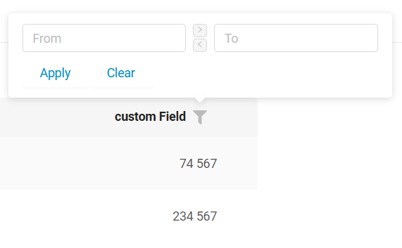
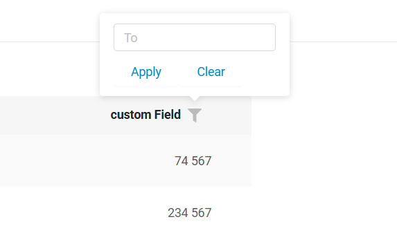
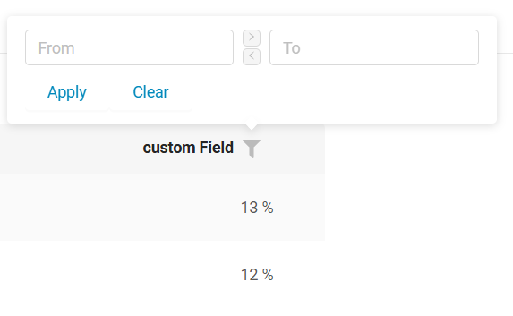
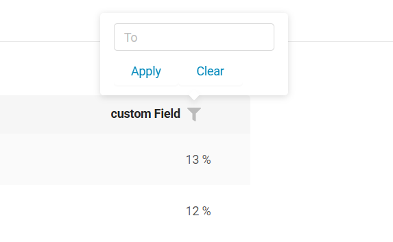
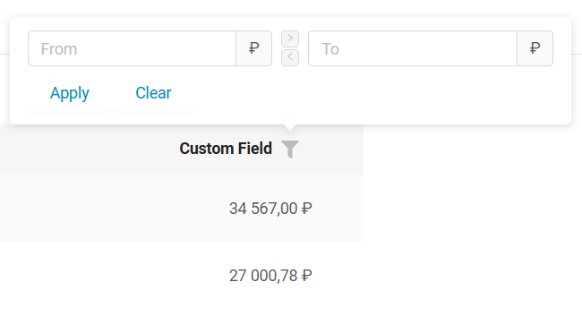
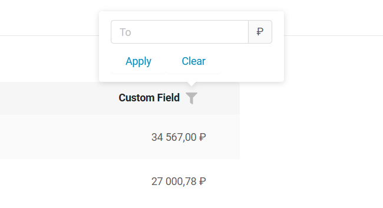

# 2.0.13

* [cxbox/demo 2.0.13 git](https://github.com/CX-Box/cxbox-demo/tree/v.2.0.13), [release notes](https://github.com/CX-Box/cxbox-demo/releases/tag/v.2.0.13)

* [cxbox/core 4.0.0-M16 git](https://github.com/CX-Box/cxbox/tree/cxbox-4.0.0-M16), [release notes](https://github.com/CX-Box/cxbox/releases/tag/cxbox-4.0.0-M16), [maven](https://central.sonatype.com/artifact/org.cxbox/cxbox-starter-parent/4.0.0-M16)

* [cxbox-ui/core 2.5.2 git](https://github.com/CX-Box/cxbox-ui/tree/2.5.2), [release notes](https://github.com/CX-Box/cxbox-ui/releases/tag/2.5.2), [npm](https://www.npmjs.com/package/@cxbox-ui/core/v/2.5.2)

* [cxbox/code-samples 2.0.13 git](https://github.com/CX-Box/cxbox-code-samples/tree/v.2.0.13), [release notes](https://github.com/CX-Box/cxbox-code-samples/releases/tag/v.2.0.13)

* cxbox/intellij-plugin 1.7.9 [Jetbrains Marketplace](https://plugins.jetbrains.com/plugin/19523-platform-tools/versions/stable/707119), [cxbox-intellij-plugin.zip](https://disk.yandex.ru/d/bcY7wjV5RQIvfA)

## **Key updates April, May 2025**

### CXBOX ([Demo](http://demo.cxbox.org))
#### Added: number, money, percent fields - range filtering support

You can now filter number, money, and percent fields by a value range.

The filter displays two inputs:

* `From` – shows values ≥ the entered number (.greaterOrEqualThan).
* `To` – shows values ≤ the entered number (.lessOrEqualThan).

You can fill in either one or both fields. Values matching the entered range will be shown.

=== "Number"
    === "After"  
        
    === "Before"
        
=== "Percent"
    === "After"
        
    === "Before"
        
=== "Money"
    === "After"
        
    === "Before"
        

**Copy buttons** allow duplicating values between fields:

* `>` button – copies `From` to `To`
* `<` button – copies `To` to `From`

**Note**: The buttons are only active when the corresponding source field contains a value.

#### Fixed: drillDown autoscroll behavior
Now, the page automatically scrolls to the top during drillDown navigation.  
Previously, the system remembered the user's scroll position on the screen, which could lead to confusion when switching screens.

=== "After"
    {width="900"}
=== "Before"
    {width="900"}

#### Fixed: refresh request for a non-existent bc
The frontend now handles refresh requests for business components that aren't present on the page without errors. Instead, a warning is logged to the console.

=== "After"
    
=== "Before"
    

#### Added: dictionary, multipleSelect, radio fields - filtering window improvements
Enhancements were introduced to filtering windows for fields with checkbox selection (dictionary, multipleSelect, radio):

* **Search Field**: A text field for searching filter values has been added. It appears only when the list of values exceeds the visible area and a scrollbar is shown.
  Note: This search filters the list of available values — it does not select them.
* **Selected Values Counter**: A counter has been added to the "Apply" button to display the number of the selected values. It is shown under the same condition as the search field - when the list doesn't fit and a scrollbar appears. The maximum value displayed in the counter is configured in a frontend constant. If the number of selected values exceeds the limit, a "+" sign is added (e.g., **9+**).
* **UI Adjustments**:
    * Scrollbar is now aligned to the right edge
    * Margin between the list of values and the buttons has been removed

See more [dictionary](https://doc.cxbox.org/widget/fields/field/dictionary/dictionary/#filtering), [multipleSelect](https://doc.cxbox.org/widget/fields/field/multipleSelect/multipleSelect/#filtering), [radio](https://doc.cxbox.org/widget/fields/field/radio/radio/#filtering)
=== "After"
    {width="400"}
=== "Before"
    {width="400"}

#### Added: Screen navigation - line wrapping and search bar
We have added support for automatic line wrapping in the screen navigation panel. If the setting is `auto`, long screen names will wrap. If it is set to `none`, they will remain on a single line.

=== "none (default)"  
    {width="400"}
=== "auto"  
    {width="400"}

Additionally, a new setting allows you to enable or disable the search bar in the expanded left navigation menu. If it set to `true`, the search bar is displayed when the menu is expanded. If it is set to `false`, the search bar is unavailable.

=== "true (default)"
    {width="400"}
=== "false"
    {width="400"}

#### Added: Steps Widget – Description Support
The Steps widget now supports optional descriptions for each step. If no description is provided, only the step label is displayed, as before.

=== "After"  
    
=== "Before"
    

#### Added: List widget – Excel Export Limit
You can now configure a row limit for Excel export in list widgets at the application level. If the number of rows exceeds this limit, the UI will display a warning stating that only N rows were exported due to the configured restriction. To ensure stable performance, the maximum allowed value is capped at 10,000, even if a higher value is set.

#### Fixed: Date field - filter window after drillDown
We have improved the filter window display for Date field after drilldowns.
Previously, when opening a filter window after applying a drilldown filter to a Date field, no values were displayed.
Now, the window correctly displays the applied values.  
=== "After"
    
=== "Before"
    

#### Fixed: showCondition with forceActive parent
We’ve improved the behavior of showCondition in cases where a parent widget has forceActive enabled. Now, when the value of a forceActive field changes, the metadata is correctly updated, ensuring that the affected widget’s visibility and available actions are properly refreshed.

#### Fixed: Improved Display of elements in Inline Editing Mode upon errors

The display of elements in inline editing mode has been enhanced to handle errors (e.g., mandatory field validation errors).

Now, the empty value area occupies the same space as filled fields, ensuring a consistent interface.
=== "After"
    
=== "Before"
    

#### Fixed: Button actions respect Force-Active field
Previously, when data in a force active field was modified and a button (e.g., Save) was clicked, the button action triggered before the metadata check for its availability. This caused the action to execute even if the button should have been disabled.

Now, the system first checks the metadata and button availability, and only then executes the action if the button is active.
=== "After"
    
=== "Before"
    

#### Fixed: pickList field - updated query logic

* The frontend no longer sends requests for picklist data when the parent entity contains no records.
* Child entity data is no longer requested if its parent entity has no records.

=== "After"
    The frontend no longer sends requests  
=== "Before"
    

#### Fixed: Improved Error Handling in Role Switching
We’ve refined how error messages are shown when switching user roles. Before, an error could appear even if the view was actually available. Now, the message is shown only when the requested view is truly inaccessible for the selected role.

### CXBOX [documentation](https://doc.cxbox.org/)

#### Added: [suggestionPickList](https://doc.cxbox.org/widget/fields/field/suggestionpicklist/suggestionPickList/) field
We have provided a full description of [suggestionPickList](https://doc.cxbox.org/widget/fields/field/suggestionpicklist/suggestionPickList/) field

#### Added: enhancements for filtering elements [dictionary](https://doc.cxbox.org/widget/fields/field/dictionary/dictionary/#filtering), [multipleSelect](https://doc.cxbox.org/widget/fields/field/multipleSelect/multipleSelect/#filtering), [radio](https://doc.cxbox.org/widget/fields/field/radio/radio/#filtering)
We have provided a  description of [dictionary](https://doc.cxbox.org/widget/fields/field/dictionary/dictionary/#filtering), [multipleSelect](https://doc.cxbox.org/widget/fields/field/multipleSelect/multipleSelect/#filtering), [radio](https://doc.cxbox.org/widget/fields/field/radio/radio/#filtering)
