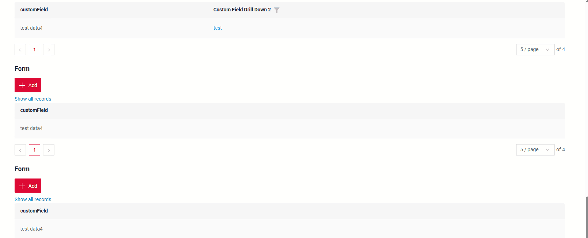
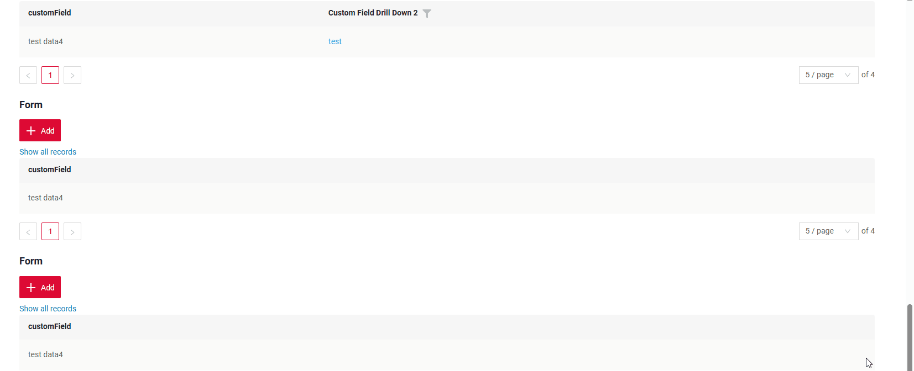

# 2.0.12

* [cxbox/demo 2.0.12 git](https://github.com/CX-Box/cxbox-demo/tree/v.2.0.12), [release notes](https://github.com/CX-Box/cxbox-demo/releases/tag/v.2.0.12)

* [cxbox/core 4.0.0-M16 git](https://github.com/CX-Box/cxbox/tree/cxbox-4.0.0-M16), [release notes](https://github.com/CX-Box/cxbox/releases/tag/cxbox-4.0.0-M16), [maven](https://central.sonatype.com/artifact/org.cxbox/cxbox-starter-parent/4.0.0-M16)

* [cxbox-ui/core 2.5.2 git](https://github.com/CX-Box/cxbox-ui/tree/2.5.2), [release notes](https://github.com/CX-Box/cxbox-ui/releases/tag/2.5.2), [npm](https://www.npmjs.com/package/@cxbox-ui/core/v/2.5.2)

* [cxbox/code-samples 2.0.12 git](https://github.com/CX-Box/cxbox-code-samples/tree/v.2.0.12), [release notes](https://github.com/CX-Box/cxbox-code-samples/releases/tag/v.2.0.12)  

* cxbox/intellij-plugin 1.7.9 [Jetbrains Marketplace](https://plugins.jetbrains.com/plugin/19523-platform-tools/versions/stable/707119), [cxbox-intellij-plugin.zip](https://disk.yandex.ru/d/bcY7wjV5RQIvfA) 

## **Key updates April 2025**

### CXBOX ([Demo](http://demo.cxbox.org))

#### Fixed: Autoscroll drilldown
New Behavior:
Now, during any drill-down navigation, the page automatically scrolls to the top. This improves usability
Previous Behavior:
When navigating between pages (drill-down), the system remembered the user's scroll position on the screen.
8
=== "After"!
    {width="700"}
=== "Before"
     {width="700"}

 