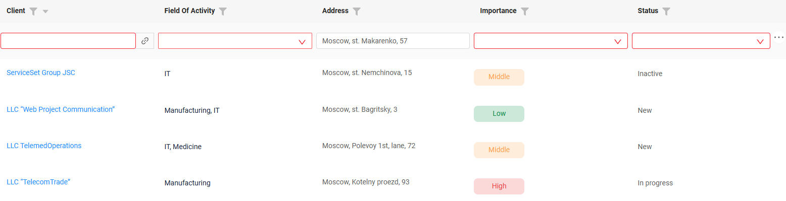

# 2.0.13

* [cxbox/demo 2.0.13 git](https://github.com/CX-Box/cxbox-demo/tree/v.2.0.13), [release notes](https://github.com/CX-Box/cxbox-demo/releases/tag/v.2.0.13)

* [cxbox/core 4.0.0-M16 git](https://github.com/CX-Box/cxbox/tree/cxbox-4.0.0-M16), [release notes](https://github.com/CX-Box/cxbox/releases/tag/cxbox-4.0.0-M16), [maven](https://central.sonatype.com/artifact/org.cxbox/cxbox-starter-parent/4.0.0-M16)

* [cxbox-ui/core 2.5.2 git](https://github.com/CX-Box/cxbox-ui/tree/2.5.2), [release notes](https://github.com/CX-Box/cxbox-ui/releases/tag/2.5.2), [npm](https://www.npmjs.com/package/@cxbox-ui/core/v/2.5.2)

* [cxbox/code-samples 2.0.13 git](https://github.com/CX-Box/cxbox-code-samples/tree/v.2.0.13), [release notes](https://github.com/CX-Box/cxbox-code-samples/releases/tag/v.2.0.13)  

* cxbox/intellij-plugin 1.7.9 [Jetbrains Marketplace](https://plugins.jetbrains.com/plugin/19523-platform-tools/versions/stable/707119), [cxbox-intellij-plugin.zip](https://disk.yandex.ru/d/bcY7wjV5RQIvfA) 

## **Key updates April 2025**

### CXBOX ([Demo](http://demo.cxbox.org)) 
#### Added: Filter data by a range of values (number, money, percent)

A new filtering functionality for numeric fields (number, money, percent) has been implemented in the system. 
Now you can filter data by a range of values.

When selecting a filter for a numeric field, a window with two input fields is displayed:

* `From` field – filters values greater than or equal to the entered number (.greaterOrEqualThan).
* `To` field – filters values less than or equal to the entered number (.lessOrEqualThan).

You can use the filtering feature in several ways:

* Fill in only the `From` field – values greater than or equal to the specified number will be shown.
* Fill in only the `To` field – values less than or equal to the specified number will be shown.
* Fill in both fields – values within the specified range will be displayed.

=== "Number"
    === "After"  
        
    === "Before"
        
=== "Percent"
    === "After"
        
    === "Before"
        
=== "Money"
    === "After"
        
    === "Before"
        

**Value copy buttons**:

Between the `From` and `To` fields, there are two buttons:

* `>` button – copies the value from the `From` field to the `To` field.
* `<` button – copies the value from the `To` field to the `From` field.

Note: The buttons are only active when the corresponding source field contains a value.

#### Fixed: Autoscroll drilldown  
New Behavior:
Now, during any drill-down navigation, the page automatically scrolls to the top. This improves usability
Previous Behavior:
When navigating between pages (drill-down), the system remembered the user's scroll position on the screen.

=== "After"
    {width="700"}
=== "Before"
    {width="700"}

#### Fixed: refresh request for a non-existent bc
The frontend handles cases when a backend attempts to refresh a Business Component (bc) that doesn't exist on the current page.

When receiving a refresh request for a non-existent bc:
Warning is logged to the console

=== "After"
    
=== "Before"
    

#### Added: enhancements  for filtering elements (dictionary, multipleSelect, radio)
The following enhancements have been implemented for filtering elements (dictionary, multipleSelect, radio):

* Added Search Field: A text search field has been added to the filtering window for quick value lookup.
* Scroll Optimization: The scrollbar for all values has been aligned to the right edge
* Selected Values Counter :

A counter displaying the number of selected filter values has been added.

A frontend constant has been introduced to configure the threshold for displaying a "+" symbol.

The default value is set to 9: if more than 9 values are selected, the counter displays "9+".

see more [dictionary](https://doc.cxbox.org/widget/fields/field/dictionary/dictionary/#filtering), [multipleSelect](https://doc.cxbox.org/widget/fields/field/multipleSelect/multipleSelect/#filtering), [radio](https://doc.cxbox.org/widget/fields/field/radio/radio/#filtering)
=== "After"
    
=== "Before"
    

#### Fixed: Improved Display of elements in Inline Editing Mode upon errors

The display of elements in inline editing mode has been enhanced to handle errors (e.g., mandatory field validation errors).

Now, the empty value area occupies the same space as filled fields, ensuring a consistent interface.
=== "After"
    
=== "Before"
    

#### Fixed: Button ctions respect Force-Active field
Previously, when data in a force active field was modified and a button (e.g., Save) was clicked, the button action triggered before the metadata check for its availability. This caused the action to execute even if the button should have been disabled.

Now, the system first checks the metadata and button availability, and only then executes the action if the button is active.
=== "After"
    
=== "Before"
    

#### Fixed: Data Loading

* The frontend no longer sends requests for picklist data when the parent entity contains no records.
* Child entity data is no longer requested if its parent entity has no records.

=== "After"
The frontend no longer sends requests  
=== "Before"

#### Added: Added support for screen name wrapping in the left menu.
If the sideBarWordBreak setting is not specified or set to none, screen names do not wrap and are truncated.

With sideBarWordBreak: auto, long screen names wrap to the next line if they exceed the menu width.

=== "sideBarWordBreak:none"

=== "sideBarWordBreak:true"

### CXBOX [documentation](https://doc.cxbox.org/)

#### Added: [suggestionPickList](https://doc.cxbox.org/widget/fields/field/suggestionpicklist/suggestionPickList/) field
We have provided a full description of [suggestionPickList](https://doc.cxbox.org/widget/fields/field/suggestionpicklist/suggestionPickList/) field

#### Added: enhancements for filtering elements [dictionary](https://doc.cxbox.org/widget/fields/field/dictionary/dictionary/#filtering), [multipleSelect](https://doc.cxbox.org/widget/fields/field/multipleSelect/multipleSelect/#filtering), [radio](https://doc.cxbox.org/widget/fields/field/radio/radio/#filtering)
We have provided a  description of [dictionary](https://doc.cxbox.org/widget/fields/field/dictionary/dictionary/#filtering), [multipleSelect](https://doc.cxbox.org/widget/fields/field/multipleSelect/multipleSelect/#filtering), [radio](https://doc.cxbox.org/widget/fields/field/radio/radio/#filtering)
