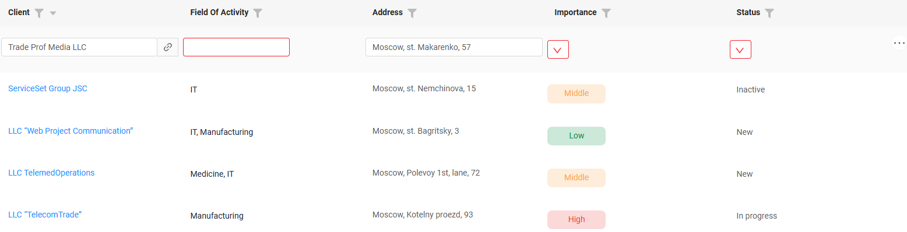

# 2.0.13

* [cxbox/demo 2.0.13 git](https://github.com/CX-Box/cxbox-demo/tree/v.2.0.13), [release notes](https://github.com/CX-Box/cxbox-demo/releases/tag/v.2.0.13)

* [cxbox/core 4.0.0-M17 git](https://github.com/CX-Box/cxbox/tree/cxbox-4.0.0-M17), [release notes](https://github.com/CX-Box/cxbox/releases/tag/cxbox-4.0.0-M17), [maven](https://central.sonatype.com/artifact/org.cxbox/cxbox-starter-parent/4.0.0-M17)

* [cxbox-ui/core 2.5.3 git](https://github.com/CX-Box/cxbox-ui/tree/2.5.3), [release notes](https://github.com/CX-Box/cxbox-ui/releases/tag/2.5.3), [npm](https://www.npmjs.com/package/@cxbox-ui/core/v/2.5.3)

<!--* [cxbox/code-samples 2.0.13 git](https://github.com/CX-Box/cxbox-code-samples/tree/v.2.0.13), [release notes](https://github.com/CX-Box/cxbox-code-samples/releases/tag/v.2.0.13)  
-->

## **Key updates April, May 2025**

### CXBOX ([Demo](http://demo.cxbox.org))  

#### Added: number, money, percent fields - range filter support

You can now filter [number](https://doc.cxbox.org/widget/fields/field/number/number/), [money](https://doc.cxbox.org/widget/fields/field/money/money/), and [percent](https://doc.cxbox.org/widget/fields/field/percent/percent/) fields by a value range.

The filter displays two inputs:

* `From` – shows values ≥ the entered number (.greaterOrEqualThan).
* `To` – shows values ≤ the entered number (.lessOrEqualThan).

You can fill in either one or both fields. Values matching the entered range will be shown.  

=== "After"  
    {width="700"}
=== "Before"
    {width="700"}

See range filtering for [number](https://doc.cxbox.org/widget/fields/field/number/number/#filtering), [percent](https://doc.cxbox.org/widget/fields/field/percent/percent/#filtering), [money](https://doc.cxbox.org/widget/fields/field/money/money/#filtering) in the updated articles.  

**Copy buttons** allow duplicating values between fields:

* `>` button – copies `From` to `To`
* `<` button – copies `To` to `From`

**Note**: The buttons are only active when the corresponding source field contains a value.

  

!!! info 
    The `.equals` method is still available to support exact match filtering, ensuring backward compatibility.  

#### Added: dictionary, multipleSelect, radio fields - filter display 
The filter panel for fields with checkbox-style filtering ([dictionary](https://doc.cxbox.org/widget/fields/field/dictionary/dictionary/), [multipleSelect](https://doc.cxbox.org/widget/fields/field/multipleSelect/multipleSelect/), and [radio](https://doc.cxbox.org/widget/fields/field/radio/radio/)) has been improved for better usability.  

* **Search Field**: A text input for searching filter values has been added. It appears **only** when the list of values exceeds the visible area and a scrollbar is shown. **Note**: This is just a search tool - it doesn't select any values.  
* **Selected Values Counter**: A counter has been added to the **"Apply"** button to display the number of the selected values. It is shown under the same condition as the search field (when a scrollbar is present). The maximum displayed number is limited by a frontend constant. If the number of selected values exceeds the limit, a "+" sign is added (e.g., **9+**).
* **UI Adjustments**:
    * Scrollbar is now aligned to the right edge
    * Margin between the list and the buttons has been removed

=== "After"
    {width="400"}
=== "Before"
    {width="400"}  

See filter display for [dictionary](https://doc.cxbox.org/widget/fields/field/dictionary/dictionary/#filtering), [multipleSelect](https://doc.cxbox.org/widget/fields/field/multipleSelect/multipleSelect/#filtering), [radio](https://doc.cxbox.org/widget/fields/field/radio/radio/#filtering) in the updated articles.  

#### Added: Sorting - support for toggling sorting states  

In addition to modifying sorting (which was already supported), users can now clear sorting with a third click — returning the field to an unsorted state (only for user-applied sorting).  

Visual updates make the sorting state more intuitive:  

* Both arrows (↑↓) are now always displayed to indicate whether sorting is applied.   
* The active direction is highlighted (ascending or descending), while the other remains faded.   
* When no sorting is applied, both arrows are faded and only visible on hover.

=== "1st click (ascending)"  
    
=== "2nd click (descending)"
    
=== "3d click (no sorting)"
      

!!! info
    Users can **only** clear the sorting they applied themselves. Default sorting set by the system **cannot** be cleared.  

#### Added: time field - logic and display enhancements  
The [time](https://doc.cxbox.org/widget/fields/field/time/time/) field is now fully supported and aligned with the behavior of [date](https://doc.cxbox.org/widget/fields/field/date/date/), [dateTime](https://doc.cxbox.org/widget/fields/field/dateTime/dateTime/), and [dateTimeWithSeconds](https://doc.cxbox.org/widget/fields/field/dateTimeWithSeconds/dateTimeWithSeconds/) fields. It supports sorting, range-based filtering, and multiple display formats (`HH:mm:ss`, `HH:mm`, `HH`, `hh:mm:ss A`, `hh:mm A`, `hh A`).

=== "List"  
    
=== "Info"
    
=== "Form"
    

!!! info  
    An updated article on time field is coming soon — stay tuned!

#### Added: Screen panel - line wrapping and search bar  
We have enhanced the left screen panel with two new features:  

* **Line wrapping for screen names** - a new setting controls how long screen names are displayed    
=== "none (default)"  
    Names stay on a single line and may be truncated if the screen name is long.  
    {width="400"}
=== "auto"  
    Names automatically wrap to the next line.  
    {width="400"}

* **Search bar visibility** - you can now control the search bar's display when the navigation menu is expanded:  

=== "true (default)"  
    The search bar is shown.  
    {width="400"}
=== "false"  
    The search bar is unavailable.  
    {width="400"}

#### Added: Steps widget – description support
The Steps widget now supports optional descriptions for each step. If no description is provided, only the step label is displayed, as before.

=== "After"  
    
=== "Before"
    

#### Added: List widget – configurable Excel export limit  
You can now set a row limit for Excel export in [List](https://doc.cxbox.org/widget/type/list/list/) widget at the application level. If the number of rows to export exceeds the configured limit, a warning message will inform the user that only **N** rows were exported. To ensure stable performance, the maximum export limit is **10,000 rows**, even if a higher value is set in the configuration.  

#### Fixed: date field - applied filtration display after drillDown  
Previously, when opening the filter window for a [date](https://doc.cxbox.org/widget/fields/field/date/date/) field after a drillDown, the applied filter values were not displayed.
Now, the selected values are shown correctly, making it easier to understand the applied filter values and adjust the filter.  
=== "After"
    
=== "Before"
    

#### Fixed: showCondition with forceActive parent
We’ve improved the showCondition logic in cases where a parent widget has forceActive enabled. Now, when the value of a forceActive field changes, the metadata is correctly updated, ensuring that the affected widget’s visibility and available actions are properly refreshed.

#### Fixed: drillDown - autoscroll to top  
The screen now scrolls to the top when navigating via drillDown.
Previously, the scroll position was preserved, which could confuse users when switching between screens.  
=== "After"
    {width="900"}
=== "Before"
    {width="900"}

#### Fixed: dictionary, multipleSelect, inlinePickList fields - unified dropdown positioning in List widget  
The dropdown positioning for [dictionary](https://doc.cxbox.org/widget/fields/field/dictionary/dictionary/), [multipleSelect](https://doc.cxbox.org/widget/fields/field/multipleSelect/multipleSelect/), and [inlinePickList](https://doc.cxbox.org/widget/fields/field/inlinePickList/inlinePickList/) fields has been unified. Now, all dropdowns in List widget are displayed correctly outside the row and are no longer truncated.  

=== "After"
    
=== "Before"
    

See [dictionary](https://doc.cxbox.org/widget/fields/field/dictionary/dictionary/#readonlyeditable), [multipleSelect](https://doc.cxbox.org/widget/fields/field/multipleSelect/multipleSelect/#readonlyeditable), and [inlinePickList](https://doc.cxbox.org/widget/fields/field/inlinePickList/inlinePickList/#readonlyeditable) in the updated articles.  

#### Fixed: refresh request for a non-existent bc
The frontend now handles refresh requests for business components that aren't present on the page without errors. Instead, a warning is logged to the console.

=== "After"
    
=== "Before"
      

#### Fixed: dictionary field - consistent field size with validation (inline-edit)  

The display of dictionary in inline editing mode has been enhanced to handle errors (e.g., mandatory field validation errors).

Now, the empty value area occupies the same space as filled fields, ensuring a consistent interface.
=== "After"
    
=== "Before"
    

#### Fixed: Button actions - respond to force-active fields  

Button actions now correctly respond to metadata updates from force-active fields. Previously, actions could be triggered before re-evaluating button availability, allowing execution even when the button should have been disabled.  

=== "After"
    
=== "Before"
    

#### Fixed: dictionary, multipleSelect, multivalue, multivalueHover - unified display height in read mode  

The height of the following field types in view mode has been adjusted from 20px to 16px (just like other fields) to ensure visual consistency.   

#### Fixed: pickList field - updated query logic

* The frontend no longer sends requests for picklist data when the parent entity contains no records.
* Child entity data is no longer requested if its parent entity has no records.

=== "After"
    The frontend no longer sends requests  
=== "Before"
    

#### Fixed: role switching - improved error handling  
We’ve refined how error messages are shown when switching user roles. Before, an error could appear even if the view was actually available. Now, the message is shown only when the requested view is truly inaccessible for the selected role.  

#### Other Changes
see [cxbox-demo changelog](https://github.com/CX-Box/cxbox-demo/releases/tag/v.2.0.13)  

### CXBOX ([Core Ui](https://github.com/CX-Box/cxbox-ui/releases/tag/2.5.3))

We have released a new 2.5.3 CORE UI version.

#### Other Changes
See [cxbox-ui 2.5.3 changelog](https://github.com/CX-Box/cxbox-ui/releases/tag/2.5.3).

### CXBOX 4.0.0-M17 ([Core](https://github.com/CX-Box/cxbox/tree/cxbox-4.0.0-M17))

We have released a new 4.0.0-M17 CORE version.  

#### Other Changes
See [cxbox 4.0.0-M17 changelog](https://github.com/CX-Box/cxbox/releases/tag/cxbox-4.0.0-M17).

### CXBOX [documentation](https://doc.cxbox.org/)

#### Added: [suggestionPickList](https://doc.cxbox.org/widget/fields/field/suggestionpicklist/suggestionPickList/) field
We have provided a full description of [suggestionPickList](https://doc.cxbox.org/widget/fields/field/suggestionpicklist/suggestionPickList/) field

#### Added: [dictionary](https://doc.cxbox.org/widget/fields/field/dictionary/dictionary/#filtering), [multipleSelect](https://doc.cxbox.org/widget/fields/field/multipleSelect/multipleSelect/#filtering), [radio](https://doc.cxbox.org/widget/fields/field/radio/radio/#filtering) fields - updated article  
We have provided a  description of [dictionary](https://doc.cxbox.org/widget/fields/field/dictionary/dictionary/#filtering), [multipleSelect](https://doc.cxbox.org/widget/fields/field/multipleSelect/multipleSelect/#filtering), [radio](https://doc.cxbox.org/widget/fields/field/radio/radio/#filtering)  

#### Added: [number](https://doc.cxbox.org/widget/fields/field/number/number/#filtering), [percent](https://doc.cxbox.org/widget/fields/field/percent/percent/#filtering), [money](https://doc.cxbox.org/widget/fields/field/money/money/#filtering) fields - filtration by range  
We have updated the articles on [number](https://doc.cxbox.org/widget/fields/field/number/number/#filtering), [percent](https://doc.cxbox.org/widget/fields/field/percent/percent/#filtering) and [money](https://doc.cxbox.org/widget/fields/field/money/money/#filtering) on range filtration.  

