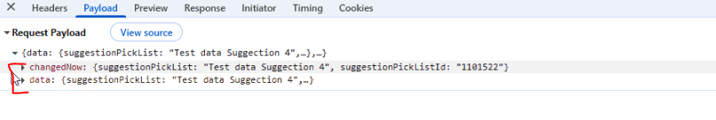
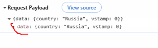

# 2.0.14

* [cxbox/demo 2.0.14 git](https://github.com/CX-Box/cxbox-demo/tree/v.2.0.14), [release notes](https://github.com/CX-Box/cxbox-demo/releases/tag/v.2.0.14)

* [cxbox/core 4.0.0-M17 git](https://github.com/CX-Box/cxbox/tree/cxbox-4.0.0-M17), [release notes](https://github.com/CX-Box/cxbox/releases/tag/cxbox-4.0.0-M17), [maven](https://central.sonatype.com/artifact/org.cxbox/cxbox-starter-parent/4.0.0-M17)

* [cxbox-ui/core 2.5.3 git](https://github.com/CX-Box/cxbox-ui/tree/2.5.3), [release notes](https://github.com/CX-Box/cxbox-ui/releases/tag/2.5.3), [npm](https://www.npmjs.com/package/@cxbox-ui/core/v/2.5.3)

* [cxbox/code-samples 2.0.14 git](https://github.com/CX-Box/cxbox-code-samples/tree/v.2.0.14), [release notes](https://github.com/CX-Box/cxbox-code-samples/releases/tag/v.2.0.14)

## **Key updates July 2025**

### CXBOX ([Demo](http://demo.cxbox.org))
 
#### Other Changes
see [cxbox-demo changelog](https://github.com/CX-Box/cxbox-demo/releases/tag/v.2.0.14)


### CXBOX ([Core Ui](https://github.com/CX-Box/cxbox-ui/releases/tag/2.5.3))

#### Added tag changedNow the fields modified in the current user interaction   (CXBOX-812)
A new tag, `changedNow`, has been introduced. It contains only the fields modified in the current user interaction that have not yet
been sent to the backend.

=== "After row-meta/ (POST)"
    
=== "Before row-meta/ (POST)"
    


**When is `changedNow` sent?**

row-meta/ (POST)

* When the user exits a field that has `forceActive = true`.
* When call FormPopup widget


=== "After Behavior"

    | Scenario                                                                                                                   | Meta Builder Called | Field Update Triggered         |
    | -------------------------------------------------------------------------------------------------------------------------- | ------------------- | ------------------------------ |
    | Editing a field with `forceActive`                                                                                         | ✅ Yes               | ✅ Yes                          |
    | `forceActive` → Standard Save button (for fields listed below where `row-meta` is not triggered until the field is exited) | ❌ No                | ❌ No                           |
    | `forceActive` → Custom button (for fields listed below where `row-meta` is not triggered until the field is exited)        | ❌ No                | ❌ No                           |
    | Opening a `FormPopup`                                                                                                      | ✅ Yes               | ✅ Yes                          |
    | Clicking only the Standard Save button                                                                                     | ❌ No                | ❌ No                           |
    | Clicking only a Custom button                                                                                              | ❌ No                | ❌ No                           |
    | Clicking Delete                                                                                                            | ❌ No                | ❌ No (only deletes the record) |

=== "Before Behavior"

    | Scenario                                                                                                                   | Meta Builder Called                                 | Field Update Triggered                     |
    | -------------------------------------------------------------------------------------------------------------------------- | --------------------------------------------------- | ------------------------------------------ |
    | Editing a field with `forceActive`                                                                                         | ✅ Yes                                               | ✅ Yes                                      |
    | `forceActive` → Standard Save button (for fields listed below where `row-meta` is not triggered until the field is exited) | ✅ Yes (via `/row-meta` → followed by save request)  | Update occurs within the `/row-meta` event |
    | `forceActive` → Custom button (for fields listed below where `row-meta` is not triggered until the field is exited)        | ✅ Yes (via `/row-meta` → followed by custom action) | Update occurs within the `/row-meta` event |
    | Opening a `FormPopup`                                                                                                      | ✅ Yes                                               | ✅ Yes                                      |
    | Clicking only the Standard Save button                                                                                     | ❌ No                                                | ❌ No                                       |
    | Clicking only a Custom button                                                                                              | ❌ No                                                | ❌ No                                       |
    | Clicking Delete                                                                                                            | ❌ No                                                | ❌ No (only deletes the record)             |


**Field Type Behavior**

Legend:

* ✅ — `forceActive` (`row-meta`) is triggered immediately on value selection.
* ❌ — `row-meta` is not triggered until a button is clicked or user leaves the field.
* `noValid` — field does not support in-place value changes.

| Field Type            | `forceActive` triggered immediately? | Notes                                               |
| --------------------- | ------------------------------------ | --------------------------------------------------- |
| `input`               | ❌ No                                 | Triggered on click outside the field or on a button |
| `date`                | ✅ Yes                                |                                                     |
| `dateTime`            | ✅ Yes                                |                                                     |
| `dateTimeWithSeconds` | ✅ Yes                                |                                                     |
| `number`              | ❌ No                                 | Triggered on click outside the field or on a button |
| `percent`             | ❌ No                                 | Triggered on click outside the field or on a button |
| `hidden`              | `noValid`                            | Not editable                                        |
| `text`                | ❌ No                                 | Triggered on click outside the field or on a button |
| `radio`               | ✅ Yes                                |                                                     |
| `checkbox`            | ✅ Yes                                |                                                     |
| `money`               | ❌ No                                 |                                                     |
| `dictionary`          | ✅ Yes                                |                                                     |
| `fileUpload`          | ✅ Yes                                |                                                     |
| `pickList`            | ✅ Yes                                |                                                     |
| `inlinePickList`      | ✅ Yes                                | Save only triggered if an item is picked            |
| `hint`                | `noValid`                            | Not editable                                        |
| `multifield`          | ✅ Yes                                |                                                     |
| `multivalueHover`     | `noValid`                            | Not editable                                        |
| `multivalue`          | ✅ Yes                                |                                                     |
| `multipleSelect`      | ✅ Yes                                |                                                     |
| `suggestionPickList`  | ✅ Yes                                | Save only triggered if an item is picked            |


#### Other Changes
See [cxbox-ui 2.5.3 changelog](https://github.com/CX-Box/cxbox-ui/releases/tag/2.5.3).


### CXBOX 4.0.0-M18 ([Core](https://github.com/CX-Box/cxbox/tree/cxbox-4.0.0-M18))

We have released a new 4.0.0-M18 CORE version.

#### Added tag changedNow the fields modified in the current user interaction   (CXBOX-812)
**as is**

Previously, the frontend included all previously changed fields in the `data` tag, rather than only those modified in the current user action. This made it difficult to determine which fields were *just now* changed by the user.

**to be**

A new tag, `changedNow`, has been introduced. It contains only the fields modified in the current user interaction that have not yet
been sent to the backend.

**New Methods for Tracking Field Changes on the Client (changedNow)**

To support tracking of field changes on the UI, the following method has been introduced:

```java
public <V> boolean isFieldChangedNow(RowDependentFieldsMeta<T> fields, DtoField<? super T, V> field)
```

Description:
Checks if a specific field was modified during the current UI interaction, based on the contents of the `changedNow` tag.

Example Usage:

```java
if (isFieldChangedNow(fields, MyDtoFields_.name)) {
    // Logic to execute if the 'name' field was changed in the current action
}
```
 
#### Other Changes
See [cxbox 4.0.0-M17 changelog](https://github.com/CX-Box/cxbox/releases/tag/cxbox-4.0.0-M17).


### CXBOX [plugin](https://plugins.jetbrains.com/plugin/19523-platform-tools)
####  


### CXBOX [documentation](https://doc.cxbox.org/) 

