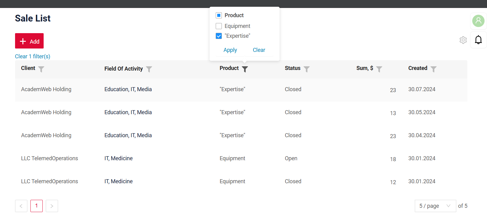
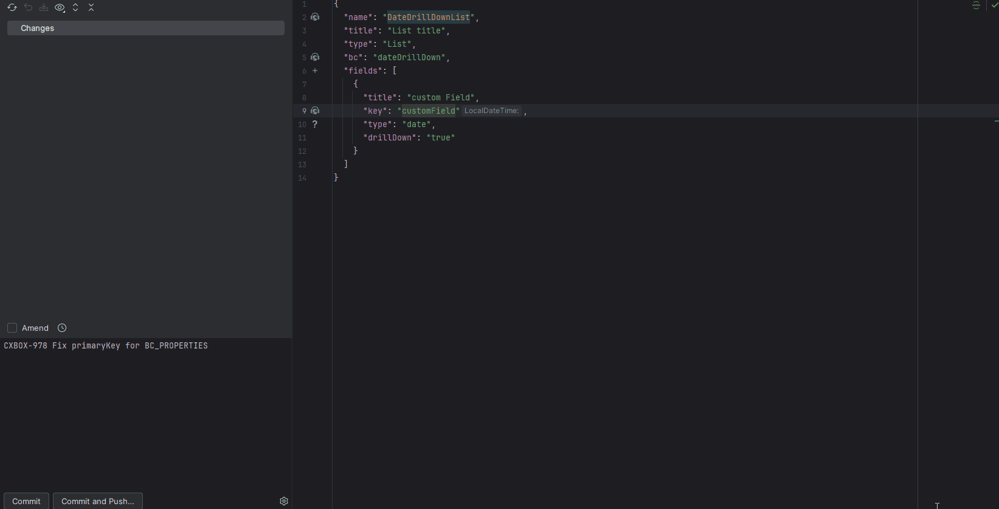
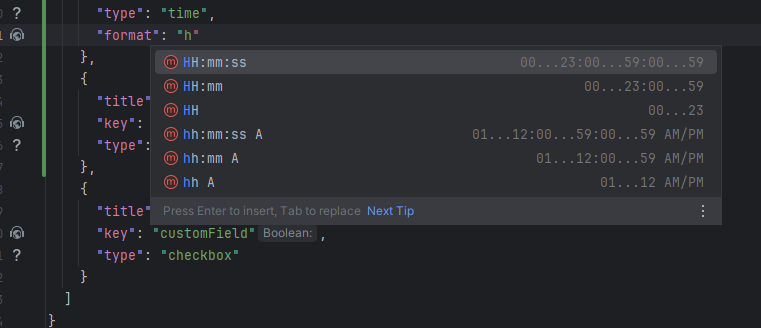
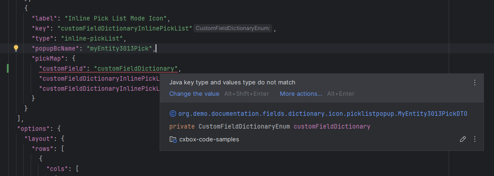
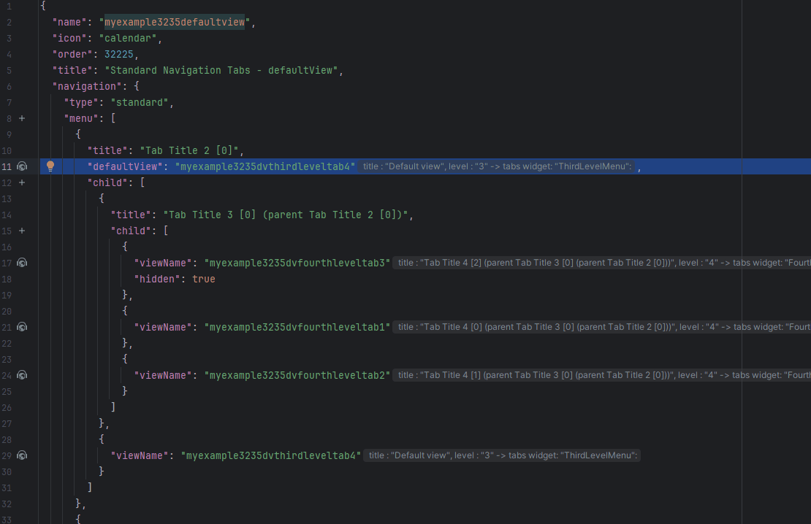
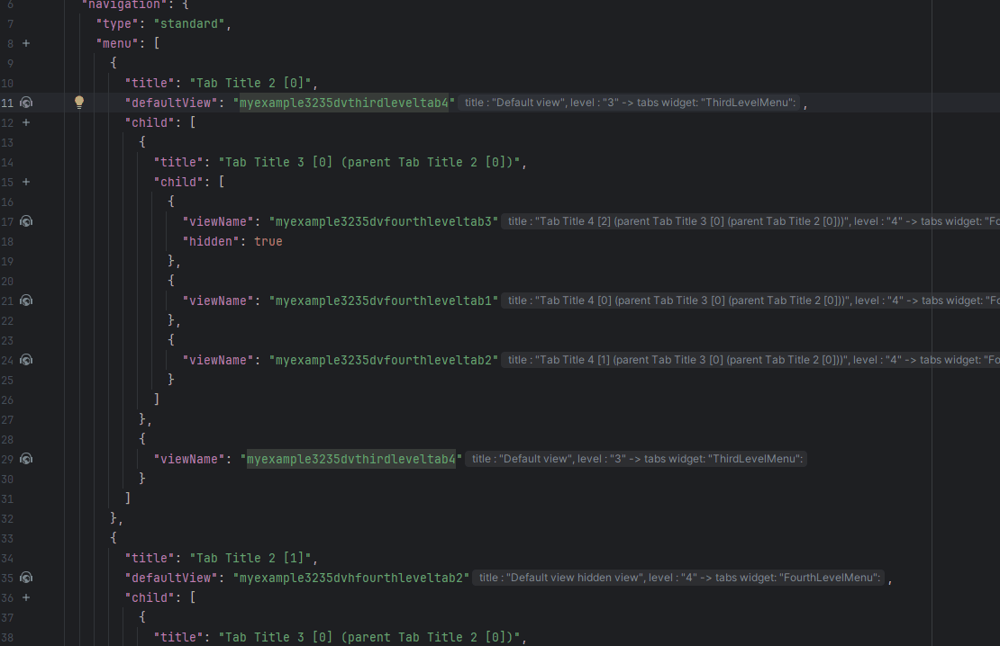

# 2.0.14

* [cxbox/demo 2.0.14 git](https://github.com/CX-Box/cxbox-demo/tree/v.2.0.14), [release notes](https://github.com/CX-Box/cxbox-demo/releases/tag/v.2.0.14)

* [cxbox/core 4.0.0-M18 git](https://github.com/CX-Box/cxbox/tree/cxbox-4.0.0-M18), [release notes](https://github.com/CX-Box/cxbox/releases/tag/cxbox-4.0.0-M18), [maven](https://central.sonatype.com/artifact/org.cxbox/cxbox-starter-parent/4.0.0-M18)

* [cxbox-ui/core 2.6.0 git](https://github.com/CX-Box/cxbox-ui/tree/2.6.0), [release notes](https://github.com/CX-Box/cxbox-ui/releases/tag/2.6.0), [npm](https://www.npmjs.com/package/@cxbox-ui/core/v/2.6.0)

* [cxbox/code-samples 2.0.14 git](https://github.com/CX-Box/cxbox-code-samples/tree/v.2.0.14), [release notes](https://github.com/CX-Box/cxbox-code-samples/releases/tag/v.2.0.14)

## **Key updates June, July 2025**

### CXBOX ([Demo](http://demo.cxbox.org))  

#### TODO>> ADD after test! Added: List widget – mass operations (NEW!)  
We’ve introduced a new feature that allows you to apply actions to multiple rows at once – **mass operations**.  
This is a special list widget display designed to guide the user through each step of a bulk action.  

Mass operations can include the following steps:  
=== "Step 1: Select"  
    Checkboxes appear next to each row. You can select multiple rows, which are then shown as tags above the table.  
=== "Step 2: Review"  
    The selected rows are shown in read-only mode, allowing you to double-check your selection before proceeding.  
=== "Step 3: Confirm"  
    Depending on the operation, this step may include a form for entering additional required data and/or a confirmation button.  
=== "Step 4: Results"  
    Once the action is complete, you’ll see a summary of results for each row. You can also download the result as an Excel file and exit the mass operation mode.  

!!! info 
    A detailed article on mass operations will be available soon in our official documentation – stay tuned!  

#### Added: FilePreview widget – NEW widget type!  

We’ve introduced a new widget type – FilePreview. It takes up 50% of the main screen area and is placed next to other content. The widget remains fixed at the top while scrolling, keeping the document always visible.  

FilePreview supports a new preview mode: `inline`, which displays the document directly within the page, without opening a popup.   

This widget is especially useful for side-by-side document viewing and form editing, making it easier to fill out forms based on the contents of the uploaded file.  

=== "Standard display"  
    
=== "Display with Additional widgets"  
      

#### Added: text field – value truncation
We’ve added support for truncating long values in text fields using a frontend constant.  
If the value exceeds the defined limit, it will be shortened with an ellipsis (...). Hovering over the ellipsis shows the full value in a tooltip.  

=== "After"
    
=== "Before"
      

#### Added: StatsBlock widget – selected block highlighting  

We’ve added support for highlighting the selected block in [StatsBlock](https://doc.cxbox.org/widget/type/statblocks/statblocks/). This makes it easier to understand which block was clicked and which data is currently being displayed.
It’s especially useful when StatsBlock is used together with another widget (e.g. [List widget](https://doc.cxbox.org/widget/type/list/list/)).

!!! info
    You can place StatsBlock and List widget either on different views or on the same view. The behavior depends on how they’re configured.  

StatsBlock + List widget:  
=== "On the same view - highlight supported"  
    If both widgets are placed on the same view, you can link them via a **parent-child** relationship, without using any drillDowns. In this case, highlighting is **available**.  
    
=== "On different views - no highlight"
    If the widgets are placed on separate views, highlighting is **not supported**. You can link them **only** using a drillDown.  
      

#### Fixed: Form widget - stable layout on validation
We have corrected layout behavior in multi-column [Form widget](https://doc.cxbox.org/widget/type/form/form/). Validation messages no longer cause fields to shift. Fields stay aligned, and the overall form structure remains stable and consistent when errors appear.  

=== "After"  
    
=== "Before"
      

#### Added: date, dateTime, dateTimeWithSeconds fields – copy buttons in range filter

We’ve improved the range filter for the following field types: [date](https://doc.cxbox.org/widget/fields/field/date/date/), [dateTime](https://doc.cxbox.org/widget/fields/field/dateTime/dateTime/), and [dateTimeWithSeconds](https://doc.cxbox.org/widget/fields/field/dateTimeWithSeconds/dateTimeWithSeconds/).  

The filter already supported “From” and “To” inputs. This time, we’ve added copy buttons to simplify filling both fields:  

* `>` button – copies the “From” value into “To”  
* `<` button – copies the “To” value into “From”  

These buttons are only active when the source field contains a value.  

This update brings the same convenient experience to date-based filters as the one we introduced for number, money, and percent fields in our previous release, [2.0.13](https://doc.cxbox.org/new/version2013/#added-number-money-percent-fields-range-filter-support).  

=== "After"  
    
=== "Before"
      

#### Added: fileUpload field – word wrapping support  
Long file names in [fileUpload](https://doc.cxbox.org/widget/fields/field/fileUpload/fileUpload/) field now wrap automatically and fit within the available space.  
The text also wraps around the extension icon, making the layout more compact and readable.  

=== "After"  
    
=== "Before"
      

#### Fixed: drillDown – updated display logic  
We’ve updated the drillDown display logic to correctly handle cases where the first row has no value in a drillDown field. DrillDown links now appear for all rows with valid values, regardless of the first row. You can now simply set `"drillDown": true` in `*.widget.json`, and the links will be correctly rendered for all applicable rows.  

=== "After"  
    
=== "Before"
      

#### Fixed: Notification counter update  
The unread notifications counter (bell icon) now updates automatically after deleting unread messages.
It always reflects the current number of unread notifications — including cases when there are none left.  

#### Fixed: FourthLevelMenu widget – correct tab rendering  
FourthLevelMenu now shows only tabs from the active screen branch, matching the `screen.json` structure. Tabs from other branches are no longer displayed outside their defined context.  

#### Fixed: Pagination default
The **default `count` mode** is set to `nextAndPreviousSmart`.
For the following widget types, the default mode is `nextAndPreviousWithCount`:

* `List`
* `CustomGroupingHierarchy`
* `CustomDashboardList`
* `AssocListPopup`
* `PickListPopup`
* `CustomPie1D`
* `CustomColumn2D`
* `CustomLine2D`
* `CustomDualAxes2D`

The `count` query is executed **only if at least one widget with mode `nextAndPreviousWithCount` is present on the screen**.

=== "After Form widget"  
    
=== "Before Form widget"
    

#### Added: Pagination switch
A new option has been added to `options -> pagination` in the `widget.json` configuration, controlling the display of the pagination panel.

Example configuration:

```json
"options": {
  "pagination": {
    "enabled": false
  }
}
```

* `enabled: false` — the pagination panel and limit selector block **will not be displayed**, regardless of the number of records.
* `enabled: true` (or if the option is omitted) — the standard display logic applies, taking `defaultPageLimit` into account.
 


#### Other Changes
see [cxbox-demo changelog](https://github.com/CX-Box/cxbox-demo/releases/tag/v.2.0.14)


### CXBOX ([Core Ui](https://github.com/CX-Box/cxbox-ui/releases/tag/2.6.0))   

We have released two CORE UI versions - 2.5.4 and 2.6.0! 

#### Added: tag changedNow_ the fields modified in the current user interaction
A new tag, `changedNow_`, has been introduced. It contains only the fields modified in the current user interaction that have not yet
been sent to the backend.

=== "After row-meta/ (POST)"
    
=== "Before row-meta/ (POST)"
    


**When is `changedNow_` sent?**

row-meta/ (POST)

* When the user exits a field that has `forceActive = true`.
* When call FormPopup widget


=== "After Behavior"

    | Scenario                                                                                                                   | Meta Builder Called | Field Update Triggered         |
    | -------------------------------------------------------------------------------------------------------------------------- | ------------------- | ------------------------------ |
    | Editing a field with `forceActive`                                                                                         | ✅ Yes               | ✅ Yes                          |
    | `forceActive` → Standard Save button (for fields listed below where `row-meta` is not triggered until the field is exited) | ❌ No                | ❌ No                           |
    | `forceActive` → Custom button (for fields listed below where `row-meta` is not triggered until the field is exited)        | ❌ No                | ❌ No                           |
    | Opening a `FormPopup`                                                                                                      | ✅ Yes               | ✅ Yes                          |
    | Clicking only the Standard Save button                                                                                     | ❌ No                | ❌ No                           |
    | Clicking only a Custom button                                                                                              | ❌ No                | ❌ No                           |
    | Clicking Delete                                                                                                            | ❌ No                | ❌ No (only deletes the record) |

=== "Before Behavior"

    | Scenario                                                                                                                   | Meta Builder Called                                 | Field Update Triggered                     |
    | -------------------------------------------------------------------------------------------------------------------------- | --------------------------------------------------- | ------------------------------------------ |
    | Editing a field with `forceActive`                                                                                         | ✅ Yes                                               | ✅ Yes                                      |
    | `forceActive` → Standard Save button (for fields listed below where `row-meta` is not triggered until the field is exited) | ✅ Yes (via `/row-meta` → followed by save request)  | Update occurs within the `/row-meta` event |
    | `forceActive` → Custom button (for fields listed below where `row-meta` is not triggered until the field is exited)        | ✅ Yes (via `/row-meta` → followed by custom action) | Update occurs within the `/row-meta` event |
    | Opening a `FormPopup`                                                                                                      | ✅ Yes                                               | ✅ Yes                                      |
    | Clicking only the Standard Save button                                                                                     | ❌ No                                                | ❌ No                                       |
    | Clicking only a Custom button                                                                                              | ❌ No                                                | ❌ No                                       |
    | Clicking Delete                                                                                                            | ❌ No                                                | ❌ No (only deletes the record)             |


**Field Type Behavior**

Legend:

* ✅ — `forceActive` (`row-meta`) is triggered immediately on value selection.
* ❌ — `row-meta` is not triggered until a button is clicked or user leaves the field.
* `noValid` — field does not support in-place value changes.

| Field Type            | `forceActive` triggered immediately? | Notes                                               |
| --------------------- | ------------------------------------ | --------------------------------------------------- |
| `input`               | ❌ No                                 | Triggered on click outside the field or on a button |
| `date`                | ✅ Yes                                |                                                     |
| `dateTime`            | ✅ Yes                                |                                                     |
| `dateTimeWithSeconds` | ✅ Yes                                |                                                     |
| `number`              | ❌ No                                 | Triggered on click outside the field or on a button |
| `percent`             | ❌ No                                 | Triggered on click outside the field or on a button |
| `hidden`              | `noValid`                            | Not editable                                        |
| `text`                | ❌ No                                 | Triggered on click outside the field or on a button |
| `radio`               | ✅ Yes                                |                                                     |
| `checkbox`            | ✅ Yes                                |                                                     |
| `money`               | ❌ No                                 |                                                     |
| `dictionary`          | ✅ Yes                                |                                                     |
| `fileUpload`          | ✅ Yes                                |                                                     |
| `pickList`            | ✅ Yes                                |                                                     |
| `inlinePickList`      | ✅ Yes                                | Save only triggered if an item is picked            |
| `hint`                | `noValid`                            | Not editable                                        |
| `multifield`          | ✅ Yes                                |                                                     |
| `multivalueHover`     | `noValid`                            | Not editable                                        |
| `multivalue`          | ✅ Yes                                |                                                     |
| `multipleSelect`      | ✅ Yes                                |                                                     |
| `suggestionPickList`  | ✅ Yes                                | Save only triggered if an item is picked            |

#### Added: action buttons –  improved logic for repeated actions    

We’ve added a new logic to prevent accidental repeated execution of the same action. If a button is clicked while its action is already in progress, it becomes temporarily inactive and shows a spinner. Other actions remain available as usual.  

=== "After"  
    Repeated clicks are ignored while the action is running — the action is only called once
    
=== "Before"  
    On double-click, the same action (while still in progress) could be triggered twice
      

#### Fixed: Dictionary field – support for filtering with special characters  
Filtering by dictionary values that include special characters (e.g. "" ) is now fully supported. Results are displayed correctly in all cases.  

=== "After"  
    Filtering by values with special characters applies correctly.
    
=== "Before"  
    Filtering by values with special characters did not apply. 
      

#### Other Changes
See [cxbox-ui 2.5.4 changelog](https://github.com/CX-Box/cxbox-ui/releases/tag/2.5.4) and [cxbox-ui 2.6.0 changelog](https://github.com/CX-Box/cxbox-ui/releases/tag/2.6.0).


### CXBOX 4.0.0-M18 ([Core](https://github.com/CX-Box/cxbox/tree/cxbox-4.0.0-M18))

We have released a new 4.0.0-M18 CORE version.

#### Added: tag changedNow_ the fields modified in the current user interaction 
**Before**

Previously, the frontend included all previously changed fields in the `data` tag, rather than only those modified in the current user action. This made it difficult to determine which fields were *just now* changed by the user.

**After**

A new tag, `changedNow_`, has been introduced. It contains only the fields modified in the current user interaction that have not yet
been sent to the backend.

**New Methods for Tracking Field Changes on the Client (changedNow_)**

We recommend using this method only for updating values and placing it at the beginning of the `buildRowDependentMeta` method.

To support tracking of field changes on the UI, the following method has been introduced:

```java
public <V> boolean isFieldChangedNow(RowDependentFieldsMeta<T> fields, DtoField<? super T, V> field)
```

Description:
Checks if a specific field was modified during the current UI interaction, based on the contents of the `changedNow_` tag.

Example Usage:

`buildRowDependentMeta` 

```java
if (fields.isFieldChangedNow(fields, MyExampleDTO_.country)) {
    if (fields.getCurrentValue(MyExampleDTO_.country).isEmpty()) {
    fields.setCurrentValue(MyExampleDTO_.region, null);
            fields.setCurrentValue(MyExampleDTO_.street, null);
        } else if (Objects.equals(fields.getCurrentValue(MyExampleDTO_.country).orElse(null), CountryEnum.BELARUS)) {
    fields.setCurrentValue(MyExampleDTO_.region, RegionEnum.MINSK);
            fields.setCurrentValue(MyExampleDTO_.street, "Avenue Nezavisimosti");
        } else if (Objects.equals(fields.getCurrentValue(MyExampleDTO_.country).orElse(null), CountryEnum.RUSSIA)) {
    fields.setCurrentValue(MyExampleDTO_.region, RegionEnum.MOSCOWSKAYA);
            fields.setCurrentValue(MyExampleDTO_.street, "Tverskaya street");
        }
}
```

#### Added: Core support for officially introduced in previous releases widget and field types (moved from project)
Delete the classes from the project, or, if you want to keep the logic description of the new widgets at the project level, you need to add the new widget type to the project files
[FilePreview widget](https://doc.cxbox.org/new/version2014/#added-filepreview-widget-new-widget-type).

* moved "multipleSelect" support from project to core.
* moved "suggestionPickList" support from  project to core.
* moved prev releases officially introduced widget types from to core.
* merged InfoFieldExtractor.java and SimpleFormFieldExtractor.java to new single default SimpleFieldExtractor.java

#### Other Changes
See [cxbox 4.0.0-M18 changelog](https://github.com/CX-Box/cxbox/releases/tag/cxbox-4.0.0-M18).


### CXBOX [plugin](https://plugins.jetbrains.com/plugin/19523-platform-tools)
#### Added: IntelliJ 2025.1+ support

Installing the *Platform Tools* Plugin

The plugin now has **separate builds** for different versions of JetBrains IDEs. Make sure the correct update repository is configured.

1)Open the Plugin Manager

* In your JetBrains IDE, go to `Help → Find Action`
* Type `Plugins` and open the corresponding option

2) Add the Plugin Repository

* In the Plugins window, click the ⚙️ (gear icon) → `Manage Plugin Repositories...`
* Click ➕
* Enter the following URL:
  ```
  https://document.cxbox.org/plugin/updatePlugins.xml
  ```
  
* Click **OK**

3) Install the Plugin

* Switch to the `Marketplace` tab
* Search for **Platform Tools**
* Click **Install**
* After installation, click **OK**

4) Restart the IDE

#### Added: Code generation support added for fields with type <code>Time</code> in <code>.widget.json</code>.<br>

Works with [core 4.0.0-M17](https://github.com/CX-Box/cxbox/tree/cxbox-4.0.0-M17) and the versions above.  

##### Code Generation

Added support for code generation of fields with the `time` type. You can now:

* Generate a `time` field with the default format `hh:mm:ss`;
* Specify a custom time format by selecting the desired pattern from the list of supported formats.

=== "time"
    
=== "time with format"
    

##### Autocomplete

Autocomplete is now available for `time` fields. When entering a format, you'll see a list of **officially supported patterns**,
making it easier and faster to configure the desired time format.



#### Added: type checking for fields containing <code>pickMap</code> 
For fields containing <code>pickMap</code>, type checking was added to ensure Java type consistency of <code>pickMap</code> parameters (excluding the <code>id</code> field).
 
**Validation is implemented for the following field types:**

* `inline-pickList`
* `pickList`
* `suggestionPickList`



#### Added: inspection and quick-fix support for the new API
As part of the [core 4.0.0-M15](https://github.com/CX-Box/cxbox/tree/cxbox-4.0.0-M15) release, used Lombok’s @RequiredArgsConstructor and @Getter (meta,dao) 
for AnySourceVersionAwareResponseService and @Getter (meta) VersionAwareResponseService instead of explicitly writing a constructor.
Added a quick-fix for the plugin to ensure compatibility with the new API and simplify the migration to the updated service implementation.

  

#### Added: <code>@SearchParameter</code>: if no explicit parameter is defined
Now, if no parameter is specified for @SearchParameter,  through to the entity with the corresponding field name.


#### Added: Autocomplete, Ctrl-click navigation and inspection for defaultView
Autocomplete, Ctrl-click navigation and inspectio support added for the <code>defaultView</code> property in <code>.screen.json</code>

##### Autocomplete:
  

##### Ctrl-click navigation
  

##### Inspection
  

##### Refactoring
  

#### Fixed: code generation for fields with type <code>Picklist</code> and <code>inline-pickList</code>
For fields with type <code>Picklist</code> and <code>inline-pickList</code> in <code>.widget.json</code> code generation fixed: 

* **Field filtering added** to the popup for selecting fields when creating a picklist.
  Now only fields of the following types are displayed:

    * `String`
    * `LocalDateTime`
    * `Long`
    * `Double`
    * `Enum`
    * `Dictionary extension`
    * `Boolean`

* **Autogeneration of picklist configuration** is now supported **only** for the above simple field types.
  Other field types can be added manually via the picklist widget.

> **Autogeneration message:**
> *Autogeneration is supported for simple field types: String, LocalDateTime, Long, Double, Enum, Dictionary extension, Boolean. Other types can be added manually via the picklist widget.*


 
### CXBOX [documentation](https://doc.cxbox.org/)  

#### Added: Pagination - hideLimitOptions updated  
We have updated the Pagination article, [hideLimitOptions](https://doc.cxbox.org/widget/type/property/pagination/pagination/?h=pag#hidelimitoptions) section.  

