# 2.0.15

* [cxbox/demo 2.0.15 git](https://github.com/CX-Box/cxbox-demo/tree/v.2.0.15), [release notes](https://github.com/CX-Box/cxbox-demo/releases/tag/v.2.0.15)

* [cxbox/core 4.0.0-M19 git](https://github.com/CX-Box/cxbox/tree/cxbox-4.0.0-M19), [release notes](https://github.com/CX-Box/cxbox/releases/tag/cxbox-4.0.0-M19), [maven](https://central.sonatype.com/artifact/org.cxbox/cxbox-starter-parent/4.0.0-M19)

* [cxbox-ui/core 2.6.1 git](https://github.com/CX-Box/cxbox-ui/tree/2.6.1), [release notes](https://github.com/CX-Box/cxbox-ui/releases/tag/2.6.1), [npm](https://www.npmjs.com/package/@cxbox-ui/core/v/2.6.1)

* [cxbox/code-samples 2.0.15 git](https://github.com/CX-Box/cxbox-code-samples/tree/v.2.0.15), [release notes](https://github.com/CX-Box/cxbox-code-samples/releases/tag/v.2.0.15)  

* cxbox/intellij-plugin 2.0.0 [Jetbrains Marketplace](https://plugins.jetbrains.com/plugin/19523-platform-tools#), [cxbox repo (recommended)](https://doc.cxbox.org/new/version2014/#added-intellij-20251-support)

## **Key updates August 2025**

### CXBOX ([Demo](http://demo.cxbox.org))  

#### Added: notification banner – adaptive button display
We’ve made the notification banner responsive to long button texts, so button labels are no longer cut off and the popup resizes accordingly.

=== "After"
    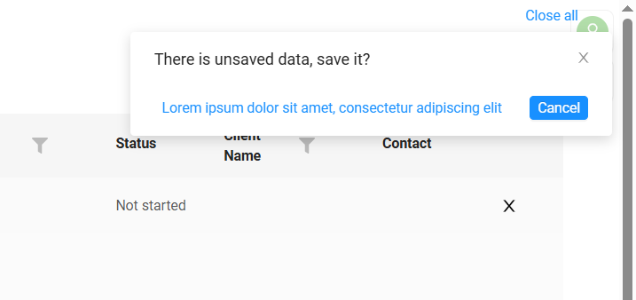
=== "Before"
    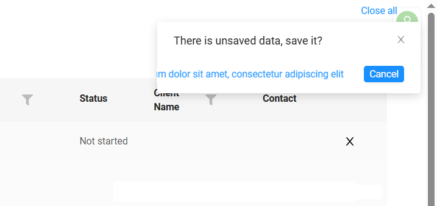

#### Added:  collapsedCondition tag

In view.json, each widget group now has a collapsedCondition tag:

* true – the widget group is collapsed
* false (default) – the widget group is expanded

If collapsedCondition -> true is set, the widget group is displayed in a collapsed state immediately after the page loads. Only the main widget header remains visible; the other widgets are hidden.

If collapsedCondition -> false is set, the widget group is expanded.

If the parameter is not specified at all, the default state is expanded (collapsedCondition -> default: false).

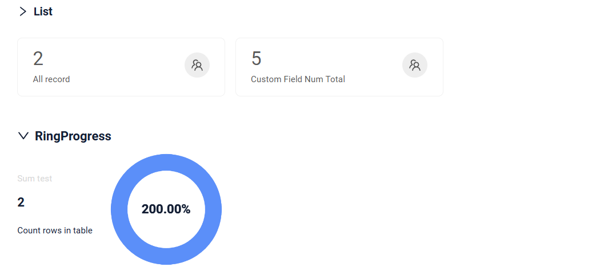

#### Fixed: validation handling for required and hidden fields

We have improved validation logic for required and both static and dynamic hidden fields to correctly display messages when required fields are empty. If a field is required and left empty, validation 

=== "required"
    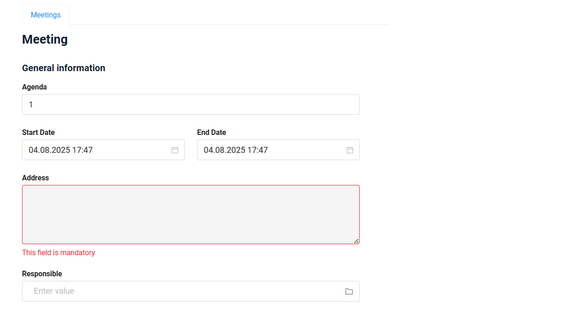
=== "hidden"
    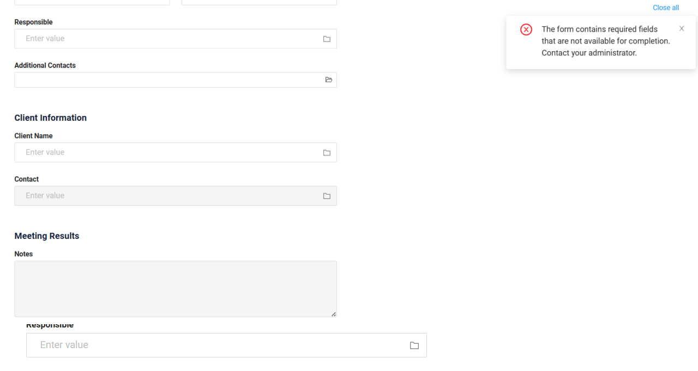

#### Fixed: cancel action after validation warning
We have improved the cancel action logic for cases when a form is blocked by validation. Now, if the system warns about required fields being left empty, users can still cancel and discard all changes.
=== "After"
    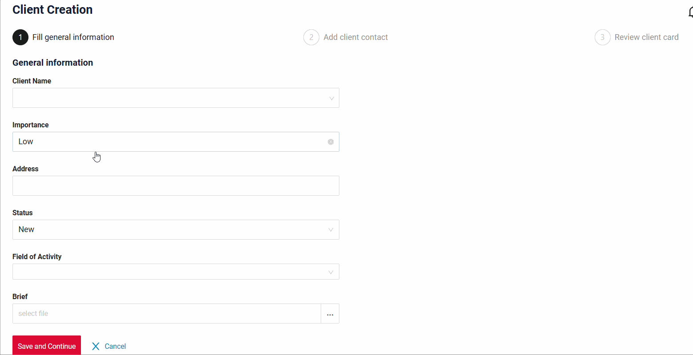
=== "Before"
    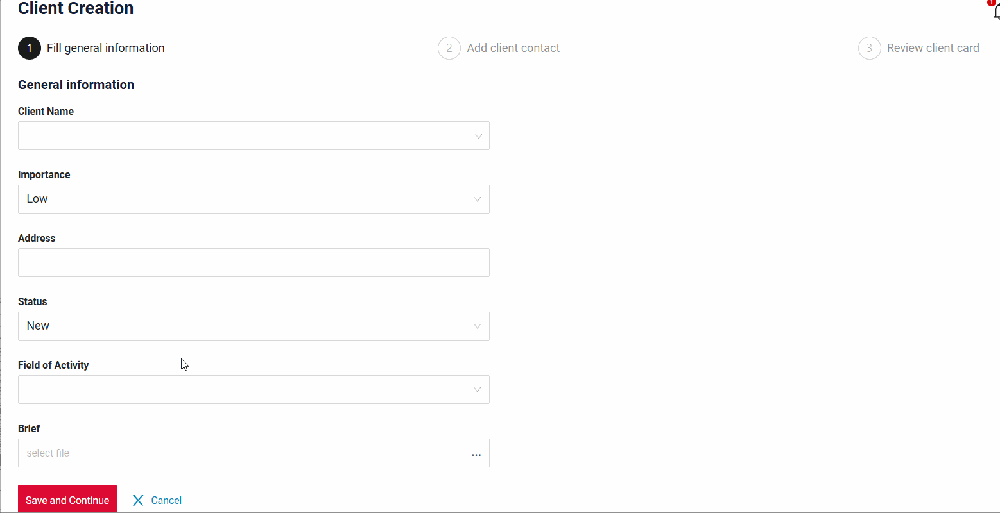 

#### Other Changes
see [cxbox-demo changelog](https://github.com/CX-Box/cxbox-demo/releases/tag/v.2.0.15)

### CXBOX ([Core Ui](https://github.com/CX-Box/cxbox-ui/releases/tag/2.6.1))

#### Added: multivalue field – updated display
We’ve updated the display of the multivalue field. Changes include adjustments to field height, chip size, folder icon display, and more to ensure visual consistency with other field types.

#### Fixed: multivalue field – correct display of values
We've improved the logic behind displaying values in multivalue fields, ensuring that each row now shows its own correct data, regardless of the selected row.

#### Fixed: Error popups were not shown
Error popups were not shown when an error requiring user notification occurred — the message was logged to the console.
Now the popup is displayed with the error text.

=== "After"
    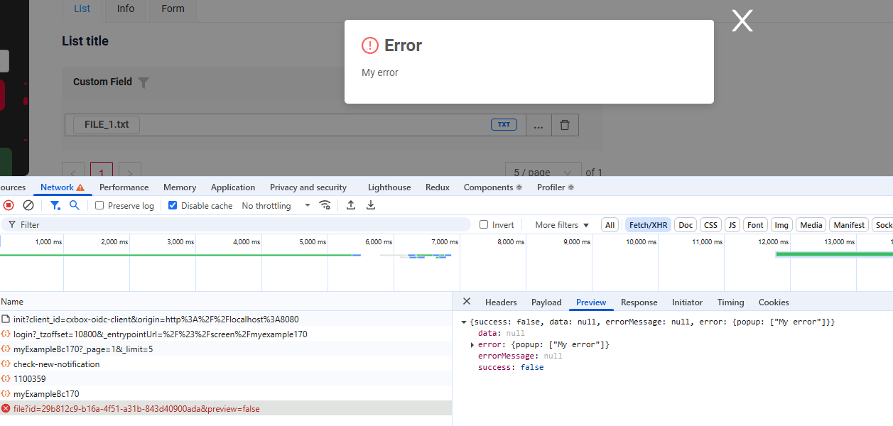
=== "Before"
    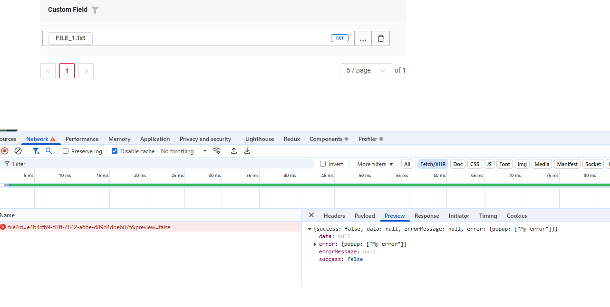

#### Other Changes
See [cxbox-ui 2.6.1 changelog](https://github.com/CX-Box/cxbox-ui/releases/tag/2.6.1).

### CXBOX 4.0.0-M19 ([Core](https://github.com/CX-Box/cxbox/tree/cxbox-4.0.0-M19))

We have released a new 4.0.0-M19 CORE version.
#### Fix: Missing roles in the getSessionUserRoles
Added handling for the situation of missing roles in the getSessionUserRoles method.

=== "after"
    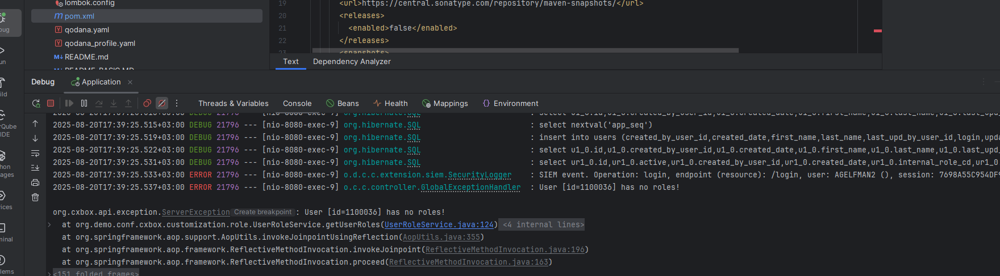
=== "before"
    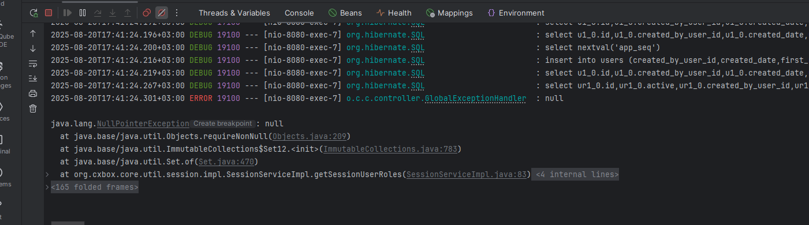

#### Fix: getCurrentValue with @JsonSerialize
We fixed the incorrect behavior of getCurrentValue with fields annotated with @JsonSerialize.

=== "after"
    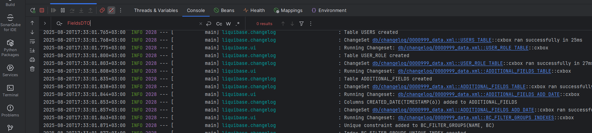
=== "before"
    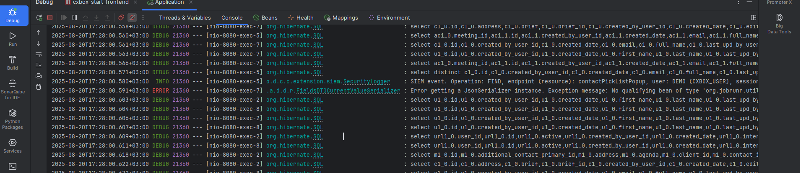

#### Other Changes
See [cxbox 4.0.0-M19 changelog](https://github.com/CX-Box/cxbox/releases/tag/cxbox-4.0.0-M19).

### CXBOX [plugin](https://plugins.jetbrains.com/plugin/19523-platform-tools).

We have released two versions - 2.0.0, 1.9.0

#### New: IntelliJ 2025.2+ support added. (with 1.9.0)
IntelliJ 2025.2+ support added.

#### New: Added generation bc from widget (with 2.0.0)
Added generation bc from widget.

You can create a new Service, Entity, or DTO based on the name of your BK, or you can use existing Services, Entities, or DTOs

Select Parameters:

Example:

#### New: Added to check the sum of span values in options.layout.rows.cols  (with 2.0.0)
Form and Info widgets, a validation was added to check that the sum of span values in options.layout.rows.cols does not exceed the grid limit (24

#### Fix. Incorrect triggering of inspection for ss (with 1.9.0)
We fixed the `SearchParameterAnnotationCorrectEndingInspection`, which was working incorrectly for the `multipleSelect` field.

=== "after"
    
=== "before"
    

### CXBOX [documentation](https://doc.cxbox.org/)  

#### Added: widget GroupingHierarchy - Aggregate
We have provided a description of Aggregate widget `GroupingHierarchy` [Aggregate](https://doc.cxbox.org/widget/type/groupinghierarchy/groupinghierarchy/#data-aggregation)   

#### Added: Multi-upload files
We have provided a description of [Multi-upload files](https://doc.cxbox.org/widget/type/property/bullupload/bulkupload/).

