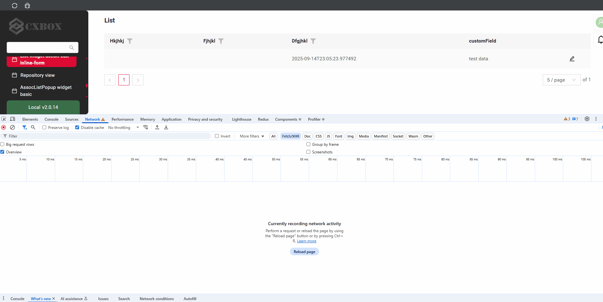
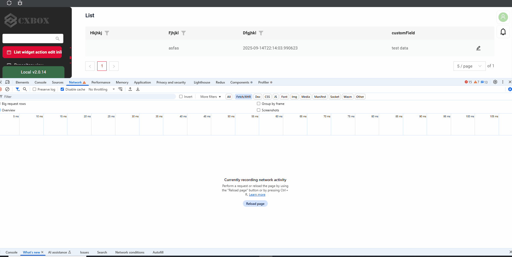
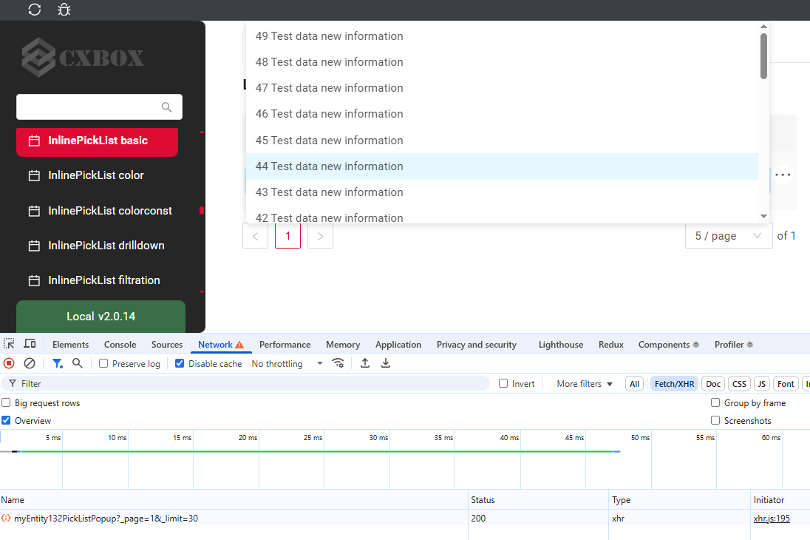
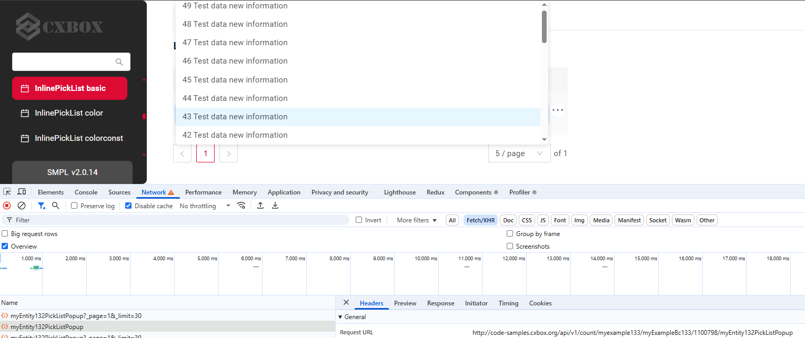
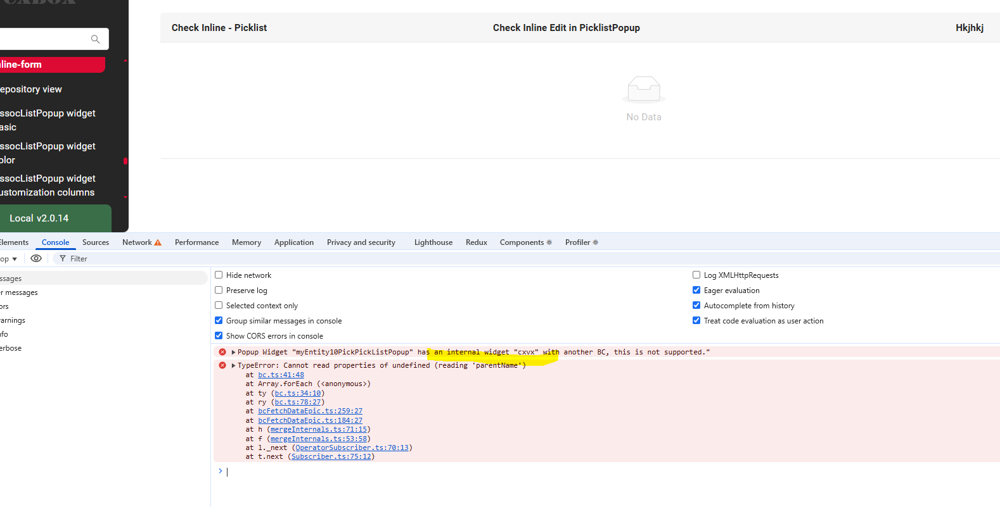

# 2.0.16

* [cxbox/demo 2.0.16 git](https://github.com/CX-Box/cxbox-demo/tree/v.2.0.16), [release notes](https://github.com/CX-Box/cxbox-demo/releases/tag/v.2.0.16)

* [cxbox/core 4.0.0-M20 git](https://github.com/CX-Box/cxbox/tree/cxbox-4.0.0-M20), [release notes](https://github.com/CX-Box/cxbox/releases/tag/cxbox-4.0.0-M20), [maven](https://central.sonatype.com/artifact/org.cxbox/cxbox-starter-parent/4.0.0-M20)

* [cxbox-ui/core 2.6.1 git](https://github.com/CX-Box/cxbox-ui/tree/2.6.1), [release notes](https://github.com/CX-Box/cxbox-ui/releases/tag/2.6.1), [npm](https://www.npmjs.com/package/@cxbox-ui/core/v/2.6.1)

* [cxbox/code-samples 2.0.16 git](https://github.com/CX-Box/cxbox-code-samples/tree/v.2.0.16), [release notes](https://github.com/CX-Box/cxbox-code-samples/releases/tag/v.2.0.16)  

* cxbox/intellij-plugin 2.0.0 [Jetbrains Marketplace](https://plugins.jetbrains.com/plugin/19523-platform-tools#), [cxbox repo (recommended)](https://doc.cxbox.org/new/version2014/#added-intellij-20251-support)

## **Key updates October, November 2025**

### CXBOX ([Demo](http://demo.cxbox.org))  

#### Added: CalendarList - NEW widget type!  
<!-- CXBOX-756 -->  
We’ve added a new CalendarList widget that allows you to view and manage events in three display modes: month, week, and day.
The widget supports switching between display modes, scrolling through months, weeks, or days, and automatically changing from month/week to day view when clicking on a specific date.  

Key features include:  

* full support for actions (of all scope types)
* filtering (+ additional fields' filtering)
* navigation between months/weeks/days   
* drillDown support 
* parent-child relationship 
* calendar-table switch 

!!! info 
    A detailed article on CalendarList will be available soon in our official documentation – stay tuned!  

#### Added: CalendarYearList - NEW widget type!  
<!-- CXBOX-756 -->  
We've introduced the CalendarYearList widget - designed to display events in a yearly overview.  
It's recommended to group backed data by the number of events per day for optimal display.  

Key features include:  

* full support for actions (all scope types)  
* filtering (+ additional fields' filtering)  
* navigation between years 
* drillDown support 
* parent-child relationship 
* calendar-table switch  

!!! info 
    A detailed article on CalendarYearList will be available soon in our official documentation – stay tuned!

#### Added: Audio preview support for fileUpload field  
<!-- CXBOX-781 -->  
We have added support for audio file preview in the fileUpload field. Users can now upload and play audio files (mp3, wav, m4a) directly in the interface without downloading them. The built-in player supports all standard features, including play/pause, rewind, and playback speed control.  

#### Added: Compact widget settings (gear icon)  
<!-- CXBOX-985 -->  
We have improved the gear icon behavior for a more compact widget layout. The gear icon has been moved from above the table into the table header. We have also moved several options into the gear menu - including the switch between table and chart modes, and Collapse columns, Expand columns, and Default controls for GroupingHierarchy widget - to keep everything organized in one place.  

#### Added: showMessage postAction - timeout support  
<!-- CXBOX-786 -->  
We have added the ability to set a timeout for the showMessage postAction. After the specified timeout, the message automatically disappears. If no timeout is defined, the message remains visible until the user closes it manually.  

#### Added: Unified field display (+disabled state display)  
We have unified the display of all field types. The unification covered font size, font color, paddings, disabled state display, etc. By default, the font color of disabled fields is now set to black, but it can be changed for all fields by adjusting the opacity constant.  

!!! info 
    For projects upgrading to version 2.0.16!  
    If you prefer to keep the gray text color for disabled fields, set the following frontend constant: WHEN_EDITABLE_FIELD_IS_DISABLED_THEN_FONT_OPACITY = 0.35.  

#### Added: Numeric fields - right alignment and improved icon layout  
<!-- CXBOX-915 -->  
We have updated the alignment for numeric field types (money, number, percent). Both the header and the field values are now right-aligned, while other field types remain left-aligned. Additionally, filter and sort icons for numeric fields are now displayed to the left of the field header, ensuring consistent alignment between headers and values across field types.  

#### Added: Unified sorting behavior  
<!-- CXBOX-1089 -->  
Sorting behavior has been updated to match filtering behavior. Now, when you navigate through drilldowns or switch between screens, your applied sorting remains active. The sorting will only reset if you refresh the page.  

#### Fixed: Action group - focus reset after action  
<!-- CXBOX-1047 -->  
We have fixed the issue where an action inside an action group remained visually focused after being executed. Now, the focus state is correctly reset once the action completes.   

#### Fixed: Lazy loading for picklists
<!-- CXBOX-1069  -->
Lazy loading for picklists has been implemented.

Data is now fetched only upon:

* Opening the pop-up
* Performing CRUD operations on its contents

=== "after"
    
=== "before"
    

The count() function is no longer called when an inline picklist is opened.

=== "after"
    
=== "before"
    

#### Added: New inline-edit widget validation
<!-- CXBOX-1069  -->
Added a check to ensure that an inline editing widget belongs to the same business component 
as its parent PickList or Assoc widget. If this rule is violated, an error message is logged to the browser console.

  

#### Fixed: File preview and deletion behavior  
<!-- CXBOX-608 -->  
We have improved the file preview and deletion logic for a more consistent user experience. Now, when switching between files in preview mode, if a file is missing for a specific row, a clear message "There is no file in this row" is displayed. We've also refined the file deletion behavior - once a file is removed, it's fully cleared from the interface and can no longer be downloaded.  

#### Other Changes
see [cxbox-demo changelog](https://github.com/CX-Box/cxbox-demo/releases/tag/v.2.0.16)

### CXBOX ([Core Ui](https://github.com/CX-Box/cxbox-ui/releases/tag/2.6.1))

####  

#### Other Changes
See [cxbox-ui 2.6.1 changelog](https://github.com/CX-Box/cxbox-ui/releases/tag/2.6.1).

### CXBOX 4.0.0-M20 ([Core](https://github.com/CX-Box/cxbox/tree/cxbox-4.0.0-M20))

We have released a new 4.0.0-M20 CORE version.
 
#### Other Changes
See [cxbox 4.0.0-M20 changelog](https://github.com/CX-Box/cxbox/releases/tag/cxbox-4.0.0-M20).

### CXBOX [plugin](https://plugins.jetbrains.com/plugin/19523-platform-tools).
  

### CXBOX [documentation](https://doc.cxbox.org/)  

#### Added: Support for truncating long values
<!-- CXBOX-1094  -->
We have provided a description of [Support for truncating long values](https://doc.cxbox.org/widget/fields/field/text/text/#support-for-truncating-long-values).

#### Added: Highlighting Functionality for the Current Item (Tile)
<!-- CXBOX-1078  -->
We added a description of [Highlighting Functionality for the Current Item (Tile)](https://doc.cxbox.org/widget/type/statblocks/statblocks/#highlighting-functionality).

#### Added: Description Widget Header
<!-- CXBOX-1061  -->
We added a description of [Widget Header](https://doc.cxbox.org/widget/type/headerwidget/headerwidget/).