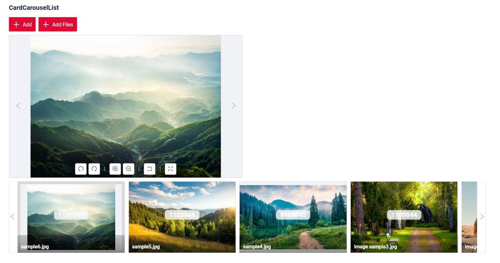
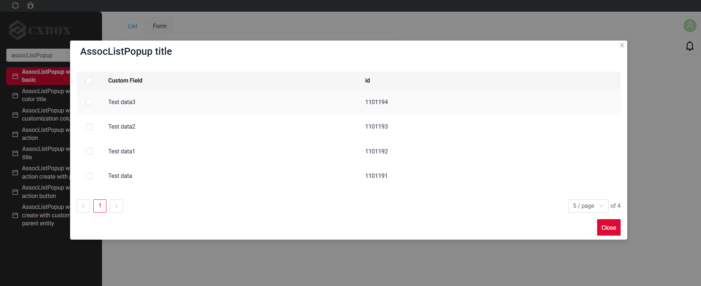
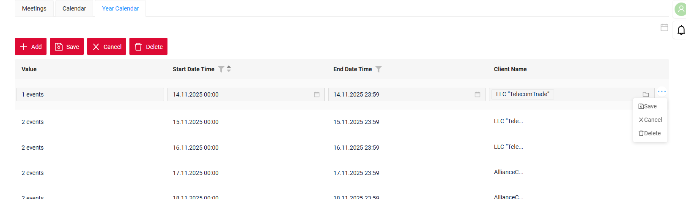
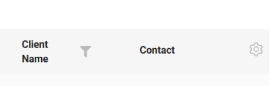
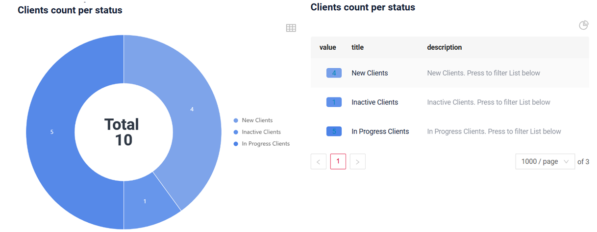
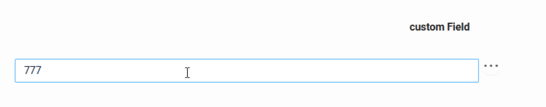
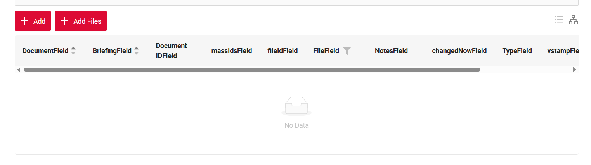
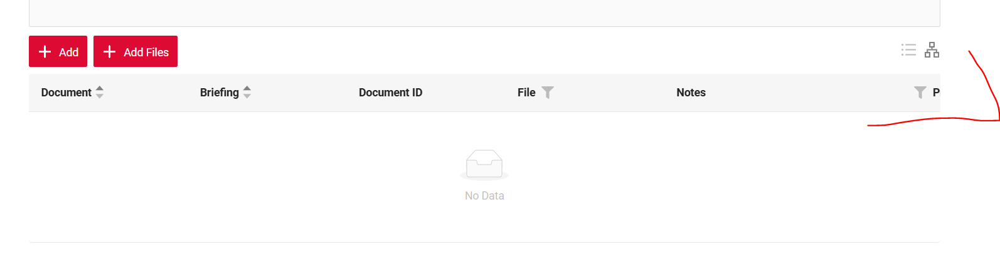
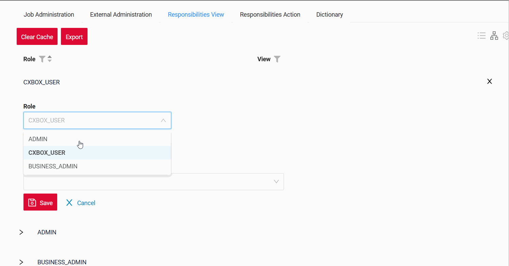

# 2.0.17

* [cxbox/demo 2.0.17 git](https://github.com/CX-Box/cxbox-demo/tree/v.2.0.17), [release notes](https://github.com/CX-Box/cxbox-demo/releases/tag/v.2.0.17)

* [cxbox/core 4.0.0-M22 git](https://github.com/CX-Box/cxbox/tree/cxbox-4.0.0-M22), [release notes](https://github.com/CX-Box/cxbox/releases/tag/cxbox-4.0.0-M22), [maven](https://central.sonatype.com/artifact/org.cxbox/cxbox-starter-parent/4.0.0-M22)

* [cxbox-ui/core 2.8.0 git](https://github.com/CX-Box/cxbox-ui/tree/2.8.0), [release notes](https://github.com/CX-Box/cxbox-ui/releases/tag/2.8.0), [npm](https://www.npmjs.com/package/@cxbox-ui/core/v/2.8.0)

* [cxbox/code-samples 2.0.17 git](https://github.com/CX-Box/cxbox-code-samples/tree/v.2.0.17), [release notes](https://github.com/CX-Box/cxbox-code-samples/releases/tag/v.2.0.17)  

## **Key updates February 2026**

### CXBOX ([Demo](http://demo.cxbox.org))  

#### Added: New Year atmosphere in the application
<!-- CXBOX-1212 -->  
We have added an option to create a festive New Year atmosphere in the application. You can enable a falling snow effect in the application menu.

The effect is controlled via a configuration parameter.
see more  [New Year atmosphere](/features/happynewyear/happynewyear/)


#### Added: RelationGraph – NEW widget type!
<!-- CXBOX-1157 -->  
We’ve introduced the RelationGraph widget to visualize relationships between nodes in a structured graph format.

Key functionality includes:

* Switch between graph and table view
* Parent–child support
* DrillDown support
* Custom color configuration for nodes and edges
* Configurable graph direction (top-bottom, left-right, etc.)
* Customizable node text, edge labels, and edge styles


A detailed article on RelationGraph will be available soon in our official documentation – stay tuned!
 
#### Added: CardList – NEW widget type!
<!-- CXBOX-901 -->
We’ve introduced a new CardList widget designed for convenient file preview and management.
All uploaded files are displayed as preview cards, allowing you to easily browse, edit, add, or delete items directly within the widget.

Key functionality includes:

* File preview in card format
* Actions’ support
* DrillDown support
* Configurable card size
* 


A detailed article on CardList will be available soon in our official documentation – stay tuned!

#### Added: CardCarouselList – NEW widget type!
<!-- CXBOX-901 -->
We’ve added a new CardCarouselList widget with functionality similar to CardList, but presented in a carousel layout.
Cards are arranged in a horizontal scrollable strip, while the selected item is displayed prominently above for easier viewing.

Key functionality includes:

* Carousel navigation (forward/backward scrolling)
* Actions’ support
* DrillDown support
* Configurable card size



A detailed article on CardCarouselList will be available soon in our official documentation – stay tuned!

#### Added: Support for `gridWidth` for popup
<!-- CXBOX-715 -->
Implemented support for `gridWidth` for popup:

1. AssocListPopup
    

2. PickListPopup
    

#### Added: Export to Excel as a regular button
<!-- CXBOX-816 -->  
Added the ability to display Export to Excel as a regular button.
To do this, you need to add the following code
```java
   .action(act -> act						
        .scope(ActionScope.BC)
        .withPreAction(PreAction.confirm(cf -> cf.text("Export to Excel?" )))
        .action("customExportToExcel", "Custom export to excel" )
        .invoker((bc, data) -> new ActionResultDTO<MyExampleDTO>()
        .setAction(PostAction.exportToExcel()))
```


#### Added: Export to Excel support all types fields

Support has also been added for exporting the following field types to Excel:

* multivalue 
* multivalueHover
* multipleSelect
* fileUpload
* money with Сurrency
* suggestionPickList

#### Added: Alternative pagination support
<!-- CXBOX-1118 -->
Added the ability to switch to an alternative pagination type. The selected pagination type is preserved during user interaction and is reset only after a page reload.

A new parameter, alternativeType, has been added to widget.json under options → pagination to define the pagination type.
By default, if the parameter is not specified, its value is empty.


```java
   "options": {
    "pagination": {
      "alternativeType": "nextAndPreviousWithCount" 
      "type": "nextAndPreviousSmart"  
    }
  }
```


#### Added: Optional WebSocket Updates
<!-- CXBOX-1060 --> 

Added the option to disable WebSocket calls from the frontend. The notification bell count is still displayed, but it will only update when the page is reloaded.

WebSocket Request Behavior Based on featureSettings

* webSocketNotificationEnabled: false → WebSocket requests are disabled
* webSocketNotificationEnabled: true → WebSocket requests are enabled
* If the setting is not provided → WebSocket requests are enabled by default

#### Added: Support for .ogg, .aac, and .flac
<!-- CXBOX-1234 --> 
Support for .ogg, .aac, and .flac formats has been added.

=== ".ogg"
    
=== ".aac"
    
=== ".flac"
    

#### Fixed: CalendarYearList the buttons are displayed correctly depending on the type
<!-- CXBOX-1149 --> 

For the *CalendarYearList* type, the buttons are displayed correctly depending on the type — *record* or *BC*

=== "after"

=== "before"


#### Fixed: Settings Menu Update
<!-- CXBOX-985 -->  
The settings icon (gear) has been moved to the table header and positioned on the right side, above the three-dot menu.

=== "after" 
    
=== "before"
    

The view mode toggle icon (chart / table) has been moved to the settings menu.
=== "after"
    { style="width:60%" }
=== "before"
    


The **Collapse columns** function has been added to the settings menu.
=== "after"
     
=== "before"
     

In the **GroupingHierarchy** widget, the hierarchy icon has been updated and moved to the settings menu (gear icon).
=== "after"
    
=== "before"
     


#### Fixed: Full-Width Numeric Fields
<!-- CXBOX-1203 -->  
The display of fields with the following types has been improved:

* **number**
* **percent**
* **money**

The field input now spans the full width of the table column.

=== "after"
    
=== "before"
    

#### Fixed: GroupingHierarchy Empty State Improvement
<!-- CXBOX-1146 -->  
For the GroupingHierarchy widget, scroll display has been added for cases when there is no data and no default hierarchy is defined.

=== "after"
    
=== "before"
    

#### Fixed: Adaptive Action Group Width
<!-- CXBOX-1179 -->  
The display of the action group has been improved: the width of the window showing button labels now automatically adjusts based on the content.

{ style="width:50%" }

#### Fixed: Improved Scrolling for Large Lists
<!-- CXBOX-1188 --> 
The behavior of the scroll and arrows has been improved when there are many values in dictionary.

=== "after"
    
=== "before"
    
    
#### Fixed: Gear Icon Display Fix
<!-- CXBOX-1192 --> 
Fixed the gear icon behavior when there are no buttons on the widget — the gear icon is now displayed.

```json
    "actionGroups": {
    "include": []
    },
```


#### Fixed: Fixed the highlighting of required multivalue field
<!-- CXBOX-1138 --> 
Fixed the highlighting of required multivalue field in the list widget when using inline form editing.

=== "after"
    
=== "before"
    

#### Fixed: Multivalue,multivalueHover и pickList Filter Display Fix
<!-- CXBOX-1145 --> 
Fixed the display of filters for multivalue,multivalueHover и pickList fields: selected values are now shown correctly, regardless of whether they are present on the selected page.

=== "after"
    
=== "before"
    

There is a limitation when using predefined filters of the following types: multivalue, pickList, and multivalueHover.

When such filters are predefined, the filter tags display id values.
When the filter is manually edited (for example, by adding values via a picklist), the tags are displayed according to the standard rules.
This behavior is caused by a frontend limitation:
the frontend cannot resolve display names for filter tags if the records specified in the predefined filter are located on different pages of the picklist popup and are not loaded in the current UI context.


#### Other Changes
see [cxbox-demo changelog](https://github.com/CX-Box/cxbox-demo/releases/tag/v.2.0.17)

### CXBOX ([Core Ui](https://github.com/CX-Box/cxbox-ui/releases/tag/2.8.0))  
We have released a new 2.8.0 CORE UI version.

#### Fixed: Optimized functionality for ...
 <!-- CXBOX-1111 --> 
Removed the request triggered by clicking on ...  the GET /api/v1/row-meta/id request is no longer sent.
 
=== "after"
    
=== "before"
    

#### Other Changes
See [cxbox-ui 2.8.0 changelog](https://github.com/CX-Box/cxbox-ui/releases/tag/2.8.0).


### CXBOX 4.0.0-M22 ([Core](https://github.com/CX-Box/cxbox/tree/cxbox-4.0.0-M22))

We have released a new 4.0.0-M22 CORE version.
#### Added: Parameter New Year atmosphere  
<!-- CXBOX-1212 -->  
We added a new parameter for `UiProperties`: `seasonalEffectsEnabled`.

When set to `true`, it enables a snowfall effect in the menu area.

#### Added: Parameter WebSocket 
<!-- CXBOX-1060 --> 
We added a new parameter for `UiProperties`: `webSocketNotificationEnabled`.

When set to `false` the frontend guarantees no WebSocket interactions, so the backend WebSocket functionality may be safely removed.

#### Added: New PostAction exportToExcel
<!-- CXBOX-1060 --> 
Added the ability to add button Export to Excel as a regular button. 
 
#### Other Changes
See [cxbox 4.0.0-M22 changelog](https://github.com/CX-Box/cxbox/releases/tag/cxbox-4.0.0-M22).

### CXBOX [documentation](https://doc.cxbox.org/)
#### Added: Description New Year atmosphere in the application
<!-- CXBOX-1212 -->   
We have provided a description on how to create a festive [New Year atmosphere](/features/happynewyear/happynewyear/) in the application.

#### Added: Description Bulk operations (Mass Operations)
<!-- CXBOX-1079  -->
We have provided a description [Bulk operations](https://doc.cxbox.org/widget/type/property/massoperations/massoperations)

`Bulk operations` are a mechanism that allows the user to perform a single action on a large number of table rows at once. Instead of processing each row individually, the user can select a set of data and apply a common operation to it—such as updating, deleting, changing statuses, recalculating values, and other typical scenarios.

#### Added: Description forward/back/refresh buttons
<!-- CXBOX-1163 -->   
Describe in the documentation the behavior of the browser's [forward/back/refresh buttons](https://doc.cxbox.org/navigation/browsernavigationbuttons/browsernavigationbuttons/).

#### Added: Description widget Steps 
<!-- CXBOX-562 CXBOX-1065 -->  
We have provided a description of [Steps widget](https://doc.cxbox.org/widget/type/steps/steps/)

#### Added: Description Screen Search in Left Menu
<!-- CXBOX-1221 -->   
We have provided a description [Screen Search in Left Menu](https://doc.cxbox.org/navigation/screen/screen/#screen-search-in-left-menu)

#### Added: Description Screen Name Wrapping in Left Menu
<!-- CXBOX-1221 -->   
We have provided a description [Screen Name Wrapping in Left Menu](https://doc.cxbox.org/navigation/screen/screen/#screen-name-wrapping-in-left-menu)

#### Added: Description setHidden
<!-- CXBOX-1155 -->   
We have provided a description [setHidden](https://doc.cxbox.org/environment/meta/buildrowdependentmeta/sethidden/sethidden/)

#### Added: Description new properties Time
<!-- CXBOX-1222 -->   
We have provided a description new properties [time](https://doc.cxbox.org/widget/fields/field/time/time/)

#### Added: Description a limitation when using predefined filters
<!-- CXBOX-1145 -->  
There is a limitation when using predefined filters of the following types: multivalue, pickList, and multivalueHover.

* When such filters are predefined, the filter tags display id values.
* When the filter is manually edited (for example, by adding values via a picklist), the tags are displayed according to the standard rules.

* see more [filters](https://doc.cxbox.org/widget/type/property/filtration/filtration/#by-filter-group)

#### Added: Description to the sorting behavior
<!-- CXBOX-1089 --> 
Please pay attention to the sorting behavior:

* If the user has not set a sorting option, the default sorting is applied if it is defined.
* If the user has applied a sorting option, it will be preserved when navigating via drill-down or between screens.

see more [sorting](https://doc.cxbox.org/widget/type/property/sorting/sorting/#type-sorting)
#### Added: Recommendations for Spring Data JPA 3.5.1, queries involving Hibernate custom types
<!-- CXBOX-1068  -->
Starting with Spring Data JPA 3.5.1, queries involving Hibernate custom types 
(for example, dictionary-like value objects) may break when Spring Data rewrites JPQL queries into constructor-based projections.

Recommendations for solving the problem are [here](https://doc.cxbox.org/environment/jparepository/jparepository/#spring-data-jpa-351-regression-with-converted-entity-properties)

#### Added: Recommendations for Spring Data JPA 3.5.1: Custom Hibernate Types Issue
<!-- CXBOX-1176  -->
Starting with Spring Data JPA 3.5.1, support for custom Hibernate types in queries is broken when Spring Data rewrites queries into constructor-based projections.

Recommendations for solving the problem are [here](https://doc.cxbox.org/environment/jparepository/jparepository/#spring-data-jpa-351-custom-hibernate-types-issue)
 